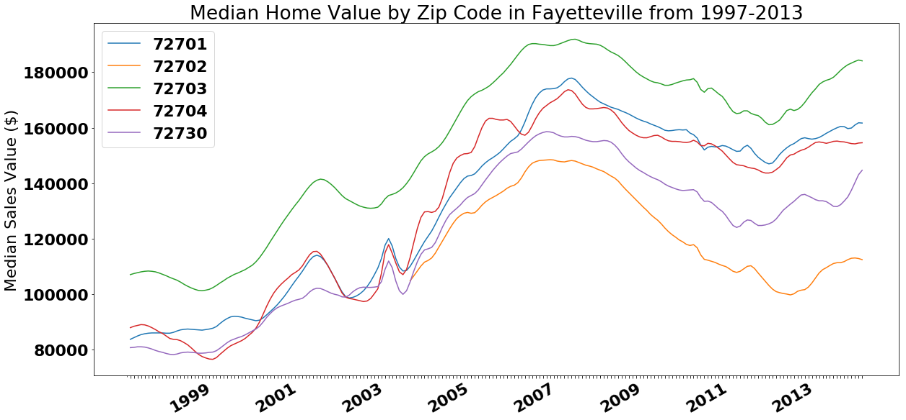
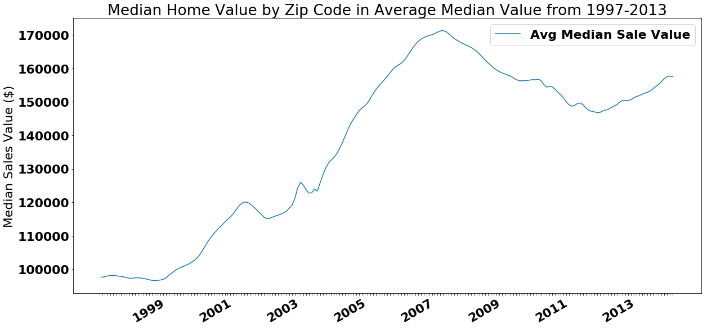
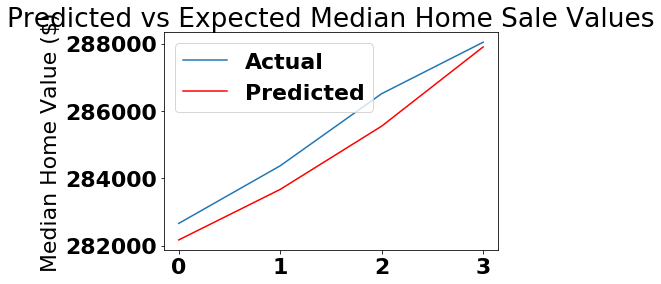
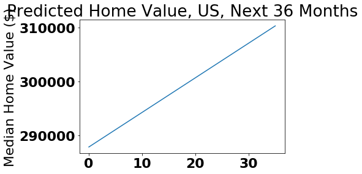

# Module 4 Project - Sample Solution

### (Private--Do not release to students)

## Step 1: Import Necessary Packages

Needed for this lab:

* pandas, numpy, matplotlib for the normal stuff
* TimeGrouper from pandas, for dealing with datetimes more easily
* ARIMA model from statsmodels
* Helper functions from statsmodels, for plotting Time Series (optional)
* TQDM, for visualizing progress bars for long runtimes (optional)


```python
import pandas as pd
from tqdm import tqdm
from pandas import TimeGrouper
import numpy as np
from matplotlib import pyplot
import matplotlib
import matplotlib.pyplot as plt
import matplotlib.dates as mdates
from statsmodels.tsa.arima_model import ARIMA
from sklearn.metrics import mean_squared_error
from statsmodels.graphics.tsaplots import plot_acf, plot_pacf
import operator
%matplotlib inline
```

# Step 2: Load and Inspect Data

Load data directly from `zillow_data.csv`. Cast `'RegionName'` column to `str` during loading process.


## A Note on Null Values

This dataset contains missing values. There are three possible cases for null values in this dataset:

1. A sequence of missing values at the start of the time series. This is seen with newer zipcodes, which will have missing values for any date before the creation of that zipcode.
2. A sequence of missing values at the end of the time series. This is seen with zipcodes that were dissolved after a rezoning.
3. Spontaneous missing values, with no pattern. These are just run-of-the-mill missing values.

Only null values of type '3' can be imputed safely. Please note that this is not done in this example notebook--instead, all zipcodes with any missing values are simply dropped.


```python
# Import and inspect the data
raw_data_df = pd.read_csv('zillow_data.csv', dtype={'RegionName': 'str'})
raw_data_df.head()
```


<div>
<style scoped>
    .dataframe tbody tr th:only-of-type {
        vertical-align: middle;
    }

    .dataframe tbody tr th {
        vertical-align: top;
    }

    .dataframe thead th {
        text-align: right;
    }
</style>
<table border="1" class="dataframe">
  <thead>
    <tr style="text-align: right;">
      <th></th>
      <th>RegionID</th>
      <th>RegionName</th>
      <th>City</th>
      <th>State</th>
      <th>Metro</th>
      <th>CountyName</th>
      <th>SizeRank</th>
      <th>1996-04</th>
      <th>1996-05</th>
      <th>1996-06</th>
      <th>...</th>
      <th>2017-07</th>
      <th>2017-08</th>
      <th>2017-09</th>
      <th>2017-10</th>
      <th>2017-11</th>
      <th>2017-12</th>
      <th>2018-01</th>
      <th>2018-02</th>
      <th>2018-03</th>
      <th>2018-04</th>
    </tr>
  </thead>
  <tbody>
    <tr>
      <th>0</th>
      <td>84654</td>
      <td>60657</td>
      <td>Chicago</td>
      <td>IL</td>
      <td>Chicago</td>
      <td>Cook</td>
      <td>1</td>
      <td>334200.0</td>
      <td>335400.0</td>
      <td>336500.0</td>
      <td>...</td>
      <td>1005500</td>
      <td>1007500</td>
      <td>1007800</td>
      <td>1009600</td>
      <td>1013300</td>
      <td>1018700</td>
      <td>1024400</td>
      <td>1030700</td>
      <td>1033800</td>
      <td>1030600</td>
    </tr>
    <tr>
      <th>1</th>
      <td>90668</td>
      <td>75070</td>
      <td>McKinney</td>
      <td>TX</td>
      <td>Dallas-Fort Worth</td>
      <td>Collin</td>
      <td>2</td>
      <td>235700.0</td>
      <td>236900.0</td>
      <td>236700.0</td>
      <td>...</td>
      <td>308000</td>
      <td>310000</td>
      <td>312500</td>
      <td>314100</td>
      <td>315000</td>
      <td>316600</td>
      <td>318100</td>
      <td>319600</td>
      <td>321100</td>
      <td>321800</td>
    </tr>
    <tr>
      <th>2</th>
      <td>91982</td>
      <td>77494</td>
      <td>Katy</td>
      <td>TX</td>
      <td>Houston</td>
      <td>Harris</td>
      <td>3</td>
      <td>210400.0</td>
      <td>212200.0</td>
      <td>212200.0</td>
      <td>...</td>
      <td>321000</td>
      <td>320600</td>
      <td>320200</td>
      <td>320400</td>
      <td>320800</td>
      <td>321200</td>
      <td>321200</td>
      <td>323000</td>
      <td>326900</td>
      <td>329900</td>
    </tr>
    <tr>
      <th>3</th>
      <td>84616</td>
      <td>60614</td>
      <td>Chicago</td>
      <td>IL</td>
      <td>Chicago</td>
      <td>Cook</td>
      <td>4</td>
      <td>498100.0</td>
      <td>500900.0</td>
      <td>503100.0</td>
      <td>...</td>
      <td>1289800</td>
      <td>1287700</td>
      <td>1287400</td>
      <td>1291500</td>
      <td>1296600</td>
      <td>1299000</td>
      <td>1302700</td>
      <td>1306400</td>
      <td>1308500</td>
      <td>1307000</td>
    </tr>
    <tr>
      <th>4</th>
      <td>93144</td>
      <td>79936</td>
      <td>El Paso</td>
      <td>TX</td>
      <td>El Paso</td>
      <td>El Paso</td>
      <td>5</td>
      <td>77300.0</td>
      <td>77300.0</td>
      <td>77300.0</td>
      <td>...</td>
      <td>119100</td>
      <td>119400</td>
      <td>120000</td>
      <td>120300</td>
      <td>120300</td>
      <td>120300</td>
      <td>120300</td>
      <td>120500</td>
      <td>121000</td>
      <td>121500</td>
    </tr>
  </tbody>
</table>
<p>5 rows × 272 columns</p>
</div>


# Step 3: Drop Unneeded Columns

We don't need `'SizeRank'` or `'RegionID'`, so let's drop them.


```python
df1 = raw_data_df.drop(['SizeRank', 'RegionID'], axis=1, inplace=False)
df1.head()
```


<div>
<style scoped>
    .dataframe tbody tr th:only-of-type {
        vertical-align: middle;
    }

    .dataframe tbody tr th {
        vertical-align: top;
    }

    .dataframe thead th {
        text-align: right;
    }
</style>
<table border="1" class="dataframe">
  <thead>
    <tr style="text-align: right;">
      <th></th>
      <th>RegionName</th>
      <th>City</th>
      <th>State</th>
      <th>Metro</th>
      <th>CountyName</th>
      <th>1996-04</th>
      <th>1996-05</th>
      <th>1996-06</th>
      <th>1996-07</th>
      <th>1996-08</th>
      <th>...</th>
      <th>2017-07</th>
      <th>2017-08</th>
      <th>2017-09</th>
      <th>2017-10</th>
      <th>2017-11</th>
      <th>2017-12</th>
      <th>2018-01</th>
      <th>2018-02</th>
      <th>2018-03</th>
      <th>2018-04</th>
    </tr>
  </thead>
  <tbody>
    <tr>
      <th>0</th>
      <td>60657</td>
      <td>Chicago</td>
      <td>IL</td>
      <td>Chicago</td>
      <td>Cook</td>
      <td>334200.0</td>
      <td>335400.0</td>
      <td>336500.0</td>
      <td>337600.0</td>
      <td>338500.0</td>
      <td>...</td>
      <td>1005500</td>
      <td>1007500</td>
      <td>1007800</td>
      <td>1009600</td>
      <td>1013300</td>
      <td>1018700</td>
      <td>1024400</td>
      <td>1030700</td>
      <td>1033800</td>
      <td>1030600</td>
    </tr>
    <tr>
      <th>1</th>
      <td>75070</td>
      <td>McKinney</td>
      <td>TX</td>
      <td>Dallas-Fort Worth</td>
      <td>Collin</td>
      <td>235700.0</td>
      <td>236900.0</td>
      <td>236700.0</td>
      <td>235400.0</td>
      <td>233300.0</td>
      <td>...</td>
      <td>308000</td>
      <td>310000</td>
      <td>312500</td>
      <td>314100</td>
      <td>315000</td>
      <td>316600</td>
      <td>318100</td>
      <td>319600</td>
      <td>321100</td>
      <td>321800</td>
    </tr>
    <tr>
      <th>2</th>
      <td>77494</td>
      <td>Katy</td>
      <td>TX</td>
      <td>Houston</td>
      <td>Harris</td>
      <td>210400.0</td>
      <td>212200.0</td>
      <td>212200.0</td>
      <td>210700.0</td>
      <td>208300.0</td>
      <td>...</td>
      <td>321000</td>
      <td>320600</td>
      <td>320200</td>
      <td>320400</td>
      <td>320800</td>
      <td>321200</td>
      <td>321200</td>
      <td>323000</td>
      <td>326900</td>
      <td>329900</td>
    </tr>
    <tr>
      <th>3</th>
      <td>60614</td>
      <td>Chicago</td>
      <td>IL</td>
      <td>Chicago</td>
      <td>Cook</td>
      <td>498100.0</td>
      <td>500900.0</td>
      <td>503100.0</td>
      <td>504600.0</td>
      <td>505500.0</td>
      <td>...</td>
      <td>1289800</td>
      <td>1287700</td>
      <td>1287400</td>
      <td>1291500</td>
      <td>1296600</td>
      <td>1299000</td>
      <td>1302700</td>
      <td>1306400</td>
      <td>1308500</td>
      <td>1307000</td>
    </tr>
    <tr>
      <th>4</th>
      <td>79936</td>
      <td>El Paso</td>
      <td>TX</td>
      <td>El Paso</td>
      <td>El Paso</td>
      <td>77300.0</td>
      <td>77300.0</td>
      <td>77300.0</td>
      <td>77300.0</td>
      <td>77400.0</td>
      <td>...</td>
      <td>119100</td>
      <td>119400</td>
      <td>120000</td>
      <td>120300</td>
      <td>120300</td>
      <td>120300</td>
      <td>120300</td>
      <td>120500</td>
      <td>121000</td>
      <td>121500</td>
    </tr>
  </tbody>
</table>
<p>5 rows × 270 columns</p>
</div>


# Example: Filtering Zipcodes for Arkansas

Zipcodes were retrieved by searching city zipcodes on Google. Store each as a string inside separate lists.


```python
## Zipcodes for AK metro areas
hot_springs = ['71901', '71902', '71903', '71913', '71914']
little_rock = ['72002', '72203', '72207', '72212', '72219', '72225', '72260', '72103',
               '72204', '72209', '72214', '72221', '72227', '72295', '72201', '72205',
               '72210', '72215', '72222', '72231', '72202', '72206', '72211', '72217',
               '72223', '72255']
fayetteville = ['72701', '72702', '72703', '72704', '72730', '72764']
searcy = ['72082', '72143', '72145', '72149']

ar_city_zipcodes = hot_springs + little_rock + fayetteville + searcy

ar_city_zipcodes
```


    ['71901',
     '71902',
     '71903',
     '71913',
     '71914',
     '72002',
     '72203',
     '72207',
     '72212',
     '72219',
     '72225',
     '72260',
     '72103',
     '72204',
     '72209',
     '72214',
     '72221',
     '72227',
     '72295',
     '72201',
     '72205',
     '72210',
     '72215',
     '72222',
     '72231',
     '72202',
     '72206',
     '72211',
     '72217',
     '72223',
     '72255',
     '72701',
     '72702',
     '72703',
     '72704',
     '72730',
     '72764',
     '72082',
     '72143',
     '72145',
     '72149']


```python
ar_cities_df = df1[df1['RegionName'].isin(ar_city_zipcodes)]
ar_cities_df
```


<div>
<style scoped>
    .dataframe tbody tr th:only-of-type {
        vertical-align: middle;
    }

    .dataframe tbody tr th {
        vertical-align: top;
    }

    .dataframe thead th {
        text-align: right;
    }
</style>
<table border="1" class="dataframe">
  <thead>
    <tr style="text-align: right;">
      <th></th>
      <th>RegionName</th>
      <th>City</th>
      <th>State</th>
      <th>Metro</th>
      <th>CountyName</th>
      <th>1996-04</th>
      <th>1996-05</th>
      <th>1996-06</th>
      <th>1996-07</th>
      <th>1996-08</th>
      <th>...</th>
      <th>2017-07</th>
      <th>2017-08</th>
      <th>2017-09</th>
      <th>2017-10</th>
      <th>2017-11</th>
      <th>2017-12</th>
      <th>2018-01</th>
      <th>2018-02</th>
      <th>2018-03</th>
      <th>2018-04</th>
    </tr>
  </thead>
  <tbody>
    <tr>
      <th>297</th>
      <td>71913</td>
      <td>Hot Springs</td>
      <td>AR</td>
      <td>Hot Springs</td>
      <td>Garland</td>
      <td>82100.0</td>
      <td>81900.0</td>
      <td>81600.0</td>
      <td>81300.0</td>
      <td>81000.0</td>
      <td>...</td>
      <td>145500</td>
      <td>145700</td>
      <td>146500</td>
      <td>147500</td>
      <td>148100</td>
      <td>147300</td>
      <td>146400</td>
      <td>146200</td>
      <td>146400</td>
      <td>146300</td>
    </tr>
    <tr>
      <th>799</th>
      <td>72701</td>
      <td>Fayetteville</td>
      <td>AR</td>
      <td>Fayetteville</td>
      <td>Washington</td>
      <td>83100.0</td>
      <td>83500.0</td>
      <td>83700.0</td>
      <td>83800.0</td>
      <td>83700.0</td>
      <td>...</td>
      <td>194200</td>
      <td>195400</td>
      <td>196600</td>
      <td>198500</td>
      <td>201100</td>
      <td>203800</td>
      <td>206100</td>
      <td>208700</td>
      <td>211700</td>
      <td>214000</td>
    </tr>
    <tr>
      <th>868</th>
      <td>72764</td>
      <td>Springdale</td>
      <td>AR</td>
      <td>Fayetteville</td>
      <td>Washington</td>
      <td>NaN</td>
      <td>NaN</td>
      <td>NaN</td>
      <td>NaN</td>
      <td>NaN</td>
      <td>...</td>
      <td>143200</td>
      <td>143700</td>
      <td>144300</td>
      <td>144900</td>
      <td>145800</td>
      <td>146600</td>
      <td>147100</td>
      <td>148300</td>
      <td>150300</td>
      <td>152000</td>
    </tr>
    <tr>
      <th>1596</th>
      <td>72703</td>
      <td>Fayetteville</td>
      <td>AR</td>
      <td>Fayetteville</td>
      <td>Washington</td>
      <td>104900.0</td>
      <td>105300.0</td>
      <td>105600.0</td>
      <td>105800.0</td>
      <td>106000.0</td>
      <td>...</td>
      <td>219600</td>
      <td>220300</td>
      <td>220900</td>
      <td>222400</td>
      <td>223900</td>
      <td>225100</td>
      <td>225500</td>
      <td>226300</td>
      <td>227600</td>
      <td>228500</td>
    </tr>
    <tr>
      <th>2240</th>
      <td>72143</td>
      <td>Searcy</td>
      <td>AR</td>
      <td>Searcy</td>
      <td>White</td>
      <td>73800.0</td>
      <td>74100.0</td>
      <td>74300.0</td>
      <td>74600.0</td>
      <td>74800.0</td>
      <td>...</td>
      <td>120300</td>
      <td>120500</td>
      <td>121000</td>
      <td>121300</td>
      <td>121600</td>
      <td>122400</td>
      <td>123600</td>
      <td>125000</td>
      <td>126100</td>
      <td>126500</td>
    </tr>
    <tr>
      <th>2392</th>
      <td>72204</td>
      <td>Little Rock</td>
      <td>AR</td>
      <td>Little Rock</td>
      <td>Pulaski</td>
      <td>39000.0</td>
      <td>39300.0</td>
      <td>39500.0</td>
      <td>39800.0</td>
      <td>40000.0</td>
      <td>...</td>
      <td>65800</td>
      <td>65400</td>
      <td>65500</td>
      <td>66500</td>
      <td>67300</td>
      <td>67600</td>
      <td>67900</td>
      <td>67700</td>
      <td>66600</td>
      <td>65800</td>
    </tr>
    <tr>
      <th>2616</th>
      <td>71901</td>
      <td>Hot Springs</td>
      <td>AR</td>
      <td>Hot Springs</td>
      <td>Garland</td>
      <td>67900.0</td>
      <td>67800.0</td>
      <td>67700.0</td>
      <td>67600.0</td>
      <td>67400.0</td>
      <td>...</td>
      <td>122000</td>
      <td>122800</td>
      <td>123500</td>
      <td>124400</td>
      <td>125500</td>
      <td>126000</td>
      <td>126600</td>
      <td>126900</td>
      <td>126900</td>
      <td>126500</td>
    </tr>
    <tr>
      <th>3230</th>
      <td>72205</td>
      <td>Little Rock</td>
      <td>AR</td>
      <td>Little Rock</td>
      <td>Pulaski</td>
      <td>72200.0</td>
      <td>72400.0</td>
      <td>72700.0</td>
      <td>73000.0</td>
      <td>73300.0</td>
      <td>...</td>
      <td>153200</td>
      <td>153000</td>
      <td>152100</td>
      <td>151400</td>
      <td>150700</td>
      <td>151000</td>
      <td>152100</td>
      <td>152900</td>
      <td>153100</td>
      <td>153400</td>
    </tr>
    <tr>
      <th>3413</th>
      <td>72704</td>
      <td>Fayetteville</td>
      <td>AR</td>
      <td>Fayetteville</td>
      <td>Washington</td>
      <td>92800.0</td>
      <td>92600.0</td>
      <td>92000.0</td>
      <td>91200.0</td>
      <td>90400.0</td>
      <td>...</td>
      <td>178800</td>
      <td>180400</td>
      <td>182100</td>
      <td>183400</td>
      <td>184600</td>
      <td>185500</td>
      <td>186300</td>
      <td>187500</td>
      <td>189100</td>
      <td>189800</td>
    </tr>
    <tr>
      <th>3606</th>
      <td>72211</td>
      <td>Little Rock</td>
      <td>AR</td>
      <td>Little Rock</td>
      <td>Pulaski</td>
      <td>110000.0</td>
      <td>110300.0</td>
      <td>110400.0</td>
      <td>110400.0</td>
      <td>110300.0</td>
      <td>...</td>
      <td>177400</td>
      <td>178100</td>
      <td>179000</td>
      <td>179100</td>
      <td>179100</td>
      <td>178600</td>
      <td>177500</td>
      <td>177000</td>
      <td>176900</td>
      <td>176900</td>
    </tr>
    <tr>
      <th>3869</th>
      <td>72223</td>
      <td>Little Rock</td>
      <td>AR</td>
      <td>Little Rock</td>
      <td>Pulaski</td>
      <td>195200.0</td>
      <td>194600.0</td>
      <td>194000.0</td>
      <td>193300.0</td>
      <td>192600.0</td>
      <td>...</td>
      <td>321200</td>
      <td>321600</td>
      <td>322100</td>
      <td>322400</td>
      <td>322600</td>
      <td>322700</td>
      <td>323000</td>
      <td>323700</td>
      <td>324600</td>
      <td>324900</td>
    </tr>
    <tr>
      <th>6319</th>
      <td>72210</td>
      <td>Little Rock</td>
      <td>AR</td>
      <td>Little Rock</td>
      <td>Pulaski</td>
      <td>97300.0</td>
      <td>97100.0</td>
      <td>96900.0</td>
      <td>96500.0</td>
      <td>96100.0</td>
      <td>...</td>
      <td>167600</td>
      <td>168200</td>
      <td>169000</td>
      <td>170300</td>
      <td>172700</td>
      <td>176100</td>
      <td>179600</td>
      <td>182000</td>
      <td>181700</td>
      <td>180200</td>
    </tr>
    <tr>
      <th>6446</th>
      <td>72002</td>
      <td>Shannon Hills</td>
      <td>AR</td>
      <td>Little Rock</td>
      <td>Saline</td>
      <td>77300.0</td>
      <td>77300.0</td>
      <td>77200.0</td>
      <td>77100.0</td>
      <td>76900.0</td>
      <td>...</td>
      <td>151100</td>
      <td>152300</td>
      <td>153300</td>
      <td>154200</td>
      <td>155300</td>
      <td>156900</td>
      <td>158200</td>
      <td>157900</td>
      <td>156800</td>
      <td>156700</td>
    </tr>
    <tr>
      <th>6944</th>
      <td>72103</td>
      <td>Little Rock</td>
      <td>AR</td>
      <td>Little Rock</td>
      <td>Pulaski</td>
      <td>61500.0</td>
      <td>61700.0</td>
      <td>61900.0</td>
      <td>62100.0</td>
      <td>62300.0</td>
      <td>...</td>
      <td>117500</td>
      <td>118300</td>
      <td>119300</td>
      <td>120800</td>
      <td>122100</td>
      <td>123600</td>
      <td>125700</td>
      <td>126500</td>
      <td>126100</td>
      <td>125900</td>
    </tr>
    <tr>
      <th>7162</th>
      <td>72227</td>
      <td>Little Rock</td>
      <td>AR</td>
      <td>Little Rock</td>
      <td>Pulaski</td>
      <td>115700.0</td>
      <td>115600.0</td>
      <td>115500.0</td>
      <td>115400.0</td>
      <td>115400.0</td>
      <td>...</td>
      <td>191100</td>
      <td>190900</td>
      <td>190600</td>
      <td>191500</td>
      <td>192700</td>
      <td>193500</td>
      <td>194000</td>
      <td>194300</td>
      <td>193300</td>
      <td>191900</td>
    </tr>
    <tr>
      <th>7309</th>
      <td>72207</td>
      <td>Little Rock</td>
      <td>AR</td>
      <td>Little Rock</td>
      <td>Pulaski</td>
      <td>113700.0</td>
      <td>114000.0</td>
      <td>114300.0</td>
      <td>114700.0</td>
      <td>115100.0</td>
      <td>...</td>
      <td>262600</td>
      <td>262900</td>
      <td>262800</td>
      <td>261200</td>
      <td>260200</td>
      <td>261300</td>
      <td>262700</td>
      <td>263400</td>
      <td>265100</td>
      <td>267100</td>
    </tr>
    <tr>
      <th>7552</th>
      <td>72212</td>
      <td>Little Rock</td>
      <td>AR</td>
      <td>Little Rock</td>
      <td>Pulaski</td>
      <td>177200.0</td>
      <td>177100.0</td>
      <td>176900.0</td>
      <td>176700.0</td>
      <td>176500.0</td>
      <td>...</td>
      <td>268000</td>
      <td>269300</td>
      <td>269200</td>
      <td>268500</td>
      <td>269000</td>
      <td>269600</td>
      <td>270000</td>
      <td>270400</td>
      <td>270600</td>
      <td>270600</td>
    </tr>
    <tr>
      <th>8643</th>
      <td>72730</td>
      <td>Farmington</td>
      <td>AR</td>
      <td>Fayetteville</td>
      <td>Washington</td>
      <td>84000.0</td>
      <td>83900.0</td>
      <td>83600.0</td>
      <td>83200.0</td>
      <td>82700.0</td>
      <td>...</td>
      <td>163600</td>
      <td>164800</td>
      <td>165800</td>
      <td>165900</td>
      <td>166000</td>
      <td>166800</td>
      <td>167900</td>
      <td>170400</td>
      <td>174000</td>
      <td>176100</td>
    </tr>
  </tbody>
</table>
<p>18 rows × 270 columns</p>
</div>


# Example: Filtering by City Name

Can also get zipcodes for a given city by filtering by the name of the city.


```python
# Check that zipcodes starting with 0 are now formatted correctly
df1[df1['City'] == 'Agawam']
```


<div>
<style scoped>
    .dataframe tbody tr th:only-of-type {
        vertical-align: middle;
    }

    .dataframe tbody tr th {
        vertical-align: top;
    }

    .dataframe thead th {
        text-align: right;
    }
</style>
<table border="1" class="dataframe">
  <thead>
    <tr style="text-align: right;">
      <th></th>
      <th>RegionName</th>
      <th>City</th>
      <th>State</th>
      <th>Metro</th>
      <th>CountyName</th>
      <th>1996-04</th>
      <th>1996-05</th>
      <th>1996-06</th>
      <th>1996-07</th>
      <th>1996-08</th>
      <th>...</th>
      <th>2017-07</th>
      <th>2017-08</th>
      <th>2017-09</th>
      <th>2017-10</th>
      <th>2017-11</th>
      <th>2017-12</th>
      <th>2018-01</th>
      <th>2018-02</th>
      <th>2018-03</th>
      <th>2018-04</th>
    </tr>
  </thead>
  <tbody>
    <tr>
      <th>5850</th>
      <td>01001</td>
      <td>Agawam</td>
      <td>MA</td>
      <td>Springfield</td>
      <td>Hampden</td>
      <td>113100.0</td>
      <td>112800.0</td>
      <td>112600.0</td>
      <td>112300.0</td>
      <td>112100.0</td>
      <td>...</td>
      <td>213900</td>
      <td>215700</td>
      <td>218200</td>
      <td>220100</td>
      <td>221100</td>
      <td>221700</td>
      <td>221700</td>
      <td>221700</td>
      <td>222700</td>
      <td>223600</td>
    </tr>
    <tr>
      <th>7801</th>
      <td>01030</td>
      <td>Agawam</td>
      <td>MA</td>
      <td>Springfield</td>
      <td>Hampden</td>
      <td>121700.0</td>
      <td>121500.0</td>
      <td>121200.0</td>
      <td>121000.0</td>
      <td>120800.0</td>
      <td>...</td>
      <td>238600</td>
      <td>238700</td>
      <td>239500</td>
      <td>239500</td>
      <td>238500</td>
      <td>237400</td>
      <td>236700</td>
      <td>236600</td>
      <td>237900</td>
      <td>239300</td>
    </tr>
  </tbody>
</table>
<p>2 rows × 270 columns</p>
</div>


# Step 4: Creating Time Series Plots

## Step 4.1: Filter by Zipcodes

In this example, we slice the relevant zipcodes for each of our example cities into separate DataFrames. This will make visualizing them easier.


```python
# Create data sets containing zip codes for AR metro area
searcy_df = df1[df1['RegionName'].isin(searcy)]
littlerock_df = df1[df1['RegionName'].isin(little_rock)]
fayetteville_df = df1[df1['RegionName'].isin(fayetteville)]
hotsprings_df = df1[df1['RegionName'].isin(hot_springs)]

display(searcy_df)
display(littlerock_df)
display(fayetteville_df)
display(hotsprings_df)
```


<div>
<style scoped>
    .dataframe tbody tr th:only-of-type {
        vertical-align: middle;
    }

    .dataframe tbody tr th {
        vertical-align: top;
    }

    .dataframe thead th {
        text-align: right;
    }
</style>
<table border="1" class="dataframe">
  <thead>
    <tr style="text-align: right;">
      <th></th>
      <th>RegionName</th>
      <th>City</th>
      <th>State</th>
      <th>Metro</th>
      <th>CountyName</th>
      <th>1996-04</th>
      <th>1996-05</th>
      <th>1996-06</th>
      <th>1996-07</th>
      <th>1996-08</th>
      <th>...</th>
      <th>2017-07</th>
      <th>2017-08</th>
      <th>2017-09</th>
      <th>2017-10</th>
      <th>2017-11</th>
      <th>2017-12</th>
      <th>2018-01</th>
      <th>2018-02</th>
      <th>2018-03</th>
      <th>2018-04</th>
    </tr>
  </thead>
  <tbody>
    <tr>
      <th>2240</th>
      <td>72143</td>
      <td>Searcy</td>
      <td>AR</td>
      <td>Searcy</td>
      <td>White</td>
      <td>73800.0</td>
      <td>74100.0</td>
      <td>74300.0</td>
      <td>74600.0</td>
      <td>74800.0</td>
      <td>...</td>
      <td>120300</td>
      <td>120500</td>
      <td>121000</td>
      <td>121300</td>
      <td>121600</td>
      <td>122400</td>
      <td>123600</td>
      <td>125000</td>
      <td>126100</td>
      <td>126500</td>
    </tr>
  </tbody>
</table>
<p>1 rows × 270 columns</p>
</div>


<div>
<style scoped>
    .dataframe tbody tr th:only-of-type {
        vertical-align: middle;
    }

    .dataframe tbody tr th {
        vertical-align: top;
    }

    .dataframe thead th {
        text-align: right;
    }
</style>
<table border="1" class="dataframe">
  <thead>
    <tr style="text-align: right;">
      <th></th>
      <th>RegionName</th>
      <th>City</th>
      <th>State</th>
      <th>Metro</th>
      <th>CountyName</th>
      <th>1996-04</th>
      <th>1996-05</th>
      <th>1996-06</th>
      <th>1996-07</th>
      <th>1996-08</th>
      <th>...</th>
      <th>2017-07</th>
      <th>2017-08</th>
      <th>2017-09</th>
      <th>2017-10</th>
      <th>2017-11</th>
      <th>2017-12</th>
      <th>2018-01</th>
      <th>2018-02</th>
      <th>2018-03</th>
      <th>2018-04</th>
    </tr>
  </thead>
  <tbody>
    <tr>
      <th>2392</th>
      <td>72204</td>
      <td>Little Rock</td>
      <td>AR</td>
      <td>Little Rock</td>
      <td>Pulaski</td>
      <td>39000.0</td>
      <td>39300.0</td>
      <td>39500.0</td>
      <td>39800.0</td>
      <td>40000.0</td>
      <td>...</td>
      <td>65800</td>
      <td>65400</td>
      <td>65500</td>
      <td>66500</td>
      <td>67300</td>
      <td>67600</td>
      <td>67900</td>
      <td>67700</td>
      <td>66600</td>
      <td>65800</td>
    </tr>
    <tr>
      <th>3230</th>
      <td>72205</td>
      <td>Little Rock</td>
      <td>AR</td>
      <td>Little Rock</td>
      <td>Pulaski</td>
      <td>72200.0</td>
      <td>72400.0</td>
      <td>72700.0</td>
      <td>73000.0</td>
      <td>73300.0</td>
      <td>...</td>
      <td>153200</td>
      <td>153000</td>
      <td>152100</td>
      <td>151400</td>
      <td>150700</td>
      <td>151000</td>
      <td>152100</td>
      <td>152900</td>
      <td>153100</td>
      <td>153400</td>
    </tr>
    <tr>
      <th>3606</th>
      <td>72211</td>
      <td>Little Rock</td>
      <td>AR</td>
      <td>Little Rock</td>
      <td>Pulaski</td>
      <td>110000.0</td>
      <td>110300.0</td>
      <td>110400.0</td>
      <td>110400.0</td>
      <td>110300.0</td>
      <td>...</td>
      <td>177400</td>
      <td>178100</td>
      <td>179000</td>
      <td>179100</td>
      <td>179100</td>
      <td>178600</td>
      <td>177500</td>
      <td>177000</td>
      <td>176900</td>
      <td>176900</td>
    </tr>
    <tr>
      <th>3869</th>
      <td>72223</td>
      <td>Little Rock</td>
      <td>AR</td>
      <td>Little Rock</td>
      <td>Pulaski</td>
      <td>195200.0</td>
      <td>194600.0</td>
      <td>194000.0</td>
      <td>193300.0</td>
      <td>192600.0</td>
      <td>...</td>
      <td>321200</td>
      <td>321600</td>
      <td>322100</td>
      <td>322400</td>
      <td>322600</td>
      <td>322700</td>
      <td>323000</td>
      <td>323700</td>
      <td>324600</td>
      <td>324900</td>
    </tr>
    <tr>
      <th>6319</th>
      <td>72210</td>
      <td>Little Rock</td>
      <td>AR</td>
      <td>Little Rock</td>
      <td>Pulaski</td>
      <td>97300.0</td>
      <td>97100.0</td>
      <td>96900.0</td>
      <td>96500.0</td>
      <td>96100.0</td>
      <td>...</td>
      <td>167600</td>
      <td>168200</td>
      <td>169000</td>
      <td>170300</td>
      <td>172700</td>
      <td>176100</td>
      <td>179600</td>
      <td>182000</td>
      <td>181700</td>
      <td>180200</td>
    </tr>
    <tr>
      <th>6446</th>
      <td>72002</td>
      <td>Shannon Hills</td>
      <td>AR</td>
      <td>Little Rock</td>
      <td>Saline</td>
      <td>77300.0</td>
      <td>77300.0</td>
      <td>77200.0</td>
      <td>77100.0</td>
      <td>76900.0</td>
      <td>...</td>
      <td>151100</td>
      <td>152300</td>
      <td>153300</td>
      <td>154200</td>
      <td>155300</td>
      <td>156900</td>
      <td>158200</td>
      <td>157900</td>
      <td>156800</td>
      <td>156700</td>
    </tr>
    <tr>
      <th>6944</th>
      <td>72103</td>
      <td>Little Rock</td>
      <td>AR</td>
      <td>Little Rock</td>
      <td>Pulaski</td>
      <td>61500.0</td>
      <td>61700.0</td>
      <td>61900.0</td>
      <td>62100.0</td>
      <td>62300.0</td>
      <td>...</td>
      <td>117500</td>
      <td>118300</td>
      <td>119300</td>
      <td>120800</td>
      <td>122100</td>
      <td>123600</td>
      <td>125700</td>
      <td>126500</td>
      <td>126100</td>
      <td>125900</td>
    </tr>
    <tr>
      <th>7162</th>
      <td>72227</td>
      <td>Little Rock</td>
      <td>AR</td>
      <td>Little Rock</td>
      <td>Pulaski</td>
      <td>115700.0</td>
      <td>115600.0</td>
      <td>115500.0</td>
      <td>115400.0</td>
      <td>115400.0</td>
      <td>...</td>
      <td>191100</td>
      <td>190900</td>
      <td>190600</td>
      <td>191500</td>
      <td>192700</td>
      <td>193500</td>
      <td>194000</td>
      <td>194300</td>
      <td>193300</td>
      <td>191900</td>
    </tr>
    <tr>
      <th>7309</th>
      <td>72207</td>
      <td>Little Rock</td>
      <td>AR</td>
      <td>Little Rock</td>
      <td>Pulaski</td>
      <td>113700.0</td>
      <td>114000.0</td>
      <td>114300.0</td>
      <td>114700.0</td>
      <td>115100.0</td>
      <td>...</td>
      <td>262600</td>
      <td>262900</td>
      <td>262800</td>
      <td>261200</td>
      <td>260200</td>
      <td>261300</td>
      <td>262700</td>
      <td>263400</td>
      <td>265100</td>
      <td>267100</td>
    </tr>
    <tr>
      <th>7552</th>
      <td>72212</td>
      <td>Little Rock</td>
      <td>AR</td>
      <td>Little Rock</td>
      <td>Pulaski</td>
      <td>177200.0</td>
      <td>177100.0</td>
      <td>176900.0</td>
      <td>176700.0</td>
      <td>176500.0</td>
      <td>...</td>
      <td>268000</td>
      <td>269300</td>
      <td>269200</td>
      <td>268500</td>
      <td>269000</td>
      <td>269600</td>
      <td>270000</td>
      <td>270400</td>
      <td>270600</td>
      <td>270600</td>
    </tr>
  </tbody>
</table>
<p>10 rows × 270 columns</p>
</div>


<div>
<style scoped>
    .dataframe tbody tr th:only-of-type {
        vertical-align: middle;
    }

    .dataframe tbody tr th {
        vertical-align: top;
    }

    .dataframe thead th {
        text-align: right;
    }
</style>
<table border="1" class="dataframe">
  <thead>
    <tr style="text-align: right;">
      <th></th>
      <th>RegionName</th>
      <th>City</th>
      <th>State</th>
      <th>Metro</th>
      <th>CountyName</th>
      <th>1996-04</th>
      <th>1996-05</th>
      <th>1996-06</th>
      <th>1996-07</th>
      <th>1996-08</th>
      <th>...</th>
      <th>2017-07</th>
      <th>2017-08</th>
      <th>2017-09</th>
      <th>2017-10</th>
      <th>2017-11</th>
      <th>2017-12</th>
      <th>2018-01</th>
      <th>2018-02</th>
      <th>2018-03</th>
      <th>2018-04</th>
    </tr>
  </thead>
  <tbody>
    <tr>
      <th>799</th>
      <td>72701</td>
      <td>Fayetteville</td>
      <td>AR</td>
      <td>Fayetteville</td>
      <td>Washington</td>
      <td>83100.0</td>
      <td>83500.0</td>
      <td>83700.0</td>
      <td>83800.0</td>
      <td>83700.0</td>
      <td>...</td>
      <td>194200</td>
      <td>195400</td>
      <td>196600</td>
      <td>198500</td>
      <td>201100</td>
      <td>203800</td>
      <td>206100</td>
      <td>208700</td>
      <td>211700</td>
      <td>214000</td>
    </tr>
    <tr>
      <th>868</th>
      <td>72764</td>
      <td>Springdale</td>
      <td>AR</td>
      <td>Fayetteville</td>
      <td>Washington</td>
      <td>NaN</td>
      <td>NaN</td>
      <td>NaN</td>
      <td>NaN</td>
      <td>NaN</td>
      <td>...</td>
      <td>143200</td>
      <td>143700</td>
      <td>144300</td>
      <td>144900</td>
      <td>145800</td>
      <td>146600</td>
      <td>147100</td>
      <td>148300</td>
      <td>150300</td>
      <td>152000</td>
    </tr>
    <tr>
      <th>1596</th>
      <td>72703</td>
      <td>Fayetteville</td>
      <td>AR</td>
      <td>Fayetteville</td>
      <td>Washington</td>
      <td>104900.0</td>
      <td>105300.0</td>
      <td>105600.0</td>
      <td>105800.0</td>
      <td>106000.0</td>
      <td>...</td>
      <td>219600</td>
      <td>220300</td>
      <td>220900</td>
      <td>222400</td>
      <td>223900</td>
      <td>225100</td>
      <td>225500</td>
      <td>226300</td>
      <td>227600</td>
      <td>228500</td>
    </tr>
    <tr>
      <th>3413</th>
      <td>72704</td>
      <td>Fayetteville</td>
      <td>AR</td>
      <td>Fayetteville</td>
      <td>Washington</td>
      <td>92800.0</td>
      <td>92600.0</td>
      <td>92000.0</td>
      <td>91200.0</td>
      <td>90400.0</td>
      <td>...</td>
      <td>178800</td>
      <td>180400</td>
      <td>182100</td>
      <td>183400</td>
      <td>184600</td>
      <td>185500</td>
      <td>186300</td>
      <td>187500</td>
      <td>189100</td>
      <td>189800</td>
    </tr>
    <tr>
      <th>8643</th>
      <td>72730</td>
      <td>Farmington</td>
      <td>AR</td>
      <td>Fayetteville</td>
      <td>Washington</td>
      <td>84000.0</td>
      <td>83900.0</td>
      <td>83600.0</td>
      <td>83200.0</td>
      <td>82700.0</td>
      <td>...</td>
      <td>163600</td>
      <td>164800</td>
      <td>165800</td>
      <td>165900</td>
      <td>166000</td>
      <td>166800</td>
      <td>167900</td>
      <td>170400</td>
      <td>174000</td>
      <td>176100</td>
    </tr>
  </tbody>
</table>
<p>5 rows × 270 columns</p>
</div>


<div>
<style scoped>
    .dataframe tbody tr th:only-of-type {
        vertical-align: middle;
    }

    .dataframe tbody tr th {
        vertical-align: top;
    }

    .dataframe thead th {
        text-align: right;
    }
</style>
<table border="1" class="dataframe">
  <thead>
    <tr style="text-align: right;">
      <th></th>
      <th>RegionName</th>
      <th>City</th>
      <th>State</th>
      <th>Metro</th>
      <th>CountyName</th>
      <th>1996-04</th>
      <th>1996-05</th>
      <th>1996-06</th>
      <th>1996-07</th>
      <th>1996-08</th>
      <th>...</th>
      <th>2017-07</th>
      <th>2017-08</th>
      <th>2017-09</th>
      <th>2017-10</th>
      <th>2017-11</th>
      <th>2017-12</th>
      <th>2018-01</th>
      <th>2018-02</th>
      <th>2018-03</th>
      <th>2018-04</th>
    </tr>
  </thead>
  <tbody>
    <tr>
      <th>297</th>
      <td>71913</td>
      <td>Hot Springs</td>
      <td>AR</td>
      <td>Hot Springs</td>
      <td>Garland</td>
      <td>82100.0</td>
      <td>81900.0</td>
      <td>81600.0</td>
      <td>81300.0</td>
      <td>81000.0</td>
      <td>...</td>
      <td>145500</td>
      <td>145700</td>
      <td>146500</td>
      <td>147500</td>
      <td>148100</td>
      <td>147300</td>
      <td>146400</td>
      <td>146200</td>
      <td>146400</td>
      <td>146300</td>
    </tr>
    <tr>
      <th>2616</th>
      <td>71901</td>
      <td>Hot Springs</td>
      <td>AR</td>
      <td>Hot Springs</td>
      <td>Garland</td>
      <td>67900.0</td>
      <td>67800.0</td>
      <td>67700.0</td>
      <td>67600.0</td>
      <td>67400.0</td>
      <td>...</td>
      <td>122000</td>
      <td>122800</td>
      <td>123500</td>
      <td>124400</td>
      <td>125500</td>
      <td>126000</td>
      <td>126600</td>
      <td>126900</td>
      <td>126900</td>
      <td>126500</td>
    </tr>
  </tbody>
</table>
<p>2 rows × 270 columns</p>
</div>


## Step 4.2: Remove Unneeded Columns

For our Time Series Plots, we only need the `RegionName` and the actual median housing values for each.  This means that we can drop everything else.


```python
cols_to_drop = ['City', 'State', 'Metro', 'CountyName']
searcy_clean_df = searcy_df.drop(cols_to_drop, axis=1, inplace=False)
fayetteville_clean_df = fayetteville_df.drop(cols_to_drop, axis=1, inplace=False)
hotsprings_clean_df = hotsprings_df.drop(cols_to_drop, axis=1, inplace=False)
littlerock_clean_df = littlerock_df.drop(cols_to_drop, axis=1, inplace=False)
```

# Step 4.3: Get Datetimes

We will use the datetimes as our indices for these plots. Currently, the column names for each remaining column that is not the zipcode in question is contains the datetimes. These datetimes are stored as strings, in the format `'%Y-%m'`.

In the cell below, we create a series called `datetimes` using pandas and the column values for one of the cities (we exclude the first column value, since this contains `'RegionName'`).


```python
datetimes = pd.to_datetime(searcy_clean_df.columns.values[1:], format='%Y-%m')
```

# Step 4.4: Set Params for Matplotlib Visualizations

This step is optional, but will make our plots easier to read.


```python
font = {'family' : 'normal',
        'weight' : 'bold',
        'size'   : 22}

matplotlib.rc('font', **font)
```

# Step 4.5: Create a Function for Visualizing Time Series Data

This one is a bit complicated, so the code is commented and broken down line by line.

**_NOTE_**: For the example below, we've only visualized the data for 1997 through 2013. This was done on purpose, to show how to visualize select ranges of data. The index values were obtained by manually looking at the date ranges and determining that `[10:215]` includes everything between 1997 and 2013.


```python

def time_series(df, name=None, legend=None):

    # Instantiate a figure object.
    plt.figure()
    if not legend:
        legend = list(df['RegionName'])
    # Enumerate through each row in the dataframe passed in. Each row is a different zipcode.
    for ind, row in df.iterrows():

        # Get the median housing value data for the date ranges we want and store in a Series object
        data = pd.Series(row.iloc[10:215])
        # Set the appropriate datetimes for data as the index for our data series
        data.index = datetimes[10:215]
        # Plot data for current zipcode on figure we instantiated on line 4. Set xticks to corresponding datetimes
        # Also make the figure large, so that we can read it more easily
        ax = data.plot(figsize=(20, 10), xticks=datetimes[10:215])
        # add a label
        plt.ylabel("Median Sales Value ($)")
        # let matplootlib autoformat the datetimes for the xticks
        plt.gcf().autofmt_xdate()

        # If name of city was provided, use it to set title of plot
        if name:
            plt.title("Median Home Value by Zip Code in {} from 1997-2013".format(name))
        else:
            plt.title("Avg Median Home Value in AR Metro Area, 1997-2013")

    plt.legend(legend)

    plt.show()


time_series(fayetteville_clean_df, name='Fayetteville', legend=fayetteville)
# time_series(searcy_clean_df, name='Searcy')
# time_series(hotsprings_clean_df, hot_springs, 'Hot Springs')
# time_series(littlerock_clean_df, little_rock, 'Little Rock')
```





# Step 4.6: Visualizing the Average Median Home Sale Price for a Collection of Zipcodes

To visualize the average median home sales value for an area, we can use the function we created above, but we need to do a bit of processing first to get it into the shape needed.

1. First, we concatenate all of the dataframes containing the zipcodes we want to average.
2. Next, we create a new DataFrame containing a single column of data called `'Avg_Median_Value'` for the date range we want (in this example, still focusing only on values between 1997-2013).
3. Next, drop the `'RegionName'` column.
4. Finally, inspect the data to see what our newly computed `'Avg_Median_Value'` data looks like.


```python
arkansas_metro_df = pd.concat([searcy_clean_df, littlerock_clean_df, fayetteville_clean_df, hotsprings_clean_df])
avg_metro_value_df = pd.DataFrame(arkansas_metro_df[10:215].mean(), columns=['Avg_Median_Value'])
avg_metro_value_df.drop('RegionName', axis=0, inplace=True)
avg_metro_value_df.head()
```


<div>
<style scoped>
    .dataframe tbody tr th:only-of-type {
        vertical-align: middle;
    }

    .dataframe tbody tr th {
        vertical-align: top;
    }

    .dataframe thead th {
        text-align: right;
    }
</style>
<table border="1" class="dataframe">
  <thead>
    <tr style="text-align: right;">
      <th></th>
      <th>Avg_Median_Value</th>
    </tr>
  </thead>
  <tbody>
    <tr>
      <th>1996-04</th>
      <td>98857.142857</td>
    </tr>
    <tr>
      <th>1996-05</th>
      <td>98871.428571</td>
    </tr>
    <tr>
      <th>1996-06</th>
      <td>98728.571429</td>
    </tr>
    <tr>
      <th>1996-07</th>
      <td>98514.285714</td>
    </tr>
    <tr>
      <th>1996-08</th>
      <td>98242.857143</td>
    </tr>
  </tbody>
</table>
</div>


The data looks fine, but it need to be transposed in order to work with the function we've written.

Note that we can chance the value of our legend to whatever string we want by wrapping it in an array and passing it in to the `legend` parameter.


```python
time_series(avg_metro_value_df.transpose(), name="Average Median Value", legend=['Avg Median Sale Value'])
```





# ARIMA Modeling

The next section demonstrates how to do ARIMA modeling on this data set.

## 'Melting' the Data

In order to train the model, we need to first **_melt_** the data into the appropriate shape. ARIMA models expect the data in columnar format ("long"), and in our current format, the values are stored in rows ("wide").

The cell below shows some sample code for melting a dataframe, and displays the same dataframe in both wide (unmelted) and long (melted) formats.


```python
melted = pd.melt(searcy_df, id_vars=['RegionName', 'City', 'State', 'Metro', 'CountyName'], var_name='time')
melted['time'] = pd.to_datetime(melted['time'], infer_datetime_format=True)
melted = melted.dropna(subset=['value'])

display(searcy_df.head())
melted.head(10)
```


<div>
<style scoped>
    .dataframe tbody tr th:only-of-type {
        vertical-align: middle;
    }

    .dataframe tbody tr th {
        vertical-align: top;
    }

    .dataframe thead th {
        text-align: right;
    }
</style>
<table border="1" class="dataframe">
  <thead>
    <tr style="text-align: right;">
      <th></th>
      <th>RegionName</th>
      <th>City</th>
      <th>State</th>
      <th>Metro</th>
      <th>CountyName</th>
      <th>1996-04</th>
      <th>1996-05</th>
      <th>1996-06</th>
      <th>1996-07</th>
      <th>1996-08</th>
      <th>...</th>
      <th>2017-07</th>
      <th>2017-08</th>
      <th>2017-09</th>
      <th>2017-10</th>
      <th>2017-11</th>
      <th>2017-12</th>
      <th>2018-01</th>
      <th>2018-02</th>
      <th>2018-03</th>
      <th>2018-04</th>
    </tr>
  </thead>
  <tbody>
    <tr>
      <th>2240</th>
      <td>72143</td>
      <td>Searcy</td>
      <td>AR</td>
      <td>Searcy</td>
      <td>White</td>
      <td>73800.0</td>
      <td>74100.0</td>
      <td>74300.0</td>
      <td>74600.0</td>
      <td>74800.0</td>
      <td>...</td>
      <td>120300</td>
      <td>120500</td>
      <td>121000</td>
      <td>121300</td>
      <td>121600</td>
      <td>122400</td>
      <td>123600</td>
      <td>125000</td>
      <td>126100</td>
      <td>126500</td>
    </tr>
  </tbody>
</table>
<p>1 rows × 270 columns</p>
</div>


<div>
<style scoped>
    .dataframe tbody tr th:only-of-type {
        vertical-align: middle;
    }

    .dataframe tbody tr th {
        vertical-align: top;
    }

    .dataframe thead th {
        text-align: right;
    }
</style>
<table border="1" class="dataframe">
  <thead>
    <tr style="text-align: right;">
      <th></th>
      <th>RegionName</th>
      <th>City</th>
      <th>State</th>
      <th>Metro</th>
      <th>CountyName</th>
      <th>time</th>
      <th>value</th>
    </tr>
  </thead>
  <tbody>
    <tr>
      <th>0</th>
      <td>72143</td>
      <td>Searcy</td>
      <td>AR</td>
      <td>Searcy</td>
      <td>White</td>
      <td>1996-04-01</td>
      <td>73800.0</td>
    </tr>
    <tr>
      <th>1</th>
      <td>72143</td>
      <td>Searcy</td>
      <td>AR</td>
      <td>Searcy</td>
      <td>White</td>
      <td>1996-05-01</td>
      <td>74100.0</td>
    </tr>
    <tr>
      <th>2</th>
      <td>72143</td>
      <td>Searcy</td>
      <td>AR</td>
      <td>Searcy</td>
      <td>White</td>
      <td>1996-06-01</td>
      <td>74300.0</td>
    </tr>
    <tr>
      <th>3</th>
      <td>72143</td>
      <td>Searcy</td>
      <td>AR</td>
      <td>Searcy</td>
      <td>White</td>
      <td>1996-07-01</td>
      <td>74600.0</td>
    </tr>
    <tr>
      <th>4</th>
      <td>72143</td>
      <td>Searcy</td>
      <td>AR</td>
      <td>Searcy</td>
      <td>White</td>
      <td>1996-08-01</td>
      <td>74800.0</td>
    </tr>
    <tr>
      <th>5</th>
      <td>72143</td>
      <td>Searcy</td>
      <td>AR</td>
      <td>Searcy</td>
      <td>White</td>
      <td>1996-09-01</td>
      <td>75100.0</td>
    </tr>
    <tr>
      <th>6</th>
      <td>72143</td>
      <td>Searcy</td>
      <td>AR</td>
      <td>Searcy</td>
      <td>White</td>
      <td>1996-10-01</td>
      <td>75400.0</td>
    </tr>
    <tr>
      <th>7</th>
      <td>72143</td>
      <td>Searcy</td>
      <td>AR</td>
      <td>Searcy</td>
      <td>White</td>
      <td>1996-11-01</td>
      <td>75700.0</td>
    </tr>
    <tr>
      <th>8</th>
      <td>72143</td>
      <td>Searcy</td>
      <td>AR</td>
      <td>Searcy</td>
      <td>White</td>
      <td>1996-12-01</td>
      <td>76000.0</td>
    </tr>
    <tr>
      <th>9</th>
      <td>72143</td>
      <td>Searcy</td>
      <td>AR</td>
      <td>Searcy</td>
      <td>White</td>
      <td>1997-01-01</td>
      <td>76400.0</td>
    </tr>
  </tbody>
</table>
</div>


# Step 5: Create a Function for Melting Data

Since this is an operation we'll need to for any group of data we want to format for ARIMA modeling, we should create a function in order to save ourselves some time.


```python
def melt_data(df):
    melted = pd.melt(df, id_vars=['RegionName', 'City', 'State', 'Metro', 'CountyName'], var_name='time')
    melted['time'] = pd.to_datetime(melted['time'], infer_datetime_format=True)
    melted = melted.dropna(subset=['value'])
    return melted.groupby('time').aggregate({'value':'mean'})
```

# Step 6: Creating a Function to Evaluate Results

Before we actually fit the model, we'll create a function that creates predictions for datetimes with known values based on the previous data, and then compare the lagged predictions with ground truth values from our time series data.


```python
def get_results(df, preds, name):
    if 'pandas.core.frame.DataFrame' in str(type(df)):
        current_price = df.iloc[-1].value
    else:
        current_price = df[-1]
    year_later = preds[11]
    year_3_val = preds[35]
    year_5_val = preds[-1]

    print("Current Avg Median Home Value in {}: ${:.2f}".format(name, current_price))
    print("Predicted Avg Median Home Value for {} in April 2019: ${:.2f}".format(name, year_later))
    expected_appreciation_value_1 = year_later - current_price
    expected_appreciation_percent_1 = expected_appreciation_value_1 / current_price
    expected_appreciation_value_3 = year_3_val - current_price
    expected_appreciation_percent_3 = expected_appreciation_value_3 / current_price
    expected_appreciation_value_5 = year_5_val - current_price
    expected_appreciation_percent_5 = expected_appreciation_value_5 / current_price

    print("Expected property value appreciation for 1 year in {} :  ${:.2f}".format(name, expected_appreciation_value_1))
    print("Expected Return on Investment after 1 year:  {:.4f}%".format(expected_appreciation_percent_1 * 100))
    print("Expected property value appreciation for 3 years in {} :  ${:.2f}".format(name, expected_appreciation_value_3))
    print("Expected Return on Investment after 3 years:  {:.4f}%".format(expected_appreciation_percent_3 * 100))
    print("Expected property value appreciation for 5 years in {} :  ${:.2f}".format(name, expected_appreciation_value_5))
    print("Expected Return on Investment after 5 years:  {:.4f}%".format(expected_appreciation_percent_5 * 100))
```

# Step 7: Fitting Our ARIMA Model

Finally, we create a `fit_model()` function that takes in our (melted!) dataframe, the zipcode (for display purposes), and an optional parameter for visualizing the results of our model's fit.

The function below has been commented to explain what is happening at each step.


```python
def fit_model(df, zipcode, show_graph=True):
    # Get only the values from the dataframe
    vals = df.values
    # Split the data into training and testing sets by holding out dates past a certain point. Below, we use index 261 for
    # this split
    train = vals[:261]
    test = vals[261:]

    # Use a list comprehension to create a "history" list using our training data values
    history = [i for i in train]

    # initialize an empty list for predictions
    preds = []

    # loop through a list the length of our training set
    for i in range(len(test)):

        # create an ARIMA model and pass in our history list. Also set `order=(0,1,1)` (order refers to AR and MA params--
        # see statsmodels documentation for ARIMA for more details)
        model = ARIMA(history, order=(0,1,1))

        # Fit the model we just created
        fitted_model = model.fit(disp=0)
        # Get the forecast of the next value from our fitted model, and grab the first value to use as our 'y-hat' prediction
        output = fitted_model.forecast()
        y_hat = output[0]

        # append y_hat to our list of predictions
        preds.append(y_hat)
        obs = test[i]

        # Get the actual ground truth value for this datetime and append it to the history array
        history.append(obs)


    # get the forecast for the next three years (1 month==1 timestep in our data)
    future_preds = fitted_model.forecast(steps=36)[0]

    # Visualize the ARIMA model's predictions vs the actual ground truth values for our test set
    if show_graph == True:
        print('Predicted: {} \t Expected: {}'.format(y_hat, obs))
        # Also calculate the MSE
        mse = mean_squared_error(test, preds)
        print("MSE for Test Set: {}".format(mse))
        plt.plot(test)
        plt.plot(preds, color='r')
        plt.ylabel('Median Home Value ($)')
        plt.title('Predicted vs Expected Median Home Sale Values'.format(zipcode))
        plt.legend(['Actual', 'Predicted'])
        plt.show()


        plt.figure()
        plt.plot(future_preds)
        plt.ylabel('Median Home Value ($)')
        plt.title('Predicted Home Value, {}, Next 36 Months'.format(zipcode))
        plt.show()
        get_results(df, future_preds, zipcode)

    return future_preds
```


```python
aggregate_df = melt_data(df1)
aggregate_df.head()
```


<div>
<style scoped>
    .dataframe tbody tr th:only-of-type {
        vertical-align: middle;
    }

    .dataframe tbody tr th {
        vertical-align: top;
    }

    .dataframe thead th {
        text-align: right;
    }
</style>
<table border="1" class="dataframe">
  <thead>
    <tr style="text-align: right;">
      <th></th>
      <th>value</th>
    </tr>
    <tr>
      <th>time</th>
      <th></th>
    </tr>
  </thead>
  <tbody>
    <tr>
      <th>1996-04-01</th>
      <td>118299.123063</td>
    </tr>
    <tr>
      <th>1996-05-01</th>
      <td>118419.044139</td>
    </tr>
    <tr>
      <th>1996-06-01</th>
      <td>118537.423268</td>
    </tr>
    <tr>
      <th>1996-07-01</th>
      <td>118653.069278</td>
    </tr>
    <tr>
      <th>1996-08-01</th>
      <td>118780.254312</td>
    </tr>
  </tbody>
</table>
</div>


```python
_ = fit_model(aggregate_df, "US")
```

    C:\Users\medio\AppData\Local\Continuum\anaconda3\lib\site-packages\scipy\signal\signaltools.py:1344: FutureWarning: Using a non-tuple sequence for multidimensional indexing is deprecated; use `arr[tuple(seq)]` instead of `arr[seq]`. In the future this will be interpreted as an array index, `arr[np.array(seq)]`, which will result either in an error or a different result.
      out = out_full[ind]


    Predicted: [287900.30065811] 	 Expected: [288039.94430483]
    MSE for Test Set: 420626.9329345166








    Current Avg Median Home Value in US: $288039.94
    Predicted Avg Median Home Value for US in April 2019: $294958.15
    Expected property value appreciation for 1 year in US :  $6918.21
    Expected Return on Investment after 1 year:  2.4018%
    Expected property value appreciation for 3 years in US :  $22317.15
    Expected Return on Investment after 3 years:  7.7479%
    Expected property value appreciation for 5 years in US :  $22317.15
    Expected Return on Investment after 5 years:  7.7479%


# Optional: Compare Forecasts for Every Zipcode in US

The following cells demonstrate how to use all the code written so far to create and compare 5-year forecasts for every zipcode in the dataset. Note that this is well outside the scope of the project!

**_NOTE: Running the cells below takes >1 hour on a fast computer!_**


```python
def model_data_by_zip(df, num_top_zips=3):

    df.dropna(axis=0, inplace=True)
    zip_roi_12_month = {}
    zip_roi_36_month = {}
    zip_roi_60_month = {}

    # Get 12-month RoI for each zipcode
    with tqdm(total=len(list(df.iterrows()))) as pbar:
        for ind, row in df.iterrows():
            pbar.update(1)
            series = pd.Series(row)
            name = series[0]
            data = series[5:]

            preds_for_zip = fit_model(data, name, show_graph=False)
            last_val = row[-1]
            predicted_val_12 = preds_for_zip[11]
            predicted_val_36 = preds_for_zip[35]
            predicted_val_60 = preds_for_zip[-1]
            roi_12 = (predicted_val_12 - last_val) / last_val
            roi_36 = (predicted_val_36 - last_val) / last_val
            roi_60 = (predicted_val_60 - last_val) / last_val
            zip_roi_12_month[name] = roi_12
            zip_roi_36_month[name] = roi_36
            zip_roi_60_month[name] = roi_60

    # Sort dict by values and return amount specified by optional parameter, default 3
    sorted_by_roi_12 = sorted(zip_roi_12_month.items(), key=operator.itemgetter(1), reverse=True)
    sorted_by_roi_36 = sorted(zip_roi_36_month.items(), key=operator.itemgetter(1), reverse=True)
    sorted_by_roi_60 = sorted(zip_roi_60_month.items(), key=operator.itemgetter(1), reverse=True)

    return (sorted_by_roi_12[:num_top_zips], sorted_by_roi_36[:num_top_zips], sorted_by_roi_60[:num_top_zips])
```


```python
def format_results(results):
    results_12 = results[0]
    results_36 = results[1]
    results_60 = results[2]

    print("Top Zip Codes for Predicted RoI--1 Year")

    for zipcode, roi in results_12:
        print("Zipcode: {} \t Predicted 12-month RoI: {:.6f}%".format(zipcode, roi * 100))

    print("")
    print('-' * 60)
    print("")

    print("Top Zip Codes for Predicted RoI--3 Years")

    for zipcode, roi in results_36:
        print("Zipcode: {} \t Predicted 36-month RoI: {:.6f}%".format(zipcode, roi * 100))

    print("")
    print('-' * 60)
    print("")

    print("Top Zip Codes for Predicted RoI--5 Years")

    for zipcode, roi in results_60:
        print("Zipcode: {} \t Predicted 60-month RoI: {:.6f}%".format(zipcode, roi * 100))

```


```python
# run model on every zipcode
# (model drops rows containing any null values)

top_zips_in_us = model_data_by_zip(df1, num_top_zips=10)
```

      0%|          | 1/12895 [00:00<30:43,  6.99it/s]C:\Users\medio\AppData\Local\Continuum\anaconda3\lib\site-packages\scipy\signal\signaltools.py:1344: FutureWarning: Using a non-tuple sequence for multidimensional indexing is deprecated; use `arr[tuple(seq)]` instead of `arr[seq]`. In the future this will be interpreted as an array index, `arr[np.array(seq)]`, which will result either in an error or a different result.
      out = out_full[ind]
      0%|          | 21/12895 [00:05<1:00:16,  3.56it/s]C:\Users\medio\AppData\Local\Continuum\anaconda3\lib\site-packages\statsmodels\base\model.py:488: HessianInversionWarning: Inverting hessian failed, no bse or cov_params available
      'available', HessianInversionWarning)
      1%|          | 74/12895 [00:21<1:00:17,  3.54it/s]C:\Users\medio\AppData\Local\Continuum\anaconda3\lib\site-packages\statsmodels\base\model.py:488: HessianInversionWarning: Inverting hessian failed, no bse or cov_params available
      'available', HessianInversionWarning)
      1%|          | 78/12895 [00:22<1:00:01,  3.56it/s]C:\Users\medio\AppData\Local\Continuum\anaconda3\lib\site-packages\statsmodels\base\model.py:488: HessianInversionWarning: Inverting hessian failed, no bse or cov_params available
      'available', HessianInversionWarning)
    C:\Users\medio\AppData\Local\Continuum\anaconda3\lib\site-packages\statsmodels\base\model.py:508: ConvergenceWarning: Maximum Likelihood optimization failed to converge. Check mle_retvals
      "Check mle_retvals", ConvergenceWarning)
      1%|          | 103/12895 [00:28<58:05,  3.67it/s]  C:\Users\medio\AppData\Local\Continuum\anaconda3\lib\site-packages\statsmodels\base\model.py:488: HessianInversionWarning: Inverting hessian failed, no bse or cov_params available
      'available', HessianInversionWarning)
    C:\Users\medio\AppData\Local\Continuum\anaconda3\lib\site-packages\statsmodels\base\model.py:488: HessianInversionWarning: Inverting hessian failed, no bse or cov_params available
      'available', HessianInversionWarning)
    C:\Users\medio\AppData\Local\Continuum\anaconda3\lib\site-packages\statsmodels\base\model.py:488: HessianInversionWarning: Inverting hessian failed, no bse or cov_params available
      'available', HessianInversionWarning)
      1%|          | 107/12895 [00:30<1:06:24,  3.21it/s]C:\Users\medio\AppData\Local\Continuum\anaconda3\lib\site-packages\statsmodels\base\model.py:488: HessianInversionWarning: Inverting hessian failed, no bse or cov_params available
      'available', HessianInversionWarning)
    C:\Users\medio\AppData\Local\Continuum\anaconda3\lib\site-packages\statsmodels\base\model.py:488: HessianInversionWarning: Inverting hessian failed, no bse or cov_params available
      'available', HessianInversionWarning)
    C:\Users\medio\AppData\Local\Continuum\anaconda3\lib\site-packages\statsmodels\base\model.py:488: HessianInversionWarning: Inverting hessian failed, no bse or cov_params available
      'available', HessianInversionWarning)
      1%|          | 152/12895 [00:42<55:01,  3.86it/s]  C:\Users\medio\AppData\Local\Continuum\anaconda3\lib\site-packages\statsmodels\base\model.py:488: HessianInversionWarning: Inverting hessian failed, no bse or cov_params available
      'available', HessianInversionWarning)
    C:\Users\medio\AppData\Local\Continuum\anaconda3\lib\site-packages\statsmodels\base\model.py:488: HessianInversionWarning: Inverting hessian failed, no bse or cov_params available
      'available', HessianInversionWarning)
    C:\Users\medio\AppData\Local\Continuum\anaconda3\lib\site-packages\statsmodels\base\model.py:488: HessianInversionWarning: Inverting hessian failed, no bse or cov_params available
      'available', HessianInversionWarning)
      1%|          | 158/12895 [00:44<1:00:25,  3.51it/s]C:\Users\medio\AppData\Local\Continuum\anaconda3\lib\site-packages\statsmodels\base\model.py:488: HessianInversionWarning: Inverting hessian failed, no bse or cov_params available
      'available', HessianInversionWarning)
    C:\Users\medio\AppData\Local\Continuum\anaconda3\lib\site-packages\statsmodels\base\model.py:488: HessianInversionWarning: Inverting hessian failed, no bse or cov_params available
      'available', HessianInversionWarning)
    C:\Users\medio\AppData\Local\Continuum\anaconda3\lib\site-packages\statsmodels\base\model.py:488: HessianInversionWarning: Inverting hessian failed, no bse or cov_params available
      'available', HessianInversionWarning)
      1%|▏         | 176/12895 [00:48<1:03:45,  3.33it/s]C:\Users\medio\AppData\Local\Continuum\anaconda3\lib\site-packages\statsmodels\base\model.py:488: HessianInversionWarning: Inverting hessian failed, no bse or cov_params available
      'available', HessianInversionWarning)
    C:\Users\medio\AppData\Local\Continuum\anaconda3\lib\site-packages\statsmodels\base\model.py:488: HessianInversionWarning: Inverting hessian failed, no bse or cov_params available
      'available', HessianInversionWarning)
    C:\Users\medio\AppData\Local\Continuum\anaconda3\lib\site-packages\statsmodels\base\model.py:488: HessianInversionWarning: Inverting hessian failed, no bse or cov_params available
      'available', HessianInversionWarning)
      1%|▏         | 178/12895 [00:49<1:01:32,  3.44it/s]C:\Users\medio\AppData\Local\Continuum\anaconda3\lib\site-packages\statsmodels\base\model.py:488: HessianInversionWarning: Inverting hessian failed, no bse or cov_params available
      'available', HessianInversionWarning)
      1%|▏         | 188/12895 [00:52<1:07:51,  3.12it/s]C:\Users\medio\AppData\Local\Continuum\anaconda3\lib\site-packages\statsmodels\base\model.py:488: HessianInversionWarning: Inverting hessian failed, no bse or cov_params available
      'available', HessianInversionWarning)
      2%|▏         | 200/12895 [00:55<1:00:47,  3.48it/s]C:\Users\medio\AppData\Local\Continuum\anaconda3\lib\site-packages\statsmodels\base\model.py:488: HessianInversionWarning: Inverting hessian failed, no bse or cov_params available
      'available', HessianInversionWarning)
    C:\Users\medio\AppData\Local\Continuum\anaconda3\lib\site-packages\statsmodels\base\model.py:488: HessianInversionWarning: Inverting hessian failed, no bse or cov_params available
      'available', HessianInversionWarning)
    C:\Users\medio\AppData\Local\Continuum\anaconda3\lib\site-packages\statsmodels\base\model.py:488: HessianInversionWarning: Inverting hessian failed, no bse or cov_params available
      'available', HessianInversionWarning)
      2%|▏         | 203/12895 [00:56<1:00:06,  3.52it/s]C:\Users\medio\AppData\Local\Continuum\anaconda3\lib\site-packages\statsmodels\base\model.py:488: HessianInversionWarning: Inverting hessian failed, no bse or cov_params available
      'available', HessianInversionWarning)
    C:\Users\medio\AppData\Local\Continuum\anaconda3\lib\site-packages\statsmodels\base\model.py:488: HessianInversionWarning: Inverting hessian failed, no bse or cov_params available
      'available', HessianInversionWarning)
      2%|▏         | 231/12895 [01:04<58:13,  3.62it/s]  C:\Users\medio\AppData\Local\Continuum\anaconda3\lib\site-packages\statsmodels\base\model.py:488: HessianInversionWarning: Inverting hessian failed, no bse or cov_params available
      'available', HessianInversionWarning)
    C:\Users\medio\AppData\Local\Continuum\anaconda3\lib\site-packages\statsmodels\base\model.py:488: HessianInversionWarning: Inverting hessian failed, no bse or cov_params available
      'available', HessianInversionWarning)
      2%|▏         | 245/12895 [01:08<1:10:22,  3.00it/s]C:\Users\medio\AppData\Local\Continuum\anaconda3\lib\site-packages\statsmodels\base\model.py:488: HessianInversionWarning: Inverting hessian failed, no bse or cov_params available
      'available', HessianInversionWarning)
      2%|▏         | 255/12895 [01:11<1:10:00,  3.01it/s]C:\Users\medio\AppData\Local\Continuum\anaconda3\lib\site-packages\statsmodels\base\model.py:488: HessianInversionWarning: Inverting hessian failed, no bse or cov_params available
      'available', HessianInversionWarning)
    C:\Users\medio\AppData\Local\Continuum\anaconda3\lib\site-packages\statsmodels\base\model.py:488: HessianInversionWarning: Inverting hessian failed, no bse or cov_params available
      'available', HessianInversionWarning)
    C:\Users\medio\AppData\Local\Continuum\anaconda3\lib\site-packages\statsmodels\base\model.py:488: HessianInversionWarning: Inverting hessian failed, no bse or cov_params available
      'available', HessianInversionWarning)
      2%|▏         | 257/12895 [01:12<1:09:12,  3.04it/s]C:\Users\medio\AppData\Local\Continuum\anaconda3\lib\site-packages\statsmodels\base\model.py:488: HessianInversionWarning: Inverting hessian failed, no bse or cov_params available
      'available', HessianInversionWarning)
    C:\Users\medio\AppData\Local\Continuum\anaconda3\lib\site-packages\statsmodels\base\model.py:488: HessianInversionWarning: Inverting hessian failed, no bse or cov_params available
      'available', HessianInversionWarning)
      2%|▏         | 266/12895 [01:14<58:14,  3.61it/s]  C:\Users\medio\AppData\Local\Continuum\anaconda3\lib\site-packages\statsmodels\base\model.py:488: HessianInversionWarning: Inverting hessian failed, no bse or cov_params available
      'available', HessianInversionWarning)
    C:\Users\medio\AppData\Local\Continuum\anaconda3\lib\site-packages\statsmodels\base\model.py:488: HessianInversionWarning: Inverting hessian failed, no bse or cov_params available
      'available', HessianInversionWarning)
    C:\Users\medio\AppData\Local\Continuum\anaconda3\lib\site-packages\statsmodels\base\model.py:488: HessianInversionWarning: Inverting hessian failed, no bse or cov_params available
      'available', HessianInversionWarning)
      2%|▏         | 272/12895 [01:16<56:47,  3.71it/s]  C:\Users\medio\AppData\Local\Continuum\anaconda3\lib\site-packages\statsmodels\tsa\tsatools.py:676: RuntimeWarning: divide by zero encountered in log
      invmacoefs = -np.log((1-macoefs)/(1+macoefs))
    C:\Users\medio\AppData\Local\Continuum\anaconda3\lib\site-packages\statsmodels\tools\numdiff.py:243: RuntimeWarning: invalid value encountered in subtract
      **kwargs)).imag/2./hess[i, j]
    C:\Users\medio\AppData\Local\Continuum\anaconda3\lib\site-packages\statsmodels\tsa\tsatools.py:650: RuntimeWarning: invalid value encountered in true_divide
      newparams = ((1-np.exp(-params))/(1+np.exp(-params))).copy()
    C:\Users\medio\AppData\Local\Continuum\anaconda3\lib\site-packages\statsmodels\tsa\tsatools.py:651: RuntimeWarning: invalid value encountered in true_divide
      tmp = ((1-np.exp(-params))/(1+np.exp(-params))).copy()
    C:\Users\medio\AppData\Local\Continuum\anaconda3\lib\site-packages\statsmodels\tsa\kalmanf\kalmanfilter.py:654: RuntimeWarning: invalid value encountered in log
      R_mat, T_mat)
    C:\Users\medio\AppData\Local\Continuum\anaconda3\lib\site-packages\statsmodels\tsa\kalmanf\kalmanfilter.py:654: RuntimeWarning: invalid value encountered in true_divide
      R_mat, T_mat)
    C:\Users\medio\AppData\Local\Continuum\anaconda3\lib\site-packages\statsmodels\tools\numdiff.py:243: RuntimeWarning: invalid value encountered in multiply
      **kwargs)).imag/2./hess[i, j]
    C:\Users\medio\AppData\Local\Continuum\anaconda3\lib\site-packages\statsmodels\base\model.py:488: HessianInversionWarning: Inverting hessian failed, no bse or cov_params available
      'available', HessianInversionWarning)
    C:\Users\medio\AppData\Local\Continuum\anaconda3\lib\site-packages\statsmodels\base\model.py:508: ConvergenceWarning: Maximum Likelihood optimization failed to converge. Check mle_retvals
      "Check mle_retvals", ConvergenceWarning)
    C:\Users\medio\AppData\Local\Continuum\anaconda3\lib\site-packages\statsmodels\base\model.py:488: HessianInversionWarning: Inverting hessian failed, no bse or cov_params available
      'available', HessianInversionWarning)
    C:\Users\medio\AppData\Local\Continuum\anaconda3\lib\site-packages\statsmodels\base\model.py:508: ConvergenceWarning: Maximum Likelihood optimization failed to converge. Check mle_retvals
      "Check mle_retvals", ConvergenceWarning)
    C:\Users\medio\AppData\Local\Continuum\anaconda3\lib\site-packages\statsmodels\base\model.py:488: HessianInversionWarning: Inverting hessian failed, no bse or cov_params available
      'available', HessianInversionWarning)
    C:\Users\medio\AppData\Local\Continuum\anaconda3\lib\site-packages\statsmodels\base\model.py:508: ConvergenceWarning: Maximum Likelihood optimization failed to converge. Check mle_retvals
      "Check mle_retvals", ConvergenceWarning)
    C:\Users\medio\AppData\Local\Continuum\anaconda3\lib\site-packages\statsmodels\base\model.py:488: HessianInversionWarning: Inverting hessian failed, no bse or cov_params available
      'available', HessianInversionWarning)
    C:\Users\medio\AppData\Local\Continuum\anaconda3\lib\site-packages\statsmodels\base\model.py:508: ConvergenceWarning: Maximum Likelihood optimization failed to converge. Check mle_retvals
      "Check mle_retvals", ConvergenceWarning)
      2%|▏         | 281/12895 [01:19<58:19,  3.60it/s]C:\Users\medio\AppData\Local\Continuum\anaconda3\lib\site-packages\statsmodels\base\model.py:488: HessianInversionWarning: Inverting hessian failed, no bse or cov_params available
      'available', HessianInversionWarning)
    C:\Users\medio\AppData\Local\Continuum\anaconda3\lib\site-packages\statsmodels\base\model.py:488: HessianInversionWarning: Inverting hessian failed, no bse or cov_params available
      'available', HessianInversionWarning)
      2%|▏         | 286/12895 [01:20<59:11,  3.55it/s]C:\Users\medio\AppData\Local\Continuum\anaconda3\lib\site-packages\statsmodels\base\model.py:488: HessianInversionWarning: Inverting hessian failed, no bse or cov_params available
      'available', HessianInversionWarning)
    C:\Users\medio\AppData\Local\Continuum\anaconda3\lib\site-packages\statsmodels\base\model.py:488: HessianInversionWarning: Inverting hessian failed, no bse or cov_params available
      'available', HessianInversionWarning)
      2%|▏         | 299/12895 [01:23<59:18,  3.54it/s]  C:\Users\medio\AppData\Local\Continuum\anaconda3\lib\site-packages\statsmodels\base\model.py:488: HessianInversionWarning: Inverting hessian failed, no bse or cov_params available
      'available', HessianInversionWarning)
    C:\Users\medio\AppData\Local\Continuum\anaconda3\lib\site-packages\statsmodels\base\model.py:488: HessianInversionWarning: Inverting hessian failed, no bse or cov_params available
      'available', HessianInversionWarning)
    C:\Users\medio\AppData\Local\Continuum\anaconda3\lib\site-packages\statsmodels\base\model.py:488: HessianInversionWarning: Inverting hessian failed, no bse or cov_params available
      'available', HessianInversionWarning)
    C:\Users\medio\AppData\Local\Continuum\anaconda3\lib\site-packages\statsmodels\base\model.py:488: HessianInversionWarning: Inverting hessian failed, no bse or cov_params available
      'available', HessianInversionWarning)
      3%|▎         | 337/12895 [01:34<59:12,  3.53it/s]  C:\Users\medio\AppData\Local\Continuum\anaconda3\lib\site-packages\statsmodels\base\model.py:488: HessianInversionWarning: Inverting hessian failed, no bse or cov_params available
      'available', HessianInversionWarning)
    C:\Users\medio\AppData\Local\Continuum\anaconda3\lib\site-packages\statsmodels\base\model.py:488: HessianInversionWarning: Inverting hessian failed, no bse or cov_params available
      'available', HessianInversionWarning)
      3%|▎         | 354/12895 [01:39<1:02:08,  3.36it/s]C:\Users\medio\AppData\Local\Continuum\anaconda3\lib\site-packages\statsmodels\base\model.py:488: HessianInversionWarning: Inverting hessian failed, no bse or cov_params available
      'available', HessianInversionWarning)
    C:\Users\medio\AppData\Local\Continuum\anaconda3\lib\site-packages\statsmodels\base\model.py:488: HessianInversionWarning: Inverting hessian failed, no bse or cov_params available
      'available', HessianInversionWarning)
    C:\Users\medio\AppData\Local\Continuum\anaconda3\lib\site-packages\statsmodels\base\model.py:488: HessianInversionWarning: Inverting hessian failed, no bse or cov_params available
      'available', HessianInversionWarning)
    C:\Users\medio\AppData\Local\Continuum\anaconda3\lib\site-packages\statsmodels\base\model.py:488: HessianInversionWarning: Inverting hessian failed, no bse or cov_params available
      'available', HessianInversionWarning)
      3%|▎         | 373/12895 [01:44<1:00:31,  3.45it/s]C:\Users\medio\AppData\Local\Continuum\anaconda3\lib\site-packages\statsmodels\base\model.py:488: HessianInversionWarning: Inverting hessian failed, no bse or cov_params available
      'available', HessianInversionWarning)
    C:\Users\medio\AppData\Local\Continuum\anaconda3\lib\site-packages\statsmodels\base\model.py:488: HessianInversionWarning: Inverting hessian failed, no bse or cov_params available
      'available', HessianInversionWarning)
      3%|▎         | 387/12895 [01:48<52:50,  3.95it/s]  C:\Users\medio\AppData\Local\Continuum\anaconda3\lib\site-packages\statsmodels\base\model.py:488: HessianInversionWarning: Inverting hessian failed, no bse or cov_params available
      'available', HessianInversionWarning)
      3%|▎         | 420/12895 [01:57<1:04:41,  3.21it/s]C:\Users\medio\AppData\Local\Continuum\anaconda3\lib\site-packages\statsmodels\base\model.py:488: HessianInversionWarning: Inverting hessian failed, no bse or cov_params available
      'available', HessianInversionWarning)
    C:\Users\medio\AppData\Local\Continuum\anaconda3\lib\site-packages\statsmodels\base\model.py:488: HessianInversionWarning: Inverting hessian failed, no bse or cov_params available
      'available', HessianInversionWarning)
      3%|▎         | 424/12895 [01:58<53:49,  3.86it/s]  C:\Users\medio\AppData\Local\Continuum\anaconda3\lib\site-packages\statsmodels\base\model.py:488: HessianInversionWarning: Inverting hessian failed, no bse or cov_params available
      'available', HessianInversionWarning)
    C:\Users\medio\AppData\Local\Continuum\anaconda3\lib\site-packages\statsmodels\base\model.py:488: HessianInversionWarning: Inverting hessian failed, no bse or cov_params available
      'available', HessianInversionWarning)
    C:\Users\medio\AppData\Local\Continuum\anaconda3\lib\site-packages\statsmodels\base\model.py:488: HessianInversionWarning: Inverting hessian failed, no bse or cov_params available
      'available', HessianInversionWarning)
    C:\Users\medio\AppData\Local\Continuum\anaconda3\lib\site-packages\statsmodels\base\model.py:488: HessianInversionWarning: Inverting hessian failed, no bse or cov_params available
      'available', HessianInversionWarning)
      3%|▎         | 434/12895 [02:01<57:03,  3.64it/s]  C:\Users\medio\AppData\Local\Continuum\anaconda3\lib\site-packages\statsmodels\base\model.py:488: HessianInversionWarning: Inverting hessian failed, no bse or cov_params available
      'available', HessianInversionWarning)
    C:\Users\medio\AppData\Local\Continuum\anaconda3\lib\site-packages\statsmodels\base\model.py:488: HessianInversionWarning: Inverting hessian failed, no bse or cov_params available
      'available', HessianInversionWarning)
    C:\Users\medio\AppData\Local\Continuum\anaconda3\lib\site-packages\statsmodels\base\model.py:488: HessianInversionWarning: Inverting hessian failed, no bse or cov_params available
      'available', HessianInversionWarning)
      4%|▎         | 459/12895 [02:08<1:00:25,  3.43it/s]C:\Users\medio\AppData\Local\Continuum\anaconda3\lib\site-packages\statsmodels\base\model.py:488: HessianInversionWarning: Inverting hessian failed, no bse or cov_params available
      'available', HessianInversionWarning)
      4%|▎         | 461/12895 [02:08<55:17,  3.75it/s]  C:\Users\medio\AppData\Local\Continuum\anaconda3\lib\site-packages\statsmodels\base\model.py:488: HessianInversionWarning: Inverting hessian failed, no bse or cov_params available
      'available', HessianInversionWarning)
    C:\Users\medio\AppData\Local\Continuum\anaconda3\lib\site-packages\statsmodels\base\model.py:488: HessianInversionWarning: Inverting hessian failed, no bse or cov_params available
      'available', HessianInversionWarning)
    C:\Users\medio\AppData\Local\Continuum\anaconda3\lib\site-packages\statsmodels\base\model.py:488: HessianInversionWarning: Inverting hessian failed, no bse or cov_params available
      'available', HessianInversionWarning)
      4%|▎         | 475/12895 [02:12<57:23,  3.61it/s]  C:\Users\medio\AppData\Local\Continuum\anaconda3\lib\site-packages\statsmodels\base\model.py:488: HessianInversionWarning: Inverting hessian failed, no bse or cov_params available
      'available', HessianInversionWarning)
    C:\Users\medio\AppData\Local\Continuum\anaconda3\lib\site-packages\statsmodels\base\model.py:488: HessianInversionWarning: Inverting hessian failed, no bse or cov_params available
      'available', HessianInversionWarning)
      4%|▍         | 488/12895 [02:15<55:51,  3.70it/s]C:\Users\medio\AppData\Local\Continuum\anaconda3\lib\site-packages\statsmodels\base\model.py:488: HessianInversionWarning: Inverting hessian failed, no bse or cov_params available
      'available', HessianInversionWarning)
    C:\Users\medio\AppData\Local\Continuum\anaconda3\lib\site-packages\statsmodels\base\model.py:488: HessianInversionWarning: Inverting hessian failed, no bse or cov_params available
      'available', HessianInversionWarning)
    C:\Users\medio\AppData\Local\Continuum\anaconda3\lib\site-packages\statsmodels\base\model.py:488: HessianInversionWarning: Inverting hessian failed, no bse or cov_params available
      'available', HessianInversionWarning)
      4%|▍         | 504/12895 [02:20<1:01:09,  3.38it/s]C:\Users\medio\AppData\Local\Continuum\anaconda3\lib\site-packages\statsmodels\base\model.py:488: HessianInversionWarning: Inverting hessian failed, no bse or cov_params available
      'available', HessianInversionWarning)
      4%|▍         | 533/12895 [02:28<59:43,  3.45it/s]  C:\Users\medio\AppData\Local\Continuum\anaconda3\lib\site-packages\statsmodels\base\model.py:488: HessianInversionWarning: Inverting hessian failed, no bse or cov_params available
      'available', HessianInversionWarning)
    C:\Users\medio\AppData\Local\Continuum\anaconda3\lib\site-packages\statsmodels\base\model.py:508: ConvergenceWarning: Maximum Likelihood optimization failed to converge. Check mle_retvals
      "Check mle_retvals", ConvergenceWarning)
    C:\Users\medio\AppData\Local\Continuum\anaconda3\lib\site-packages\statsmodels\base\model.py:488: HessianInversionWarning: Inverting hessian failed, no bse or cov_params available
      'available', HessianInversionWarning)
    C:\Users\medio\AppData\Local\Continuum\anaconda3\lib\site-packages\statsmodels\base\model.py:508: ConvergenceWarning: Maximum Likelihood optimization failed to converge. Check mle_retvals
      "Check mle_retvals", ConvergenceWarning)
    C:\Users\medio\AppData\Local\Continuum\anaconda3\lib\site-packages\statsmodels\base\model.py:488: HessianInversionWarning: Inverting hessian failed, no bse or cov_params available
      'available', HessianInversionWarning)
    C:\Users\medio\AppData\Local\Continuum\anaconda3\lib\site-packages\statsmodels\base\model.py:508: ConvergenceWarning: Maximum Likelihood optimization failed to converge. Check mle_retvals
      "Check mle_retvals", ConvergenceWarning)
      4%|▍         | 535/12895 [02:29<1:02:49,  3.28it/s]C:\Users\medio\AppData\Local\Continuum\anaconda3\lib\site-packages\statsmodels\base\model.py:488: HessianInversionWarning: Inverting hessian failed, no bse or cov_params available
      'available', HessianInversionWarning)
      4%|▍         | 545/12895 [02:31<56:56,  3.61it/s]  C:\Users\medio\AppData\Local\Continuum\anaconda3\lib\site-packages\statsmodels\base\model.py:488: HessianInversionWarning: Inverting hessian failed, no bse or cov_params available
      'available', HessianInversionWarning)
    C:\Users\medio\AppData\Local\Continuum\anaconda3\lib\site-packages\statsmodels\base\model.py:488: HessianInversionWarning: Inverting hessian failed, no bse or cov_params available
      'available', HessianInversionWarning)
    C:\Users\medio\AppData\Local\Continuum\anaconda3\lib\site-packages\statsmodels\base\model.py:488: HessianInversionWarning: Inverting hessian failed, no bse or cov_params available
      'available', HessianInversionWarning)
    C:\Users\medio\AppData\Local\Continuum\anaconda3\lib\site-packages\statsmodels\base\model.py:488: HessianInversionWarning: Inverting hessian failed, no bse or cov_params available
      'available', HessianInversionWarning)
      4%|▍         | 565/12895 [02:37<1:02:09,  3.31it/s]C:\Users\medio\AppData\Local\Continuum\anaconda3\lib\site-packages\statsmodels\base\model.py:488: HessianInversionWarning: Inverting hessian failed, no bse or cov_params available
      'available', HessianInversionWarning)
      4%|▍         | 568/12895 [02:38<58:05,  3.54it/s]  C:\Users\medio\AppData\Local\Continuum\anaconda3\lib\site-packages\statsmodels\base\model.py:488: HessianInversionWarning: Inverting hessian failed, no bse or cov_params available
      'available', HessianInversionWarning)
      4%|▍         | 569/12895 [02:38<53:32,  3.84it/s]C:\Users\medio\AppData\Local\Continuum\anaconda3\lib\site-packages\statsmodels\base\model.py:488: HessianInversionWarning: Inverting hessian failed, no bse or cov_params available
      'available', HessianInversionWarning)
      5%|▍         | 587/12895 [02:43<52:32,  3.90it/s]C:\Users\medio\AppData\Local\Continuum\anaconda3\lib\site-packages\statsmodels\base\model.py:488: HessianInversionWarning: Inverting hessian failed, no bse or cov_params available
      'available', HessianInversionWarning)
    C:\Users\medio\AppData\Local\Continuum\anaconda3\lib\site-packages\statsmodels\base\model.py:488: HessianInversionWarning: Inverting hessian failed, no bse or cov_params available
      'available', HessianInversionWarning)
    C:\Users\medio\AppData\Local\Continuum\anaconda3\lib\site-packages\statsmodels\base\model.py:488: HessianInversionWarning: Inverting hessian failed, no bse or cov_params available
      'available', HessianInversionWarning)
    C:\Users\medio\AppData\Local\Continuum\anaconda3\lib\site-packages\statsmodels\base\model.py:488: HessianInversionWarning: Inverting hessian failed, no bse or cov_params available
      'available', HessianInversionWarning)
      5%|▍         | 595/12895 [02:45<55:06,  3.72it/s]C:\Users\medio\AppData\Local\Continuum\anaconda3\lib\site-packages\statsmodels\base\model.py:488: HessianInversionWarning: Inverting hessian failed, no bse or cov_params available
      'available', HessianInversionWarning)
    C:\Users\medio\AppData\Local\Continuum\anaconda3\lib\site-packages\statsmodels\base\model.py:488: HessianInversionWarning: Inverting hessian failed, no bse or cov_params available
      'available', HessianInversionWarning)
    C:\Users\medio\AppData\Local\Continuum\anaconda3\lib\site-packages\statsmodels\base\model.py:488: HessianInversionWarning: Inverting hessian failed, no bse or cov_params available
      'available', HessianInversionWarning)
      5%|▍         | 607/12895 [02:48<51:56,  3.94it/s]C:\Users\medio\AppData\Local\Continuum\anaconda3\lib\site-packages\statsmodels\base\model.py:488: HessianInversionWarning: Inverting hessian failed, no bse or cov_params available
      'available', HessianInversionWarning)
    C:\Users\medio\AppData\Local\Continuum\anaconda3\lib\site-packages\statsmodels\base\model.py:488: HessianInversionWarning: Inverting hessian failed, no bse or cov_params available
      'available', HessianInversionWarning)
    C:\Users\medio\AppData\Local\Continuum\anaconda3\lib\site-packages\statsmodels\base\model.py:488: HessianInversionWarning: Inverting hessian failed, no bse or cov_params available
      'available', HessianInversionWarning)
    C:\Users\medio\AppData\Local\Continuum\anaconda3\lib\site-packages\statsmodels\base\model.py:488: HessianInversionWarning: Inverting hessian failed, no bse or cov_params available
      'available', HessianInversionWarning)
      5%|▌         | 652/12895 [03:00<53:49,  3.79it/s]  C:\Users\medio\AppData\Local\Continuum\anaconda3\lib\site-packages\statsmodels\base\model.py:488: HessianInversionWarning: Inverting hessian failed, no bse or cov_params available
      'available', HessianInversionWarning)
      5%|▌         | 669/12895 [03:05<54:47,  3.72it/s]  C:\Users\medio\AppData\Local\Continuum\anaconda3\lib\site-packages\statsmodels\base\model.py:488: HessianInversionWarning: Inverting hessian failed, no bse or cov_params available
      'available', HessianInversionWarning)
    C:\Users\medio\AppData\Local\Continuum\anaconda3\lib\site-packages\statsmodels\base\model.py:488: HessianInversionWarning: Inverting hessian failed, no bse or cov_params available
      'available', HessianInversionWarning)
      5%|▌         | 672/12895 [03:05<52:14,  3.90it/s]C:\Users\medio\AppData\Local\Continuum\anaconda3\lib\site-packages\statsmodels\base\model.py:488: HessianInversionWarning: Inverting hessian failed, no bse or cov_params available
      'available', HessianInversionWarning)
    C:\Users\medio\AppData\Local\Continuum\anaconda3\lib\site-packages\statsmodels\base\model.py:488: HessianInversionWarning: Inverting hessian failed, no bse or cov_params available
      'available', HessianInversionWarning)
    C:\Users\medio\AppData\Local\Continuum\anaconda3\lib\site-packages\statsmodels\base\model.py:488: HessianInversionWarning: Inverting hessian failed, no bse or cov_params available
      'available', HessianInversionWarning)
      5%|▌         | 674/12895 [03:06<51:05,  3.99it/s]C:\Users\medio\AppData\Local\Continuum\anaconda3\lib\site-packages\statsmodels\base\model.py:488: HessianInversionWarning: Inverting hessian failed, no bse or cov_params available
      'available', HessianInversionWarning)
    C:\Users\medio\AppData\Local\Continuum\anaconda3\lib\site-packages\statsmodels\base\model.py:488: HessianInversionWarning: Inverting hessian failed, no bse or cov_params available
      'available', HessianInversionWarning)
    C:\Users\medio\AppData\Local\Continuum\anaconda3\lib\site-packages\statsmodels\base\model.py:488: HessianInversionWarning: Inverting hessian failed, no bse or cov_params available
      'available', HessianInversionWarning)
      5%|▌         | 681/12895 [03:08<47:55,  4.25it/s]C:\Users\medio\AppData\Local\Continuum\anaconda3\lib\site-packages\statsmodels\base\model.py:488: HessianInversionWarning: Inverting hessian failed, no bse or cov_params available
      'available', HessianInversionWarning)
    C:\Users\medio\AppData\Local\Continuum\anaconda3\lib\site-packages\statsmodels\base\model.py:488: HessianInversionWarning: Inverting hessian failed, no bse or cov_params available
      'available', HessianInversionWarning)
      5%|▌         | 698/12895 [03:12<1:00:27,  3.36it/s]C:\Users\medio\AppData\Local\Continuum\anaconda3\lib\site-packages\statsmodels\base\model.py:488: HessianInversionWarning: Inverting hessian failed, no bse or cov_params available
      'available', HessianInversionWarning)
    C:\Users\medio\AppData\Local\Continuum\anaconda3\lib\site-packages\statsmodels\base\model.py:488: HessianInversionWarning: Inverting hessian failed, no bse or cov_params available
      'available', HessianInversionWarning)
    C:\Users\medio\AppData\Local\Continuum\anaconda3\lib\site-packages\statsmodels\base\model.py:488: HessianInversionWarning: Inverting hessian failed, no bse or cov_params available
      'available', HessianInversionWarning)
      5%|▌         | 700/12895 [03:13<59:07,  3.44it/s]  C:\Users\medio\AppData\Local\Continuum\anaconda3\lib\site-packages\statsmodels\base\model.py:488: HessianInversionWarning: Inverting hessian failed, no bse or cov_params available
      'available', HessianInversionWarning)
    C:\Users\medio\AppData\Local\Continuum\anaconda3\lib\site-packages\statsmodels\base\model.py:488: HessianInversionWarning: Inverting hessian failed, no bse or cov_params available
      'available', HessianInversionWarning)
    C:\Users\medio\AppData\Local\Continuum\anaconda3\lib\site-packages\statsmodels\base\model.py:488: HessianInversionWarning: Inverting hessian failed, no bse or cov_params available
      'available', HessianInversionWarning)
      5%|▌         | 708/12895 [03:15<58:21,  3.48it/s]C:\Users\medio\AppData\Local\Continuum\anaconda3\lib\site-packages\statsmodels\base\model.py:488: HessianInversionWarning: Inverting hessian failed, no bse or cov_params available
      'available', HessianInversionWarning)
    C:\Users\medio\AppData\Local\Continuum\anaconda3\lib\site-packages\statsmodels\base\model.py:488: HessianInversionWarning: Inverting hessian failed, no bse or cov_params available
      'available', HessianInversionWarning)
      6%|▌         | 714/12895 [03:16<56:51,  3.57it/s]C:\Users\medio\AppData\Local\Continuum\anaconda3\lib\site-packages\statsmodels\base\model.py:488: HessianInversionWarning: Inverting hessian failed, no bse or cov_params available
      'available', HessianInversionWarning)
    C:\Users\medio\AppData\Local\Continuum\anaconda3\lib\site-packages\statsmodels\base\model.py:488: HessianInversionWarning: Inverting hessian failed, no bse or cov_params available
      'available', HessianInversionWarning)
    C:\Users\medio\AppData\Local\Continuum\anaconda3\lib\site-packages\statsmodels\base\model.py:488: HessianInversionWarning: Inverting hessian failed, no bse or cov_params available
      'available', HessianInversionWarning)
    C:\Users\medio\AppData\Local\Continuum\anaconda3\lib\site-packages\statsmodels\base\model.py:488: HessianInversionWarning: Inverting hessian failed, no bse or cov_params available
      'available', HessianInversionWarning)
      6%|▌         | 716/12895 [03:17<55:42,  3.64it/s]C:\Users\medio\AppData\Local\Continuum\anaconda3\lib\site-packages\statsmodels\base\model.py:488: HessianInversionWarning: Inverting hessian failed, no bse or cov_params available
      'available', HessianInversionWarning)
      6%|▌         | 720/12895 [03:18<54:01,  3.76it/s]C:\Users\medio\AppData\Local\Continuum\anaconda3\lib\site-packages\statsmodels\base\model.py:488: HessianInversionWarning: Inverting hessian failed, no bse or cov_params available
      'available', HessianInversionWarning)
      6%|▌         | 751/12895 [03:26<55:25,  3.65it/s]  C:\Users\medio\AppData\Local\Continuum\anaconda3\lib\site-packages\statsmodels\base\model.py:488: HessianInversionWarning: Inverting hessian failed, no bse or cov_params available
      'available', HessianInversionWarning)
    C:\Users\medio\AppData\Local\Continuum\anaconda3\lib\site-packages\statsmodels\base\model.py:488: HessianInversionWarning: Inverting hessian failed, no bse or cov_params available
      'available', HessianInversionWarning)
      6%|▌         | 755/12895 [03:28<58:18,  3.47it/s]C:\Users\medio\AppData\Local\Continuum\anaconda3\lib\site-packages\statsmodels\base\model.py:488: HessianInversionWarning: Inverting hessian failed, no bse or cov_params available
      'available', HessianInversionWarning)
    C:\Users\medio\AppData\Local\Continuum\anaconda3\lib\site-packages\statsmodels\base\model.py:488: HessianInversionWarning: Inverting hessian failed, no bse or cov_params available
      'available', HessianInversionWarning)
      6%|▌         | 795/12895 [03:38<58:29,  3.45it/s]  C:\Users\medio\AppData\Local\Continuum\anaconda3\lib\site-packages\statsmodels\base\model.py:488: HessianInversionWarning: Inverting hessian failed, no bse or cov_params available
      'available', HessianInversionWarning)
    C:\Users\medio\AppData\Local\Continuum\anaconda3\lib\site-packages\statsmodels\base\model.py:488: HessianInversionWarning: Inverting hessian failed, no bse or cov_params available
      'available', HessianInversionWarning)
    C:\Users\medio\AppData\Local\Continuum\anaconda3\lib\site-packages\statsmodels\base\model.py:488: HessianInversionWarning: Inverting hessian failed, no bse or cov_params available
      'available', HessianInversionWarning)
      6%|▋         | 812/12895 [03:42<57:04,  3.53it/s]C:\Users\medio\AppData\Local\Continuum\anaconda3\lib\site-packages\statsmodels\base\model.py:488: HessianInversionWarning: Inverting hessian failed, no bse or cov_params available
      'available', HessianInversionWarning)
    C:\Users\medio\AppData\Local\Continuum\anaconda3\lib\site-packages\statsmodels\base\model.py:488: HessianInversionWarning: Inverting hessian failed, no bse or cov_params available
      'available', HessianInversionWarning)
      7%|▋         | 854/12895 [03:54<51:07,  3.93it/s]  C:\Users\medio\AppData\Local\Continuum\anaconda3\lib\site-packages\statsmodels\base\model.py:488: HessianInversionWarning: Inverting hessian failed, no bse or cov_params available
      'available', HessianInversionWarning)
    C:\Users\medio\AppData\Local\Continuum\anaconda3\lib\site-packages\statsmodels\base\model.py:488: HessianInversionWarning: Inverting hessian failed, no bse or cov_params available
      'available', HessianInversionWarning)
    C:\Users\medio\AppData\Local\Continuum\anaconda3\lib\site-packages\statsmodels\base\model.py:488: HessianInversionWarning: Inverting hessian failed, no bse or cov_params available
      'available', HessianInversionWarning)
      7%|▋         | 871/12895 [03:59<53:36,  3.74it/s]C:\Users\medio\AppData\Local\Continuum\anaconda3\lib\site-packages\statsmodels\base\model.py:488: HessianInversionWarning: Inverting hessian failed, no bse or cov_params available
      'available', HessianInversionWarning)
    C:\Users\medio\AppData\Local\Continuum\anaconda3\lib\site-packages\statsmodels\base\model.py:488: HessianInversionWarning: Inverting hessian failed, no bse or cov_params available
      'available', HessianInversionWarning)
    C:\Users\medio\AppData\Local\Continuum\anaconda3\lib\site-packages\statsmodels\base\model.py:488: HessianInversionWarning: Inverting hessian failed, no bse or cov_params available
      'available', HessianInversionWarning)
      7%|▋         | 880/12895 [04:01<47:03,  4.26it/s]C:\Users\medio\AppData\Local\Continuum\anaconda3\lib\site-packages\statsmodels\base\model.py:488: HessianInversionWarning: Inverting hessian failed, no bse or cov_params available
      'available', HessianInversionWarning)
    C:\Users\medio\AppData\Local\Continuum\anaconda3\lib\site-packages\statsmodels\base\model.py:488: HessianInversionWarning: Inverting hessian failed, no bse or cov_params available
      'available', HessianInversionWarning)
      7%|▋         | 899/12895 [04:06<52:30,  3.81it/s]C:\Users\medio\AppData\Local\Continuum\anaconda3\lib\site-packages\statsmodels\base\model.py:488: HessianInversionWarning: Inverting hessian failed, no bse or cov_params available
      'available', HessianInversionWarning)
    C:\Users\medio\AppData\Local\Continuum\anaconda3\lib\site-packages\statsmodels\base\model.py:488: HessianInversionWarning: Inverting hessian failed, no bse or cov_params available
      'available', HessianInversionWarning)
    C:\Users\medio\AppData\Local\Continuum\anaconda3\lib\site-packages\statsmodels\base\model.py:488: HessianInversionWarning: Inverting hessian failed, no bse or cov_params available
      'available', HessianInversionWarning)
      7%|▋         | 917/12895 [04:11<1:01:01,  3.27it/s]C:\Users\medio\AppData\Local\Continuum\anaconda3\lib\site-packages\statsmodels\base\model.py:488: HessianInversionWarning: Inverting hessian failed, no bse or cov_params available
      'available', HessianInversionWarning)
      7%|▋         | 924/12895 [04:13<51:19,  3.89it/s]  C:\Users\medio\AppData\Local\Continuum\anaconda3\lib\site-packages\statsmodels\base\model.py:488: HessianInversionWarning: Inverting hessian failed, no bse or cov_params available
      'available', HessianInversionWarning)
    C:\Users\medio\AppData\Local\Continuum\anaconda3\lib\site-packages\statsmodels\base\model.py:488: HessianInversionWarning: Inverting hessian failed, no bse or cov_params available
      'available', HessianInversionWarning)
      7%|▋         | 930/12895 [04:15<58:43,  3.40it/s]  C:\Users\medio\AppData\Local\Continuum\anaconda3\lib\site-packages\statsmodels\base\model.py:488: HessianInversionWarning: Inverting hessian failed, no bse or cov_params available
      'available', HessianInversionWarning)
    C:\Users\medio\AppData\Local\Continuum\anaconda3\lib\site-packages\statsmodels\base\model.py:488: HessianInversionWarning: Inverting hessian failed, no bse or cov_params available
      'available', HessianInversionWarning)
      7%|▋         | 941/12895 [04:18<57:55,  3.44it/s]  C:\Users\medio\AppData\Local\Continuum\anaconda3\lib\site-packages\statsmodels\base\model.py:488: HessianInversionWarning: Inverting hessian failed, no bse or cov_params available
      'available', HessianInversionWarning)
    C:\Users\medio\AppData\Local\Continuum\anaconda3\lib\site-packages\statsmodels\base\model.py:488: HessianInversionWarning: Inverting hessian failed, no bse or cov_params available
      'available', HessianInversionWarning)
      7%|▋         | 942/12895 [04:18<53:27,  3.73it/s]C:\Users\medio\AppData\Local\Continuum\anaconda3\lib\site-packages\statsmodels\base\model.py:488: HessianInversionWarning: Inverting hessian failed, no bse or cov_params available
      'available', HessianInversionWarning)
    C:\Users\medio\AppData\Local\Continuum\anaconda3\lib\site-packages\statsmodels\base\model.py:488: HessianInversionWarning: Inverting hessian failed, no bse or cov_params available
      'available', HessianInversionWarning)
    C:\Users\medio\AppData\Local\Continuum\anaconda3\lib\site-packages\statsmodels\base\model.py:488: HessianInversionWarning: Inverting hessian failed, no bse or cov_params available
      'available', HessianInversionWarning)
      7%|▋         | 944/12895 [04:19<54:49,  3.63it/s]C:\Users\medio\AppData\Local\Continuum\anaconda3\lib\site-packages\statsmodels\base\model.py:488: HessianInversionWarning: Inverting hessian failed, no bse or cov_params available
      'available', HessianInversionWarning)
      7%|▋         | 950/12895 [04:20<54:40,  3.64it/s]  C:\Users\medio\AppData\Local\Continuum\anaconda3\lib\site-packages\statsmodels\base\model.py:488: HessianInversionWarning: Inverting hessian failed, no bse or cov_params available
      'available', HessianInversionWarning)
    C:\Users\medio\AppData\Local\Continuum\anaconda3\lib\site-packages\statsmodels\base\model.py:488: HessianInversionWarning: Inverting hessian failed, no bse or cov_params available
      'available', HessianInversionWarning)
      8%|▊         | 970/12895 [04:26<59:49,  3.32it/s]  C:\Users\medio\AppData\Local\Continuum\anaconda3\lib\site-packages\statsmodels\base\model.py:488: HessianInversionWarning: Inverting hessian failed, no bse or cov_params available
      'available', HessianInversionWarning)
    C:\Users\medio\AppData\Local\Continuum\anaconda3\lib\site-packages\statsmodels\base\model.py:508: ConvergenceWarning: Maximum Likelihood optimization failed to converge. Check mle_retvals
      "Check mle_retvals", ConvergenceWarning)
    C:\Users\medio\AppData\Local\Continuum\anaconda3\lib\site-packages\statsmodels\base\model.py:488: HessianInversionWarning: Inverting hessian failed, no bse or cov_params available
      'available', HessianInversionWarning)
    C:\Users\medio\AppData\Local\Continuum\anaconda3\lib\site-packages\statsmodels\base\model.py:508: ConvergenceWarning: Maximum Likelihood optimization failed to converge. Check mle_retvals
      "Check mle_retvals", ConvergenceWarning)
    C:\Users\medio\AppData\Local\Continuum\anaconda3\lib\site-packages\statsmodels\base\model.py:488: HessianInversionWarning: Inverting hessian failed, no bse or cov_params available
      'available', HessianInversionWarning)
    C:\Users\medio\AppData\Local\Continuum\anaconda3\lib\site-packages\statsmodels\base\model.py:508: ConvergenceWarning: Maximum Likelihood optimization failed to converge. Check mle_retvals
      "Check mle_retvals", ConvergenceWarning)
    C:\Users\medio\AppData\Local\Continuum\anaconda3\lib\site-packages\statsmodels\base\model.py:488: HessianInversionWarning: Inverting hessian failed, no bse or cov_params available
      'available', HessianInversionWarning)
    C:\Users\medio\AppData\Local\Continuum\anaconda3\lib\site-packages\statsmodels\base\model.py:508: ConvergenceWarning: Maximum Likelihood optimization failed to converge. Check mle_retvals
      "Check mle_retvals", ConvergenceWarning)
      8%|▊         | 988/12895 [04:31<1:00:48,  3.26it/s]C:\Users\medio\AppData\Local\Continuum\anaconda3\lib\site-packages\statsmodels\base\model.py:508: ConvergenceWarning: Maximum Likelihood optimization failed to converge. Check mle_retvals
      "Check mle_retvals", ConvergenceWarning)
      8%|▊         | 1003/12895 [04:36<1:04:54,  3.05it/s]C:\Users\medio\AppData\Local\Continuum\anaconda3\lib\site-packages\statsmodels\base\model.py:488: HessianInversionWarning: Inverting hessian failed, no bse or cov_params available
      'available', HessianInversionWarning)
    C:\Users\medio\AppData\Local\Continuum\anaconda3\lib\site-packages\statsmodels\base\model.py:488: HessianInversionWarning: Inverting hessian failed, no bse or cov_params available
      'available', HessianInversionWarning)
      8%|▊         | 1004/12895 [04:36<56:32,  3.50it/s]  C:\Users\medio\AppData\Local\Continuum\anaconda3\lib\site-packages\statsmodels\base\model.py:488: HessianInversionWarning: Inverting hessian failed, no bse or cov_params available
      'available', HessianInversionWarning)
      8%|▊         | 1008/12895 [04:37<55:25,  3.57it/s]  C:\Users\medio\AppData\Local\Continuum\anaconda3\lib\site-packages\statsmodels\base\model.py:488: HessianInversionWarning: Inverting hessian failed, no bse or cov_params available
      'available', HessianInversionWarning)
    C:\Users\medio\AppData\Local\Continuum\anaconda3\lib\site-packages\statsmodels\base\model.py:488: HessianInversionWarning: Inverting hessian failed, no bse or cov_params available
      'available', HessianInversionWarning)
      8%|▊         | 1052/12895 [04:50<59:03,  3.34it/s]  C:\Users\medio\AppData\Local\Continuum\anaconda3\lib\site-packages\statsmodels\base\model.py:488: HessianInversionWarning: Inverting hessian failed, no bse or cov_params available
      'available', HessianInversionWarning)
      8%|▊         | 1060/12895 [04:52<55:31,  3.55it/s]  C:\Users\medio\AppData\Local\Continuum\anaconda3\lib\site-packages\statsmodels\base\model.py:488: HessianInversionWarning: Inverting hessian failed, no bse or cov_params available
      'available', HessianInversionWarning)
    C:\Users\medio\AppData\Local\Continuum\anaconda3\lib\site-packages\statsmodels\base\model.py:488: HessianInversionWarning: Inverting hessian failed, no bse or cov_params available
      'available', HessianInversionWarning)
      8%|▊         | 1069/12895 [04:55<1:04:57,  3.03it/s]C:\Users\medio\AppData\Local\Continuum\anaconda3\lib\site-packages\statsmodels\base\model.py:488: HessianInversionWarning: Inverting hessian failed, no bse or cov_params available
      'available', HessianInversionWarning)
    C:\Users\medio\AppData\Local\Continuum\anaconda3\lib\site-packages\statsmodels\base\model.py:488: HessianInversionWarning: Inverting hessian failed, no bse or cov_params available
      'available', HessianInversionWarning)
    C:\Users\medio\AppData\Local\Continuum\anaconda3\lib\site-packages\statsmodels\base\model.py:488: HessianInversionWarning: Inverting hessian failed, no bse or cov_params available
      'available', HessianInversionWarning)
      8%|▊         | 1085/12895 [05:00<57:17,  3.44it/s]  C:\Users\medio\AppData\Local\Continuum\anaconda3\lib\site-packages\statsmodels\base\model.py:488: HessianInversionWarning: Inverting hessian failed, no bse or cov_params available
      'available', HessianInversionWarning)
    C:\Users\medio\AppData\Local\Continuum\anaconda3\lib\site-packages\statsmodels\base\model.py:488: HessianInversionWarning: Inverting hessian failed, no bse or cov_params available
      'available', HessianInversionWarning)
      9%|▊         | 1102/12895 [05:05<1:01:11,  3.21it/s]C:\Users\medio\AppData\Local\Continuum\anaconda3\lib\site-packages\statsmodels\base\model.py:488: HessianInversionWarning: Inverting hessian failed, no bse or cov_params available
      'available', HessianInversionWarning)
    C:\Users\medio\AppData\Local\Continuum\anaconda3\lib\site-packages\statsmodels\base\model.py:488: HessianInversionWarning: Inverting hessian failed, no bse or cov_params available
      'available', HessianInversionWarning)
    C:\Users\medio\AppData\Local\Continuum\anaconda3\lib\site-packages\statsmodels\base\model.py:488: HessianInversionWarning: Inverting hessian failed, no bse or cov_params available
      'available', HessianInversionWarning)
      9%|▊         | 1103/12895 [05:05<1:00:24,  3.25it/s]C:\Users\medio\AppData\Local\Continuum\anaconda3\lib\site-packages\statsmodels\base\model.py:488: HessianInversionWarning: Inverting hessian failed, no bse or cov_params available
      'available', HessianInversionWarning)
    C:\Users\medio\AppData\Local\Continuum\anaconda3\lib\site-packages\statsmodels\base\model.py:488: HessianInversionWarning: Inverting hessian failed, no bse or cov_params available
      'available', HessianInversionWarning)
      9%|▊         | 1112/12895 [05:08<59:44,  3.29it/s]  C:\Users\medio\AppData\Local\Continuum\anaconda3\lib\site-packages\statsmodels\base\model.py:488: HessianInversionWarning: Inverting hessian failed, no bse or cov_params available
      'available', HessianInversionWarning)
    C:\Users\medio\AppData\Local\Continuum\anaconda3\lib\site-packages\statsmodels\base\model.py:508: ConvergenceWarning: Maximum Likelihood optimization failed to converge. Check mle_retvals
      "Check mle_retvals", ConvergenceWarning)
    C:\Users\medio\AppData\Local\Continuum\anaconda3\lib\site-packages\statsmodels\base\model.py:488: HessianInversionWarning: Inverting hessian failed, no bse or cov_params available
      'available', HessianInversionWarning)
    C:\Users\medio\AppData\Local\Continuum\anaconda3\lib\site-packages\statsmodels\base\model.py:508: ConvergenceWarning: Maximum Likelihood optimization failed to converge. Check mle_retvals
      "Check mle_retvals", ConvergenceWarning)
    C:\Users\medio\AppData\Local\Continuum\anaconda3\lib\site-packages\statsmodels\base\model.py:488: HessianInversionWarning: Inverting hessian failed, no bse or cov_params available
      'available', HessianInversionWarning)
    C:\Users\medio\AppData\Local\Continuum\anaconda3\lib\site-packages\statsmodels\base\model.py:508: ConvergenceWarning: Maximum Likelihood optimization failed to converge. Check mle_retvals
      "Check mle_retvals", ConvergenceWarning)
    C:\Users\medio\AppData\Local\Continuum\anaconda3\lib\site-packages\statsmodels\base\model.py:488: HessianInversionWarning: Inverting hessian failed, no bse or cov_params available
      'available', HessianInversionWarning)
    C:\Users\medio\AppData\Local\Continuum\anaconda3\lib\site-packages\statsmodels\base\model.py:508: ConvergenceWarning: Maximum Likelihood optimization failed to converge. Check mle_retvals
      "Check mle_retvals", ConvergenceWarning)
      9%|▉         | 1135/12895 [05:15<1:17:03,  2.54it/s]C:\Users\medio\AppData\Local\Continuum\anaconda3\lib\site-packages\statsmodels\base\model.py:488: HessianInversionWarning: Inverting hessian failed, no bse or cov_params available
      'available', HessianInversionWarning)
    C:\Users\medio\AppData\Local\Continuum\anaconda3\lib\site-packages\statsmodels\base\model.py:488: HessianInversionWarning: Inverting hessian failed, no bse or cov_params available
      'available', HessianInversionWarning)
      9%|▉         | 1143/12895 [05:17<55:00,  3.56it/s]  C:\Users\medio\AppData\Local\Continuum\anaconda3\lib\site-packages\statsmodels\base\model.py:488: HessianInversionWarning: Inverting hessian failed, no bse or cov_params available
      'available', HessianInversionWarning)
    C:\Users\medio\AppData\Local\Continuum\anaconda3\lib\site-packages\statsmodels\base\model.py:488: HessianInversionWarning: Inverting hessian failed, no bse or cov_params available
      'available', HessianInversionWarning)
    C:\Users\medio\AppData\Local\Continuum\anaconda3\lib\site-packages\statsmodels\base\model.py:488: HessianInversionWarning: Inverting hessian failed, no bse or cov_params available
      'available', HessianInversionWarning)
    C:\Users\medio\AppData\Local\Continuum\anaconda3\lib\site-packages\statsmodels\base\model.py:488: HessianInversionWarning: Inverting hessian failed, no bse or cov_params available
      'available', HessianInversionWarning)
      9%|▉         | 1161/12895 [05:23<56:38,  3.45it/s]  C:\Users\medio\AppData\Local\Continuum\anaconda3\lib\site-packages\statsmodels\base\model.py:488: HessianInversionWarning: Inverting hessian failed, no bse or cov_params available
      'available', HessianInversionWarning)
    C:\Users\medio\AppData\Local\Continuum\anaconda3\lib\site-packages\statsmodels\base\model.py:488: HessianInversionWarning: Inverting hessian failed, no bse or cov_params available
      'available', HessianInversionWarning)
      9%|▉         | 1162/12895 [05:23<54:18,  3.60it/s]C:\Users\medio\AppData\Local\Continuum\anaconda3\lib\site-packages\statsmodels\base\model.py:488: HessianInversionWarning: Inverting hessian failed, no bse or cov_params available
      'available', HessianInversionWarning)
    C:\Users\medio\AppData\Local\Continuum\anaconda3\lib\site-packages\statsmodels\base\model.py:488: HessianInversionWarning: Inverting hessian failed, no bse or cov_params available
      'available', HessianInversionWarning)
    C:\Users\medio\AppData\Local\Continuum\anaconda3\lib\site-packages\statsmodels\base\model.py:488: HessianInversionWarning: Inverting hessian failed, no bse or cov_params available
      'available', HessianInversionWarning)
      9%|▉         | 1169/12895 [05:25<1:05:13,  3.00it/s]C:\Users\medio\AppData\Local\Continuum\anaconda3\lib\site-packages\statsmodels\base\model.py:488: HessianInversionWarning: Inverting hessian failed, no bse or cov_params available
      'available', HessianInversionWarning)
    C:\Users\medio\AppData\Local\Continuum\anaconda3\lib\site-packages\statsmodels\base\model.py:488: HessianInversionWarning: Inverting hessian failed, no bse or cov_params available
      'available', HessianInversionWarning)
      9%|▉         | 1175/12895 [05:27<59:29,  3.28it/s]  C:\Users\medio\AppData\Local\Continuum\anaconda3\lib\site-packages\statsmodels\base\model.py:488: HessianInversionWarning: Inverting hessian failed, no bse or cov_params available
      'available', HessianInversionWarning)
      9%|▉         | 1187/12895 [05:31<1:03:17,  3.08it/s]C:\Users\medio\AppData\Local\Continuum\anaconda3\lib\site-packages\statsmodels\base\model.py:488: HessianInversionWarning: Inverting hessian failed, no bse or cov_params available
      'available', HessianInversionWarning)
      9%|▉         | 1195/12895 [05:33<1:01:33,  3.17it/s]C:\Users\medio\AppData\Local\Continuum\anaconda3\lib\site-packages\statsmodels\base\model.py:488: HessianInversionWarning: Inverting hessian failed, no bse or cov_params available
      'available', HessianInversionWarning)
    C:\Users\medio\AppData\Local\Continuum\anaconda3\lib\site-packages\statsmodels\base\model.py:488: HessianInversionWarning: Inverting hessian failed, no bse or cov_params available
      'available', HessianInversionWarning)
    C:\Users\medio\AppData\Local\Continuum\anaconda3\lib\site-packages\statsmodels\base\model.py:488: HessianInversionWarning: Inverting hessian failed, no bse or cov_params available
      'available', HessianInversionWarning)
      9%|▉         | 1199/12895 [05:35<59:36,  3.27it/s]  C:\Users\medio\AppData\Local\Continuum\anaconda3\lib\site-packages\statsmodels\base\model.py:488: HessianInversionWarning: Inverting hessian failed, no bse or cov_params available
      'available', HessianInversionWarning)
      9%|▉         | 1211/12895 [05:38<57:58,  3.36it/s]  C:\Users\medio\AppData\Local\Continuum\anaconda3\lib\site-packages\statsmodels\base\model.py:488: HessianInversionWarning: Inverting hessian failed, no bse or cov_params available
      'available', HessianInversionWarning)
    C:\Users\medio\AppData\Local\Continuum\anaconda3\lib\site-packages\statsmodels\base\model.py:488: HessianInversionWarning: Inverting hessian failed, no bse or cov_params available
      'available', HessianInversionWarning)
     10%|▉         | 1233/12895 [05:46<1:02:53,  3.09it/s]C:\Users\medio\AppData\Local\Continuum\anaconda3\lib\site-packages\statsmodels\base\model.py:488: HessianInversionWarning: Inverting hessian failed, no bse or cov_params available
      'available', HessianInversionWarning)
    C:\Users\medio\AppData\Local\Continuum\anaconda3\lib\site-packages\statsmodels\base\model.py:488: HessianInversionWarning: Inverting hessian failed, no bse or cov_params available
      'available', HessianInversionWarning)
     10%|▉         | 1234/12895 [05:46<1:01:27,  3.16it/s]C:\Users\medio\AppData\Local\Continuum\anaconda3\lib\site-packages\statsmodels\base\model.py:488: HessianInversionWarning: Inverting hessian failed, no bse or cov_params available
      'available', HessianInversionWarning)
    C:\Users\medio\AppData\Local\Continuum\anaconda3\lib\site-packages\statsmodels\base\model.py:488: HessianInversionWarning: Inverting hessian failed, no bse or cov_params available
      'available', HessianInversionWarning)
    C:\Users\medio\AppData\Local\Continuum\anaconda3\lib\site-packages\statsmodels\base\model.py:488: HessianInversionWarning: Inverting hessian failed, no bse or cov_params available
      'available', HessianInversionWarning)
     10%|▉         | 1268/12895 [05:57<1:06:53,  2.90it/s]C:\Users\medio\AppData\Local\Continuum\anaconda3\lib\site-packages\statsmodels\base\model.py:488: HessianInversionWarning: Inverting hessian failed, no bse or cov_params available
      'available', HessianInversionWarning)
    C:\Users\medio\AppData\Local\Continuum\anaconda3\lib\site-packages\statsmodels\base\model.py:488: HessianInversionWarning: Inverting hessian failed, no bse or cov_params available
      'available', HessianInversionWarning)
     10%|▉         | 1280/12895 [06:02<1:05:49,  2.94it/s]C:\Users\medio\AppData\Local\Continuum\anaconda3\lib\site-packages\statsmodels\base\model.py:488: HessianInversionWarning: Inverting hessian failed, no bse or cov_params available
      'available', HessianInversionWarning)
    C:\Users\medio\AppData\Local\Continuum\anaconda3\lib\site-packages\statsmodels\base\model.py:488: HessianInversionWarning: Inverting hessian failed, no bse or cov_params available
      'available', HessianInversionWarning)
    C:\Users\medio\AppData\Local\Continuum\anaconda3\lib\site-packages\statsmodels\base\model.py:488: HessianInversionWarning: Inverting hessian failed, no bse or cov_params available
      'available', HessianInversionWarning)
    C:\Users\medio\AppData\Local\Continuum\anaconda3\lib\site-packages\statsmodels\base\model.py:488: HessianInversionWarning: Inverting hessian failed, no bse or cov_params available
      'available', HessianInversionWarning)
     10%|█         | 1297/12895 [06:07<1:04:59,  2.97it/s]C:\Users\medio\AppData\Local\Continuum\anaconda3\lib\site-packages\statsmodels\base\model.py:488: HessianInversionWarning: Inverting hessian failed, no bse or cov_params available
      'available', HessianInversionWarning)
    C:\Users\medio\AppData\Local\Continuum\anaconda3\lib\site-packages\statsmodels\base\model.py:488: HessianInversionWarning: Inverting hessian failed, no bse or cov_params available
      'available', HessianInversionWarning)
    C:\Users\medio\AppData\Local\Continuum\anaconda3\lib\site-packages\statsmodels\base\model.py:488: HessianInversionWarning: Inverting hessian failed, no bse or cov_params available
      'available', HessianInversionWarning)
    C:\Users\medio\AppData\Local\Continuum\anaconda3\lib\site-packages\statsmodels\base\model.py:488: HessianInversionWarning: Inverting hessian failed, no bse or cov_params available
      'available', HessianInversionWarning)
     10%|█         | 1302/12895 [06:09<1:06:34,  2.90it/s]C:\Users\medio\AppData\Local\Continuum\anaconda3\lib\site-packages\statsmodels\base\model.py:488: HessianInversionWarning: Inverting hessian failed, no bse or cov_params available
      'available', HessianInversionWarning)
    C:\Users\medio\AppData\Local\Continuum\anaconda3\lib\site-packages\statsmodels\base\model.py:488: HessianInversionWarning: Inverting hessian failed, no bse or cov_params available
      'available', HessianInversionWarning)
     10%|█         | 1313/12895 [06:12<58:05,  3.32it/s]  C:\Users\medio\AppData\Local\Continuum\anaconda3\lib\site-packages\statsmodels\base\model.py:488: HessianInversionWarning: Inverting hessian failed, no bse or cov_params available
      'available', HessianInversionWarning)
    C:\Users\medio\AppData\Local\Continuum\anaconda3\lib\site-packages\statsmodels\base\model.py:488: HessianInversionWarning: Inverting hessian failed, no bse or cov_params available
      'available', HessianInversionWarning)
     10%|█         | 1333/12895 [06:18<1:04:39,  2.98it/s]C:\Users\medio\AppData\Local\Continuum\anaconda3\lib\site-packages\statsmodels\base\model.py:488: HessianInversionWarning: Inverting hessian failed, no bse or cov_params available
      'available', HessianInversionWarning)
    C:\Users\medio\AppData\Local\Continuum\anaconda3\lib\site-packages\statsmodels\base\model.py:488: HessianInversionWarning: Inverting hessian failed, no bse or cov_params available
      'available', HessianInversionWarning)
     10%|█         | 1338/12895 [06:20<59:07,  3.26it/s]  C:\Users\medio\AppData\Local\Continuum\anaconda3\lib\site-packages\statsmodels\base\model.py:488: HessianInversionWarning: Inverting hessian failed, no bse or cov_params available
      'available', HessianInversionWarning)
    C:\Users\medio\AppData\Local\Continuum\anaconda3\lib\site-packages\statsmodels\base\model.py:488: HessianInversionWarning: Inverting hessian failed, no bse or cov_params available
      'available', HessianInversionWarning)
    C:\Users\medio\AppData\Local\Continuum\anaconda3\lib\site-packages\statsmodels\base\model.py:488: HessianInversionWarning: Inverting hessian failed, no bse or cov_params available
      'available', HessianInversionWarning)
    C:\Users\medio\AppData\Local\Continuum\anaconda3\lib\site-packages\statsmodels\base\model.py:488: HessianInversionWarning: Inverting hessian failed, no bse or cov_params available
      'available', HessianInversionWarning)
     10%|█         | 1345/12895 [06:22<1:09:08,  2.78it/s]C:\Users\medio\AppData\Local\Continuum\anaconda3\lib\site-packages\statsmodels\base\model.py:488: HessianInversionWarning: Inverting hessian failed, no bse or cov_params available
      'available', HessianInversionWarning)
    C:\Users\medio\AppData\Local\Continuum\anaconda3\lib\site-packages\statsmodels\base\model.py:488: HessianInversionWarning: Inverting hessian failed, no bse or cov_params available
      'available', HessianInversionWarning)
    C:\Users\medio\AppData\Local\Continuum\anaconda3\lib\site-packages\statsmodels\base\model.py:488: HessianInversionWarning: Inverting hessian failed, no bse or cov_params available
      'available', HessianInversionWarning)
     11%|█         | 1354/12895 [06:25<1:02:46,  3.06it/s]C:\Users\medio\AppData\Local\Continuum\anaconda3\lib\site-packages\statsmodels\base\model.py:488: HessianInversionWarning: Inverting hessian failed, no bse or cov_params available
      'available', HessianInversionWarning)
    C:\Users\medio\AppData\Local\Continuum\anaconda3\lib\site-packages\statsmodels\base\model.py:488: HessianInversionWarning: Inverting hessian failed, no bse or cov_params available
      'available', HessianInversionWarning)
     11%|█         | 1359/12895 [06:27<1:09:06,  2.78it/s]C:\Users\medio\AppData\Local\Continuum\anaconda3\lib\site-packages\statsmodels\base\model.py:488: HessianInversionWarning: Inverting hessian failed, no bse or cov_params available
      'available', HessianInversionWarning)
    C:\Users\medio\AppData\Local\Continuum\anaconda3\lib\site-packages\statsmodels\base\model.py:488: HessianInversionWarning: Inverting hessian failed, no bse or cov_params available
      'available', HessianInversionWarning)
    C:\Users\medio\AppData\Local\Continuum\anaconda3\lib\site-packages\statsmodels\base\model.py:488: HessianInversionWarning: Inverting hessian failed, no bse or cov_params available
      'available', HessianInversionWarning)
     11%|█         | 1398/12895 [06:40<56:28,  3.39it/s]  C:\Users\medio\AppData\Local\Continuum\anaconda3\lib\site-packages\statsmodels\base\model.py:488: HessianInversionWarning: Inverting hessian failed, no bse or cov_params available
      'available', HessianInversionWarning)
    C:\Users\medio\AppData\Local\Continuum\anaconda3\lib\site-packages\statsmodels\base\model.py:488: HessianInversionWarning: Inverting hessian failed, no bse or cov_params available
      'available', HessianInversionWarning)
    C:\Users\medio\AppData\Local\Continuum\anaconda3\lib\site-packages\statsmodels\base\model.py:488: HessianInversionWarning: Inverting hessian failed, no bse or cov_params available
      'available', HessianInversionWarning)
     11%|█         | 1430/12895 [06:50<1:02:47,  3.04it/s]C:\Users\medio\AppData\Local\Continuum\anaconda3\lib\site-packages\statsmodels\base\model.py:488: HessianInversionWarning: Inverting hessian failed, no bse or cov_params available
      'available', HessianInversionWarning)
    C:\Users\medio\AppData\Local\Continuum\anaconda3\lib\site-packages\statsmodels\base\model.py:488: HessianInversionWarning: Inverting hessian failed, no bse or cov_params available
      'available', HessianInversionWarning)
    C:\Users\medio\AppData\Local\Continuum\anaconda3\lib\site-packages\statsmodels\base\model.py:488: HessianInversionWarning: Inverting hessian failed, no bse or cov_params available
      'available', HessianInversionWarning)
    C:\Users\medio\AppData\Local\Continuum\anaconda3\lib\site-packages\statsmodels\base\model.py:488: HessianInversionWarning: Inverting hessian failed, no bse or cov_params available
      'available', HessianInversionWarning)
     11%|█         | 1433/12895 [06:51<56:03,  3.41it/s]  C:\Users\medio\AppData\Local\Continuum\anaconda3\lib\site-packages\statsmodels\base\model.py:488: HessianInversionWarning: Inverting hessian failed, no bse or cov_params available
      'available', HessianInversionWarning)
    C:\Users\medio\AppData\Local\Continuum\anaconda3\lib\site-packages\statsmodels\base\model.py:488: HessianInversionWarning: Inverting hessian failed, no bse or cov_params available
      'available', HessianInversionWarning)
    C:\Users\medio\AppData\Local\Continuum\anaconda3\lib\site-packages\statsmodels\base\model.py:488: HessianInversionWarning: Inverting hessian failed, no bse or cov_params available
      'available', HessianInversionWarning)
     11%|█         | 1441/12895 [06:54<1:04:02,  2.98it/s]C:\Users\medio\AppData\Local\Continuum\anaconda3\lib\site-packages\statsmodels\base\model.py:488: HessianInversionWarning: Inverting hessian failed, no bse or cov_params available
      'available', HessianInversionWarning)
    C:\Users\medio\AppData\Local\Continuum\anaconda3\lib\site-packages\statsmodels\base\model.py:488: HessianInversionWarning: Inverting hessian failed, no bse or cov_params available
      'available', HessianInversionWarning)
     11%|█         | 1442/12895 [06:54<58:20,  3.27it/s]  C:\Users\medio\AppData\Local\Continuum\anaconda3\lib\site-packages\statsmodels\base\model.py:488: HessianInversionWarning: Inverting hessian failed, no bse or cov_params available
      'available', HessianInversionWarning)
    C:\Users\medio\AppData\Local\Continuum\anaconda3\lib\site-packages\statsmodels\base\model.py:488: HessianInversionWarning: Inverting hessian failed, no bse or cov_params available
      'available', HessianInversionWarning)
    C:\Users\medio\AppData\Local\Continuum\anaconda3\lib\site-packages\statsmodels\base\model.py:488: HessianInversionWarning: Inverting hessian failed, no bse or cov_params available
      'available', HessianInversionWarning)
     12%|█▏        | 1491/12895 [07:10<55:13,  3.44it/s]  C:\Users\medio\AppData\Local\Continuum\anaconda3\lib\site-packages\statsmodels\base\model.py:488: HessianInversionWarning: Inverting hessian failed, no bse or cov_params available
      'available', HessianInversionWarning)
     12%|█▏        | 1504/12895 [07:14<59:56,  3.17it/s]  C:\Users\medio\AppData\Local\Continuum\anaconda3\lib\site-packages\statsmodels\base\model.py:488: HessianInversionWarning: Inverting hessian failed, no bse or cov_params available
      'available', HessianInversionWarning)
    C:\Users\medio\AppData\Local\Continuum\anaconda3\lib\site-packages\statsmodels\base\model.py:488: HessianInversionWarning: Inverting hessian failed, no bse or cov_params available
      'available', HessianInversionWarning)
    C:\Users\medio\AppData\Local\Continuum\anaconda3\lib\site-packages\statsmodels\base\model.py:488: HessianInversionWarning: Inverting hessian failed, no bse or cov_params available
      'available', HessianInversionWarning)
    C:\Users\medio\AppData\Local\Continuum\anaconda3\lib\site-packages\statsmodels\base\model.py:488: HessianInversionWarning: Inverting hessian failed, no bse or cov_params available
      'available', HessianInversionWarning)
     12%|█▏        | 1578/12895 [07:38<1:02:09,  3.03it/s]C:\Users\medio\AppData\Local\Continuum\anaconda3\lib\site-packages\statsmodels\base\model.py:488: HessianInversionWarning: Inverting hessian failed, no bse or cov_params available
      'available', HessianInversionWarning)
     12%|█▏        | 1579/12895 [07:39<1:07:19,  2.80it/s]C:\Users\medio\AppData\Local\Continuum\anaconda3\lib\site-packages\statsmodels\base\model.py:488: HessianInversionWarning: Inverting hessian failed, no bse or cov_params available
      'available', HessianInversionWarning)
    C:\Users\medio\AppData\Local\Continuum\anaconda3\lib\site-packages\statsmodels\base\model.py:488: HessianInversionWarning: Inverting hessian failed, no bse or cov_params available
      'available', HessianInversionWarning)
    C:\Users\medio\AppData\Local\Continuum\anaconda3\lib\site-packages\statsmodels\base\model.py:488: HessianInversionWarning: Inverting hessian failed, no bse or cov_params available
      'available', HessianInversionWarning)
     12%|█▏        | 1596/12895 [07:44<58:50,  3.20it/s]  C:\Users\medio\AppData\Local\Continuum\anaconda3\lib\site-packages\statsmodels\base\model.py:488: HessianInversionWarning: Inverting hessian failed, no bse or cov_params available
      'available', HessianInversionWarning)
    C:\Users\medio\AppData\Local\Continuum\anaconda3\lib\site-packages\statsmodels\base\model.py:488: HessianInversionWarning: Inverting hessian failed, no bse or cov_params available
      'available', HessianInversionWarning)
     13%|█▎        | 1612/12895 [07:49<1:10:32,  2.67it/s]C:\Users\medio\AppData\Local\Continuum\anaconda3\lib\site-packages\statsmodels\base\model.py:488: HessianInversionWarning: Inverting hessian failed, no bse or cov_params available
      'available', HessianInversionWarning)
    C:\Users\medio\AppData\Local\Continuum\anaconda3\lib\site-packages\statsmodels\base\model.py:488: HessianInversionWarning: Inverting hessian failed, no bse or cov_params available
      'available', HessianInversionWarning)
     13%|█▎        | 1652/12895 [08:03<1:02:39,  2.99it/s]C:\Users\medio\AppData\Local\Continuum\anaconda3\lib\site-packages\statsmodels\base\model.py:488: HessianInversionWarning: Inverting hessian failed, no bse or cov_params available
      'available', HessianInversionWarning)
    C:\Users\medio\AppData\Local\Continuum\anaconda3\lib\site-packages\statsmodels\base\model.py:488: HessianInversionWarning: Inverting hessian failed, no bse or cov_params available
      'available', HessianInversionWarning)
     13%|█▎        | 1654/12895 [08:03<1:02:10,  3.01it/s]C:\Users\medio\AppData\Local\Continuum\anaconda3\lib\site-packages\statsmodels\base\model.py:488: HessianInversionWarning: Inverting hessian failed, no bse or cov_params available
      'available', HessianInversionWarning)
     13%|█▎        | 1664/12895 [08:07<1:03:18,  2.96it/s]C:\Users\medio\AppData\Local\Continuum\anaconda3\lib\site-packages\statsmodels\base\model.py:488: HessianInversionWarning: Inverting hessian failed, no bse or cov_params available
      'available', HessianInversionWarning)
    C:\Users\medio\AppData\Local\Continuum\anaconda3\lib\site-packages\statsmodels\base\model.py:488: HessianInversionWarning: Inverting hessian failed, no bse or cov_params available
      'available', HessianInversionWarning)
     13%|█▎        | 1706/12895 [08:21<56:28,  3.30it/s]  C:\Users\medio\AppData\Local\Continuum\anaconda3\lib\site-packages\statsmodels\base\model.py:488: HessianInversionWarning: Inverting hessian failed, no bse or cov_params available
      'available', HessianInversionWarning)
    C:\Users\medio\AppData\Local\Continuum\anaconda3\lib\site-packages\statsmodels\base\model.py:488: HessianInversionWarning: Inverting hessian failed, no bse or cov_params available
      'available', HessianInversionWarning)
     13%|█▎        | 1716/12895 [08:24<56:06,  3.32it/s]C:\Users\medio\AppData\Local\Continuum\anaconda3\lib\site-packages\statsmodels\base\model.py:488: HessianInversionWarning: Inverting hessian failed, no bse or cov_params available
      'available', HessianInversionWarning)
    C:\Users\medio\AppData\Local\Continuum\anaconda3\lib\site-packages\statsmodels\base\model.py:488: HessianInversionWarning: Inverting hessian failed, no bse or cov_params available
      'available', HessianInversionWarning)
    C:\Users\medio\AppData\Local\Continuum\anaconda3\lib\site-packages\statsmodels\base\model.py:488: HessianInversionWarning: Inverting hessian failed, no bse or cov_params available
      'available', HessianInversionWarning)
    C:\Users\medio\AppData\Local\Continuum\anaconda3\lib\site-packages\statsmodels\base\model.py:488: HessianInversionWarning: Inverting hessian failed, no bse or cov_params available
      'available', HessianInversionWarning)
     13%|█▎        | 1719/12895 [08:24<53:47,  3.46it/s]C:\Users\medio\AppData\Local\Continuum\anaconda3\lib\site-packages\statsmodels\base\model.py:488: HessianInversionWarning: Inverting hessian failed, no bse or cov_params available
      'available', HessianInversionWarning)
    C:\Users\medio\AppData\Local\Continuum\anaconda3\lib\site-packages\statsmodels\base\model.py:488: HessianInversionWarning: Inverting hessian failed, no bse or cov_params available
      'available', HessianInversionWarning)
     13%|█▎        | 1736/12895 [08:30<57:51,  3.21it/s]  C:\Users\medio\AppData\Local\Continuum\anaconda3\lib\site-packages\statsmodels\base\model.py:488: HessianInversionWarning: Inverting hessian failed, no bse or cov_params available
      'available', HessianInversionWarning)
    C:\Users\medio\AppData\Local\Continuum\anaconda3\lib\site-packages\statsmodels\base\model.py:488: HessianInversionWarning: Inverting hessian failed, no bse or cov_params available
      'available', HessianInversionWarning)
    C:\Users\medio\AppData\Local\Continuum\anaconda3\lib\site-packages\statsmodels\base\model.py:488: HessianInversionWarning: Inverting hessian failed, no bse or cov_params available
      'available', HessianInversionWarning)
     14%|█▎        | 1754/12895 [08:36<1:02:46,  2.96it/s]C:\Users\medio\AppData\Local\Continuum\anaconda3\lib\site-packages\statsmodels\base\model.py:488: HessianInversionWarning: Inverting hessian failed, no bse or cov_params available
      'available', HessianInversionWarning)
    C:\Users\medio\AppData\Local\Continuum\anaconda3\lib\site-packages\statsmodels\base\model.py:488: HessianInversionWarning: Inverting hessian failed, no bse or cov_params available
      'available', HessianInversionWarning)
     14%|█▎        | 1760/12895 [08:38<55:45,  3.33it/s]  C:\Users\medio\AppData\Local\Continuum\anaconda3\lib\site-packages\statsmodels\base\model.py:488: HessianInversionWarning: Inverting hessian failed, no bse or cov_params available
      'available', HessianInversionWarning)
    C:\Users\medio\AppData\Local\Continuum\anaconda3\lib\site-packages\statsmodels\base\model.py:488: HessianInversionWarning: Inverting hessian failed, no bse or cov_params available
      'available', HessianInversionWarning)
    C:\Users\medio\AppData\Local\Continuum\anaconda3\lib\site-packages\statsmodels\base\model.py:488: HessianInversionWarning: Inverting hessian failed, no bse or cov_params available
      'available', HessianInversionWarning)
     14%|█▎        | 1768/12895 [08:40<57:21,  3.23it/s]  C:\Users\medio\AppData\Local\Continuum\anaconda3\lib\site-packages\statsmodels\base\model.py:488: HessianInversionWarning: Inverting hessian failed, no bse or cov_params available
      'available', HessianInversionWarning)
    C:\Users\medio\AppData\Local\Continuum\anaconda3\lib\site-packages\statsmodels\base\model.py:488: HessianInversionWarning: Inverting hessian failed, no bse or cov_params available
      'available', HessianInversionWarning)
     14%|█▍        | 1793/12895 [08:49<1:05:05,  2.84it/s]C:\Users\medio\AppData\Local\Continuum\anaconda3\lib\site-packages\statsmodels\base\model.py:508: ConvergenceWarning: Maximum Likelihood optimization failed to converge. Check mle_retvals
      "Check mle_retvals", ConvergenceWarning)
     14%|█▍        | 1820/12895 [08:58<1:09:13,  2.67it/s]C:\Users\medio\AppData\Local\Continuum\anaconda3\lib\site-packages\statsmodels\base\model.py:488: HessianInversionWarning: Inverting hessian failed, no bse or cov_params available
      'available', HessianInversionWarning)
    C:\Users\medio\AppData\Local\Continuum\anaconda3\lib\site-packages\statsmodels\base\model.py:488: HessianInversionWarning: Inverting hessian failed, no bse or cov_params available
      'available', HessianInversionWarning)
    C:\Users\medio\AppData\Local\Continuum\anaconda3\lib\site-packages\statsmodels\base\model.py:488: HessianInversionWarning: Inverting hessian failed, no bse or cov_params available
      'available', HessianInversionWarning)
    C:\Users\medio\AppData\Local\Continuum\anaconda3\lib\site-packages\statsmodels\base\model.py:488: HessianInversionWarning: Inverting hessian failed, no bse or cov_params available
      'available', HessianInversionWarning)
     14%|█▍        | 1821/12895 [08:58<58:48,  3.14it/s]  C:\Users\medio\AppData\Local\Continuum\anaconda3\lib\site-packages\statsmodels\base\model.py:488: HessianInversionWarning: Inverting hessian failed, no bse or cov_params available
      'available', HessianInversionWarning)
    C:\Users\medio\AppData\Local\Continuum\anaconda3\lib\site-packages\statsmodels\base\model.py:488: HessianInversionWarning: Inverting hessian failed, no bse or cov_params available
      'available', HessianInversionWarning)
     14%|█▍        | 1826/12895 [09:00<1:02:37,  2.95it/s]C:\Users\medio\AppData\Local\Continuum\anaconda3\lib\site-packages\statsmodels\base\model.py:488: HessianInversionWarning: Inverting hessian failed, no bse or cov_params available
      'available', HessianInversionWarning)
    C:\Users\medio\AppData\Local\Continuum\anaconda3\lib\site-packages\statsmodels\base\model.py:488: HessianInversionWarning: Inverting hessian failed, no bse or cov_params available
      'available', HessianInversionWarning)
    C:\Users\medio\AppData\Local\Continuum\anaconda3\lib\site-packages\statsmodels\base\model.py:488: HessianInversionWarning: Inverting hessian failed, no bse or cov_params available
      'available', HessianInversionWarning)
    C:\Users\medio\AppData\Local\Continuum\anaconda3\lib\site-packages\statsmodels\base\model.py:488: HessianInversionWarning: Inverting hessian failed, no bse or cov_params available
      'available', HessianInversionWarning)
     14%|█▍        | 1854/12895 [09:09<1:01:25,  3.00it/s]C:\Users\medio\AppData\Local\Continuum\anaconda3\lib\site-packages\statsmodels\base\model.py:488: HessianInversionWarning: Inverting hessian failed, no bse or cov_params available
      'available', HessianInversionWarning)
    C:\Users\medio\AppData\Local\Continuum\anaconda3\lib\site-packages\statsmodels\base\model.py:488: HessianInversionWarning: Inverting hessian failed, no bse or cov_params available
      'available', HessianInversionWarning)
     14%|█▍        | 1861/12895 [09:12<1:05:23,  2.81it/s]C:\Users\medio\AppData\Local\Continuum\anaconda3\lib\site-packages\statsmodels\base\model.py:488: HessianInversionWarning: Inverting hessian failed, no bse or cov_params available
      'available', HessianInversionWarning)
    C:\Users\medio\AppData\Local\Continuum\anaconda3\lib\site-packages\statsmodels\base\model.py:488: HessianInversionWarning: Inverting hessian failed, no bse or cov_params available
      'available', HessianInversionWarning)
     14%|█▍        | 1864/12895 [09:13<1:03:03,  2.92it/s]C:\Users\medio\AppData\Local\Continuum\anaconda3\lib\site-packages\statsmodels\base\model.py:488: HessianInversionWarning: Inverting hessian failed, no bse or cov_params available
      'available', HessianInversionWarning)
    C:\Users\medio\AppData\Local\Continuum\anaconda3\lib\site-packages\statsmodels\base\model.py:488: HessianInversionWarning: Inverting hessian failed, no bse or cov_params available
      'available', HessianInversionWarning)
    C:\Users\medio\AppData\Local\Continuum\anaconda3\lib\site-packages\statsmodels\base\model.py:488: HessianInversionWarning: Inverting hessian failed, no bse or cov_params available
      'available', HessianInversionWarning)
    C:\Users\medio\AppData\Local\Continuum\anaconda3\lib\site-packages\statsmodels\base\model.py:488: HessianInversionWarning: Inverting hessian failed, no bse or cov_params available
      'available', HessianInversionWarning)
     15%|█▍        | 1918/12895 [09:31<57:16,  3.19it/s]  C:\Users\medio\AppData\Local\Continuum\anaconda3\lib\site-packages\statsmodels\base\model.py:488: HessianInversionWarning: Inverting hessian failed, no bse or cov_params available
      'available', HessianInversionWarning)
    C:\Users\medio\AppData\Local\Continuum\anaconda3\lib\site-packages\statsmodels\base\model.py:488: HessianInversionWarning: Inverting hessian failed, no bse or cov_params available
      'available', HessianInversionWarning)
    C:\Users\medio\AppData\Local\Continuum\anaconda3\lib\site-packages\statsmodels\base\model.py:488: HessianInversionWarning: Inverting hessian failed, no bse or cov_params available
      'available', HessianInversionWarning)
    C:\Users\medio\AppData\Local\Continuum\anaconda3\lib\site-packages\statsmodels\base\model.py:488: HessianInversionWarning: Inverting hessian failed, no bse or cov_params available
      'available', HessianInversionWarning)
     15%|█▍        | 1928/12895 [09:34<1:02:19,  2.93it/s]C:\Users\medio\AppData\Local\Continuum\anaconda3\lib\site-packages\statsmodels\base\model.py:488: HessianInversionWarning: Inverting hessian failed, no bse or cov_params available
      'available', HessianInversionWarning)
    C:\Users\medio\AppData\Local\Continuum\anaconda3\lib\site-packages\statsmodels\base\model.py:508: ConvergenceWarning: Maximum Likelihood optimization failed to converge. Check mle_retvals
      "Check mle_retvals", ConvergenceWarning)
    C:\Users\medio\AppData\Local\Continuum\anaconda3\lib\site-packages\statsmodels\base\model.py:488: HessianInversionWarning: Inverting hessian failed, no bse or cov_params available
      'available', HessianInversionWarning)
    C:\Users\medio\AppData\Local\Continuum\anaconda3\lib\site-packages\statsmodels\base\model.py:508: ConvergenceWarning: Maximum Likelihood optimization failed to converge. Check mle_retvals
      "Check mle_retvals", ConvergenceWarning)
    C:\Users\medio\AppData\Local\Continuum\anaconda3\lib\site-packages\statsmodels\base\model.py:488: HessianInversionWarning: Inverting hessian failed, no bse or cov_params available
      'available', HessianInversionWarning)
    C:\Users\medio\AppData\Local\Continuum\anaconda3\lib\site-packages\statsmodels\base\model.py:508: ConvergenceWarning: Maximum Likelihood optimization failed to converge. Check mle_retvals
      "Check mle_retvals", ConvergenceWarning)
    C:\Users\medio\AppData\Local\Continuum\anaconda3\lib\site-packages\statsmodels\base\model.py:488: HessianInversionWarning: Inverting hessian failed, no bse or cov_params available
      'available', HessianInversionWarning)
    C:\Users\medio\AppData\Local\Continuum\anaconda3\lib\site-packages\statsmodels\base\model.py:508: ConvergenceWarning: Maximum Likelihood optimization failed to converge. Check mle_retvals
      "Check mle_retvals", ConvergenceWarning)
     15%|█▌        | 1941/12895 [09:38<59:21,  3.08it/s]  C:\Users\medio\AppData\Local\Continuum\anaconda3\lib\site-packages\statsmodels\base\model.py:488: HessianInversionWarning: Inverting hessian failed, no bse or cov_params available
      'available', HessianInversionWarning)
     15%|█▌        | 1949/12895 [09:41<1:03:38,  2.87it/s]C:\Users\medio\AppData\Local\Continuum\anaconda3\lib\site-packages\statsmodels\base\model.py:488: HessianInversionWarning: Inverting hessian failed, no bse or cov_params available
      'available', HessianInversionWarning)
    C:\Users\medio\AppData\Local\Continuum\anaconda3\lib\site-packages\statsmodels\base\model.py:488: HessianInversionWarning: Inverting hessian failed, no bse or cov_params available
      'available', HessianInversionWarning)
    C:\Users\medio\AppData\Local\Continuum\anaconda3\lib\site-packages\statsmodels\base\model.py:488: HessianInversionWarning: Inverting hessian failed, no bse or cov_params available
      'available', HessianInversionWarning)
     15%|█▌        | 1964/12895 [09:46<59:22,  3.07it/s]  C:\Users\medio\AppData\Local\Continuum\anaconda3\lib\site-packages\statsmodels\base\model.py:488: HessianInversionWarning: Inverting hessian failed, no bse or cov_params available
      'available', HessianInversionWarning)
    C:\Users\medio\AppData\Local\Continuum\anaconda3\lib\site-packages\statsmodels\base\model.py:488: HessianInversionWarning: Inverting hessian failed, no bse or cov_params available
      'available', HessianInversionWarning)
     15%|█▌        | 1974/12895 [09:49<1:00:57,  2.99it/s]C:\Users\medio\AppData\Local\Continuum\anaconda3\lib\site-packages\statsmodels\base\model.py:508: ConvergenceWarning: Maximum Likelihood optimization failed to converge. Check mle_retvals
      "Check mle_retvals", ConvergenceWarning)
     15%|█▌        | 1985/12895 [09:53<1:00:04,  3.03it/s]C:\Users\medio\AppData\Local\Continuum\anaconda3\lib\site-packages\statsmodels\base\model.py:488: HessianInversionWarning: Inverting hessian failed, no bse or cov_params available
      'available', HessianInversionWarning)
     15%|█▌        | 1995/12895 [09:57<1:00:32,  3.00it/s]C:\Users\medio\AppData\Local\Continuum\anaconda3\lib\site-packages\statsmodels\base\model.py:488: HessianInversionWarning: Inverting hessian failed, no bse or cov_params available
      'available', HessianInversionWarning)
     16%|█▌        | 2013/12895 [10:03<57:43,  3.14it/s]  C:\Users\medio\AppData\Local\Continuum\anaconda3\lib\site-packages\statsmodels\base\model.py:488: HessianInversionWarning: Inverting hessian failed, no bse or cov_params available
      'available', HessianInversionWarning)
    C:\Users\medio\AppData\Local\Continuum\anaconda3\lib\site-packages\statsmodels\base\model.py:488: HessianInversionWarning: Inverting hessian failed, no bse or cov_params available
      'available', HessianInversionWarning)
     16%|█▌        | 2028/12895 [10:08<1:06:45,  2.71it/s]C:\Users\medio\AppData\Local\Continuum\anaconda3\lib\site-packages\statsmodels\base\model.py:488: HessianInversionWarning: Inverting hessian failed, no bse or cov_params available
      'available', HessianInversionWarning)
     16%|█▌        | 2043/12895 [10:13<57:11,  3.16it/s]  C:\Users\medio\AppData\Local\Continuum\anaconda3\lib\site-packages\statsmodels\base\model.py:488: HessianInversionWarning: Inverting hessian failed, no bse or cov_params available
      'available', HessianInversionWarning)
    C:\Users\medio\AppData\Local\Continuum\anaconda3\lib\site-packages\statsmodels\base\model.py:488: HessianInversionWarning: Inverting hessian failed, no bse or cov_params available
      'available', HessianInversionWarning)
     16%|█▌        | 2053/12895 [10:16<58:47,  3.07it/s]  C:\Users\medio\AppData\Local\Continuum\anaconda3\lib\site-packages\statsmodels\base\model.py:488: HessianInversionWarning: Inverting hessian failed, no bse or cov_params available
      'available', HessianInversionWarning)
     16%|█▌        | 2078/12895 [10:25<1:04:45,  2.78it/s]C:\Users\medio\AppData\Local\Continuum\anaconda3\lib\site-packages\statsmodels\base\model.py:488: HessianInversionWarning: Inverting hessian failed, no bse or cov_params available
      'available', HessianInversionWarning)
    C:\Users\medio\AppData\Local\Continuum\anaconda3\lib\site-packages\statsmodels\base\model.py:488: HessianInversionWarning: Inverting hessian failed, no bse or cov_params available
      'available', HessianInversionWarning)
    C:\Users\medio\AppData\Local\Continuum\anaconda3\lib\site-packages\statsmodels\base\model.py:488: HessianInversionWarning: Inverting hessian failed, no bse or cov_params available
      'available', HessianInversionWarning)
     16%|█▌        | 2083/12895 [10:26<1:01:07,  2.95it/s]C:\Users\medio\AppData\Local\Continuum\anaconda3\lib\site-packages\statsmodels\base\model.py:488: HessianInversionWarning: Inverting hessian failed, no bse or cov_params available
      'available', HessianInversionWarning)
     16%|█▋        | 2096/12895 [10:31<56:20,  3.19it/s]  C:\Users\medio\AppData\Local\Continuum\anaconda3\lib\site-packages\statsmodels\base\model.py:488: HessianInversionWarning: Inverting hessian failed, no bse or cov_params available
      'available', HessianInversionWarning)
    C:\Users\medio\AppData\Local\Continuum\anaconda3\lib\site-packages\statsmodels\base\model.py:488: HessianInversionWarning: Inverting hessian failed, no bse or cov_params available
      'available', HessianInversionWarning)
     16%|█▋        | 2126/12895 [10:40<58:58,  3.04it/s]  C:\Users\medio\AppData\Local\Continuum\anaconda3\lib\site-packages\statsmodels\base\model.py:488: HessianInversionWarning: Inverting hessian failed, no bse or cov_params available
      'available', HessianInversionWarning)
    C:\Users\medio\AppData\Local\Continuum\anaconda3\lib\site-packages\statsmodels\base\model.py:488: HessianInversionWarning: Inverting hessian failed, no bse or cov_params available
      'available', HessianInversionWarning)
    C:\Users\medio\AppData\Local\Continuum\anaconda3\lib\site-packages\statsmodels\base\model.py:488: HessianInversionWarning: Inverting hessian failed, no bse or cov_params available
      'available', HessianInversionWarning)
     17%|█▋        | 2211/12895 [11:10<59:34,  2.99it/s]  C:\Users\medio\AppData\Local\Continuum\anaconda3\lib\site-packages\statsmodels\base\model.py:488: HessianInversionWarning: Inverting hessian failed, no bse or cov_params available
      'available', HessianInversionWarning)
    C:\Users\medio\AppData\Local\Continuum\anaconda3\lib\site-packages\statsmodels\base\model.py:488: HessianInversionWarning: Inverting hessian failed, no bse or cov_params available
      'available', HessianInversionWarning)
     17%|█▋        | 2229/12895 [11:17<1:00:04,  2.96it/s]C:\Users\medio\AppData\Local\Continuum\anaconda3\lib\site-packages\statsmodels\base\model.py:488: HessianInversionWarning: Inverting hessian failed, no bse or cov_params available
      'available', HessianInversionWarning)
    C:\Users\medio\AppData\Local\Continuum\anaconda3\lib\site-packages\statsmodels\base\model.py:488: HessianInversionWarning: Inverting hessian failed, no bse or cov_params available
      'available', HessianInversionWarning)
     17%|█▋        | 2244/12895 [11:22<1:13:36,  2.41it/s]C:\Users\medio\AppData\Local\Continuum\anaconda3\lib\site-packages\statsmodels\base\model.py:488: HessianInversionWarning: Inverting hessian failed, no bse or cov_params available
      'available', HessianInversionWarning)
    C:\Users\medio\AppData\Local\Continuum\anaconda3\lib\site-packages\statsmodels\base\model.py:488: HessianInversionWarning: Inverting hessian failed, no bse or cov_params available
      'available', HessianInversionWarning)
    C:\Users\medio\AppData\Local\Continuum\anaconda3\lib\site-packages\statsmodels\base\model.py:488: HessianInversionWarning: Inverting hessian failed, no bse or cov_params available
      'available', HessianInversionWarning)
     17%|█▋        | 2245/12895 [11:23<1:07:42,  2.62it/s]C:\Users\medio\AppData\Local\Continuum\anaconda3\lib\site-packages\statsmodels\base\model.py:488: HessianInversionWarning: Inverting hessian failed, no bse or cov_params available
      'available', HessianInversionWarning)
     18%|█▊        | 2267/12895 [11:30<58:50,  3.01it/s]  C:\Users\medio\AppData\Local\Continuum\anaconda3\lib\site-packages\statsmodels\base\model.py:488: HessianInversionWarning: Inverting hessian failed, no bse or cov_params available
      'available', HessianInversionWarning)
    C:\Users\medio\AppData\Local\Continuum\anaconda3\lib\site-packages\statsmodels\base\model.py:488: HessianInversionWarning: Inverting hessian failed, no bse or cov_params available
      'available', HessianInversionWarning)
    C:\Users\medio\AppData\Local\Continuum\anaconda3\lib\site-packages\statsmodels\base\model.py:488: HessianInversionWarning: Inverting hessian failed, no bse or cov_params available
      'available', HessianInversionWarning)
     18%|█▊        | 2366/12895 [12:03<1:04:31,  2.72it/s]C:\Users\medio\AppData\Local\Continuum\anaconda3\lib\site-packages\statsmodels\base\model.py:488: HessianInversionWarning: Inverting hessian failed, no bse or cov_params available
      'available', HessianInversionWarning)
    C:\Users\medio\AppData\Local\Continuum\anaconda3\lib\site-packages\statsmodels\base\model.py:488: HessianInversionWarning: Inverting hessian failed, no bse or cov_params available
      'available', HessianInversionWarning)
     18%|█▊        | 2383/12895 [12:09<54:45,  3.20it/s]  C:\Users\medio\AppData\Local\Continuum\anaconda3\lib\site-packages\statsmodels\base\model.py:488: HessianInversionWarning: Inverting hessian failed, no bse or cov_params available
      'available', HessianInversionWarning)
    C:\Users\medio\AppData\Local\Continuum\anaconda3\lib\site-packages\statsmodels\base\model.py:488: HessianInversionWarning: Inverting hessian failed, no bse or cov_params available
      'available', HessianInversionWarning)
    C:\Users\medio\AppData\Local\Continuum\anaconda3\lib\site-packages\statsmodels\base\model.py:488: HessianInversionWarning: Inverting hessian failed, no bse or cov_params available
      'available', HessianInversionWarning)
     18%|█▊        | 2385/12895 [12:09<53:01,  3.30it/s]C:\Users\medio\AppData\Local\Continuum\anaconda3\lib\site-packages\statsmodels\base\model.py:488: HessianInversionWarning: Inverting hessian failed, no bse or cov_params available
      'available', HessianInversionWarning)
     19%|█▊        | 2400/12895 [12:14<57:11,  3.06it/s]  C:\Users\medio\AppData\Local\Continuum\anaconda3\lib\site-packages\statsmodels\base\model.py:488: HessianInversionWarning: Inverting hessian failed, no bse or cov_params available
      'available', HessianInversionWarning)
    C:\Users\medio\AppData\Local\Continuum\anaconda3\lib\site-packages\statsmodels\base\model.py:488: HessianInversionWarning: Inverting hessian failed, no bse or cov_params available
      'available', HessianInversionWarning)
     19%|█▊        | 2405/12895 [12:16<1:01:05,  2.86it/s]C:\Users\medio\AppData\Local\Continuum\anaconda3\lib\site-packages\statsmodels\base\model.py:488: HessianInversionWarning: Inverting hessian failed, no bse or cov_params available
      'available', HessianInversionWarning)
    C:\Users\medio\AppData\Local\Continuum\anaconda3\lib\site-packages\statsmodels\base\model.py:488: HessianInversionWarning: Inverting hessian failed, no bse or cov_params available
      'available', HessianInversionWarning)
     19%|█▉        | 2425/12895 [12:22<59:32,  2.93it/s]  C:\Users\medio\AppData\Local\Continuum\anaconda3\lib\site-packages\statsmodels\base\model.py:508: ConvergenceWarning: Maximum Likelihood optimization failed to converge. Check mle_retvals
      "Check mle_retvals", ConvergenceWarning)
     19%|█▉        | 2436/12895 [12:26<1:00:51,  2.86it/s]C:\Users\medio\AppData\Local\Continuum\anaconda3\lib\site-packages\statsmodels\base\model.py:488: HessianInversionWarning: Inverting hessian failed, no bse or cov_params available
      'available', HessianInversionWarning)
    C:\Users\medio\AppData\Local\Continuum\anaconda3\lib\site-packages\statsmodels\base\model.py:488: HessianInversionWarning: Inverting hessian failed, no bse or cov_params available
      'available', HessianInversionWarning)
    C:\Users\medio\AppData\Local\Continuum\anaconda3\lib\site-packages\statsmodels\base\model.py:488: HessianInversionWarning: Inverting hessian failed, no bse or cov_params available
      'available', HessianInversionWarning)
    C:\Users\medio\AppData\Local\Continuum\anaconda3\lib\site-packages\statsmodels\base\model.py:488: HessianInversionWarning: Inverting hessian failed, no bse or cov_params available
      'available', HessianInversionWarning)
     19%|█▉        | 2443/12895 [12:28<52:21,  3.33it/s]  C:\Users\medio\AppData\Local\Continuum\anaconda3\lib\site-packages\statsmodels\base\model.py:488: HessianInversionWarning: Inverting hessian failed, no bse or cov_params available
      'available', HessianInversionWarning)
    C:\Users\medio\AppData\Local\Continuum\anaconda3\lib\site-packages\statsmodels\base\model.py:488: HessianInversionWarning: Inverting hessian failed, no bse or cov_params available
      'available', HessianInversionWarning)
     19%|█▉        | 2454/12895 [12:32<1:05:35,  2.65it/s]C:\Users\medio\AppData\Local\Continuum\anaconda3\lib\site-packages\statsmodels\base\model.py:488: HessianInversionWarning: Inverting hessian failed, no bse or cov_params available
      'available', HessianInversionWarning)
    C:\Users\medio\AppData\Local\Continuum\anaconda3\lib\site-packages\statsmodels\base\model.py:488: HessianInversionWarning: Inverting hessian failed, no bse or cov_params available
      'available', HessianInversionWarning)
    C:\Users\medio\AppData\Local\Continuum\anaconda3\lib\site-packages\statsmodels\base\model.py:508: ConvergenceWarning: Maximum Likelihood optimization failed to converge. Check mle_retvals
      "Check mle_retvals", ConvergenceWarning)
    C:\Users\medio\AppData\Local\Continuum\anaconda3\lib\site-packages\statsmodels\base\model.py:488: HessianInversionWarning: Inverting hessian failed, no bse or cov_params available
      'available', HessianInversionWarning)
     19%|█▉        | 2461/12895 [12:35<1:01:27,  2.83it/s]C:\Users\medio\AppData\Local\Continuum\anaconda3\lib\site-packages\statsmodels\base\model.py:488: HessianInversionWarning: Inverting hessian failed, no bse or cov_params available
      'available', HessianInversionWarning)
     19%|█▉        | 2464/12895 [12:36<1:01:03,  2.85it/s]C:\Users\medio\AppData\Local\Continuum\anaconda3\lib\site-packages\statsmodels\base\model.py:488: HessianInversionWarning: Inverting hessian failed, no bse or cov_params available
      'available', HessianInversionWarning)
    C:\Users\medio\AppData\Local\Continuum\anaconda3\lib\site-packages\statsmodels\base\model.py:488: HessianInversionWarning: Inverting hessian failed, no bse or cov_params available
      'available', HessianInversionWarning)
     19%|█▉        | 2468/12895 [12:37<1:09:39,  2.49it/s]C:\Users\medio\AppData\Local\Continuum\anaconda3\lib\site-packages\statsmodels\base\model.py:488: HessianInversionWarning: Inverting hessian failed, no bse or cov_params available
      'available', HessianInversionWarning)
     19%|█▉        | 2487/12895 [12:44<1:03:43,  2.72it/s]C:\Users\medio\AppData\Local\Continuum\anaconda3\lib\site-packages\statsmodels\base\model.py:488: HessianInversionWarning: Inverting hessian failed, no bse or cov_params available
      'available', HessianInversionWarning)
    C:\Users\medio\AppData\Local\Continuum\anaconda3\lib\site-packages\statsmodels\base\model.py:488: HessianInversionWarning: Inverting hessian failed, no bse or cov_params available
      'available', HessianInversionWarning)
    C:\Users\medio\AppData\Local\Continuum\anaconda3\lib\site-packages\statsmodels\base\model.py:488: HessianInversionWarning: Inverting hessian failed, no bse or cov_params available
      'available', HessianInversionWarning)
    C:\Users\medio\AppData\Local\Continuum\anaconda3\lib\site-packages\statsmodels\base\model.py:488: HessianInversionWarning: Inverting hessian failed, no bse or cov_params available
      'available', HessianInversionWarning)
     19%|█▉        | 2500/12895 [12:49<56:06,  3.09it/s]  C:\Users\medio\AppData\Local\Continuum\anaconda3\lib\site-packages\statsmodels\base\model.py:488: HessianInversionWarning: Inverting hessian failed, no bse or cov_params available
      'available', HessianInversionWarning)
    C:\Users\medio\AppData\Local\Continuum\anaconda3\lib\site-packages\statsmodels\base\model.py:508: ConvergenceWarning: Maximum Likelihood optimization failed to converge. Check mle_retvals
      "Check mle_retvals", ConvergenceWarning)
    C:\Users\medio\AppData\Local\Continuum\anaconda3\lib\site-packages\statsmodels\base\model.py:488: HessianInversionWarning: Inverting hessian failed, no bse or cov_params available
      'available', HessianInversionWarning)
    C:\Users\medio\AppData\Local\Continuum\anaconda3\lib\site-packages\statsmodels\base\model.py:508: ConvergenceWarning: Maximum Likelihood optimization failed to converge. Check mle_retvals
      "Check mle_retvals", ConvergenceWarning)
    C:\Users\medio\AppData\Local\Continuum\anaconda3\lib\site-packages\statsmodels\base\model.py:488: HessianInversionWarning: Inverting hessian failed, no bse or cov_params available
      'available', HessianInversionWarning)
     19%|█▉        | 2509/12895 [12:52<56:45,  3.05it/s]  C:\Users\medio\AppData\Local\Continuum\anaconda3\lib\site-packages\statsmodels\base\model.py:488: HessianInversionWarning: Inverting hessian failed, no bse or cov_params available
      'available', HessianInversionWarning)
    C:\Users\medio\AppData\Local\Continuum\anaconda3\lib\site-packages\statsmodels\base\model.py:508: ConvergenceWarning: Maximum Likelihood optimization failed to converge. Check mle_retvals
      "Check mle_retvals", ConvergenceWarning)
    C:\Users\medio\AppData\Local\Continuum\anaconda3\lib\site-packages\statsmodels\base\model.py:488: HessianInversionWarning: Inverting hessian failed, no bse or cov_params available
      'available', HessianInversionWarning)
    C:\Users\medio\AppData\Local\Continuum\anaconda3\lib\site-packages\statsmodels\base\model.py:508: ConvergenceWarning: Maximum Likelihood optimization failed to converge. Check mle_retvals
      "Check mle_retvals", ConvergenceWarning)
    C:\Users\medio\AppData\Local\Continuum\anaconda3\lib\site-packages\statsmodels\base\model.py:488: HessianInversionWarning: Inverting hessian failed, no bse or cov_params available
      'available', HessianInversionWarning)
    C:\Users\medio\AppData\Local\Continuum\anaconda3\lib\site-packages\statsmodels\base\model.py:508: ConvergenceWarning: Maximum Likelihood optimization failed to converge. Check mle_retvals
      "Check mle_retvals", ConvergenceWarning)
    C:\Users\medio\AppData\Local\Continuum\anaconda3\lib\site-packages\statsmodels\base\model.py:488: HessianInversionWarning: Inverting hessian failed, no bse or cov_params available
      'available', HessianInversionWarning)
    C:\Users\medio\AppData\Local\Continuum\anaconda3\lib\site-packages\statsmodels\base\model.py:508: ConvergenceWarning: Maximum Likelihood optimization failed to converge. Check mle_retvals
      "Check mle_retvals", ConvergenceWarning)
     20%|█▉        | 2553/12895 [13:06<1:03:20,  2.72it/s]C:\Users\medio\AppData\Local\Continuum\anaconda3\lib\site-packages\statsmodels\base\model.py:488: HessianInversionWarning: Inverting hessian failed, no bse or cov_params available
      'available', HessianInversionWarning)
    C:\Users\medio\AppData\Local\Continuum\anaconda3\lib\site-packages\statsmodels\base\model.py:488: HessianInversionWarning: Inverting hessian failed, no bse or cov_params available
      'available', HessianInversionWarning)
     20%|█▉        | 2559/12895 [13:08<58:34,  2.94it/s]  C:\Users\medio\AppData\Local\Continuum\anaconda3\lib\site-packages\statsmodels\base\model.py:488: HessianInversionWarning: Inverting hessian failed, no bse or cov_params available
      'available', HessianInversionWarning)
    C:\Users\medio\AppData\Local\Continuum\anaconda3\lib\site-packages\statsmodels\base\model.py:488: HessianInversionWarning: Inverting hessian failed, no bse or cov_params available
      'available', HessianInversionWarning)
     20%|█▉        | 2569/12895 [13:11<55:23,  3.11it/s]C:\Users\medio\AppData\Local\Continuum\anaconda3\lib\site-packages\statsmodels\base\model.py:488: HessianInversionWarning: Inverting hessian failed, no bse or cov_params available
      'available', HessianInversionWarning)
     20%|█▉        | 2573/12895 [13:12<57:11,  3.01it/s]C:\Users\medio\AppData\Local\Continuum\anaconda3\lib\site-packages\statsmodels\base\model.py:488: HessianInversionWarning: Inverting hessian failed, no bse or cov_params available
      'available', HessianInversionWarning)
     20%|██        | 2611/12895 [13:26<1:00:55,  2.81it/s]C:\Users\medio\AppData\Local\Continuum\anaconda3\lib\site-packages\statsmodels\base\model.py:488: HessianInversionWarning: Inverting hessian failed, no bse or cov_params available
      'available', HessianInversionWarning)
    C:\Users\medio\AppData\Local\Continuum\anaconda3\lib\site-packages\statsmodels\base\model.py:488: HessianInversionWarning: Inverting hessian failed, no bse or cov_params available
      'available', HessianInversionWarning)
     20%|██        | 2626/12895 [13:31<55:55,  3.06it/s]  C:\Users\medio\AppData\Local\Continuum\anaconda3\lib\site-packages\statsmodels\base\model.py:488: HessianInversionWarning: Inverting hessian failed, no bse or cov_params available
      'available', HessianInversionWarning)
    C:\Users\medio\AppData\Local\Continuum\anaconda3\lib\site-packages\statsmodels\base\model.py:488: HessianInversionWarning: Inverting hessian failed, no bse or cov_params available
      'available', HessianInversionWarning)
    C:\Users\medio\AppData\Local\Continuum\anaconda3\lib\site-packages\statsmodels\base\model.py:488: HessianInversionWarning: Inverting hessian failed, no bse or cov_params available
      'available', HessianInversionWarning)
     21%|██        | 2650/12895 [13:38<57:18,  2.98it/s]  C:\Users\medio\AppData\Local\Continuum\anaconda3\lib\site-packages\statsmodels\base\model.py:488: HessianInversionWarning: Inverting hessian failed, no bse or cov_params available
      'available', HessianInversionWarning)
     21%|██        | 2664/12895 [13:43<56:09,  3.04it/s]  C:\Users\medio\AppData\Local\Continuum\anaconda3\lib\site-packages\statsmodels\base\model.py:488: HessianInversionWarning: Inverting hessian failed, no bse or cov_params available
      'available', HessianInversionWarning)
    C:\Users\medio\AppData\Local\Continuum\anaconda3\lib\site-packages\statsmodels\base\model.py:488: HessianInversionWarning: Inverting hessian failed, no bse or cov_params available
      'available', HessianInversionWarning)
    C:\Users\medio\AppData\Local\Continuum\anaconda3\lib\site-packages\statsmodels\base\model.py:488: HessianInversionWarning: Inverting hessian failed, no bse or cov_params available
      'available', HessianInversionWarning)
    C:\Users\medio\AppData\Local\Continuum\anaconda3\lib\site-packages\statsmodels\base\model.py:488: HessianInversionWarning: Inverting hessian failed, no bse or cov_params available
      'available', HessianInversionWarning)
     21%|██        | 2670/12895 [13:45<1:01:48,  2.76it/s]C:\Users\medio\AppData\Local\Continuum\anaconda3\lib\site-packages\statsmodels\base\model.py:488: HessianInversionWarning: Inverting hessian failed, no bse or cov_params available
      'available', HessianInversionWarning)
    C:\Users\medio\AppData\Local\Continuum\anaconda3\lib\site-packages\statsmodels\base\model.py:488: HessianInversionWarning: Inverting hessian failed, no bse or cov_params available
      'available', HessianInversionWarning)
    C:\Users\medio\AppData\Local\Continuum\anaconda3\lib\site-packages\statsmodels\base\model.py:488: HessianInversionWarning: Inverting hessian failed, no bse or cov_params available
      'available', HessianInversionWarning)
     21%|██        | 2678/12895 [13:48<54:29,  3.13it/s]  C:\Users\medio\AppData\Local\Continuum\anaconda3\lib\site-packages\statsmodels\base\model.py:488: HessianInversionWarning: Inverting hessian failed, no bse or cov_params available
      'available', HessianInversionWarning)
    C:\Users\medio\AppData\Local\Continuum\anaconda3\lib\site-packages\statsmodels\base\model.py:488: HessianInversionWarning: Inverting hessian failed, no bse or cov_params available
      'available', HessianInversionWarning)
    C:\Users\medio\AppData\Local\Continuum\anaconda3\lib\site-packages\statsmodels\base\model.py:488: HessianInversionWarning: Inverting hessian failed, no bse or cov_params available
      'available', HessianInversionWarning)
    C:\Users\medio\AppData\Local\Continuum\anaconda3\lib\site-packages\statsmodels\base\model.py:488: HessianInversionWarning: Inverting hessian failed, no bse or cov_params available
      'available', HessianInversionWarning)
     21%|██▏       | 2756/12895 [14:14<1:00:04,  2.81it/s]C:\Users\medio\AppData\Local\Continuum\anaconda3\lib\site-packages\statsmodels\base\model.py:488: HessianInversionWarning: Inverting hessian failed, no bse or cov_params available
      'available', HessianInversionWarning)
     22%|██▏       | 2776/12895 [14:21<52:02,  3.24it/s]  C:\Users\medio\AppData\Local\Continuum\anaconda3\lib\site-packages\statsmodels\base\model.py:488: HessianInversionWarning: Inverting hessian failed, no bse or cov_params available
      'available', HessianInversionWarning)
    C:\Users\medio\AppData\Local\Continuum\anaconda3\lib\site-packages\statsmodels\base\model.py:488: HessianInversionWarning: Inverting hessian failed, no bse or cov_params available
      'available', HessianInversionWarning)
     22%|██▏       | 2786/12895 [14:24<55:53,  3.01it/s]C:\Users\medio\AppData\Local\Continuum\anaconda3\lib\site-packages\statsmodels\base\model.py:488: HessianInversionWarning: Inverting hessian failed, no bse or cov_params available
      'available', HessianInversionWarning)
    C:\Users\medio\AppData\Local\Continuum\anaconda3\lib\site-packages\statsmodels\base\model.py:488: HessianInversionWarning: Inverting hessian failed, no bse or cov_params available
      'available', HessianInversionWarning)
    C:\Users\medio\AppData\Local\Continuum\anaconda3\lib\site-packages\statsmodels\base\model.py:488: HessianInversionWarning: Inverting hessian failed, no bse or cov_params available
      'available', HessianInversionWarning)
    C:\Users\medio\AppData\Local\Continuum\anaconda3\lib\site-packages\statsmodels\base\model.py:488: HessianInversionWarning: Inverting hessian failed, no bse or cov_params available
      'available', HessianInversionWarning)
     22%|██▏       | 2798/12895 [14:28<57:55,  2.91it/s]  C:\Users\medio\AppData\Local\Continuum\anaconda3\lib\site-packages\statsmodels\base\model.py:488: HessianInversionWarning: Inverting hessian failed, no bse or cov_params available
      'available', HessianInversionWarning)
     22%|██▏       | 2806/12895 [14:30<54:24,  3.09it/s]C:\Users\medio\AppData\Local\Continuum\anaconda3\lib\site-packages\statsmodels\base\model.py:488: HessianInversionWarning: Inverting hessian failed, no bse or cov_params available
      'available', HessianInversionWarning)
     22%|██▏       | 2813/12895 [14:33<59:08,  2.84it/s]  C:\Users\medio\AppData\Local\Continuum\anaconda3\lib\site-packages\statsmodels\base\model.py:488: HessianInversionWarning: Inverting hessian failed, no bse or cov_params available
      'available', HessianInversionWarning)
    C:\Users\medio\AppData\Local\Continuum\anaconda3\lib\site-packages\statsmodels\base\model.py:488: HessianInversionWarning: Inverting hessian failed, no bse or cov_params available
      'available', HessianInversionWarning)
    C:\Users\medio\AppData\Local\Continuum\anaconda3\lib\site-packages\statsmodels\base\model.py:488: HessianInversionWarning: Inverting hessian failed, no bse or cov_params available
      'available', HessianInversionWarning)
     22%|██▏       | 2850/12895 [14:45<1:01:00,  2.74it/s]C:\Users\medio\AppData\Local\Continuum\anaconda3\lib\site-packages\statsmodels\base\model.py:488: HessianInversionWarning: Inverting hessian failed, no bse or cov_params available
      'available', HessianInversionWarning)
    C:\Users\medio\AppData\Local\Continuum\anaconda3\lib\site-packages\statsmodels\base\model.py:488: HessianInversionWarning: Inverting hessian failed, no bse or cov_params available
      'available', HessianInversionWarning)
     23%|██▎       | 2910/12895 [15:04<51:07,  3.25it/s]  C:\Users\medio\AppData\Local\Continuum\anaconda3\lib\site-packages\statsmodels\base\model.py:488: HessianInversionWarning: Inverting hessian failed, no bse or cov_params available
      'available', HessianInversionWarning)
    C:\Users\medio\AppData\Local\Continuum\anaconda3\lib\site-packages\statsmodels\base\model.py:488: HessianInversionWarning: Inverting hessian failed, no bse or cov_params available
      'available', HessianInversionWarning)
    C:\Users\medio\AppData\Local\Continuum\anaconda3\lib\site-packages\statsmodels\base\model.py:488: HessianInversionWarning: Inverting hessian failed, no bse or cov_params available
      'available', HessianInversionWarning)
     23%|██▎       | 2931/12895 [15:12<55:13,  3.01it/s]  C:\Users\medio\AppData\Local\Continuum\anaconda3\lib\site-packages\statsmodels\base\model.py:488: HessianInversionWarning: Inverting hessian failed, no bse or cov_params available
      'available', HessianInversionWarning)
    C:\Users\medio\AppData\Local\Continuum\anaconda3\lib\site-packages\statsmodels\base\model.py:488: HessianInversionWarning: Inverting hessian failed, no bse or cov_params available
      'available', HessianInversionWarning)
    C:\Users\medio\AppData\Local\Continuum\anaconda3\lib\site-packages\statsmodels\base\model.py:488: HessianInversionWarning: Inverting hessian failed, no bse or cov_params available
      'available', HessianInversionWarning)
     23%|██▎       | 2941/12895 [15:15<48:54,  3.39it/s]C:\Users\medio\AppData\Local\Continuum\anaconda3\lib\site-packages\statsmodels\base\model.py:488: HessianInversionWarning: Inverting hessian failed, no bse or cov_params available
      'available', HessianInversionWarning)
     23%|██▎       | 2961/12895 [15:21<53:32,  3.09it/s]C:\Users\medio\AppData\Local\Continuum\anaconda3\lib\site-packages\statsmodels\base\model.py:488: HessianInversionWarning: Inverting hessian failed, no bse or cov_params available
      'available', HessianInversionWarning)
    C:\Users\medio\AppData\Local\Continuum\anaconda3\lib\site-packages\statsmodels\base\model.py:488: HessianInversionWarning: Inverting hessian failed, no bse or cov_params available
      'available', HessianInversionWarning)
    C:\Users\medio\AppData\Local\Continuum\anaconda3\lib\site-packages\statsmodels\base\model.py:488: HessianInversionWarning: Inverting hessian failed, no bse or cov_params available
      'available', HessianInversionWarning)
     23%|██▎       | 2979/12895 [15:27<54:11,  3.05it/s]  C:\Users\medio\AppData\Local\Continuum\anaconda3\lib\site-packages\statsmodels\base\model.py:488: HessianInversionWarning: Inverting hessian failed, no bse or cov_params available
      'available', HessianInversionWarning)
    C:\Users\medio\AppData\Local\Continuum\anaconda3\lib\site-packages\statsmodels\base\model.py:488: HessianInversionWarning: Inverting hessian failed, no bse or cov_params available
      'available', HessianInversionWarning)
    C:\Users\medio\AppData\Local\Continuum\anaconda3\lib\site-packages\statsmodels\base\model.py:488: HessianInversionWarning: Inverting hessian failed, no bse or cov_params available
      'available', HessianInversionWarning)
    C:\Users\medio\AppData\Local\Continuum\anaconda3\lib\site-packages\statsmodels\base\model.py:488: HessianInversionWarning: Inverting hessian failed, no bse or cov_params available
      'available', HessianInversionWarning)
     23%|██▎       | 3002/12895 [15:35<54:34,  3.02it/s]C:\Users\medio\AppData\Local\Continuum\anaconda3\lib\site-packages\statsmodels\base\model.py:488: HessianInversionWarning: Inverting hessian failed, no bse or cov_params available
      'available', HessianInversionWarning)
    C:\Users\medio\AppData\Local\Continuum\anaconda3\lib\site-packages\statsmodels\base\model.py:488: HessianInversionWarning: Inverting hessian failed, no bse or cov_params available
      'available', HessianInversionWarning)
     23%|██▎       | 3004/12895 [15:35<1:00:50,  2.71it/s]C:\Users\medio\AppData\Local\Continuum\anaconda3\lib\site-packages\statsmodels\base\model.py:488: HessianInversionWarning: Inverting hessian failed, no bse or cov_params available
      'available', HessianInversionWarning)
    C:\Users\medio\AppData\Local\Continuum\anaconda3\lib\site-packages\statsmodels\base\model.py:488: HessianInversionWarning: Inverting hessian failed, no bse or cov_params available
      'available', HessianInversionWarning)
    C:\Users\medio\AppData\Local\Continuum\anaconda3\lib\site-packages\statsmodels\base\model.py:488: HessianInversionWarning: Inverting hessian failed, no bse or cov_params available
      'available', HessianInversionWarning)
    C:\Users\medio\AppData\Local\Continuum\anaconda3\lib\site-packages\statsmodels\base\model.py:488: HessianInversionWarning: Inverting hessian failed, no bse or cov_params available
      'available', HessianInversionWarning)
     23%|██▎       | 3011/12895 [15:38<58:57,  2.79it/s]  C:\Users\medio\AppData\Local\Continuum\anaconda3\lib\site-packages\statsmodels\base\model.py:488: HessianInversionWarning: Inverting hessian failed, no bse or cov_params available
      'available', HessianInversionWarning)
     24%|██▎       | 3042/12895 [15:48<57:39,  2.85it/s]C:\Users\medio\AppData\Local\Continuum\anaconda3\lib\site-packages\statsmodels\base\model.py:488: HessianInversionWarning: Inverting hessian failed, no bse or cov_params available
      'available', HessianInversionWarning)
    C:\Users\medio\AppData\Local\Continuum\anaconda3\lib\site-packages\statsmodels\base\model.py:508: ConvergenceWarning: Maximum Likelihood optimization failed to converge. Check mle_retvals
      "Check mle_retvals", ConvergenceWarning)
    C:\Users\medio\AppData\Local\Continuum\anaconda3\lib\site-packages\statsmodels\base\model.py:488: HessianInversionWarning: Inverting hessian failed, no bse or cov_params available
      'available', HessianInversionWarning)
    C:\Users\medio\AppData\Local\Continuum\anaconda3\lib\site-packages\statsmodels\base\model.py:508: ConvergenceWarning: Maximum Likelihood optimization failed to converge. Check mle_retvals
      "Check mle_retvals", ConvergenceWarning)
    C:\Users\medio\AppData\Local\Continuum\anaconda3\lib\site-packages\statsmodels\base\model.py:488: HessianInversionWarning: Inverting hessian failed, no bse or cov_params available
      'available', HessianInversionWarning)
     24%|██▎       | 3045/12895 [15:48<51:49,  3.17it/s]C:\Users\medio\AppData\Local\Continuum\anaconda3\lib\site-packages\statsmodels\base\model.py:488: HessianInversionWarning: Inverting hessian failed, no bse or cov_params available
      'available', HessianInversionWarning)
     24%|██▎       | 3050/12895 [15:50<52:23,  3.13it/s]C:\Users\medio\AppData\Local\Continuum\anaconda3\lib\site-packages\statsmodels\base\model.py:488: HessianInversionWarning: Inverting hessian failed, no bse or cov_params available
      'available', HessianInversionWarning)
     24%|██▎       | 3055/12895 [15:52<52:03,  3.15it/s]C:\Users\medio\AppData\Local\Continuum\anaconda3\lib\site-packages\statsmodels\base\model.py:488: HessianInversionWarning: Inverting hessian failed, no bse or cov_params available
      'available', HessianInversionWarning)
    C:\Users\medio\AppData\Local\Continuum\anaconda3\lib\site-packages\statsmodels\base\model.py:508: ConvergenceWarning: Maximum Likelihood optimization failed to converge. Check mle_retvals
      "Check mle_retvals", ConvergenceWarning)
    C:\Users\medio\AppData\Local\Continuum\anaconda3\lib\site-packages\statsmodels\base\model.py:488: HessianInversionWarning: Inverting hessian failed, no bse or cov_params available
      'available', HessianInversionWarning)
    C:\Users\medio\AppData\Local\Continuum\anaconda3\lib\site-packages\statsmodels\base\model.py:508: ConvergenceWarning: Maximum Likelihood optimization failed to converge. Check mle_retvals
      "Check mle_retvals", ConvergenceWarning)
    C:\Users\medio\AppData\Local\Continuum\anaconda3\lib\site-packages\statsmodels\base\model.py:488: HessianInversionWarning: Inverting hessian failed, no bse or cov_params available
      'available', HessianInversionWarning)
    C:\Users\medio\AppData\Local\Continuum\anaconda3\lib\site-packages\statsmodels\base\model.py:508: ConvergenceWarning: Maximum Likelihood optimization failed to converge. Check mle_retvals
      "Check mle_retvals", ConvergenceWarning)
    C:\Users\medio\AppData\Local\Continuum\anaconda3\lib\site-packages\statsmodels\base\model.py:488: HessianInversionWarning: Inverting hessian failed, no bse or cov_params available
      'available', HessianInversionWarning)
    C:\Users\medio\AppData\Local\Continuum\anaconda3\lib\site-packages\statsmodels\base\model.py:508: ConvergenceWarning: Maximum Likelihood optimization failed to converge. Check mle_retvals
      "Check mle_retvals", ConvergenceWarning)
     24%|██▎       | 3056/12895 [15:52<53:18,  3.08it/s]C:\Users\medio\AppData\Local\Continuum\anaconda3\lib\site-packages\statsmodels\base\model.py:488: HessianInversionWarning: Inverting hessian failed, no bse or cov_params available
      'available', HessianInversionWarning)
    C:\Users\medio\AppData\Local\Continuum\anaconda3\lib\site-packages\statsmodels\base\model.py:488: HessianInversionWarning: Inverting hessian failed, no bse or cov_params available
      'available', HessianInversionWarning)
     24%|██▍       | 3070/12895 [15:57<52:45,  3.10it/s]C:\Users\medio\AppData\Local\Continuum\anaconda3\lib\site-packages\statsmodels\base\model.py:488: HessianInversionWarning: Inverting hessian failed, no bse or cov_params available
      'available', HessianInversionWarning)
    C:\Users\medio\AppData\Local\Continuum\anaconda3\lib\site-packages\statsmodels\base\model.py:488: HessianInversionWarning: Inverting hessian failed, no bse or cov_params available
      'available', HessianInversionWarning)
     24%|██▍       | 3085/12895 [16:01<50:38,  3.23it/s]C:\Users\medio\AppData\Local\Continuum\anaconda3\lib\site-packages\statsmodels\base\model.py:488: HessianInversionWarning: Inverting hessian failed, no bse or cov_params available
      'available', HessianInversionWarning)
     24%|██▍       | 3096/12895 [16:05<53:50,  3.03it/s]C:\Users\medio\AppData\Local\Continuum\anaconda3\lib\site-packages\statsmodels\base\model.py:488: HessianInversionWarning: Inverting hessian failed, no bse or cov_params available
      'available', HessianInversionWarning)
    C:\Users\medio\AppData\Local\Continuum\anaconda3\lib\site-packages\statsmodels\base\model.py:488: HessianInversionWarning: Inverting hessian failed, no bse or cov_params available
      'available', HessianInversionWarning)
     24%|██▍       | 3103/12895 [16:07<57:10,  2.85it/s]C:\Users\medio\AppData\Local\Continuum\anaconda3\lib\site-packages\statsmodels\base\model.py:488: HessianInversionWarning: Inverting hessian failed, no bse or cov_params available
      'available', HessianInversionWarning)
    C:\Users\medio\AppData\Local\Continuum\anaconda3\lib\site-packages\statsmodels\base\model.py:488: HessianInversionWarning: Inverting hessian failed, no bse or cov_params available
      'available', HessianInversionWarning)
    C:\Users\medio\AppData\Local\Continuum\anaconda3\lib\site-packages\statsmodels\base\model.py:488: HessianInversionWarning: Inverting hessian failed, no bse or cov_params available
      'available', HessianInversionWarning)
     24%|██▍       | 3118/12895 [16:12<55:00,  2.96it/s]C:\Users\medio\AppData\Local\Continuum\anaconda3\lib\site-packages\statsmodels\base\model.py:488: HessianInversionWarning: Inverting hessian failed, no bse or cov_params available
      'available', HessianInversionWarning)
    C:\Users\medio\AppData\Local\Continuum\anaconda3\lib\site-packages\statsmodels\base\model.py:488: HessianInversionWarning: Inverting hessian failed, no bse or cov_params available
      'available', HessianInversionWarning)
    C:\Users\medio\AppData\Local\Continuum\anaconda3\lib\site-packages\statsmodels\base\model.py:488: HessianInversionWarning: Inverting hessian failed, no bse or cov_params available
      'available', HessianInversionWarning)
     25%|██▍       | 3174/12895 [16:31<1:00:31,  2.68it/s]C:\Users\medio\AppData\Local\Continuum\anaconda3\lib\site-packages\statsmodels\base\model.py:488: HessianInversionWarning: Inverting hessian failed, no bse or cov_params available
      'available', HessianInversionWarning)
     25%|██▍       | 3182/12895 [16:33<50:38,  3.20it/s]  C:\Users\medio\AppData\Local\Continuum\anaconda3\lib\site-packages\statsmodels\base\model.py:488: HessianInversionWarning: Inverting hessian failed, no bse or cov_params available
      'available', HessianInversionWarning)
    C:\Users\medio\AppData\Local\Continuum\anaconda3\lib\site-packages\statsmodels\base\model.py:508: ConvergenceWarning: Maximum Likelihood optimization failed to converge. Check mle_retvals
      "Check mle_retvals", ConvergenceWarning)
    C:\Users\medio\AppData\Local\Continuum\anaconda3\lib\site-packages\statsmodels\base\model.py:488: HessianInversionWarning: Inverting hessian failed, no bse or cov_params available
      'available', HessianInversionWarning)
    C:\Users\medio\AppData\Local\Continuum\anaconda3\lib\site-packages\statsmodels\base\model.py:508: ConvergenceWarning: Maximum Likelihood optimization failed to converge. Check mle_retvals
      "Check mle_retvals", ConvergenceWarning)
     25%|██▍       | 3192/12895 [16:37<54:19,  2.98it/s]C:\Users\medio\AppData\Local\Continuum\anaconda3\lib\site-packages\statsmodels\base\model.py:488: HessianInversionWarning: Inverting hessian failed, no bse or cov_params available
      'available', HessianInversionWarning)
    C:\Users\medio\AppData\Local\Continuum\anaconda3\lib\site-packages\statsmodels\base\model.py:488: HessianInversionWarning: Inverting hessian failed, no bse or cov_params available
      'available', HessianInversionWarning)
    C:\Users\medio\AppData\Local\Continuum\anaconda3\lib\site-packages\statsmodels\base\model.py:488: HessianInversionWarning: Inverting hessian failed, no bse or cov_params available
      'available', HessianInversionWarning)
     25%|██▍       | 3207/12895 [16:42<54:33,  2.96it/s]C:\Users\medio\AppData\Local\Continuum\anaconda3\lib\site-packages\statsmodels\base\model.py:488: HessianInversionWarning: Inverting hessian failed, no bse or cov_params available
      'available', HessianInversionWarning)
    C:\Users\medio\AppData\Local\Continuum\anaconda3\lib\site-packages\statsmodels\base\model.py:488: HessianInversionWarning: Inverting hessian failed, no bse or cov_params available
      'available', HessianInversionWarning)
    C:\Users\medio\AppData\Local\Continuum\anaconda3\lib\site-packages\statsmodels\base\model.py:488: HessianInversionWarning: Inverting hessian failed, no bse or cov_params available
      'available', HessianInversionWarning)
     25%|██▍       | 3212/12895 [16:43<49:16,  3.28it/s]C:\Users\medio\AppData\Local\Continuum\anaconda3\lib\site-packages\statsmodels\base\model.py:488: HessianInversionWarning: Inverting hessian failed, no bse or cov_params available
      'available', HessianInversionWarning)
    C:\Users\medio\AppData\Local\Continuum\anaconda3\lib\site-packages\statsmodels\base\model.py:488: HessianInversionWarning: Inverting hessian failed, no bse or cov_params available
      'available', HessianInversionWarning)
     25%|██▌       | 3230/12895 [16:49<46:34,  3.46it/s]C:\Users\medio\AppData\Local\Continuum\anaconda3\lib\site-packages\statsmodels\base\model.py:488: HessianInversionWarning: Inverting hessian failed, no bse or cov_params available
      'available', HessianInversionWarning)
    C:\Users\medio\AppData\Local\Continuum\anaconda3\lib\site-packages\statsmodels\base\model.py:488: HessianInversionWarning: Inverting hessian failed, no bse or cov_params available
      'available', HessianInversionWarning)
    C:\Users\medio\AppData\Local\Continuum\anaconda3\lib\site-packages\statsmodels\base\model.py:488: HessianInversionWarning: Inverting hessian failed, no bse or cov_params available
      'available', HessianInversionWarning)
     25%|██▌       | 3236/12895 [16:50<49:13,  3.27it/s]C:\Users\medio\AppData\Local\Continuum\anaconda3\lib\site-packages\statsmodels\base\model.py:488: HessianInversionWarning: Inverting hessian failed, no bse or cov_params available
      'available', HessianInversionWarning)
     25%|██▌       | 3252/12895 [16:55<50:07,  3.21it/s]C:\Users\medio\AppData\Local\Continuum\anaconda3\lib\site-packages\statsmodels\base\model.py:488: HessianInversionWarning: Inverting hessian failed, no bse or cov_params available
      'available', HessianInversionWarning)
     25%|██▌       | 3273/12895 [17:02<51:44,  3.10it/s]  C:\Users\medio\AppData\Local\Continuum\anaconda3\lib\site-packages\statsmodels\base\model.py:488: HessianInversionWarning: Inverting hessian failed, no bse or cov_params available
      'available', HessianInversionWarning)
    C:\Users\medio\AppData\Local\Continuum\anaconda3\lib\site-packages\statsmodels\base\model.py:488: HessianInversionWarning: Inverting hessian failed, no bse or cov_params available
      'available', HessianInversionWarning)
    C:\Users\medio\AppData\Local\Continuum\anaconda3\lib\site-packages\statsmodels\base\model.py:488: HessianInversionWarning: Inverting hessian failed, no bse or cov_params available
      'available', HessianInversionWarning)
    C:\Users\medio\AppData\Local\Continuum\anaconda3\lib\site-packages\statsmodels\base\model.py:488: HessianInversionWarning: Inverting hessian failed, no bse or cov_params available
      'available', HessianInversionWarning)
     25%|██▌       | 3281/12895 [17:05<57:16,  2.80it/s]C:\Users\medio\AppData\Local\Continuum\anaconda3\lib\site-packages\statsmodels\base\model.py:488: HessianInversionWarning: Inverting hessian failed, no bse or cov_params available
      'available', HessianInversionWarning)
    C:\Users\medio\AppData\Local\Continuum\anaconda3\lib\site-packages\statsmodels\base\model.py:488: HessianInversionWarning: Inverting hessian failed, no bse or cov_params available
      'available', HessianInversionWarning)
     25%|██▌       | 3286/12895 [17:07<49:27,  3.24it/s]C:\Users\medio\AppData\Local\Continuum\anaconda3\lib\site-packages\statsmodels\base\model.py:488: HessianInversionWarning: Inverting hessian failed, no bse or cov_params available
      'available', HessianInversionWarning)
    C:\Users\medio\AppData\Local\Continuum\anaconda3\lib\site-packages\statsmodels\base\model.py:488: HessianInversionWarning: Inverting hessian failed, no bse or cov_params available
      'available', HessianInversionWarning)
     26%|██▌       | 3298/12895 [17:11<53:19,  3.00it/s]C:\Users\medio\AppData\Local\Continuum\anaconda3\lib\site-packages\statsmodels\base\model.py:488: HessianInversionWarning: Inverting hessian failed, no bse or cov_params available
      'available', HessianInversionWarning)
     26%|██▌       | 3314/12895 [17:16<52:15,  3.06it/s]C:\Users\medio\AppData\Local\Continuum\anaconda3\lib\site-packages\statsmodels\base\model.py:488: HessianInversionWarning: Inverting hessian failed, no bse or cov_params available
      'available', HessianInversionWarning)
    C:\Users\medio\AppData\Local\Continuum\anaconda3\lib\site-packages\statsmodels\base\model.py:488: HessianInversionWarning: Inverting hessian failed, no bse or cov_params available
      'available', HessianInversionWarning)
    C:\Users\medio\AppData\Local\Continuum\anaconda3\lib\site-packages\statsmodels\base\model.py:488: HessianInversionWarning: Inverting hessian failed, no bse or cov_params available
      'available', HessianInversionWarning)
     26%|██▌       | 3323/12895 [17:19<52:37,  3.03it/s]  C:\Users\medio\AppData\Local\Continuum\anaconda3\lib\site-packages\statsmodels\base\model.py:488: HessianInversionWarning: Inverting hessian failed, no bse or cov_params available
      'available', HessianInversionWarning)
    C:\Users\medio\AppData\Local\Continuum\anaconda3\lib\site-packages\statsmodels\base\model.py:508: ConvergenceWarning: Maximum Likelihood optimization failed to converge. Check mle_retvals
      "Check mle_retvals", ConvergenceWarning)
    C:\Users\medio\AppData\Local\Continuum\anaconda3\lib\site-packages\statsmodels\base\model.py:488: HessianInversionWarning: Inverting hessian failed, no bse or cov_params available
      'available', HessianInversionWarning)
    C:\Users\medio\AppData\Local\Continuum\anaconda3\lib\site-packages\statsmodels\base\model.py:488: HessianInversionWarning: Inverting hessian failed, no bse or cov_params available
      'available', HessianInversionWarning)
    C:\Users\medio\AppData\Local\Continuum\anaconda3\lib\site-packages\statsmodels\base\model.py:508: ConvergenceWarning: Maximum Likelihood optimization failed to converge. Check mle_retvals
      "Check mle_retvals", ConvergenceWarning)
    C:\Users\medio\AppData\Local\Continuum\anaconda3\lib\site-packages\statsmodels\base\model.py:488: HessianInversionWarning: Inverting hessian failed, no bse or cov_params available
      'available', HessianInversionWarning)
    C:\Users\medio\AppData\Local\Continuum\anaconda3\lib\site-packages\statsmodels\base\model.py:508: ConvergenceWarning: Maximum Likelihood optimization failed to converge. Check mle_retvals
      "Check mle_retvals", ConvergenceWarning)
     26%|██▌       | 3336/12895 [17:23<53:22,  2.98it/s]C:\Users\medio\AppData\Local\Continuum\anaconda3\lib\site-packages\statsmodels\base\model.py:508: ConvergenceWarning: Maximum Likelihood optimization failed to converge. Check mle_retvals
      "Check mle_retvals", ConvergenceWarning)
     26%|██▌       | 3356/12895 [17:30<48:13,  3.30it/s]C:\Users\medio\AppData\Local\Continuum\anaconda3\lib\site-packages\statsmodels\base\model.py:488: HessianInversionWarning: Inverting hessian failed, no bse or cov_params available
      'available', HessianInversionWarning)
    C:\Users\medio\AppData\Local\Continuum\anaconda3\lib\site-packages\statsmodels\base\model.py:488: HessianInversionWarning: Inverting hessian failed, no bse or cov_params available
      'available', HessianInversionWarning)
     26%|██▌       | 3366/12895 [17:33<50:44,  3.13it/s]C:\Users\medio\AppData\Local\Continuum\anaconda3\lib\site-packages\statsmodels\base\model.py:488: HessianInversionWarning: Inverting hessian failed, no bse or cov_params available
      'available', HessianInversionWarning)
    C:\Users\medio\AppData\Local\Continuum\anaconda3\lib\site-packages\statsmodels\base\model.py:488: HessianInversionWarning: Inverting hessian failed, no bse or cov_params available
      'available', HessianInversionWarning)
    C:\Users\medio\AppData\Local\Continuum\anaconda3\lib\site-packages\statsmodels\base\model.py:488: HessianInversionWarning: Inverting hessian failed, no bse or cov_params available
      'available', HessianInversionWarning)
    C:\Users\medio\AppData\Local\Continuum\anaconda3\lib\site-packages\statsmodels\base\model.py:488: HessianInversionWarning: Inverting hessian failed, no bse or cov_params available
      'available', HessianInversionWarning)
     26%|██▌       | 3368/12895 [17:33<49:27,  3.21it/s]C:\Users\medio\AppData\Local\Continuum\anaconda3\lib\site-packages\statsmodels\base\model.py:488: HessianInversionWarning: Inverting hessian failed, no bse or cov_params available
      'available', HessianInversionWarning)
     26%|██▌       | 3373/12895 [17:35<55:25,  2.86it/s]C:\Users\medio\AppData\Local\Continuum\anaconda3\lib\site-packages\statsmodels\base\model.py:488: HessianInversionWarning: Inverting hessian failed, no bse or cov_params available
      'available', HessianInversionWarning)
    C:\Users\medio\AppData\Local\Continuum\anaconda3\lib\site-packages\statsmodels\base\model.py:488: HessianInversionWarning: Inverting hessian failed, no bse or cov_params available
      'available', HessianInversionWarning)
     26%|██▋       | 3398/12895 [17:43<49:07,  3.22it/s]C:\Users\medio\AppData\Local\Continuum\anaconda3\lib\site-packages\statsmodels\base\model.py:488: HessianInversionWarning: Inverting hessian failed, no bse or cov_params available
      'available', HessianInversionWarning)
    C:\Users\medio\AppData\Local\Continuum\anaconda3\lib\site-packages\statsmodels\base\model.py:488: HessianInversionWarning: Inverting hessian failed, no bse or cov_params available
      'available', HessianInversionWarning)
     27%|██▋       | 3455/12895 [18:01<50:01,  3.15it/s]C:\Users\medio\AppData\Local\Continuum\anaconda3\lib\site-packages\statsmodels\base\model.py:488: HessianInversionWarning: Inverting hessian failed, no bse or cov_params available
      'available', HessianInversionWarning)
    C:\Users\medio\AppData\Local\Continuum\anaconda3\lib\site-packages\statsmodels\base\model.py:488: HessianInversionWarning: Inverting hessian failed, no bse or cov_params available
      'available', HessianInversionWarning)
    C:\Users\medio\AppData\Local\Continuum\anaconda3\lib\site-packages\statsmodels\base\model.py:488: HessianInversionWarning: Inverting hessian failed, no bse or cov_params available
      'available', HessianInversionWarning)
     27%|██▋       | 3459/12895 [18:02<51:24,  3.06it/s]C:\Users\medio\AppData\Local\Continuum\anaconda3\lib\site-packages\statsmodels\base\model.py:488: HessianInversionWarning: Inverting hessian failed, no bse or cov_params available
      'available', HessianInversionWarning)
     27%|██▋       | 3476/12895 [18:08<51:54,  3.02it/s]C:\Users\medio\AppData\Local\Continuum\anaconda3\lib\site-packages\statsmodels\base\model.py:488: HessianInversionWarning: Inverting hessian failed, no bse or cov_params available
      'available', HessianInversionWarning)
    C:\Users\medio\AppData\Local\Continuum\anaconda3\lib\site-packages\statsmodels\base\model.py:488: HessianInversionWarning: Inverting hessian failed, no bse or cov_params available
      'available', HessianInversionWarning)
     27%|██▋       | 3505/12895 [18:17<53:42,  2.91it/s]C:\Users\medio\AppData\Local\Continuum\anaconda3\lib\site-packages\statsmodels\base\model.py:488: HessianInversionWarning: Inverting hessian failed, no bse or cov_params available
      'available', HessianInversionWarning)
    C:\Users\medio\AppData\Local\Continuum\anaconda3\lib\site-packages\statsmodels\base\model.py:488: HessianInversionWarning: Inverting hessian failed, no bse or cov_params available
      'available', HessianInversionWarning)
    C:\Users\medio\AppData\Local\Continuum\anaconda3\lib\site-packages\statsmodels\base\model.py:488: HessianInversionWarning: Inverting hessian failed, no bse or cov_params available
      'available', HessianInversionWarning)
     27%|██▋       | 3509/12895 [18:18<52:16,  2.99it/s]C:\Users\medio\AppData\Local\Continuum\anaconda3\lib\site-packages\statsmodels\base\model.py:488: HessianInversionWarning: Inverting hessian failed, no bse or cov_params available
      'available', HessianInversionWarning)
    C:\Users\medio\AppData\Local\Continuum\anaconda3\lib\site-packages\statsmodels\base\model.py:488: HessianInversionWarning: Inverting hessian failed, no bse or cov_params available
      'available', HessianInversionWarning)
     27%|██▋       | 3520/12895 [18:22<55:41,  2.81it/s]C:\Users\medio\AppData\Local\Continuum\anaconda3\lib\site-packages\statsmodels\base\model.py:488: HessianInversionWarning: Inverting hessian failed, no bse or cov_params available
      'available', HessianInversionWarning)
    C:\Users\medio\AppData\Local\Continuum\anaconda3\lib\site-packages\statsmodels\base\model.py:488: HessianInversionWarning: Inverting hessian failed, no bse or cov_params available
      'available', HessianInversionWarning)
    C:\Users\medio\AppData\Local\Continuum\anaconda3\lib\site-packages\statsmodels\base\model.py:488: HessianInversionWarning: Inverting hessian failed, no bse or cov_params available
      'available', HessianInversionWarning)
    C:\Users\medio\AppData\Local\Continuum\anaconda3\lib\site-packages\statsmodels\base\model.py:488: HessianInversionWarning: Inverting hessian failed, no bse or cov_params available
      'available', HessianInversionWarning)
     27%|██▋       | 3538/12895 [18:28<58:39,  2.66it/s]C:\Users\medio\AppData\Local\Continuum\anaconda3\lib\site-packages\statsmodels\base\model.py:488: HessianInversionWarning: Inverting hessian failed, no bse or cov_params available
      'available', HessianInversionWarning)
    C:\Users\medio\AppData\Local\Continuum\anaconda3\lib\site-packages\statsmodels\base\model.py:488: HessianInversionWarning: Inverting hessian failed, no bse or cov_params available
      'available', HessianInversionWarning)
    C:\Users\medio\AppData\Local\Continuum\anaconda3\lib\site-packages\statsmodels\base\model.py:488: HessianInversionWarning: Inverting hessian failed, no bse or cov_params available
      'available', HessianInversionWarning)
     28%|██▊       | 3593/12895 [18:45<41:09,  3.77it/s]C:\Users\medio\AppData\Local\Continuum\anaconda3\lib\site-packages\statsmodels\base\model.py:488: HessianInversionWarning: Inverting hessian failed, no bse or cov_params available
      'available', HessianInversionWarning)
    C:\Users\medio\AppData\Local\Continuum\anaconda3\lib\site-packages\statsmodels\base\model.py:488: HessianInversionWarning: Inverting hessian failed, no bse or cov_params available
      'available', HessianInversionWarning)
    C:\Users\medio\AppData\Local\Continuum\anaconda3\lib\site-packages\statsmodels\base\model.py:488: HessianInversionWarning: Inverting hessian failed, no bse or cov_params available
      'available', HessianInversionWarning)
     28%|██▊       | 3623/12895 [18:55<50:55,  3.03it/s]C:\Users\medio\AppData\Local\Continuum\anaconda3\lib\site-packages\statsmodels\base\model.py:488: HessianInversionWarning: Inverting hessian failed, no bse or cov_params available
      'available', HessianInversionWarning)
    C:\Users\medio\AppData\Local\Continuum\anaconda3\lib\site-packages\statsmodels\base\model.py:488: HessianInversionWarning: Inverting hessian failed, no bse or cov_params available
      'available', HessianInversionWarning)
     28%|██▊       | 3632/12895 [18:58<53:11,  2.90it/s]C:\Users\medio\AppData\Local\Continuum\anaconda3\lib\site-packages\statsmodels\base\model.py:488: HessianInversionWarning: Inverting hessian failed, no bse or cov_params available
      'available', HessianInversionWarning)
    C:\Users\medio\AppData\Local\Continuum\anaconda3\lib\site-packages\statsmodels\base\model.py:508: ConvergenceWarning: Maximum Likelihood optimization failed to converge. Check mle_retvals
      "Check mle_retvals", ConvergenceWarning)
    C:\Users\medio\AppData\Local\Continuum\anaconda3\lib\site-packages\statsmodels\base\model.py:488: HessianInversionWarning: Inverting hessian failed, no bse or cov_params available
      'available', HessianInversionWarning)
    C:\Users\medio\AppData\Local\Continuum\anaconda3\lib\site-packages\statsmodels\base\model.py:508: ConvergenceWarning: Maximum Likelihood optimization failed to converge. Check mle_retvals
      "Check mle_retvals", ConvergenceWarning)
    C:\Users\medio\AppData\Local\Continuum\anaconda3\lib\site-packages\statsmodels\base\model.py:488: HessianInversionWarning: Inverting hessian failed, no bse or cov_params available
      'available', HessianInversionWarning)
    C:\Users\medio\AppData\Local\Continuum\anaconda3\lib\site-packages\statsmodels\base\model.py:508: ConvergenceWarning: Maximum Likelihood optimization failed to converge. Check mle_retvals
      "Check mle_retvals", ConvergenceWarning)
    C:\Users\medio\AppData\Local\Continuum\anaconda3\lib\site-packages\statsmodels\base\model.py:488: HessianInversionWarning: Inverting hessian failed, no bse or cov_params available
      'available', HessianInversionWarning)
    C:\Users\medio\AppData\Local\Continuum\anaconda3\lib\site-packages\statsmodels\base\model.py:508: ConvergenceWarning: Maximum Likelihood optimization failed to converge. Check mle_retvals
      "Check mle_retvals", ConvergenceWarning)
     28%|██▊       | 3638/12895 [19:00<51:59,  2.97it/s]C:\Users\medio\AppData\Local\Continuum\anaconda3\lib\site-packages\statsmodels\base\model.py:488: HessianInversionWarning: Inverting hessian failed, no bse or cov_params available
      'available', HessianInversionWarning)
    C:\Users\medio\AppData\Local\Continuum\anaconda3\lib\site-packages\statsmodels\base\model.py:488: HessianInversionWarning: Inverting hessian failed, no bse or cov_params available
      'available', HessianInversionWarning)
     28%|██▊       | 3665/12895 [19:09<51:23,  2.99it/s]C:\Users\medio\AppData\Local\Continuum\anaconda3\lib\site-packages\statsmodels\base\model.py:508: ConvergenceWarning: Maximum Likelihood optimization failed to converge. Check mle_retvals
      "Check mle_retvals", ConvergenceWarning)
     28%|██▊       | 3669/12895 [19:10<57:01,  2.70it/s]C:\Users\medio\AppData\Local\Continuum\anaconda3\lib\site-packages\statsmodels\base\model.py:488: HessianInversionWarning: Inverting hessian failed, no bse or cov_params available
      'available', HessianInversionWarning)
     29%|██▊       | 3689/12895 [19:17<46:58,  3.27it/s]C:\Users\medio\AppData\Local\Continuum\anaconda3\lib\site-packages\statsmodels\base\model.py:488: HessianInversionWarning: Inverting hessian failed, no bse or cov_params available
      'available', HessianInversionWarning)
    C:\Users\medio\AppData\Local\Continuum\anaconda3\lib\site-packages\statsmodels\base\model.py:488: HessianInversionWarning: Inverting hessian failed, no bse or cov_params available
      'available', HessianInversionWarning)
     29%|██▉       | 3761/12895 [19:40<52:12,  2.92it/s]C:\Users\medio\AppData\Local\Continuum\anaconda3\lib\site-packages\statsmodels\base\model.py:488: HessianInversionWarning: Inverting hessian failed, no bse or cov_params available
      'available', HessianInversionWarning)
     29%|██▉       | 3762/12895 [19:40<48:44,  3.12it/s]C:\Users\medio\AppData\Local\Continuum\anaconda3\lib\site-packages\statsmodels\base\model.py:488: HessianInversionWarning: Inverting hessian failed, no bse or cov_params available
      'available', HessianInversionWarning)
     29%|██▉       | 3772/12895 [19:43<38:24,  3.96it/s]C:\Users\medio\AppData\Local\Continuum\anaconda3\lib\site-packages\statsmodels\base\model.py:488: HessianInversionWarning: Inverting hessian failed, no bse or cov_params available
      'available', HessianInversionWarning)
    C:\Users\medio\AppData\Local\Continuum\anaconda3\lib\site-packages\statsmodels\base\model.py:508: ConvergenceWarning: Maximum Likelihood optimization failed to converge. Check mle_retvals
      "Check mle_retvals", ConvergenceWarning)
    C:\Users\medio\AppData\Local\Continuum\anaconda3\lib\site-packages\statsmodels\base\model.py:488: HessianInversionWarning: Inverting hessian failed, no bse or cov_params available
      'available', HessianInversionWarning)
    C:\Users\medio\AppData\Local\Continuum\anaconda3\lib\site-packages\statsmodels\base\model.py:508: ConvergenceWarning: Maximum Likelihood optimization failed to converge. Check mle_retvals
      "Check mle_retvals", ConvergenceWarning)
    C:\Users\medio\AppData\Local\Continuum\anaconda3\lib\site-packages\statsmodels\base\model.py:488: HessianInversionWarning: Inverting hessian failed, no bse or cov_params available
      'available', HessianInversionWarning)
    C:\Users\medio\AppData\Local\Continuum\anaconda3\lib\site-packages\statsmodels\base\model.py:508: ConvergenceWarning: Maximum Likelihood optimization failed to converge. Check mle_retvals
      "Check mle_retvals", ConvergenceWarning)
    C:\Users\medio\AppData\Local\Continuum\anaconda3\lib\site-packages\statsmodels\base\model.py:488: HessianInversionWarning: Inverting hessian failed, no bse or cov_params available
      'available', HessianInversionWarning)
    C:\Users\medio\AppData\Local\Continuum\anaconda3\lib\site-packages\statsmodels\base\model.py:508: ConvergenceWarning: Maximum Likelihood optimization failed to converge. Check mle_retvals
      "Check mle_retvals", ConvergenceWarning)
     29%|██▉       | 3786/12895 [19:47<46:18,  3.28it/s]C:\Users\medio\AppData\Local\Continuum\anaconda3\lib\site-packages\statsmodels\base\model.py:488: HessianInversionWarning: Inverting hessian failed, no bse or cov_params available
      'available', HessianInversionWarning)
    C:\Users\medio\AppData\Local\Continuum\anaconda3\lib\site-packages\statsmodels\base\model.py:488: HessianInversionWarning: Inverting hessian failed, no bse or cov_params available
      'available', HessianInversionWarning)
     29%|██▉       | 3800/12895 [19:52<47:38,  3.18it/s]C:\Users\medio\AppData\Local\Continuum\anaconda3\lib\site-packages\statsmodels\base\model.py:488: HessianInversionWarning: Inverting hessian failed, no bse or cov_params available
      'available', HessianInversionWarning)
     30%|██▉       | 3828/12895 [20:01<46:34,  3.24it/s]C:\Users\medio\AppData\Local\Continuum\anaconda3\lib\site-packages\statsmodels\base\model.py:488: HessianInversionWarning: Inverting hessian failed, no bse or cov_params available
      'available', HessianInversionWarning)
    C:\Users\medio\AppData\Local\Continuum\anaconda3\lib\site-packages\statsmodels\base\model.py:488: HessianInversionWarning: Inverting hessian failed, no bse or cov_params available
      'available', HessianInversionWarning)
    C:\Users\medio\AppData\Local\Continuum\anaconda3\lib\site-packages\statsmodels\base\model.py:488: HessianInversionWarning: Inverting hessian failed, no bse or cov_params available
      'available', HessianInversionWarning)
     30%|██▉       | 3845/12895 [20:06<53:45,  2.81it/s]C:\Users\medio\AppData\Local\Continuum\anaconda3\lib\site-packages\statsmodels\base\model.py:488: HessianInversionWarning: Inverting hessian failed, no bse or cov_params available
      'available', HessianInversionWarning)
    C:\Users\medio\AppData\Local\Continuum\anaconda3\lib\site-packages\statsmodels\base\model.py:488: HessianInversionWarning: Inverting hessian failed, no bse or cov_params available
      'available', HessianInversionWarning)
    C:\Users\medio\AppData\Local\Continuum\anaconda3\lib\site-packages\statsmodels\base\model.py:488: HessianInversionWarning: Inverting hessian failed, no bse or cov_params available
      'available', HessianInversionWarning)
    C:\Users\medio\AppData\Local\Continuum\anaconda3\lib\site-packages\statsmodels\base\model.py:488: HessianInversionWarning: Inverting hessian failed, no bse or cov_params available
      'available', HessianInversionWarning)
     30%|██▉       | 3849/12895 [20:08<52:29,  2.87it/s]C:\Users\medio\AppData\Local\Continuum\anaconda3\lib\site-packages\statsmodels\base\model.py:488: HessianInversionWarning: Inverting hessian failed, no bse or cov_params available
      'available', HessianInversionWarning)
    C:\Users\medio\AppData\Local\Continuum\anaconda3\lib\site-packages\statsmodels\base\model.py:488: HessianInversionWarning: Inverting hessian failed, no bse or cov_params available
      'available', HessianInversionWarning)
     30%|██▉       | 3863/12895 [20:12<46:37,  3.23it/s]C:\Users\medio\AppData\Local\Continuum\anaconda3\lib\site-packages\statsmodels\base\model.py:488: HessianInversionWarning: Inverting hessian failed, no bse or cov_params available
      'available', HessianInversionWarning)
    C:\Users\medio\AppData\Local\Continuum\anaconda3\lib\site-packages\statsmodels\base\model.py:488: HessianInversionWarning: Inverting hessian failed, no bse or cov_params available
      'available', HessianInversionWarning)
    C:\Users\medio\AppData\Local\Continuum\anaconda3\lib\site-packages\statsmodels\base\model.py:488: HessianInversionWarning: Inverting hessian failed, no bse or cov_params available
      'available', HessianInversionWarning)
    C:\Users\medio\AppData\Local\Continuum\anaconda3\lib\site-packages\statsmodels\base\model.py:488: HessianInversionWarning: Inverting hessian failed, no bse or cov_params available
      'available', HessianInversionWarning)
     30%|███       | 3873/12895 [20:15<57:27,  2.62it/s]C:\Users\medio\AppData\Local\Continuum\anaconda3\lib\site-packages\statsmodels\base\model.py:488: HessianInversionWarning: Inverting hessian failed, no bse or cov_params available
      'available', HessianInversionWarning)
    C:\Users\medio\AppData\Local\Continuum\anaconda3\lib\site-packages\statsmodels\base\model.py:488: HessianInversionWarning: Inverting hessian failed, no bse or cov_params available
      'available', HessianInversionWarning)
    C:\Users\medio\AppData\Local\Continuum\anaconda3\lib\site-packages\statsmodels\base\model.py:488: HessianInversionWarning: Inverting hessian failed, no bse or cov_params available
      'available', HessianInversionWarning)
     30%|███       | 3879/12895 [20:17<49:40,  3.03it/s]C:\Users\medio\AppData\Local\Continuum\anaconda3\lib\site-packages\statsmodels\base\model.py:488: HessianInversionWarning: Inverting hessian failed, no bse or cov_params available
      'available', HessianInversionWarning)
     30%|███       | 3922/12895 [20:31<44:56,  3.33it/s]C:\Users\medio\AppData\Local\Continuum\anaconda3\lib\site-packages\statsmodels\base\model.py:488: HessianInversionWarning: Inverting hessian failed, no bse or cov_params available
      'available', HessianInversionWarning)
    C:\Users\medio\AppData\Local\Continuum\anaconda3\lib\site-packages\statsmodels\base\model.py:488: HessianInversionWarning: Inverting hessian failed, no bse or cov_params available
      'available', HessianInversionWarning)
    C:\Users\medio\AppData\Local\Continuum\anaconda3\lib\site-packages\statsmodels\base\model.py:488: HessianInversionWarning: Inverting hessian failed, no bse or cov_params available
      'available', HessianInversionWarning)
    C:\Users\medio\AppData\Local\Continuum\anaconda3\lib\site-packages\statsmodels\base\model.py:488: HessianInversionWarning: Inverting hessian failed, no bse or cov_params available
      'available', HessianInversionWarning)
     30%|███       | 3929/12895 [20:33<47:17,  3.16it/s]C:\Users\medio\AppData\Local\Continuum\anaconda3\lib\site-packages\statsmodels\base\model.py:488: HessianInversionWarning: Inverting hessian failed, no bse or cov_params available
      'available', HessianInversionWarning)
    C:\Users\medio\AppData\Local\Continuum\anaconda3\lib\site-packages\statsmodels\base\model.py:488: HessianInversionWarning: Inverting hessian failed, no bse or cov_params available
      'available', HessianInversionWarning)
    C:\Users\medio\AppData\Local\Continuum\anaconda3\lib\site-packages\statsmodels\base\model.py:488: HessianInversionWarning: Inverting hessian failed, no bse or cov_params available
      'available', HessianInversionWarning)
     31%|███       | 3946/12895 [20:38<46:32,  3.20it/s]C:\Users\medio\AppData\Local\Continuum\anaconda3\lib\site-packages\statsmodels\base\model.py:488: HessianInversionWarning: Inverting hessian failed, no bse or cov_params available
      'available', HessianInversionWarning)
    C:\Users\medio\AppData\Local\Continuum\anaconda3\lib\site-packages\statsmodels\base\model.py:488: HessianInversionWarning: Inverting hessian failed, no bse or cov_params available
      'available', HessianInversionWarning)
    C:\Users\medio\AppData\Local\Continuum\anaconda3\lib\site-packages\statsmodels\base\model.py:488: HessianInversionWarning: Inverting hessian failed, no bse or cov_params available
      'available', HessianInversionWarning)
    C:\Users\medio\AppData\Local\Continuum\anaconda3\lib\site-packages\statsmodels\base\model.py:488: HessianInversionWarning: Inverting hessian failed, no bse or cov_params available
      'available', HessianInversionWarning)
     31%|███       | 3975/12895 [20:47<47:02,  3.16it/s]C:\Users\medio\AppData\Local\Continuum\anaconda3\lib\site-packages\statsmodels\base\model.py:488: HessianInversionWarning: Inverting hessian failed, no bse or cov_params available
      'available', HessianInversionWarning)
     31%|███       | 3994/12895 [20:54<49:35,  2.99it/s]C:\Users\medio\AppData\Local\Continuum\anaconda3\lib\site-packages\statsmodels\base\model.py:488: HessianInversionWarning: Inverting hessian failed, no bse or cov_params available
      'available', HessianInversionWarning)
    C:\Users\medio\AppData\Local\Continuum\anaconda3\lib\site-packages\statsmodels\base\model.py:488: HessianInversionWarning: Inverting hessian failed, no bse or cov_params available
      'available', HessianInversionWarning)
     31%|███       | 3996/12895 [20:55<50:30,  2.94it/s]C:\Users\medio\AppData\Local\Continuum\anaconda3\lib\site-packages\statsmodels\base\model.py:488: HessianInversionWarning: Inverting hessian failed, no bse or cov_params available
      'available', HessianInversionWarning)
     31%|███       | 4013/12895 [21:00<45:12,  3.27it/s]C:\Users\medio\AppData\Local\Continuum\anaconda3\lib\site-packages\statsmodels\base\model.py:488: HessianInversionWarning: Inverting hessian failed, no bse or cov_params available
      'available', HessianInversionWarning)
     31%|███       | 4029/12895 [21:05<48:47,  3.03it/s]C:\Users\medio\AppData\Local\Continuum\anaconda3\lib\site-packages\statsmodels\base\model.py:488: HessianInversionWarning: Inverting hessian failed, no bse or cov_params available
      'available', HessianInversionWarning)
    C:\Users\medio\AppData\Local\Continuum\anaconda3\lib\site-packages\statsmodels\base\model.py:488: HessianInversionWarning: Inverting hessian failed, no bse or cov_params available
      'available', HessianInversionWarning)
     31%|███▏      | 4060/12895 [21:15<44:30,  3.31it/s]C:\Users\medio\AppData\Local\Continuum\anaconda3\lib\site-packages\statsmodels\base\model.py:488: HessianInversionWarning: Inverting hessian failed, no bse or cov_params available
      'available', HessianInversionWarning)
    C:\Users\medio\AppData\Local\Continuum\anaconda3\lib\site-packages\statsmodels\base\model.py:488: HessianInversionWarning: Inverting hessian failed, no bse or cov_params available
      'available', HessianInversionWarning)
    C:\Users\medio\AppData\Local\Continuum\anaconda3\lib\site-packages\statsmodels\base\model.py:488: HessianInversionWarning: Inverting hessian failed, no bse or cov_params available
      'available', HessianInversionWarning)
     32%|███▏      | 4071/12895 [21:18<53:07,  2.77it/s]C:\Users\medio\AppData\Local\Continuum\anaconda3\lib\site-packages\statsmodels\base\model.py:488: HessianInversionWarning: Inverting hessian failed, no bse or cov_params available
      'available', HessianInversionWarning)
     32%|███▏      | 4094/12895 [21:26<45:41,  3.21it/s]C:\Users\medio\AppData\Local\Continuum\anaconda3\lib\site-packages\statsmodels\base\model.py:488: HessianInversionWarning: Inverting hessian failed, no bse or cov_params available
      'available', HessianInversionWarning)
    C:\Users\medio\AppData\Local\Continuum\anaconda3\lib\site-packages\statsmodels\base\model.py:488: HessianInversionWarning: Inverting hessian failed, no bse or cov_params available
      'available', HessianInversionWarning)
    C:\Users\medio\AppData\Local\Continuum\anaconda3\lib\site-packages\statsmodels\base\model.py:488: HessianInversionWarning: Inverting hessian failed, no bse or cov_params available
      'available', HessianInversionWarning)
     32%|███▏      | 4107/12895 [21:30<45:33,  3.21it/s]  C:\Users\medio\AppData\Local\Continuum\anaconda3\lib\site-packages\statsmodels\base\model.py:488: HessianInversionWarning: Inverting hessian failed, no bse or cov_params available
      'available', HessianInversionWarning)
    C:\Users\medio\AppData\Local\Continuum\anaconda3\lib\site-packages\statsmodels\base\model.py:488: HessianInversionWarning: Inverting hessian failed, no bse or cov_params available
      'available', HessianInversionWarning)
    C:\Users\medio\AppData\Local\Continuum\anaconda3\lib\site-packages\statsmodels\base\model.py:488: HessianInversionWarning: Inverting hessian failed, no bse or cov_params available
      'available', HessianInversionWarning)
     32%|███▏      | 4120/12895 [21:34<51:26,  2.84it/s]C:\Users\medio\AppData\Local\Continuum\anaconda3\lib\site-packages\statsmodels\base\model.py:488: HessianInversionWarning: Inverting hessian failed, no bse or cov_params available
      'available', HessianInversionWarning)
    C:\Users\medio\AppData\Local\Continuum\anaconda3\lib\site-packages\statsmodels\base\model.py:488: HessianInversionWarning: Inverting hessian failed, no bse or cov_params available
      'available', HessianInversionWarning)
     32%|███▏      | 4134/12895 [21:39<46:35,  3.13it/s]C:\Users\medio\AppData\Local\Continuum\anaconda3\lib\site-packages\statsmodels\base\model.py:488: HessianInversionWarning: Inverting hessian failed, no bse or cov_params available
      'available', HessianInversionWarning)
    C:\Users\medio\AppData\Local\Continuum\anaconda3\lib\site-packages\statsmodels\base\model.py:488: HessianInversionWarning: Inverting hessian failed, no bse or cov_params available
      'available', HessianInversionWarning)
    C:\Users\medio\AppData\Local\Continuum\anaconda3\lib\site-packages\statsmodels\base\model.py:488: HessianInversionWarning: Inverting hessian failed, no bse or cov_params available
      'available', HessianInversionWarning)
    C:\Users\medio\AppData\Local\Continuum\anaconda3\lib\site-packages\statsmodels\base\model.py:488: HessianInversionWarning: Inverting hessian failed, no bse or cov_params available
      'available', HessianInversionWarning)
     32%|███▏      | 4136/12895 [21:40<48:09,  3.03it/s]C:\Users\medio\AppData\Local\Continuum\anaconda3\lib\site-packages\statsmodels\base\model.py:488: HessianInversionWarning: Inverting hessian failed, no bse or cov_params available
      'available', HessianInversionWarning)
    C:\Users\medio\AppData\Local\Continuum\anaconda3\lib\site-packages\statsmodels\base\model.py:488: HessianInversionWarning: Inverting hessian failed, no bse or cov_params available
      'available', HessianInversionWarning)
     32%|███▏      | 4152/12895 [21:45<44:23,  3.28it/s]C:\Users\medio\AppData\Local\Continuum\anaconda3\lib\site-packages\statsmodels\base\model.py:488: HessianInversionWarning: Inverting hessian failed, no bse or cov_params available
      'available', HessianInversionWarning)
    C:\Users\medio\AppData\Local\Continuum\anaconda3\lib\site-packages\statsmodels\base\model.py:488: HessianInversionWarning: Inverting hessian failed, no bse or cov_params available
      'available', HessianInversionWarning)
    C:\Users\medio\AppData\Local\Continuum\anaconda3\lib\site-packages\statsmodels\base\model.py:488: HessianInversionWarning: Inverting hessian failed, no bse or cov_params available
      'available', HessianInversionWarning)
     32%|███▏      | 4158/12895 [21:47<47:13,  3.08it/s]C:\Users\medio\AppData\Local\Continuum\anaconda3\lib\site-packages\statsmodels\base\model.py:488: HessianInversionWarning: Inverting hessian failed, no bse or cov_params available
      'available', HessianInversionWarning)
     32%|███▏      | 4169/12895 [21:50<43:18,  3.36it/s]C:\Users\medio\AppData\Local\Continuum\anaconda3\lib\site-packages\statsmodels\base\model.py:488: HessianInversionWarning: Inverting hessian failed, no bse or cov_params available
      'available', HessianInversionWarning)
    C:\Users\medio\AppData\Local\Continuum\anaconda3\lib\site-packages\statsmodels\base\model.py:488: HessianInversionWarning: Inverting hessian failed, no bse or cov_params available
      'available', HessianInversionWarning)
    C:\Users\medio\AppData\Local\Continuum\anaconda3\lib\site-packages\statsmodels\base\model.py:488: HessianInversionWarning: Inverting hessian failed, no bse or cov_params available
      'available', HessianInversionWarning)
    C:\Users\medio\AppData\Local\Continuum\anaconda3\lib\site-packages\statsmodels\base\model.py:488: HessianInversionWarning: Inverting hessian failed, no bse or cov_params available
      'available', HessianInversionWarning)
     33%|███▎      | 4197/12895 [21:59<45:28,  3.19it/s]C:\Users\medio\AppData\Local\Continuum\anaconda3\lib\site-packages\statsmodels\base\model.py:488: HessianInversionWarning: Inverting hessian failed, no bse or cov_params available
      'available', HessianInversionWarning)
    C:\Users\medio\AppData\Local\Continuum\anaconda3\lib\site-packages\statsmodels\base\model.py:488: HessianInversionWarning: Inverting hessian failed, no bse or cov_params available
      'available', HessianInversionWarning)
    C:\Users\medio\AppData\Local\Continuum\anaconda3\lib\site-packages\statsmodels\base\model.py:488: HessianInversionWarning: Inverting hessian failed, no bse or cov_params available
      'available', HessianInversionWarning)
     33%|███▎      | 4198/12895 [21:59<41:05,  3.53it/s]C:\Users\medio\AppData\Local\Continuum\anaconda3\lib\site-packages\statsmodels\base\model.py:488: HessianInversionWarning: Inverting hessian failed, no bse or cov_params available
      'available', HessianInversionWarning)
     33%|███▎      | 4201/12895 [22:00<39:07,  3.70it/s]C:\Users\medio\AppData\Local\Continuum\anaconda3\lib\site-packages\statsmodels\base\model.py:488: HessianInversionWarning: Inverting hessian failed, no bse or cov_params available
      'available', HessianInversionWarning)
     33%|███▎      | 4214/12895 [22:04<46:37,  3.10it/s]C:\Users\medio\AppData\Local\Continuum\anaconda3\lib\site-packages\statsmodels\base\model.py:488: HessianInversionWarning: Inverting hessian failed, no bse or cov_params available
      'available', HessianInversionWarning)
    C:\Users\medio\AppData\Local\Continuum\anaconda3\lib\site-packages\statsmodels\base\model.py:488: HessianInversionWarning: Inverting hessian failed, no bse or cov_params available
      'available', HessianInversionWarning)
    C:\Users\medio\AppData\Local\Continuum\anaconda3\lib\site-packages\statsmodels\base\model.py:488: HessianInversionWarning: Inverting hessian failed, no bse or cov_params available
      'available', HessianInversionWarning)
     33%|███▎      | 4252/12895 [22:16<50:39,  2.84it/s]C:\Users\medio\AppData\Local\Continuum\anaconda3\lib\site-packages\statsmodels\base\model.py:508: ConvergenceWarning: Maximum Likelihood optimization failed to converge. Check mle_retvals
      "Check mle_retvals", ConvergenceWarning)
     33%|███▎      | 4269/12895 [22:22<51:09,  2.81it/s]C:\Users\medio\AppData\Local\Continuum\anaconda3\lib\site-packages\statsmodels\base\model.py:488: HessianInversionWarning: Inverting hessian failed, no bse or cov_params available
      'available', HessianInversionWarning)
    C:\Users\medio\AppData\Local\Continuum\anaconda3\lib\site-packages\statsmodels\base\model.py:488: HessianInversionWarning: Inverting hessian failed, no bse or cov_params available
      'available', HessianInversionWarning)
    C:\Users\medio\AppData\Local\Continuum\anaconda3\lib\site-packages\statsmodels\base\model.py:488: HessianInversionWarning: Inverting hessian failed, no bse or cov_params available
      'available', HessianInversionWarning)
     33%|███▎      | 4289/12895 [22:28<45:18,  3.17it/s]C:\Users\medio\AppData\Local\Continuum\anaconda3\lib\site-packages\statsmodels\base\model.py:488: HessianInversionWarning: Inverting hessian failed, no bse or cov_params available
      'available', HessianInversionWarning)
    C:\Users\medio\AppData\Local\Continuum\anaconda3\lib\site-packages\statsmodels\base\model.py:488: HessianInversionWarning: Inverting hessian failed, no bse or cov_params available
      'available', HessianInversionWarning)
    C:\Users\medio\AppData\Local\Continuum\anaconda3\lib\site-packages\statsmodels\base\model.py:488: HessianInversionWarning: Inverting hessian failed, no bse or cov_params available
      'available', HessianInversionWarning)
    C:\Users\medio\AppData\Local\Continuum\anaconda3\lib\site-packages\statsmodels\base\model.py:488: HessianInversionWarning: Inverting hessian failed, no bse or cov_params available
      'available', HessianInversionWarning)
     33%|███▎      | 4290/12895 [22:28<44:39,  3.21it/s]C:\Users\medio\AppData\Local\Continuum\anaconda3\lib\site-packages\statsmodels\base\model.py:488: HessianInversionWarning: Inverting hessian failed, no bse or cov_params available
      'available', HessianInversionWarning)
    C:\Users\medio\AppData\Local\Continuum\anaconda3\lib\site-packages\statsmodels\base\model.py:488: HessianInversionWarning: Inverting hessian failed, no bse or cov_params available
      'available', HessianInversionWarning)
    C:\Users\medio\AppData\Local\Continuum\anaconda3\lib\site-packages\statsmodels\base\model.py:488: HessianInversionWarning: Inverting hessian failed, no bse or cov_params available
      'available', HessianInversionWarning)
    C:\Users\medio\AppData\Local\Continuum\anaconda3\lib\site-packages\statsmodels\base\model.py:488: HessianInversionWarning: Inverting hessian failed, no bse or cov_params available
      'available', HessianInversionWarning)
     33%|███▎      | 4292/12895 [22:29<42:08,  3.40it/s]C:\Users\medio\AppData\Local\Continuum\anaconda3\lib\site-packages\statsmodels\base\model.py:488: HessianInversionWarning: Inverting hessian failed, no bse or cov_params available
      'available', HessianInversionWarning)
    C:\Users\medio\AppData\Local\Continuum\anaconda3\lib\site-packages\statsmodels\base\model.py:488: HessianInversionWarning: Inverting hessian failed, no bse or cov_params available
      'available', HessianInversionWarning)
     33%|███▎      | 4314/12895 [22:36<38:22,  3.73it/s]C:\Users\medio\AppData\Local\Continuum\anaconda3\lib\site-packages\statsmodels\base\model.py:488: HessianInversionWarning: Inverting hessian failed, no bse or cov_params available
      'available', HessianInversionWarning)
    C:\Users\medio\AppData\Local\Continuum\anaconda3\lib\site-packages\statsmodels\base\model.py:488: HessianInversionWarning: Inverting hessian failed, no bse or cov_params available
      'available', HessianInversionWarning)
     34%|███▎      | 4342/12895 [22:44<45:32,  3.13it/s]C:\Users\medio\AppData\Local\Continuum\anaconda3\lib\site-packages\statsmodels\base\model.py:488: HessianInversionWarning: Inverting hessian failed, no bse or cov_params available
      'available', HessianInversionWarning)
    C:\Users\medio\AppData\Local\Continuum\anaconda3\lib\site-packages\statsmodels\base\model.py:488: HessianInversionWarning: Inverting hessian failed, no bse or cov_params available
      'available', HessianInversionWarning)
     34%|███▍      | 4353/12895 [22:48<45:57,  3.10it/s]C:\Users\medio\AppData\Local\Continuum\anaconda3\lib\site-packages\statsmodels\base\model.py:488: HessianInversionWarning: Inverting hessian failed, no bse or cov_params available
      'available', HessianInversionWarning)
     34%|███▍      | 4397/12895 [23:02<43:55,  3.22it/s]C:\Users\medio\AppData\Local\Continuum\anaconda3\lib\site-packages\statsmodels\base\model.py:488: HessianInversionWarning: Inverting hessian failed, no bse or cov_params available
      'available', HessianInversionWarning)
    C:\Users\medio\AppData\Local\Continuum\anaconda3\lib\site-packages\statsmodels\base\model.py:488: HessianInversionWarning: Inverting hessian failed, no bse or cov_params available
      'available', HessianInversionWarning)
    C:\Users\medio\AppData\Local\Continuum\anaconda3\lib\site-packages\statsmodels\base\model.py:488: HessianInversionWarning: Inverting hessian failed, no bse or cov_params available
      'available', HessianInversionWarning)
    C:\Users\medio\AppData\Local\Continuum\anaconda3\lib\site-packages\statsmodels\base\model.py:488: HessianInversionWarning: Inverting hessian failed, no bse or cov_params available
      'available', HessianInversionWarning)
     34%|███▍      | 4404/12895 [23:04<42:47,  3.31it/s]C:\Users\medio\AppData\Local\Continuum\anaconda3\lib\site-packages\statsmodels\base\model.py:488: HessianInversionWarning: Inverting hessian failed, no bse or cov_params available
      'available', HessianInversionWarning)
    C:\Users\medio\AppData\Local\Continuum\anaconda3\lib\site-packages\statsmodels\base\model.py:488: HessianInversionWarning: Inverting hessian failed, no bse or cov_params available
      'available', HessianInversionWarning)
    C:\Users\medio\AppData\Local\Continuum\anaconda3\lib\site-packages\statsmodels\base\model.py:488: HessianInversionWarning: Inverting hessian failed, no bse or cov_params available
      'available', HessianInversionWarning)
    C:\Users\medio\AppData\Local\Continuum\anaconda3\lib\site-packages\statsmodels\base\model.py:488: HessianInversionWarning: Inverting hessian failed, no bse or cov_params available
      'available', HessianInversionWarning)
     35%|███▍      | 4465/12895 [23:23<42:20,  3.32it/s]C:\Users\medio\AppData\Local\Continuum\anaconda3\lib\site-packages\statsmodels\base\model.py:488: HessianInversionWarning: Inverting hessian failed, no bse or cov_params available
      'available', HessianInversionWarning)
    C:\Users\medio\AppData\Local\Continuum\anaconda3\lib\site-packages\statsmodels\base\model.py:488: HessianInversionWarning: Inverting hessian failed, no bse or cov_params available
      'available', HessianInversionWarning)
    C:\Users\medio\AppData\Local\Continuum\anaconda3\lib\site-packages\statsmodels\base\model.py:488: HessianInversionWarning: Inverting hessian failed, no bse or cov_params available
      'available', HessianInversionWarning)
     35%|███▍      | 4469/12895 [23:24<45:27,  3.09it/s]C:\Users\medio\AppData\Local\Continuum\anaconda3\lib\site-packages\statsmodels\base\model.py:488: HessianInversionWarning: Inverting hessian failed, no bse or cov_params available
      'available', HessianInversionWarning)
    C:\Users\medio\AppData\Local\Continuum\anaconda3\lib\site-packages\statsmodels\base\model.py:488: HessianInversionWarning: Inverting hessian failed, no bse or cov_params available
      'available', HessianInversionWarning)
    C:\Users\medio\AppData\Local\Continuum\anaconda3\lib\site-packages\statsmodels\base\model.py:488: HessianInversionWarning: Inverting hessian failed, no bse or cov_params available
      'available', HessianInversionWarning)
     35%|███▍      | 4476/12895 [23:26<47:01,  2.98it/s]C:\Users\medio\AppData\Local\Continuum\anaconda3\lib\site-packages\statsmodels\base\model.py:488: HessianInversionWarning: Inverting hessian failed, no bse or cov_params available
      'available', HessianInversionWarning)
    C:\Users\medio\AppData\Local\Continuum\anaconda3\lib\site-packages\statsmodels\base\model.py:488: HessianInversionWarning: Inverting hessian failed, no bse or cov_params available
      'available', HessianInversionWarning)
     35%|███▍      | 4499/12895 [23:33<42:09,  3.32it/s]C:\Users\medio\AppData\Local\Continuum\anaconda3\lib\site-packages\statsmodels\base\model.py:488: HessianInversionWarning: Inverting hessian failed, no bse or cov_params available
      'available', HessianInversionWarning)
     35%|███▍      | 4509/12895 [23:36<42:49,  3.26it/s]C:\Users\medio\AppData\Local\Continuum\anaconda3\lib\site-packages\statsmodels\base\model.py:488: HessianInversionWarning: Inverting hessian failed, no bse or cov_params available
      'available', HessianInversionWarning)
     36%|███▌      | 4578/12895 [23:59<44:35,  3.11it/s]C:\Users\medio\AppData\Local\Continuum\anaconda3\lib\site-packages\statsmodels\base\model.py:488: HessianInversionWarning: Inverting hessian failed, no bse or cov_params available
      'available', HessianInversionWarning)
     36%|███▌      | 4586/12895 [24:02<44:48,  3.09it/s]C:\Users\medio\AppData\Local\Continuum\anaconda3\lib\site-packages\statsmodels\base\model.py:488: HessianInversionWarning: Inverting hessian failed, no bse or cov_params available
      'available', HessianInversionWarning)
    C:\Users\medio\AppData\Local\Continuum\anaconda3\lib\site-packages\statsmodels\base\model.py:488: HessianInversionWarning: Inverting hessian failed, no bse or cov_params available
      'available', HessianInversionWarning)
     36%|███▌      | 4608/12895 [24:09<40:58,  3.37it/s]C:\Users\medio\AppData\Local\Continuum\anaconda3\lib\site-packages\statsmodels\base\model.py:488: HessianInversionWarning: Inverting hessian failed, no bse or cov_params available
      'available', HessianInversionWarning)
    C:\Users\medio\AppData\Local\Continuum\anaconda3\lib\site-packages\statsmodels\base\model.py:488: HessianInversionWarning: Inverting hessian failed, no bse or cov_params available
      'available', HessianInversionWarning)
     36%|███▌      | 4609/12895 [24:09<42:43,  3.23it/s]C:\Users\medio\AppData\Local\Continuum\anaconda3\lib\site-packages\statsmodels\base\model.py:488: HessianInversionWarning: Inverting hessian failed, no bse or cov_params available
      'available', HessianInversionWarning)
    C:\Users\medio\AppData\Local\Continuum\anaconda3\lib\site-packages\statsmodels\base\model.py:488: HessianInversionWarning: Inverting hessian failed, no bse or cov_params available
      'available', HessianInversionWarning)
     36%|███▌      | 4658/12895 [24:24<40:51,  3.36it/s]C:\Users\medio\AppData\Local\Continuum\anaconda3\lib\site-packages\statsmodels\base\model.py:488: HessianInversionWarning: Inverting hessian failed, no bse or cov_params available
      'available', HessianInversionWarning)
    C:\Users\medio\AppData\Local\Continuum\anaconda3\lib\site-packages\statsmodels\base\model.py:488: HessianInversionWarning: Inverting hessian failed, no bse or cov_params available
      'available', HessianInversionWarning)
    C:\Users\medio\AppData\Local\Continuum\anaconda3\lib\site-packages\statsmodels\base\model.py:488: HessianInversionWarning: Inverting hessian failed, no bse or cov_params available
      'available', HessianInversionWarning)
     36%|███▋      | 4683/12895 [24:32<43:14,  3.17it/s]C:\Users\medio\AppData\Local\Continuum\anaconda3\lib\site-packages\statsmodels\base\model.py:488: HessianInversionWarning: Inverting hessian failed, no bse or cov_params available
      'available', HessianInversionWarning)
    C:\Users\medio\AppData\Local\Continuum\anaconda3\lib\site-packages\statsmodels\base\model.py:488: HessianInversionWarning: Inverting hessian failed, no bse or cov_params available
      'available', HessianInversionWarning)
    C:\Users\medio\AppData\Local\Continuum\anaconda3\lib\site-packages\statsmodels\base\model.py:488: HessianInversionWarning: Inverting hessian failed, no bse or cov_params available
      'available', HessianInversionWarning)
     37%|███▋      | 4725/12895 [24:46<42:05,  3.23it/s]C:\Users\medio\AppData\Local\Continuum\anaconda3\lib\site-packages\statsmodels\base\model.py:488: HessianInversionWarning: Inverting hessian failed, no bse or cov_params available
      'available', HessianInversionWarning)
    C:\Users\medio\AppData\Local\Continuum\anaconda3\lib\site-packages\statsmodels\base\model.py:508: ConvergenceWarning: Maximum Likelihood optimization failed to converge. Check mle_retvals
      "Check mle_retvals", ConvergenceWarning)
    C:\Users\medio\AppData\Local\Continuum\anaconda3\lib\site-packages\statsmodels\base\model.py:488: HessianInversionWarning: Inverting hessian failed, no bse or cov_params available
      'available', HessianInversionWarning)
    C:\Users\medio\AppData\Local\Continuum\anaconda3\lib\site-packages\statsmodels\base\model.py:508: ConvergenceWarning: Maximum Likelihood optimization failed to converge. Check mle_retvals
      "Check mle_retvals", ConvergenceWarning)
    C:\Users\medio\AppData\Local\Continuum\anaconda3\lib\site-packages\statsmodels\base\model.py:488: HessianInversionWarning: Inverting hessian failed, no bse or cov_params available
      'available', HessianInversionWarning)
    C:\Users\medio\AppData\Local\Continuum\anaconda3\lib\site-packages\statsmodels\base\model.py:508: ConvergenceWarning: Maximum Likelihood optimization failed to converge. Check mle_retvals
      "Check mle_retvals", ConvergenceWarning)
     37%|███▋      | 4731/12895 [24:47<39:43,  3.42it/s]C:\Users\medio\AppData\Local\Continuum\anaconda3\lib\site-packages\statsmodels\base\model.py:488: HessianInversionWarning: Inverting hessian failed, no bse or cov_params available
      'available', HessianInversionWarning)
    C:\Users\medio\AppData\Local\Continuum\anaconda3\lib\site-packages\statsmodels\base\model.py:488: HessianInversionWarning: Inverting hessian failed, no bse or cov_params available
      'available', HessianInversionWarning)
     37%|███▋      | 4743/12895 [24:51<40:15,  3.37it/s]C:\Users\medio\AppData\Local\Continuum\anaconda3\lib\site-packages\statsmodels\base\model.py:488: HessianInversionWarning: Inverting hessian failed, no bse or cov_params available
      'available', HessianInversionWarning)
    C:\Users\medio\AppData\Local\Continuum\anaconda3\lib\site-packages\statsmodels\base\model.py:488: HessianInversionWarning: Inverting hessian failed, no bse or cov_params available
      'available', HessianInversionWarning)
     37%|███▋      | 4782/12895 [25:03<37:51,  3.57it/s]C:\Users\medio\AppData\Local\Continuum\anaconda3\lib\site-packages\statsmodels\base\model.py:488: HessianInversionWarning: Inverting hessian failed, no bse or cov_params available
      'available', HessianInversionWarning)
    C:\Users\medio\AppData\Local\Continuum\anaconda3\lib\site-packages\statsmodels\base\model.py:488: HessianInversionWarning: Inverting hessian failed, no bse or cov_params available
      'available', HessianInversionWarning)
     37%|███▋      | 4814/12895 [25:13<40:18,  3.34it/s]C:\Users\medio\AppData\Local\Continuum\anaconda3\lib\site-packages\statsmodels\base\model.py:488: HessianInversionWarning: Inverting hessian failed, no bse or cov_params available
      'available', HessianInversionWarning)
    C:\Users\medio\AppData\Local\Continuum\anaconda3\lib\site-packages\statsmodels\base\model.py:488: HessianInversionWarning: Inverting hessian failed, no bse or cov_params available
      'available', HessianInversionWarning)
    C:\Users\medio\AppData\Local\Continuum\anaconda3\lib\site-packages\statsmodels\base\model.py:488: HessianInversionWarning: Inverting hessian failed, no bse or cov_params available
      'available', HessianInversionWarning)
     37%|███▋      | 4820/12895 [25:15<43:06,  3.12it/s]C:\Users\medio\AppData\Local\Continuum\anaconda3\lib\site-packages\statsmodels\base\model.py:488: HessianInversionWarning: Inverting hessian failed, no bse or cov_params available
      'available', HessianInversionWarning)
    C:\Users\medio\AppData\Local\Continuum\anaconda3\lib\site-packages\statsmodels\base\model.py:488: HessianInversionWarning: Inverting hessian failed, no bse or cov_params available
      'available', HessianInversionWarning)
     37%|███▋      | 4828/12895 [25:17<42:03,  3.20it/s]C:\Users\medio\AppData\Local\Continuum\anaconda3\lib\site-packages\statsmodels\base\model.py:488: HessianInversionWarning: Inverting hessian failed, no bse or cov_params available
      'available', HessianInversionWarning)
    C:\Users\medio\AppData\Local\Continuum\anaconda3\lib\site-packages\statsmodels\base\model.py:488: HessianInversionWarning: Inverting hessian failed, no bse or cov_params available
      'available', HessianInversionWarning)
    C:\Users\medio\AppData\Local\Continuum\anaconda3\lib\site-packages\statsmodels\base\model.py:488: HessianInversionWarning: Inverting hessian failed, no bse or cov_params available
      'available', HessianInversionWarning)
    C:\Users\medio\AppData\Local\Continuum\anaconda3\lib\site-packages\statsmodels\base\model.py:488: HessianInversionWarning: Inverting hessian failed, no bse or cov_params available
      'available', HessianInversionWarning)
     37%|███▋      | 4831/12895 [25:18<36:55,  3.64it/s]C:\Users\medio\AppData\Local\Continuum\anaconda3\lib\site-packages\statsmodels\base\model.py:488: HessianInversionWarning: Inverting hessian failed, no bse or cov_params available
      'available', HessianInversionWarning)
    C:\Users\medio\AppData\Local\Continuum\anaconda3\lib\site-packages\statsmodels\base\model.py:488: HessianInversionWarning: Inverting hessian failed, no bse or cov_params available
      'available', HessianInversionWarning)
    C:\Users\medio\AppData\Local\Continuum\anaconda3\lib\site-packages\statsmodels\base\model.py:488: HessianInversionWarning: Inverting hessian failed, no bse or cov_params available
      'available', HessianInversionWarning)
     38%|███▊      | 4842/12895 [25:22<45:25,  2.95it/s]C:\Users\medio\AppData\Local\Continuum\anaconda3\lib\site-packages\statsmodels\base\model.py:488: HessianInversionWarning: Inverting hessian failed, no bse or cov_params available
      'available', HessianInversionWarning)
     38%|███▊      | 4869/12895 [25:31<42:54,  3.12it/s]C:\Users\medio\AppData\Local\Continuum\anaconda3\lib\site-packages\statsmodels\base\model.py:488: HessianInversionWarning: Inverting hessian failed, no bse or cov_params available
      'available', HessianInversionWarning)
    C:\Users\medio\AppData\Local\Continuum\anaconda3\lib\site-packages\statsmodels\base\model.py:488: HessianInversionWarning: Inverting hessian failed, no bse or cov_params available
      'available', HessianInversionWarning)
    C:\Users\medio\AppData\Local\Continuum\anaconda3\lib\site-packages\statsmodels\base\model.py:488: HessianInversionWarning: Inverting hessian failed, no bse or cov_params available
      'available', HessianInversionWarning)
    C:\Users\medio\AppData\Local\Continuum\anaconda3\lib\site-packages\statsmodels\base\model.py:488: HessianInversionWarning: Inverting hessian failed, no bse or cov_params available
      'available', HessianInversionWarning)
     38%|███▊      | 4878/12895 [25:34<39:12,  3.41it/s]C:\Users\medio\AppData\Local\Continuum\anaconda3\lib\site-packages\statsmodels\base\model.py:488: HessianInversionWarning: Inverting hessian failed, no bse or cov_params available
      'available', HessianInversionWarning)
     38%|███▊      | 4907/12895 [25:42<43:02,  3.09it/s]C:\Users\medio\AppData\Local\Continuum\anaconda3\lib\site-packages\statsmodels\base\model.py:488: HessianInversionWarning: Inverting hessian failed, no bse or cov_params available
      'available', HessianInversionWarning)
     38%|███▊      | 4915/12895 [25:44<40:07,  3.31it/s]C:\Users\medio\AppData\Local\Continuum\anaconda3\lib\site-packages\statsmodels\base\model.py:488: HessianInversionWarning: Inverting hessian failed, no bse or cov_params available
      'available', HessianInversionWarning)
    C:\Users\medio\AppData\Local\Continuum\anaconda3\lib\site-packages\statsmodels\base\model.py:488: HessianInversionWarning: Inverting hessian failed, no bse or cov_params available
      'available', HessianInversionWarning)
    C:\Users\medio\AppData\Local\Continuum\anaconda3\lib\site-packages\statsmodels\base\model.py:488: HessianInversionWarning: Inverting hessian failed, no bse or cov_params available
      'available', HessianInversionWarning)
     38%|███▊      | 4948/12895 [25:55<42:21,  3.13it/s]C:\Users\medio\AppData\Local\Continuum\anaconda3\lib\site-packages\statsmodels\base\model.py:488: HessianInversionWarning: Inverting hessian failed, no bse or cov_params available
      'available', HessianInversionWarning)
    C:\Users\medio\AppData\Local\Continuum\anaconda3\lib\site-packages\statsmodels\base\model.py:488: HessianInversionWarning: Inverting hessian failed, no bse or cov_params available
      'available', HessianInversionWarning)
    C:\Users\medio\AppData\Local\Continuum\anaconda3\lib\site-packages\statsmodels\base\model.py:488: HessianInversionWarning: Inverting hessian failed, no bse or cov_params available
      'available', HessianInversionWarning)
     38%|███▊      | 4958/12895 [25:58<43:22,  3.05it/s]C:\Users\medio\AppData\Local\Continuum\anaconda3\lib\site-packages\statsmodels\base\model.py:508: ConvergenceWarning: Maximum Likelihood optimization failed to converge. Check mle_retvals
      "Check mle_retvals", ConvergenceWarning)
     39%|███▊      | 4970/12895 [26:02<44:05,  3.00it/s]C:\Users\medio\AppData\Local\Continuum\anaconda3\lib\site-packages\statsmodels\base\model.py:488: HessianInversionWarning: Inverting hessian failed, no bse or cov_params available
      'available', HessianInversionWarning)
     39%|███▊      | 4985/12895 [26:07<40:42,  3.24it/s]C:\Users\medio\AppData\Local\Continuum\anaconda3\lib\site-packages\statsmodels\base\model.py:488: HessianInversionWarning: Inverting hessian failed, no bse or cov_params available
      'available', HessianInversionWarning)
    C:\Users\medio\AppData\Local\Continuum\anaconda3\lib\site-packages\statsmodels\base\model.py:488: HessianInversionWarning: Inverting hessian failed, no bse or cov_params available
      'available', HessianInversionWarning)
    C:\Users\medio\AppData\Local\Continuum\anaconda3\lib\site-packages\statsmodels\base\model.py:488: HessianInversionWarning: Inverting hessian failed, no bse or cov_params available
      'available', HessianInversionWarning)
     39%|███▉      | 5007/12895 [26:14<46:32,  2.82it/s]C:\Users\medio\AppData\Local\Continuum\anaconda3\lib\site-packages\statsmodels\base\model.py:488: HessianInversionWarning: Inverting hessian failed, no bse or cov_params available
      'available', HessianInversionWarning)
    C:\Users\medio\AppData\Local\Continuum\anaconda3\lib\site-packages\statsmodels\base\model.py:488: HessianInversionWarning: Inverting hessian failed, no bse or cov_params available
      'available', HessianInversionWarning)
     39%|███▉      | 5015/12895 [26:16<44:34,  2.95it/s]C:\Users\medio\AppData\Local\Continuum\anaconda3\lib\site-packages\statsmodels\base\model.py:488: HessianInversionWarning: Inverting hessian failed, no bse or cov_params available
      'available', HessianInversionWarning)
     39%|███▉      | 5057/12895 [26:30<42:52,  3.05it/s]C:\Users\medio\AppData\Local\Continuum\anaconda3\lib\site-packages\statsmodels\base\model.py:488: HessianInversionWarning: Inverting hessian failed, no bse or cov_params available
      'available', HessianInversionWarning)
    C:\Users\medio\AppData\Local\Continuum\anaconda3\lib\site-packages\statsmodels\base\model.py:488: HessianInversionWarning: Inverting hessian failed, no bse or cov_params available
      'available', HessianInversionWarning)
    C:\Users\medio\AppData\Local\Continuum\anaconda3\lib\site-packages\statsmodels\base\model.py:488: HessianInversionWarning: Inverting hessian failed, no bse or cov_params available
      'available', HessianInversionWarning)
     39%|███▉      | 5063/12895 [26:32<42:13,  3.09it/s]C:\Users\medio\AppData\Local\Continuum\anaconda3\lib\site-packages\statsmodels\base\model.py:488: HessianInversionWarning: Inverting hessian failed, no bse or cov_params available
      'available', HessianInversionWarning)
     40%|███▉      | 5095/12895 [26:42<37:52,  3.43it/s]C:\Users\medio\AppData\Local\Continuum\anaconda3\lib\site-packages\statsmodels\base\model.py:488: HessianInversionWarning: Inverting hessian failed, no bse or cov_params available
      'available', HessianInversionWarning)
     40%|███▉      | 5101/12895 [26:44<41:43,  3.11it/s]C:\Users\medio\AppData\Local\Continuum\anaconda3\lib\site-packages\statsmodels\base\model.py:488: HessianInversionWarning: Inverting hessian failed, no bse or cov_params available
      'available', HessianInversionWarning)
    C:\Users\medio\AppData\Local\Continuum\anaconda3\lib\site-packages\statsmodels\base\model.py:488: HessianInversionWarning: Inverting hessian failed, no bse or cov_params available
      'available', HessianInversionWarning)
    C:\Users\medio\AppData\Local\Continuum\anaconda3\lib\site-packages\statsmodels\base\model.py:488: HessianInversionWarning: Inverting hessian failed, no bse or cov_params available
      'available', HessianInversionWarning)
     40%|███▉      | 5113/12895 [26:48<39:52,  3.25it/s]C:\Users\medio\AppData\Local\Continuum\anaconda3\lib\site-packages\statsmodels\base\model.py:488: HessianInversionWarning: Inverting hessian failed, no bse or cov_params available
      'available', HessianInversionWarning)
     40%|███▉      | 5118/12895 [26:49<36:29,  3.55it/s]C:\Users\medio\AppData\Local\Continuum\anaconda3\lib\site-packages\statsmodels\base\model.py:488: HessianInversionWarning: Inverting hessian failed, no bse or cov_params available
      'available', HessianInversionWarning)
     40%|███▉      | 5128/12895 [26:52<38:41,  3.35it/s]C:\Users\medio\AppData\Local\Continuum\anaconda3\lib\site-packages\statsmodels\base\model.py:488: HessianInversionWarning: Inverting hessian failed, no bse or cov_params available
      'available', HessianInversionWarning)
    C:\Users\medio\AppData\Local\Continuum\anaconda3\lib\site-packages\statsmodels\base\model.py:488: HessianInversionWarning: Inverting hessian failed, no bse or cov_params available
      'available', HessianInversionWarning)
    C:\Users\medio\AppData\Local\Continuum\anaconda3\lib\site-packages\statsmodels\base\model.py:488: HessianInversionWarning: Inverting hessian failed, no bse or cov_params available
      'available', HessianInversionWarning)
    C:\Users\medio\AppData\Local\Continuum\anaconda3\lib\site-packages\statsmodels\base\model.py:488: HessianInversionWarning: Inverting hessian failed, no bse or cov_params available
      'available', HessianInversionWarning)
     40%|███▉      | 5142/12895 [26:57<43:25,  2.98it/s]C:\Users\medio\AppData\Local\Continuum\anaconda3\lib\site-packages\statsmodels\base\model.py:488: HessianInversionWarning: Inverting hessian failed, no bse or cov_params available
      'available', HessianInversionWarning)
    C:\Users\medio\AppData\Local\Continuum\anaconda3\lib\site-packages\statsmodels\base\model.py:488: HessianInversionWarning: Inverting hessian failed, no bse or cov_params available
      'available', HessianInversionWarning)
     40%|███▉      | 5144/12895 [26:57<42:22,  3.05it/s]C:\Users\medio\AppData\Local\Continuum\anaconda3\lib\site-packages\statsmodels\base\model.py:488: HessianInversionWarning: Inverting hessian failed, no bse or cov_params available
      'available', HessianInversionWarning)
    C:\Users\medio\AppData\Local\Continuum\anaconda3\lib\site-packages\statsmodels\base\model.py:488: HessianInversionWarning: Inverting hessian failed, no bse or cov_params available
      'available', HessianInversionWarning)
     40%|███▉      | 5154/12895 [27:01<43:59,  2.93it/s]C:\Users\medio\AppData\Local\Continuum\anaconda3\lib\site-packages\statsmodels\base\model.py:508: ConvergenceWarning: Maximum Likelihood optimization failed to converge. Check mle_retvals
      "Check mle_retvals", ConvergenceWarning)
     40%|████      | 5175/12895 [27:07<43:00,  2.99it/s]C:\Users\medio\AppData\Local\Continuum\anaconda3\lib\site-packages\statsmodels\base\model.py:488: HessianInversionWarning: Inverting hessian failed, no bse or cov_params available
      'available', HessianInversionWarning)
     40%|████      | 5185/12895 [27:11<42:41,  3.01it/s]C:\Users\medio\AppData\Local\Continuum\anaconda3\lib\site-packages\statsmodels\base\model.py:488: HessianInversionWarning: Inverting hessian failed, no bse or cov_params available
      'available', HessianInversionWarning)
    C:\Users\medio\AppData\Local\Continuum\anaconda3\lib\site-packages\statsmodels\base\model.py:488: HessianInversionWarning: Inverting hessian failed, no bse or cov_params available
      'available', HessianInversionWarning)
     40%|████      | 5196/12895 [27:14<47:14,  2.72it/s]C:\Users\medio\AppData\Local\Continuum\anaconda3\lib\site-packages\statsmodels\base\model.py:488: HessianInversionWarning: Inverting hessian failed, no bse or cov_params available
      'available', HessianInversionWarning)
     41%|████      | 5242/12895 [27:29<40:05,  3.18it/s]C:\Users\medio\AppData\Local\Continuum\anaconda3\lib\site-packages\statsmodels\base\model.py:488: HessianInversionWarning: Inverting hessian failed, no bse or cov_params available
      'available', HessianInversionWarning)
    C:\Users\medio\AppData\Local\Continuum\anaconda3\lib\site-packages\statsmodels\base\model.py:488: HessianInversionWarning: Inverting hessian failed, no bse or cov_params available
      'available', HessianInversionWarning)
     41%|████      | 5249/12895 [27:31<44:26,  2.87it/s]C:\Users\medio\AppData\Local\Continuum\anaconda3\lib\site-packages\statsmodels\base\model.py:488: HessianInversionWarning: Inverting hessian failed, no bse or cov_params available
      'available', HessianInversionWarning)
    C:\Users\medio\AppData\Local\Continuum\anaconda3\lib\site-packages\statsmodels\base\model.py:488: HessianInversionWarning: Inverting hessian failed, no bse or cov_params available
      'available', HessianInversionWarning)
     41%|████      | 5267/12895 [27:36<41:01,  3.10it/s]C:\Users\medio\AppData\Local\Continuum\anaconda3\lib\site-packages\statsmodels\base\model.py:488: HessianInversionWarning: Inverting hessian failed, no bse or cov_params available
      'available', HessianInversionWarning)
    C:\Users\medio\AppData\Local\Continuum\anaconda3\lib\site-packages\statsmodels\base\model.py:488: HessianInversionWarning: Inverting hessian failed, no bse or cov_params available
      'available', HessianInversionWarning)
     41%|████      | 5301/12895 [27:47<38:46,  3.26it/s]C:\Users\medio\AppData\Local\Continuum\anaconda3\lib\site-packages\statsmodels\base\model.py:488: HessianInversionWarning: Inverting hessian failed, no bse or cov_params available
      'available', HessianInversionWarning)
     41%|████      | 5311/12895 [27:50<38:12,  3.31it/s]C:\Users\medio\AppData\Local\Continuum\anaconda3\lib\site-packages\statsmodels\base\model.py:488: HessianInversionWarning: Inverting hessian failed, no bse or cov_params available
      'available', HessianInversionWarning)
    C:\Users\medio\AppData\Local\Continuum\anaconda3\lib\site-packages\statsmodels\base\model.py:488: HessianInversionWarning: Inverting hessian failed, no bse or cov_params available
      'available', HessianInversionWarning)
    C:\Users\medio\AppData\Local\Continuum\anaconda3\lib\site-packages\statsmodels\base\model.py:488: HessianInversionWarning: Inverting hessian failed, no bse or cov_params available
      'available', HessianInversionWarning)
     41%|████      | 5319/12895 [27:52<37:52,  3.33it/s]C:\Users\medio\AppData\Local\Continuum\anaconda3\lib\site-packages\statsmodels\base\model.py:488: HessianInversionWarning: Inverting hessian failed, no bse or cov_params available
      'available', HessianInversionWarning)
    C:\Users\medio\AppData\Local\Continuum\anaconda3\lib\site-packages\statsmodels\base\model.py:488: HessianInversionWarning: Inverting hessian failed, no bse or cov_params available
      'available', HessianInversionWarning)
     41%|████▏     | 5324/12895 [27:54<39:53,  3.16it/s]C:\Users\medio\AppData\Local\Continuum\anaconda3\lib\site-packages\statsmodels\base\model.py:488: HessianInversionWarning: Inverting hessian failed, no bse or cov_params available
      'available', HessianInversionWarning)
    C:\Users\medio\AppData\Local\Continuum\anaconda3\lib\site-packages\statsmodels\base\model.py:488: HessianInversionWarning: Inverting hessian failed, no bse or cov_params available
      'available', HessianInversionWarning)
     42%|████▏     | 5352/12895 [28:03<39:14,  3.20it/s]C:\Users\medio\AppData\Local\Continuum\anaconda3\lib\site-packages\statsmodels\base\model.py:488: HessianInversionWarning: Inverting hessian failed, no bse or cov_params available
      'available', HessianInversionWarning)
    C:\Users\medio\AppData\Local\Continuum\anaconda3\lib\site-packages\statsmodels\base\model.py:488: HessianInversionWarning: Inverting hessian failed, no bse or cov_params available
      'available', HessianInversionWarning)
    C:\Users\medio\AppData\Local\Continuum\anaconda3\lib\site-packages\statsmodels\base\model.py:488: HessianInversionWarning: Inverting hessian failed, no bse or cov_params available
      'available', HessianInversionWarning)
    C:\Users\medio\AppData\Local\Continuum\anaconda3\lib\site-packages\statsmodels\base\model.py:488: HessianInversionWarning: Inverting hessian failed, no bse or cov_params available
      'available', HessianInversionWarning)
     42%|████▏     | 5390/12895 [28:15<42:03,  2.97it/s]C:\Users\medio\AppData\Local\Continuum\anaconda3\lib\site-packages\statsmodels\base\model.py:488: HessianInversionWarning: Inverting hessian failed, no bse or cov_params available
      'available', HessianInversionWarning)
    C:\Users\medio\AppData\Local\Continuum\anaconda3\lib\site-packages\statsmodels\base\model.py:488: HessianInversionWarning: Inverting hessian failed, no bse or cov_params available
      'available', HessianInversionWarning)
    C:\Users\medio\AppData\Local\Continuum\anaconda3\lib\site-packages\statsmodels\base\model.py:488: HessianInversionWarning: Inverting hessian failed, no bse or cov_params available
      'available', HessianInversionWarning)
    C:\Users\medio\AppData\Local\Continuum\anaconda3\lib\site-packages\statsmodels\base\model.py:488: HessianInversionWarning: Inverting hessian failed, no bse or cov_params available
      'available', HessianInversionWarning)
     42%|████▏     | 5416/12895 [28:23<38:51,  3.21it/s]C:\Users\medio\AppData\Local\Continuum\anaconda3\lib\site-packages\statsmodels\base\model.py:488: HessianInversionWarning: Inverting hessian failed, no bse or cov_params available
      'available', HessianInversionWarning)
     42%|████▏     | 5449/12895 [28:33<36:34,  3.39it/s]C:\Users\medio\AppData\Local\Continuum\anaconda3\lib\site-packages\statsmodels\base\model.py:488: HessianInversionWarning: Inverting hessian failed, no bse or cov_params available
      'available', HessianInversionWarning)
    C:\Users\medio\AppData\Local\Continuum\anaconda3\lib\site-packages\statsmodels\base\model.py:488: HessianInversionWarning: Inverting hessian failed, no bse or cov_params available
      'available', HessianInversionWarning)
     42%|████▏     | 5471/12895 [28:41<39:15,  3.15it/s]C:\Users\medio\AppData\Local\Continuum\anaconda3\lib\site-packages\statsmodels\base\model.py:488: HessianInversionWarning: Inverting hessian failed, no bse or cov_params available
      'available', HessianInversionWarning)
    C:\Users\medio\AppData\Local\Continuum\anaconda3\lib\site-packages\statsmodels\base\model.py:488: HessianInversionWarning: Inverting hessian failed, no bse or cov_params available
      'available', HessianInversionWarning)
    C:\Users\medio\AppData\Local\Continuum\anaconda3\lib\site-packages\statsmodels\base\model.py:488: HessianInversionWarning: Inverting hessian failed, no bse or cov_params available
      'available', HessianInversionWarning)
     43%|████▎     | 5488/12895 [28:46<40:15,  3.07it/s]C:\Users\medio\AppData\Local\Continuum\anaconda3\lib\site-packages\statsmodels\base\model.py:488: HessianInversionWarning: Inverting hessian failed, no bse or cov_params available
      'available', HessianInversionWarning)
    C:\Users\medio\AppData\Local\Continuum\anaconda3\lib\site-packages\statsmodels\base\model.py:488: HessianInversionWarning: Inverting hessian failed, no bse or cov_params available
      'available', HessianInversionWarning)
     43%|████▎     | 5496/12895 [28:49<42:47,  2.88it/s]C:\Users\medio\AppData\Local\Continuum\anaconda3\lib\site-packages\statsmodels\base\model.py:488: HessianInversionWarning: Inverting hessian failed, no bse or cov_params available
      'available', HessianInversionWarning)
     43%|████▎     | 5510/12895 [28:53<39:53,  3.08it/s]C:\Users\medio\AppData\Local\Continuum\anaconda3\lib\site-packages\statsmodels\base\model.py:488: HessianInversionWarning: Inverting hessian failed, no bse or cov_params available
      'available', HessianInversionWarning)
     43%|████▎     | 5513/12895 [28:54<38:45,  3.17it/s]C:\Users\medio\AppData\Local\Continuum\anaconda3\lib\site-packages\statsmodels\base\model.py:488: HessianInversionWarning: Inverting hessian failed, no bse or cov_params available
      'available', HessianInversionWarning)
     43%|████▎     | 5527/12895 [28:58<37:21,  3.29it/s]C:\Users\medio\AppData\Local\Continuum\anaconda3\lib\site-packages\statsmodels\base\model.py:488: HessianInversionWarning: Inverting hessian failed, no bse or cov_params available
      'available', HessianInversionWarning)
    C:\Users\medio\AppData\Local\Continuum\anaconda3\lib\site-packages\statsmodels\base\model.py:508: ConvergenceWarning: Maximum Likelihood optimization failed to converge. Check mle_retvals
      "Check mle_retvals", ConvergenceWarning)
    C:\Users\medio\AppData\Local\Continuum\anaconda3\lib\site-packages\statsmodels\base\model.py:488: HessianInversionWarning: Inverting hessian failed, no bse or cov_params available
      'available', HessianInversionWarning)
    C:\Users\medio\AppData\Local\Continuum\anaconda3\lib\site-packages\statsmodels\base\model.py:508: ConvergenceWarning: Maximum Likelihood optimization failed to converge. Check mle_retvals
      "Check mle_retvals", ConvergenceWarning)
    C:\Users\medio\AppData\Local\Continuum\anaconda3\lib\site-packages\statsmodels\base\model.py:488: HessianInversionWarning: Inverting hessian failed, no bse or cov_params available
      'available', HessianInversionWarning)
    C:\Users\medio\AppData\Local\Continuum\anaconda3\lib\site-packages\statsmodels\base\model.py:488: HessianInversionWarning: Inverting hessian failed, no bse or cov_params available
      'available', HessianInversionWarning)
     43%|████▎     | 5550/12895 [29:06<38:45,  3.16it/s]C:\Users\medio\AppData\Local\Continuum\anaconda3\lib\site-packages\statsmodels\base\model.py:488: HessianInversionWarning: Inverting hessian failed, no bse or cov_params available
      'available', HessianInversionWarning)
    C:\Users\medio\AppData\Local\Continuum\anaconda3\lib\site-packages\statsmodels\base\model.py:488: HessianInversionWarning: Inverting hessian failed, no bse or cov_params available
      'available', HessianInversionWarning)
     43%|████▎     | 5590/12895 [29:19<39:49,  3.06it/s]C:\Users\medio\AppData\Local\Continuum\anaconda3\lib\site-packages\statsmodels\base\model.py:488: HessianInversionWarning: Inverting hessian failed, no bse or cov_params available
      'available', HessianInversionWarning)
     44%|████▎     | 5632/12895 [29:31<34:53,  3.47it/s]C:\Users\medio\AppData\Local\Continuum\anaconda3\lib\site-packages\statsmodels\base\model.py:488: HessianInversionWarning: Inverting hessian failed, no bse or cov_params available
      'available', HessianInversionWarning)
     44%|████▍     | 5700/12895 [29:53<39:46,  3.01it/s]C:\Users\medio\AppData\Local\Continuum\anaconda3\lib\site-packages\statsmodels\base\model.py:488: HessianInversionWarning: Inverting hessian failed, no bse or cov_params available
      'available', HessianInversionWarning)
     45%|████▍     | 5745/12895 [30:07<38:21,  3.11it/s]C:\Users\medio\AppData\Local\Continuum\anaconda3\lib\site-packages\statsmodels\base\model.py:488: HessianInversionWarning: Inverting hessian failed, no bse or cov_params available
      'available', HessianInversionWarning)
    C:\Users\medio\AppData\Local\Continuum\anaconda3\lib\site-packages\statsmodels\base\model.py:488: HessianInversionWarning: Inverting hessian failed, no bse or cov_params available
      'available', HessianInversionWarning)
     45%|████▍     | 5775/12895 [30:17<39:37,  3.00it/s]C:\Users\medio\AppData\Local\Continuum\anaconda3\lib\site-packages\statsmodels\base\model.py:488: HessianInversionWarning: Inverting hessian failed, no bse or cov_params available
      'available', HessianInversionWarning)
    C:\Users\medio\AppData\Local\Continuum\anaconda3\lib\site-packages\statsmodels\base\model.py:488: HessianInversionWarning: Inverting hessian failed, no bse or cov_params available
      'available', HessianInversionWarning)
     45%|████▍     | 5784/12895 [30:20<37:48,  3.13it/s]C:\Users\medio\AppData\Local\Continuum\anaconda3\lib\site-packages\statsmodels\base\model.py:488: HessianInversionWarning: Inverting hessian failed, no bse or cov_params available
      'available', HessianInversionWarning)
    C:\Users\medio\AppData\Local\Continuum\anaconda3\lib\site-packages\statsmodels\base\model.py:488: HessianInversionWarning: Inverting hessian failed, no bse or cov_params available
      'available', HessianInversionWarning)
    C:\Users\medio\AppData\Local\Continuum\anaconda3\lib\site-packages\statsmodels\base\model.py:488: HessianInversionWarning: Inverting hessian failed, no bse or cov_params available
      'available', HessianInversionWarning)
     45%|████▌     | 5803/12895 [30:27<38:47,  3.05it/s]C:\Users\medio\AppData\Local\Continuum\anaconda3\lib\site-packages\statsmodels\base\model.py:488: HessianInversionWarning: Inverting hessian failed, no bse or cov_params available
      'available', HessianInversionWarning)
    C:\Users\medio\AppData\Local\Continuum\anaconda3\lib\site-packages\statsmodels\base\model.py:488: HessianInversionWarning: Inverting hessian failed, no bse or cov_params available
      'available', HessianInversionWarning)
     45%|████▌     | 5852/12895 [30:42<31:08,  3.77it/s]C:\Users\medio\AppData\Local\Continuum\anaconda3\lib\site-packages\statsmodels\base\model.py:488: HessianInversionWarning: Inverting hessian failed, no bse or cov_params available
      'available', HessianInversionWarning)
    C:\Users\medio\AppData\Local\Continuum\anaconda3\lib\site-packages\statsmodels\base\model.py:488: HessianInversionWarning: Inverting hessian failed, no bse or cov_params available
      'available', HessianInversionWarning)
     45%|████▌     | 5858/12895 [30:44<36:10,  3.24it/s]C:\Users\medio\AppData\Local\Continuum\anaconda3\lib\site-packages\statsmodels\base\model.py:488: HessianInversionWarning: Inverting hessian failed, no bse or cov_params available
      'available', HessianInversionWarning)
    C:\Users\medio\AppData\Local\Continuum\anaconda3\lib\site-packages\statsmodels\base\model.py:488: HessianInversionWarning: Inverting hessian failed, no bse or cov_params available
      'available', HessianInversionWarning)
    C:\Users\medio\AppData\Local\Continuum\anaconda3\lib\site-packages\statsmodels\base\model.py:488: HessianInversionWarning: Inverting hessian failed, no bse or cov_params available
      'available', HessianInversionWarning)
     45%|████▌     | 5863/12895 [30:46<37:53,  3.09it/s]C:\Users\medio\AppData\Local\Continuum\anaconda3\lib\site-packages\statsmodels\base\model.py:488: HessianInversionWarning: Inverting hessian failed, no bse or cov_params available
      'available', HessianInversionWarning)
    C:\Users\medio\AppData\Local\Continuum\anaconda3\lib\site-packages\statsmodels\base\model.py:488: HessianInversionWarning: Inverting hessian failed, no bse or cov_params available
      'available', HessianInversionWarning)
     46%|████▌     | 5908/12895 [31:00<38:29,  3.03it/s]C:\Users\medio\AppData\Local\Continuum\anaconda3\lib\site-packages\statsmodels\base\model.py:488: HessianInversionWarning: Inverting hessian failed, no bse or cov_params available
      'available', HessianInversionWarning)
     46%|████▌     | 5948/12895 [31:12<35:44,  3.24it/s]C:\Users\medio\AppData\Local\Continuum\anaconda3\lib\site-packages\statsmodels\base\model.py:488: HessianInversionWarning: Inverting hessian failed, no bse or cov_params available
      'available', HessianInversionWarning)
    C:\Users\medio\AppData\Local\Continuum\anaconda3\lib\site-packages\statsmodels\base\model.py:488: HessianInversionWarning: Inverting hessian failed, no bse or cov_params available
      'available', HessianInversionWarning)
    C:\Users\medio\AppData\Local\Continuum\anaconda3\lib\site-packages\statsmodels\base\model.py:488: HessianInversionWarning: Inverting hessian failed, no bse or cov_params available
      'available', HessianInversionWarning)
     46%|████▋     | 5992/12895 [31:26<34:51,  3.30it/s]C:\Users\medio\AppData\Local\Continuum\anaconda3\lib\site-packages\statsmodels\base\model.py:488: HessianInversionWarning: Inverting hessian failed, no bse or cov_params available
      'available', HessianInversionWarning)
    C:\Users\medio\AppData\Local\Continuum\anaconda3\lib\site-packages\statsmodels\base\model.py:488: HessianInversionWarning: Inverting hessian failed, no bse or cov_params available
      'available', HessianInversionWarning)
     47%|████▋     | 6012/12895 [31:31<30:07,  3.81it/s]C:\Users\medio\AppData\Local\Continuum\anaconda3\lib\site-packages\statsmodels\base\model.py:488: HessianInversionWarning: Inverting hessian failed, no bse or cov_params available
      'available', HessianInversionWarning)
     47%|████▋     | 6024/12895 [31:35<34:52,  3.28it/s]C:\Users\medio\AppData\Local\Continuum\anaconda3\lib\site-packages\statsmodels\base\model.py:488: HessianInversionWarning: Inverting hessian failed, no bse or cov_params available
      'available', HessianInversionWarning)
    C:\Users\medio\AppData\Local\Continuum\anaconda3\lib\site-packages\statsmodels\base\model.py:488: HessianInversionWarning: Inverting hessian failed, no bse or cov_params available
      'available', HessianInversionWarning)
     47%|████▋     | 6033/12895 [31:38<36:44,  3.11it/s]C:\Users\medio\AppData\Local\Continuum\anaconda3\lib\site-packages\statsmodels\base\model.py:488: HessianInversionWarning: Inverting hessian failed, no bse or cov_params available
      'available', HessianInversionWarning)
     47%|████▋     | 6036/12895 [31:39<33:49,  3.38it/s]C:\Users\medio\AppData\Local\Continuum\anaconda3\lib\site-packages\statsmodels\base\model.py:488: HessianInversionWarning: Inverting hessian failed, no bse or cov_params available
      'available', HessianInversionWarning)
     47%|████▋     | 6045/12895 [31:41<31:50,  3.59it/s]C:\Users\medio\AppData\Local\Continuum\anaconda3\lib\site-packages\statsmodels\base\model.py:488: HessianInversionWarning: Inverting hessian failed, no bse or cov_params available
      'available', HessianInversionWarning)
    C:\Users\medio\AppData\Local\Continuum\anaconda3\lib\site-packages\statsmodels\base\model.py:488: HessianInversionWarning: Inverting hessian failed, no bse or cov_params available
      'available', HessianInversionWarning)
    C:\Users\medio\AppData\Local\Continuum\anaconda3\lib\site-packages\statsmodels\base\model.py:488: HessianInversionWarning: Inverting hessian failed, no bse or cov_params available
      'available', HessianInversionWarning)
    C:\Users\medio\AppData\Local\Continuum\anaconda3\lib\site-packages\statsmodels\base\model.py:488: HessianInversionWarning: Inverting hessian failed, no bse or cov_params available
      'available', HessianInversionWarning)
     47%|████▋     | 6048/12895 [31:42<35:37,  3.20it/s]C:\Users\medio\AppData\Local\Continuum\anaconda3\lib\site-packages\statsmodels\base\model.py:488: HessianInversionWarning: Inverting hessian failed, no bse or cov_params available
      'available', HessianInversionWarning)
     48%|████▊     | 6138/12895 [32:11<40:06,  2.81it/s]C:\Users\medio\AppData\Local\Continuum\anaconda3\lib\site-packages\statsmodels\base\model.py:488: HessianInversionWarning: Inverting hessian failed, no bse or cov_params available
      'available', HessianInversionWarning)
    C:\Users\medio\AppData\Local\Continuum\anaconda3\lib\site-packages\statsmodels\base\model.py:488: HessianInversionWarning: Inverting hessian failed, no bse or cov_params available
      'available', HessianInversionWarning)
    C:\Users\medio\AppData\Local\Continuum\anaconda3\lib\site-packages\statsmodels\base\model.py:488: HessianInversionWarning: Inverting hessian failed, no bse or cov_params available
      'available', HessianInversionWarning)
     48%|████▊     | 6174/12895 [32:22<30:34,  3.66it/s]C:\Users\medio\AppData\Local\Continuum\anaconda3\lib\site-packages\statsmodels\base\model.py:488: HessianInversionWarning: Inverting hessian failed, no bse or cov_params available
      'available', HessianInversionWarning)
    C:\Users\medio\AppData\Local\Continuum\anaconda3\lib\site-packages\statsmodels\base\model.py:488: HessianInversionWarning: Inverting hessian failed, no bse or cov_params available
      'available', HessianInversionWarning)
    C:\Users\medio\AppData\Local\Continuum\anaconda3\lib\site-packages\statsmodels\base\model.py:488: HessianInversionWarning: Inverting hessian failed, no bse or cov_params available
      'available', HessianInversionWarning)
     48%|████▊     | 6178/12895 [32:23<29:08,  3.84it/s]C:\Users\medio\AppData\Local\Continuum\anaconda3\lib\site-packages\statsmodels\base\model.py:488: HessianInversionWarning: Inverting hessian failed, no bse or cov_params available
      'available', HessianInversionWarning)
    C:\Users\medio\AppData\Local\Continuum\anaconda3\lib\site-packages\statsmodels\base\model.py:488: HessianInversionWarning: Inverting hessian failed, no bse or cov_params available
      'available', HessianInversionWarning)
    C:\Users\medio\AppData\Local\Continuum\anaconda3\lib\site-packages\statsmodels\base\model.py:508: ConvergenceWarning: Maximum Likelihood optimization failed to converge. Check mle_retvals
      "Check mle_retvals", ConvergenceWarning)
    C:\Users\medio\AppData\Local\Continuum\anaconda3\lib\site-packages\statsmodels\base\model.py:488: HessianInversionWarning: Inverting hessian failed, no bse or cov_params available
      'available', HessianInversionWarning)
     48%|████▊     | 6181/12895 [32:24<33:57,  3.30it/s]C:\Users\medio\AppData\Local\Continuum\anaconda3\lib\site-packages\statsmodels\base\model.py:488: HessianInversionWarning: Inverting hessian failed, no bse or cov_params available
      'available', HessianInversionWarning)
     48%|████▊     | 6196/12895 [32:29<37:10,  3.00it/s]C:\Users\medio\AppData\Local\Continuum\anaconda3\lib\site-packages\statsmodels\base\model.py:488: HessianInversionWarning: Inverting hessian failed, no bse or cov_params available
      'available', HessianInversionWarning)
    C:\Users\medio\AppData\Local\Continuum\anaconda3\lib\site-packages\statsmodels\base\model.py:488: HessianInversionWarning: Inverting hessian failed, no bse or cov_params available
      'available', HessianInversionWarning)
     48%|████▊     | 6223/12895 [32:37<31:26,  3.54it/s]C:\Users\medio\AppData\Local\Continuum\anaconda3\lib\site-packages\statsmodels\base\model.py:488: HessianInversionWarning: Inverting hessian failed, no bse or cov_params available
      'available', HessianInversionWarning)
    C:\Users\medio\AppData\Local\Continuum\anaconda3\lib\site-packages\statsmodels\base\model.py:488: HessianInversionWarning: Inverting hessian failed, no bse or cov_params available
      'available', HessianInversionWarning)
    C:\Users\medio\AppData\Local\Continuum\anaconda3\lib\site-packages\statsmodels\base\model.py:488: HessianInversionWarning: Inverting hessian failed, no bse or cov_params available
      'available', HessianInversionWarning)
    C:\Users\medio\AppData\Local\Continuum\anaconda3\lib\site-packages\statsmodels\base\model.py:488: HessianInversionWarning: Inverting hessian failed, no bse or cov_params available
      'available', HessianInversionWarning)
     48%|████▊     | 6254/12895 [32:47<36:17,  3.05it/s]C:\Users\medio\AppData\Local\Continuum\anaconda3\lib\site-packages\statsmodels\base\model.py:488: HessianInversionWarning: Inverting hessian failed, no bse or cov_params available
      'available', HessianInversionWarning)
    C:\Users\medio\AppData\Local\Continuum\anaconda3\lib\site-packages\statsmodels\base\model.py:488: HessianInversionWarning: Inverting hessian failed, no bse or cov_params available
      'available', HessianInversionWarning)
    C:\Users\medio\AppData\Local\Continuum\anaconda3\lib\site-packages\statsmodels\base\model.py:488: HessianInversionWarning: Inverting hessian failed, no bse or cov_params available
      'available', HessianInversionWarning)
     49%|████▊     | 6284/12895 [32:56<33:43,  3.27it/s]C:\Users\medio\AppData\Local\Continuum\anaconda3\lib\site-packages\statsmodels\base\model.py:488: HessianInversionWarning: Inverting hessian failed, no bse or cov_params available
      'available', HessianInversionWarning)
     49%|████▉     | 6291/12895 [32:59<35:38,  3.09it/s]C:\Users\medio\AppData\Local\Continuum\anaconda3\lib\site-packages\statsmodels\base\model.py:488: HessianInversionWarning: Inverting hessian failed, no bse or cov_params available
      'available', HessianInversionWarning)
     49%|████▉     | 6326/12895 [33:09<36:16,  3.02it/s]C:\Users\medio\AppData\Local\Continuum\anaconda3\lib\site-packages\statsmodels\base\model.py:488: HessianInversionWarning: Inverting hessian failed, no bse or cov_params available
      'available', HessianInversionWarning)
     50%|████▉     | 6384/12895 [33:27<35:49,  3.03it/s]C:\Users\medio\AppData\Local\Continuum\anaconda3\lib\site-packages\statsmodels\base\model.py:488: HessianInversionWarning: Inverting hessian failed, no bse or cov_params available
      'available', HessianInversionWarning)
     50%|████▉     | 6386/12895 [33:28<32:32,  3.33it/s]C:\Users\medio\AppData\Local\Continuum\anaconda3\lib\site-packages\statsmodels\base\model.py:488: HessianInversionWarning: Inverting hessian failed, no bse or cov_params available
      'available', HessianInversionWarning)
     50%|████▉     | 6389/12895 [33:29<33:30,  3.24it/s]C:\Users\medio\AppData\Local\Continuum\anaconda3\lib\site-packages\statsmodels\base\model.py:488: HessianInversionWarning: Inverting hessian failed, no bse or cov_params available
      'available', HessianInversionWarning)
    C:\Users\medio\AppData\Local\Continuum\anaconda3\lib\site-packages\statsmodels\base\model.py:488: HessianInversionWarning: Inverting hessian failed, no bse or cov_params available
      'available', HessianInversionWarning)
    C:\Users\medio\AppData\Local\Continuum\anaconda3\lib\site-packages\statsmodels\base\model.py:488: HessianInversionWarning: Inverting hessian failed, no bse or cov_params available
      'available', HessianInversionWarning)
     50%|████▉     | 6413/12895 [33:36<36:23,  2.97it/s]C:\Users\medio\AppData\Local\Continuum\anaconda3\lib\site-packages\statsmodels\base\model.py:488: HessianInversionWarning: Inverting hessian failed, no bse or cov_params available
      'available', HessianInversionWarning)
     50%|████▉     | 6437/12895 [33:44<33:59,  3.17it/s]C:\Users\medio\AppData\Local\Continuum\anaconda3\lib\site-packages\statsmodels\base\model.py:488: HessianInversionWarning: Inverting hessian failed, no bse or cov_params available
      'available', HessianInversionWarning)
    C:\Users\medio\AppData\Local\Continuum\anaconda3\lib\site-packages\statsmodels\base\model.py:488: HessianInversionWarning: Inverting hessian failed, no bse or cov_params available
      'available', HessianInversionWarning)
    C:\Users\medio\AppData\Local\Continuum\anaconda3\lib\site-packages\statsmodels\base\model.py:488: HessianInversionWarning: Inverting hessian failed, no bse or cov_params available
      'available', HessianInversionWarning)
     50%|████▉     | 6439/12895 [33:45<34:43,  3.10it/s]C:\Users\medio\AppData\Local\Continuum\anaconda3\lib\site-packages\statsmodels\base\model.py:488: HessianInversionWarning: Inverting hessian failed, no bse or cov_params available
      'available', HessianInversionWarning)
    C:\Users\medio\AppData\Local\Continuum\anaconda3\lib\site-packages\statsmodels\base\model.py:488: HessianInversionWarning: Inverting hessian failed, no bse or cov_params available
      'available', HessianInversionWarning)
    C:\Users\medio\AppData\Local\Continuum\anaconda3\lib\site-packages\statsmodels\base\model.py:488: HessianInversionWarning: Inverting hessian failed, no bse or cov_params available
      'available', HessianInversionWarning)
     50%|█████     | 6457/12895 [33:50<32:14,  3.33it/s]C:\Users\medio\AppData\Local\Continuum\anaconda3\lib\site-packages\statsmodels\base\model.py:488: HessianInversionWarning: Inverting hessian failed, no bse or cov_params available
      'available', HessianInversionWarning)
    C:\Users\medio\AppData\Local\Continuum\anaconda3\lib\site-packages\statsmodels\base\model.py:488: HessianInversionWarning: Inverting hessian failed, no bse or cov_params available
      'available', HessianInversionWarning)
     50%|█████     | 6459/12895 [33:51<31:37,  3.39it/s]C:\Users\medio\AppData\Local\Continuum\anaconda3\lib\site-packages\statsmodels\base\model.py:488: HessianInversionWarning: Inverting hessian failed, no bse or cov_params available
      'available', HessianInversionWarning)
    C:\Users\medio\AppData\Local\Continuum\anaconda3\lib\site-packages\statsmodels\base\model.py:488: HessianInversionWarning: Inverting hessian failed, no bse or cov_params available
      'available', HessianInversionWarning)
     50%|█████     | 6508/12895 [34:06<29:35,  3.60it/s]C:\Users\medio\AppData\Local\Continuum\anaconda3\lib\site-packages\statsmodels\base\model.py:488: HessianInversionWarning: Inverting hessian failed, no bse or cov_params available
      'available', HessianInversionWarning)
    C:\Users\medio\AppData\Local\Continuum\anaconda3\lib\site-packages\statsmodels\base\model.py:488: HessianInversionWarning: Inverting hessian failed, no bse or cov_params available
      'available', HessianInversionWarning)
     50%|█████     | 6511/12895 [34:07<31:57,  3.33it/s]C:\Users\medio\AppData\Local\Continuum\anaconda3\lib\site-packages\statsmodels\base\model.py:488: HessianInversionWarning: Inverting hessian failed, no bse or cov_params available
      'available', HessianInversionWarning)
     51%|█████     | 6521/12895 [34:10<31:24,  3.38it/s]C:\Users\medio\AppData\Local\Continuum\anaconda3\lib\site-packages\statsmodels\base\model.py:488: HessianInversionWarning: Inverting hessian failed, no bse or cov_params available
      'available', HessianInversionWarning)
    C:\Users\medio\AppData\Local\Continuum\anaconda3\lib\site-packages\statsmodels\base\model.py:488: HessianInversionWarning: Inverting hessian failed, no bse or cov_params available
      'available', HessianInversionWarning)
     51%|█████     | 6523/12895 [34:11<31:05,  3.42it/s]C:\Users\medio\AppData\Local\Continuum\anaconda3\lib\site-packages\statsmodels\base\model.py:488: HessianInversionWarning: Inverting hessian failed, no bse or cov_params available
      'available', HessianInversionWarning)
    C:\Users\medio\AppData\Local\Continuum\anaconda3\lib\site-packages\statsmodels\base\model.py:488: HessianInversionWarning: Inverting hessian failed, no bse or cov_params available
      'available', HessianInversionWarning)
    C:\Users\medio\AppData\Local\Continuum\anaconda3\lib\site-packages\statsmodels\base\model.py:488: HessianInversionWarning: Inverting hessian failed, no bse or cov_params available
      'available', HessianInversionWarning)
    C:\Users\medio\AppData\Local\Continuum\anaconda3\lib\site-packages\statsmodels\base\model.py:488: HessianInversionWarning: Inverting hessian failed, no bse or cov_params available
      'available', HessianInversionWarning)
     51%|█████     | 6558/12895 [34:22<32:08,  3.29it/s]C:\Users\medio\AppData\Local\Continuum\anaconda3\lib\site-packages\statsmodels\base\model.py:488: HessianInversionWarning: Inverting hessian failed, no bse or cov_params available
      'available', HessianInversionWarning)
    C:\Users\medio\AppData\Local\Continuum\anaconda3\lib\site-packages\statsmodels\base\model.py:488: HessianInversionWarning: Inverting hessian failed, no bse or cov_params available
      'available', HessianInversionWarning)
     51%|█████     | 6582/12895 [34:30<31:29,  3.34it/s]C:\Users\medio\AppData\Local\Continuum\anaconda3\lib\site-packages\statsmodels\base\model.py:488: HessianInversionWarning: Inverting hessian failed, no bse or cov_params available
      'available', HessianInversionWarning)
    C:\Users\medio\AppData\Local\Continuum\anaconda3\lib\site-packages\statsmodels\base\model.py:488: HessianInversionWarning: Inverting hessian failed, no bse or cov_params available
      'available', HessianInversionWarning)
     51%|█████     | 6595/12895 [34:34<34:28,  3.05it/s]C:\Users\medio\AppData\Local\Continuum\anaconda3\lib\site-packages\statsmodels\base\model.py:488: HessianInversionWarning: Inverting hessian failed, no bse or cov_params available
      'available', HessianInversionWarning)
    C:\Users\medio\AppData\Local\Continuum\anaconda3\lib\site-packages\statsmodels\base\model.py:488: HessianInversionWarning: Inverting hessian failed, no bse or cov_params available
      'available', HessianInversionWarning)
    C:\Users\medio\AppData\Local\Continuum\anaconda3\lib\site-packages\statsmodels\base\model.py:488: HessianInversionWarning: Inverting hessian failed, no bse or cov_params available
      'available', HessianInversionWarning)
     51%|█████▏    | 6614/12895 [34:40<31:08,  3.36it/s]C:\Users\medio\AppData\Local\Continuum\anaconda3\lib\site-packages\statsmodels\base\model.py:488: HessianInversionWarning: Inverting hessian failed, no bse or cov_params available
      'available', HessianInversionWarning)
    C:\Users\medio\AppData\Local\Continuum\anaconda3\lib\site-packages\statsmodels\base\model.py:488: HessianInversionWarning: Inverting hessian failed, no bse or cov_params available
      'available', HessianInversionWarning)
    C:\Users\medio\AppData\Local\Continuum\anaconda3\lib\site-packages\statsmodels\base\model.py:488: HessianInversionWarning: Inverting hessian failed, no bse or cov_params available
      'available', HessianInversionWarning)
     51%|█████▏    | 6628/12895 [34:45<32:45,  3.19it/s]C:\Users\medio\AppData\Local\Continuum\anaconda3\lib\site-packages\statsmodels\base\model.py:488: HessianInversionWarning: Inverting hessian failed, no bse or cov_params available
      'available', HessianInversionWarning)
    C:\Users\medio\AppData\Local\Continuum\anaconda3\lib\site-packages\statsmodels\base\model.py:488: HessianInversionWarning: Inverting hessian failed, no bse or cov_params available
      'available', HessianInversionWarning)
     52%|█████▏    | 6647/12895 [34:51<34:49,  2.99it/s]C:\Users\medio\AppData\Local\Continuum\anaconda3\lib\site-packages\statsmodels\base\model.py:488: HessianInversionWarning: Inverting hessian failed, no bse or cov_params available
      'available', HessianInversionWarning)
     52%|█████▏    | 6649/12895 [34:51<35:19,  2.95it/s]C:\Users\medio\AppData\Local\Continuum\anaconda3\lib\site-packages\statsmodels\base\model.py:488: HessianInversionWarning: Inverting hessian failed, no bse or cov_params available
      'available', HessianInversionWarning)
    C:\Users\medio\AppData\Local\Continuum\anaconda3\lib\site-packages\statsmodels\base\model.py:488: HessianInversionWarning: Inverting hessian failed, no bse or cov_params available
      'available', HessianInversionWarning)
    C:\Users\medio\AppData\Local\Continuum\anaconda3\lib\site-packages\statsmodels\base\model.py:488: HessianInversionWarning: Inverting hessian failed, no bse or cov_params available
      'available', HessianInversionWarning)
     52%|█████▏    | 6693/12895 [35:06<35:35,  2.90it/s]C:\Users\medio\AppData\Local\Continuum\anaconda3\lib\site-packages\statsmodels\base\model.py:488: HessianInversionWarning: Inverting hessian failed, no bse or cov_params available
      'available', HessianInversionWarning)
    C:\Users\medio\AppData\Local\Continuum\anaconda3\lib\site-packages\statsmodels\base\model.py:488: HessianInversionWarning: Inverting hessian failed, no bse or cov_params available
      'available', HessianInversionWarning)
     53%|█████▎    | 6838/12895 [35:52<32:08,  3.14it/s]C:\Users\medio\AppData\Local\Continuum\anaconda3\lib\site-packages\statsmodels\base\model.py:488: HessianInversionWarning: Inverting hessian failed, no bse or cov_params available
      'available', HessianInversionWarning)
    C:\Users\medio\AppData\Local\Continuum\anaconda3\lib\site-packages\statsmodels\base\model.py:488: HessianInversionWarning: Inverting hessian failed, no bse or cov_params available
      'available', HessianInversionWarning)
    C:\Users\medio\AppData\Local\Continuum\anaconda3\lib\site-packages\statsmodels\base\model.py:488: HessianInversionWarning: Inverting hessian failed, no bse or cov_params available
      'available', HessianInversionWarning)
     53%|█████▎    | 6874/12895 [36:04<35:07,  2.86it/s]C:\Users\medio\AppData\Local\Continuum\anaconda3\lib\site-packages\statsmodels\base\model.py:488: HessianInversionWarning: Inverting hessian failed, no bse or cov_params available
      'available', HessianInversionWarning)
    C:\Users\medio\AppData\Local\Continuum\anaconda3\lib\site-packages\statsmodels\base\model.py:488: HessianInversionWarning: Inverting hessian failed, no bse or cov_params available
      'available', HessianInversionWarning)
     54%|█████▎    | 6926/12895 [36:23<33:10,  3.00it/s]C:\Users\medio\AppData\Local\Continuum\anaconda3\lib\site-packages\statsmodels\base\model.py:488: HessianInversionWarning: Inverting hessian failed, no bse or cov_params available
      'available', HessianInversionWarning)
    C:\Users\medio\AppData\Local\Continuum\anaconda3\lib\site-packages\statsmodels\base\model.py:488: HessianInversionWarning: Inverting hessian failed, no bse or cov_params available
      'available', HessianInversionWarning)
    C:\Users\medio\AppData\Local\Continuum\anaconda3\lib\site-packages\statsmodels\base\model.py:488: HessianInversionWarning: Inverting hessian failed, no bse or cov_params available
      'available', HessianInversionWarning)
    C:\Users\medio\AppData\Local\Continuum\anaconda3\lib\site-packages\statsmodels\base\model.py:488: HessianInversionWarning: Inverting hessian failed, no bse or cov_params available
      'available', HessianInversionWarning)
     54%|█████▍    | 6969/12895 [36:42<41:10,  2.40it/s]  C:\Users\medio\AppData\Local\Continuum\anaconda3\lib\site-packages\statsmodels\base\model.py:488: HessianInversionWarning: Inverting hessian failed, no bse or cov_params available
      'available', HessianInversionWarning)
     54%|█████▍    | 6970/12895 [36:42<37:03,  2.67it/s]C:\Users\medio\AppData\Local\Continuum\anaconda3\lib\site-packages\statsmodels\base\model.py:488: HessianInversionWarning: Inverting hessian failed, no bse or cov_params available
      'available', HessianInversionWarning)
     54%|█████▍    | 6982/12895 [36:48<44:45,  2.20it/s]C:\Users\medio\AppData\Local\Continuum\anaconda3\lib\site-packages\statsmodels\base\model.py:488: HessianInversionWarning: Inverting hessian failed, no bse or cov_params available
      'available', HessianInversionWarning)
    C:\Users\medio\AppData\Local\Continuum\anaconda3\lib\site-packages\statsmodels\base\model.py:488: HessianInversionWarning: Inverting hessian failed, no bse or cov_params available
      'available', HessianInversionWarning)
    C:\Users\medio\AppData\Local\Continuum\anaconda3\lib\site-packages\statsmodels\base\model.py:488: HessianInversionWarning: Inverting hessian failed, no bse or cov_params available
      'available', HessianInversionWarning)
     55%|█████▍    | 7039/12895 [37:36<1:14:45,  1.31it/s]C:\Users\medio\AppData\Local\Continuum\anaconda3\lib\site-packages\statsmodels\base\model.py:488: HessianInversionWarning: Inverting hessian failed, no bse or cov_params available
      'available', HessianInversionWarning)
     55%|█████▍    | 7045/12895 [37:41<1:18:14,  1.25it/s]C:\Users\medio\AppData\Local\Continuum\anaconda3\lib\site-packages\statsmodels\base\model.py:488: HessianInversionWarning: Inverting hessian failed, no bse or cov_params available
      'available', HessianInversionWarning)
    C:\Users\medio\AppData\Local\Continuum\anaconda3\lib\site-packages\statsmodels\base\model.py:488: HessianInversionWarning: Inverting hessian failed, no bse or cov_params available
      'available', HessianInversionWarning)
    C:\Users\medio\AppData\Local\Continuum\anaconda3\lib\site-packages\statsmodels\base\model.py:488: HessianInversionWarning: Inverting hessian failed, no bse or cov_params available
      'available', HessianInversionWarning)
     55%|█████▍    | 7068/12895 [37:58<38:26,  2.53it/s]  C:\Users\medio\AppData\Local\Continuum\anaconda3\lib\site-packages\statsmodels\base\model.py:488: HessianInversionWarning: Inverting hessian failed, no bse or cov_params available
      'available', HessianInversionWarning)
    C:\Users\medio\AppData\Local\Continuum\anaconda3\lib\site-packages\statsmodels\base\model.py:488: HessianInversionWarning: Inverting hessian failed, no bse or cov_params available
      'available', HessianInversionWarning)
    C:\Users\medio\AppData\Local\Continuum\anaconda3\lib\site-packages\statsmodels\base\model.py:488: HessianInversionWarning: Inverting hessian failed, no bse or cov_params available
      'available', HessianInversionWarning)
    C:\Users\medio\AppData\Local\Continuum\anaconda3\lib\site-packages\statsmodels\base\model.py:488: HessianInversionWarning: Inverting hessian failed, no bse or cov_params available
      'available', HessianInversionWarning)
     55%|█████▌    | 7120/12895 [38:19<37:26,  2.57it/s]C:\Users\medio\AppData\Local\Continuum\anaconda3\lib\site-packages\statsmodels\base\model.py:488: HessianInversionWarning: Inverting hessian failed, no bse or cov_params available
      'available', HessianInversionWarning)
    C:\Users\medio\AppData\Local\Continuum\anaconda3\lib\site-packages\statsmodels\base\model.py:488: HessianInversionWarning: Inverting hessian failed, no bse or cov_params available
      'available', HessianInversionWarning)
    C:\Users\medio\AppData\Local\Continuum\anaconda3\lib\site-packages\statsmodels\base\model.py:488: HessianInversionWarning: Inverting hessian failed, no bse or cov_params available
      'available', HessianInversionWarning)
     55%|█████▌    | 7148/12895 [38:31<39:44,  2.41it/s]C:\Users\medio\AppData\Local\Continuum\anaconda3\lib\site-packages\statsmodels\base\model.py:488: HessianInversionWarning: Inverting hessian failed, no bse or cov_params available
      'available', HessianInversionWarning)
    C:\Users\medio\AppData\Local\Continuum\anaconda3\lib\site-packages\statsmodels\base\model.py:488: HessianInversionWarning: Inverting hessian failed, no bse or cov_params available
      'available', HessianInversionWarning)
    C:\Users\medio\AppData\Local\Continuum\anaconda3\lib\site-packages\statsmodels\base\model.py:488: HessianInversionWarning: Inverting hessian failed, no bse or cov_params available
      'available', HessianInversionWarning)
     56%|█████▌    | 7177/12895 [38:42<37:59,  2.51it/s]C:\Users\medio\AppData\Local\Continuum\anaconda3\lib\site-packages\statsmodels\base\model.py:488: HessianInversionWarning: Inverting hessian failed, no bse or cov_params available
      'available', HessianInversionWarning)
    C:\Users\medio\AppData\Local\Continuum\anaconda3\lib\site-packages\statsmodels\base\model.py:488: HessianInversionWarning: Inverting hessian failed, no bse or cov_params available
      'available', HessianInversionWarning)
    C:\Users\medio\AppData\Local\Continuum\anaconda3\lib\site-packages\statsmodels\base\model.py:488: HessianInversionWarning: Inverting hessian failed, no bse or cov_params available
      'available', HessianInversionWarning)
     56%|█████▌    | 7187/12895 [38:46<42:47,  2.22it/s]C:\Users\medio\AppData\Local\Continuum\anaconda3\lib\site-packages\statsmodels\base\model.py:488: HessianInversionWarning: Inverting hessian failed, no bse or cov_params available
      'available', HessianInversionWarning)
    C:\Users\medio\AppData\Local\Continuum\anaconda3\lib\site-packages\statsmodels\base\model.py:488: HessianInversionWarning: Inverting hessian failed, no bse or cov_params available
      'available', HessianInversionWarning)
     56%|█████▌    | 7205/12895 [38:53<37:03,  2.56it/s]C:\Users\medio\AppData\Local\Continuum\anaconda3\lib\site-packages\statsmodels\base\model.py:488: HessianInversionWarning: Inverting hessian failed, no bse or cov_params available
      'available', HessianInversionWarning)
    C:\Users\medio\AppData\Local\Continuum\anaconda3\lib\site-packages\statsmodels\base\model.py:488: HessianInversionWarning: Inverting hessian failed, no bse or cov_params available
      'available', HessianInversionWarning)
    C:\Users\medio\AppData\Local\Continuum\anaconda3\lib\site-packages\statsmodels\base\model.py:488: HessianInversionWarning: Inverting hessian failed, no bse or cov_params available
      'available', HessianInversionWarning)
    C:\Users\medio\AppData\Local\Continuum\anaconda3\lib\site-packages\statsmodels\base\model.py:488: HessianInversionWarning: Inverting hessian failed, no bse or cov_params available
      'available', HessianInversionWarning)
     56%|█████▌    | 7227/12895 [39:03<42:47,  2.21it/s]C:\Users\medio\AppData\Local\Continuum\anaconda3\lib\site-packages\statsmodels\base\model.py:488: HessianInversionWarning: Inverting hessian failed, no bse or cov_params available
      'available', HessianInversionWarning)
    C:\Users\medio\AppData\Local\Continuum\anaconda3\lib\site-packages\statsmodels\base\model.py:488: HessianInversionWarning: Inverting hessian failed, no bse or cov_params available
      'available', HessianInversionWarning)
     56%|█████▌    | 7232/12895 [39:05<40:47,  2.31it/s]C:\Users\medio\AppData\Local\Continuum\anaconda3\lib\site-packages\statsmodels\base\model.py:488: HessianInversionWarning: Inverting hessian failed, no bse or cov_params available
      'available', HessianInversionWarning)
    C:\Users\medio\AppData\Local\Continuum\anaconda3\lib\site-packages\statsmodels\base\model.py:488: HessianInversionWarning: Inverting hessian failed, no bse or cov_params available
      'available', HessianInversionWarning)
    C:\Users\medio\AppData\Local\Continuum\anaconda3\lib\site-packages\statsmodels\base\model.py:488: HessianInversionWarning: Inverting hessian failed, no bse or cov_params available
      'available', HessianInversionWarning)
     56%|█████▌    | 7235/12895 [39:06<43:46,  2.15it/s]C:\Users\medio\AppData\Local\Continuum\anaconda3\lib\site-packages\statsmodels\base\model.py:488: HessianInversionWarning: Inverting hessian failed, no bse or cov_params available
      'available', HessianInversionWarning)
     56%|█████▋    | 7266/12895 [39:21<48:35,  1.93it/s]C:\Users\medio\AppData\Local\Continuum\anaconda3\lib\site-packages\statsmodels\base\model.py:488: HessianInversionWarning: Inverting hessian failed, no bse or cov_params available
      'available', HessianInversionWarning)
    C:\Users\medio\AppData\Local\Continuum\anaconda3\lib\site-packages\statsmodels\base\model.py:488: HessianInversionWarning: Inverting hessian failed, no bse or cov_params available
      'available', HessianInversionWarning)
     57%|█████▋    | 7290/12895 [39:31<34:59,  2.67it/s]C:\Users\medio\AppData\Local\Continuum\anaconda3\lib\site-packages\statsmodels\base\model.py:488: HessianInversionWarning: Inverting hessian failed, no bse or cov_params available
      'available', HessianInversionWarning)
    C:\Users\medio\AppData\Local\Continuum\anaconda3\lib\site-packages\statsmodels\base\model.py:488: HessianInversionWarning: Inverting hessian failed, no bse or cov_params available
      'available', HessianInversionWarning)
    C:\Users\medio\AppData\Local\Continuum\anaconda3\lib\site-packages\statsmodels\base\model.py:488: HessianInversionWarning: Inverting hessian failed, no bse or cov_params available
      'available', HessianInversionWarning)
    C:\Users\medio\AppData\Local\Continuum\anaconda3\lib\site-packages\statsmodels\base\model.py:488: HessianInversionWarning: Inverting hessian failed, no bse or cov_params available
      'available', HessianInversionWarning)
     57%|█████▋    | 7302/12895 [39:36<34:48,  2.68it/s]C:\Users\medio\AppData\Local\Continuum\anaconda3\lib\site-packages\statsmodels\base\model.py:488: HessianInversionWarning: Inverting hessian failed, no bse or cov_params available
      'available', HessianInversionWarning)
    C:\Users\medio\AppData\Local\Continuum\anaconda3\lib\site-packages\statsmodels\base\model.py:488: HessianInversionWarning: Inverting hessian failed, no bse or cov_params available
      'available', HessianInversionWarning)
    C:\Users\medio\AppData\Local\Continuum\anaconda3\lib\site-packages\statsmodels\base\model.py:488: HessianInversionWarning: Inverting hessian failed, no bse or cov_params available
      'available', HessianInversionWarning)
     57%|█████▋    | 7313/12895 [39:40<35:57,  2.59it/s]C:\Users\medio\AppData\Local\Continuum\anaconda3\lib\site-packages\statsmodels\base\model.py:488: HessianInversionWarning: Inverting hessian failed, no bse or cov_params available
      'available', HessianInversionWarning)
    C:\Users\medio\AppData\Local\Continuum\anaconda3\lib\site-packages\statsmodels\base\model.py:488: HessianInversionWarning: Inverting hessian failed, no bse or cov_params available
      'available', HessianInversionWarning)
    C:\Users\medio\AppData\Local\Continuum\anaconda3\lib\site-packages\statsmodels\base\model.py:488: HessianInversionWarning: Inverting hessian failed, no bse or cov_params available
      'available', HessianInversionWarning)
     57%|█████▋    | 7329/12895 [39:46<38:59,  2.38it/s]C:\Users\medio\AppData\Local\Continuum\anaconda3\lib\site-packages\statsmodels\base\model.py:488: HessianInversionWarning: Inverting hessian failed, no bse or cov_params available
      'available', HessianInversionWarning)
     57%|█████▋    | 7358/12895 [39:57<34:56,  2.64it/s]C:\Users\medio\AppData\Local\Continuum\anaconda3\lib\site-packages\statsmodels\base\model.py:488: HessianInversionWarning: Inverting hessian failed, no bse or cov_params available
      'available', HessianInversionWarning)
    C:\Users\medio\AppData\Local\Continuum\anaconda3\lib\site-packages\statsmodels\base\model.py:488: HessianInversionWarning: Inverting hessian failed, no bse or cov_params available
      'available', HessianInversionWarning)
     57%|█████▋    | 7368/12895 [40:01<39:55,  2.31it/s]C:\Users\medio\AppData\Local\Continuum\anaconda3\lib\site-packages\statsmodels\base\model.py:488: HessianInversionWarning: Inverting hessian failed, no bse or cov_params available
      'available', HessianInversionWarning)
    C:\Users\medio\AppData\Local\Continuum\anaconda3\lib\site-packages\statsmodels\base\model.py:488: HessianInversionWarning: Inverting hessian failed, no bse or cov_params available
      'available', HessianInversionWarning)
    C:\Users\medio\AppData\Local\Continuum\anaconda3\lib\site-packages\statsmodels\base\model.py:488: HessianInversionWarning: Inverting hessian failed, no bse or cov_params available
      'available', HessianInversionWarning)
     57%|█████▋    | 7374/12895 [40:03<33:43,  2.73it/s]C:\Users\medio\AppData\Local\Continuum\anaconda3\lib\site-packages\statsmodels\base\model.py:488: HessianInversionWarning: Inverting hessian failed, no bse or cov_params available
      'available', HessianInversionWarning)
    C:\Users\medio\AppData\Local\Continuum\anaconda3\lib\site-packages\statsmodels\base\model.py:488: HessianInversionWarning: Inverting hessian failed, no bse or cov_params available
      'available', HessianInversionWarning)
    C:\Users\medio\AppData\Local\Continuum\anaconda3\lib\site-packages\statsmodels\base\model.py:488: HessianInversionWarning: Inverting hessian failed, no bse or cov_params available
      'available', HessianInversionWarning)
    C:\Users\medio\AppData\Local\Continuum\anaconda3\lib\site-packages\statsmodels\base\model.py:488: HessianInversionWarning: Inverting hessian failed, no bse or cov_params available
      'available', HessianInversionWarning)
     57%|█████▋    | 7385/12895 [40:08<32:34,  2.82it/s]C:\Users\medio\AppData\Local\Continuum\anaconda3\lib\site-packages\statsmodels\base\model.py:488: HessianInversionWarning: Inverting hessian failed, no bse or cov_params available
      'available', HessianInversionWarning)
     57%|█████▋    | 7391/12895 [40:11<48:02,  1.91it/s]C:\Users\medio\AppData\Local\Continuum\anaconda3\lib\site-packages\statsmodels\base\model.py:488: HessianInversionWarning: Inverting hessian failed, no bse or cov_params available
      'available', HessianInversionWarning)
    C:\Users\medio\AppData\Local\Continuum\anaconda3\lib\site-packages\statsmodels\base\model.py:488: HessianInversionWarning: Inverting hessian failed, no bse or cov_params available
      'available', HessianInversionWarning)
     58%|█████▊    | 7435/12895 [40:28<30:14,  3.01it/s]C:\Users\medio\AppData\Local\Continuum\anaconda3\lib\site-packages\statsmodels\base\model.py:488: HessianInversionWarning: Inverting hessian failed, no bse or cov_params available
      'available', HessianInversionWarning)
    C:\Users\medio\AppData\Local\Continuum\anaconda3\lib\site-packages\statsmodels\base\model.py:488: HessianInversionWarning: Inverting hessian failed, no bse or cov_params available
      'available', HessianInversionWarning)
     58%|█████▊    | 7498/12895 [40:55<35:59,  2.50it/s]C:\Users\medio\AppData\Local\Continuum\anaconda3\lib\site-packages\statsmodels\base\model.py:488: HessianInversionWarning: Inverting hessian failed, no bse or cov_params available
      'available', HessianInversionWarning)
    C:\Users\medio\AppData\Local\Continuum\anaconda3\lib\site-packages\statsmodels\base\model.py:488: HessianInversionWarning: Inverting hessian failed, no bse or cov_params available
      'available', HessianInversionWarning)
     58%|█████▊    | 7538/12895 [41:11<34:33,  2.58it/s]C:\Users\medio\AppData\Local\Continuum\anaconda3\lib\site-packages\statsmodels\base\model.py:488: HessianInversionWarning: Inverting hessian failed, no bse or cov_params available
      'available', HessianInversionWarning)
    C:\Users\medio\AppData\Local\Continuum\anaconda3\lib\site-packages\statsmodels\base\model.py:488: HessianInversionWarning: Inverting hessian failed, no bse or cov_params available
      'available', HessianInversionWarning)
    C:\Users\medio\AppData\Local\Continuum\anaconda3\lib\site-packages\statsmodels\base\model.py:488: HessianInversionWarning: Inverting hessian failed, no bse or cov_params available
      'available', HessianInversionWarning)
     59%|█████▊    | 7556/12895 [41:18<38:12,  2.33it/s]C:\Users\medio\AppData\Local\Continuum\anaconda3\lib\site-packages\statsmodels\base\model.py:488: HessianInversionWarning: Inverting hessian failed, no bse or cov_params available
      'available', HessianInversionWarning)
     59%|█████▊    | 7562/12895 [41:20<33:53,  2.62it/s]C:\Users\medio\AppData\Local\Continuum\anaconda3\lib\site-packages\statsmodels\base\model.py:488: HessianInversionWarning: Inverting hessian failed, no bse or cov_params available
      'available', HessianInversionWarning)
    C:\Users\medio\AppData\Local\Continuum\anaconda3\lib\site-packages\statsmodels\base\model.py:488: HessianInversionWarning: Inverting hessian failed, no bse or cov_params available
      'available', HessianInversionWarning)
     59%|█████▊    | 7565/12895 [41:21<32:36,  2.72it/s]C:\Users\medio\AppData\Local\Continuum\anaconda3\lib\site-packages\statsmodels\base\model.py:488: HessianInversionWarning: Inverting hessian failed, no bse or cov_params available
      'available', HessianInversionWarning)
     59%|█████▊    | 7574/12895 [41:25<37:20,  2.38it/s]C:\Users\medio\AppData\Local\Continuum\anaconda3\lib\site-packages\statsmodels\base\model.py:488: HessianInversionWarning: Inverting hessian failed, no bse or cov_params available
      'available', HessianInversionWarning)
    C:\Users\medio\AppData\Local\Continuum\anaconda3\lib\site-packages\statsmodels\base\model.py:488: HessianInversionWarning: Inverting hessian failed, no bse or cov_params available
      'available', HessianInversionWarning)
     59%|█████▉    | 7594/12895 [41:33<40:03,  2.21it/s]C:\Users\medio\AppData\Local\Continuum\anaconda3\lib\site-packages\statsmodels\base\model.py:488: HessianInversionWarning: Inverting hessian failed, no bse or cov_params available
      'available', HessianInversionWarning)
    C:\Users\medio\AppData\Local\Continuum\anaconda3\lib\site-packages\statsmodels\base\model.py:488: HessianInversionWarning: Inverting hessian failed, no bse or cov_params available
      'available', HessianInversionWarning)
    C:\Users\medio\AppData\Local\Continuum\anaconda3\lib\site-packages\statsmodels\base\model.py:488: HessianInversionWarning: Inverting hessian failed, no bse or cov_params available
      'available', HessianInversionWarning)
     59%|█████▉    | 7618/12895 [41:42<34:33,  2.55it/s]C:\Users\medio\AppData\Local\Continuum\anaconda3\lib\site-packages\statsmodels\base\model.py:488: HessianInversionWarning: Inverting hessian failed, no bse or cov_params available
      'available', HessianInversionWarning)
    C:\Users\medio\AppData\Local\Continuum\anaconda3\lib\site-packages\statsmodels\base\model.py:488: HessianInversionWarning: Inverting hessian failed, no bse or cov_params available
      'available', HessianInversionWarning)
    C:\Users\medio\AppData\Local\Continuum\anaconda3\lib\site-packages\statsmodels\base\model.py:488: HessianInversionWarning: Inverting hessian failed, no bse or cov_params available
      'available', HessianInversionWarning)
     59%|█████▉    | 7649/12895 [41:58<37:16,  2.35it/s]C:\Users\medio\AppData\Local\Continuum\anaconda3\lib\site-packages\statsmodels\base\model.py:488: HessianInversionWarning: Inverting hessian failed, no bse or cov_params available
      'available', HessianInversionWarning)
    C:\Users\medio\AppData\Local\Continuum\anaconda3\lib\site-packages\statsmodels\base\model.py:488: HessianInversionWarning: Inverting hessian failed, no bse or cov_params available
      'available', HessianInversionWarning)
    C:\Users\medio\AppData\Local\Continuum\anaconda3\lib\site-packages\statsmodels\base\model.py:488: HessianInversionWarning: Inverting hessian failed, no bse or cov_params available
      'available', HessianInversionWarning)
     60%|█████▉    | 7697/12895 [42:19<38:29,  2.25it/s]C:\Users\medio\AppData\Local\Continuum\anaconda3\lib\site-packages\statsmodels\base\model.py:488: HessianInversionWarning: Inverting hessian failed, no bse or cov_params available
      'available', HessianInversionWarning)
    C:\Users\medio\AppData\Local\Continuum\anaconda3\lib\site-packages\statsmodels\base\model.py:488: HessianInversionWarning: Inverting hessian failed, no bse or cov_params available
      'available', HessianInversionWarning)
    C:\Users\medio\AppData\Local\Continuum\anaconda3\lib\site-packages\statsmodels\base\model.py:488: HessianInversionWarning: Inverting hessian failed, no bse or cov_params available
      'available', HessianInversionWarning)
     60%|█████▉    | 7733/12895 [42:33<30:15,  2.84it/s]C:\Users\medio\AppData\Local\Continuum\anaconda3\lib\site-packages\statsmodels\base\model.py:488: HessianInversionWarning: Inverting hessian failed, no bse or cov_params available
      'available', HessianInversionWarning)
    C:\Users\medio\AppData\Local\Continuum\anaconda3\lib\site-packages\statsmodels\base\model.py:488: HessianInversionWarning: Inverting hessian failed, no bse or cov_params available
      'available', HessianInversionWarning)
    C:\Users\medio\AppData\Local\Continuum\anaconda3\lib\site-packages\statsmodels\base\model.py:488: HessianInversionWarning: Inverting hessian failed, no bse or cov_params available
      'available', HessianInversionWarning)
    C:\Users\medio\AppData\Local\Continuum\anaconda3\lib\site-packages\statsmodels\base\model.py:488: HessianInversionWarning: Inverting hessian failed, no bse or cov_params available
      'available', HessianInversionWarning)
     60%|██████    | 7739/12895 [42:35<33:10,  2.59it/s]C:\Users\medio\AppData\Local\Continuum\anaconda3\lib\site-packages\statsmodels\base\model.py:488: HessianInversionWarning: Inverting hessian failed, no bse or cov_params available
      'available', HessianInversionWarning)
     61%|██████    | 7866/12895 [43:25<30:07,  2.78it/s]C:\Users\medio\AppData\Local\Continuum\anaconda3\lib\site-packages\statsmodels\base\model.py:488: HessianInversionWarning: Inverting hessian failed, no bse or cov_params available
      'available', HessianInversionWarning)
    C:\Users\medio\AppData\Local\Continuum\anaconda3\lib\site-packages\statsmodels\base\model.py:488: HessianInversionWarning: Inverting hessian failed, no bse or cov_params available
      'available', HessianInversionWarning)
    C:\Users\medio\AppData\Local\Continuum\anaconda3\lib\site-packages\statsmodels\base\model.py:488: HessianInversionWarning: Inverting hessian failed, no bse or cov_params available
      'available', HessianInversionWarning)
     62%|██████▏   | 7960/12895 [44:00<32:03,  2.57it/s]C:\Users\medio\AppData\Local\Continuum\anaconda3\lib\site-packages\statsmodels\base\model.py:488: HessianInversionWarning: Inverting hessian failed, no bse or cov_params available
      'available', HessianInversionWarning)
    C:\Users\medio\AppData\Local\Continuum\anaconda3\lib\site-packages\statsmodels\base\model.py:488: HessianInversionWarning: Inverting hessian failed, no bse or cov_params available
      'available', HessianInversionWarning)
     62%|██████▏   | 7977/12895 [44:07<34:19,  2.39it/s]C:\Users\medio\AppData\Local\Continuum\anaconda3\lib\site-packages\statsmodels\base\model.py:488: HessianInversionWarning: Inverting hessian failed, no bse or cov_params available
      'available', HessianInversionWarning)
    C:\Users\medio\AppData\Local\Continuum\anaconda3\lib\site-packages\statsmodels\base\model.py:488: HessianInversionWarning: Inverting hessian failed, no bse or cov_params available
      'available', HessianInversionWarning)
    C:\Users\medio\AppData\Local\Continuum\anaconda3\lib\site-packages\statsmodels\base\model.py:488: HessianInversionWarning: Inverting hessian failed, no bse or cov_params available
      'available', HessianInversionWarning)
     62%|██████▏   | 8016/12895 [44:23<32:42,  2.49it/s]C:\Users\medio\AppData\Local\Continuum\anaconda3\lib\site-packages\statsmodels\base\model.py:488: HessianInversionWarning: Inverting hessian failed, no bse or cov_params available
      'available', HessianInversionWarning)
     62%|██████▏   | 8019/12895 [44:24<31:17,  2.60it/s]C:\Users\medio\AppData\Local\Continuum\anaconda3\lib\site-packages\statsmodels\base\model.py:488: HessianInversionWarning: Inverting hessian failed, no bse or cov_params available
      'available', HessianInversionWarning)
    C:\Users\medio\AppData\Local\Continuum\anaconda3\lib\site-packages\statsmodels\base\model.py:508: ConvergenceWarning: Maximum Likelihood optimization failed to converge. Check mle_retvals
      "Check mle_retvals", ConvergenceWarning)
    C:\Users\medio\AppData\Local\Continuum\anaconda3\lib\site-packages\statsmodels\base\model.py:488: HessianInversionWarning: Inverting hessian failed, no bse or cov_params available
      'available', HessianInversionWarning)
    C:\Users\medio\AppData\Local\Continuum\anaconda3\lib\site-packages\statsmodels\base\model.py:508: ConvergenceWarning: Maximum Likelihood optimization failed to converge. Check mle_retvals
      "Check mle_retvals", ConvergenceWarning)
    C:\Users\medio\AppData\Local\Continuum\anaconda3\lib\site-packages\statsmodels\base\model.py:488: HessianInversionWarning: Inverting hessian failed, no bse or cov_params available
      'available', HessianInversionWarning)
    C:\Users\medio\AppData\Local\Continuum\anaconda3\lib\site-packages\statsmodels\base\model.py:508: ConvergenceWarning: Maximum Likelihood optimization failed to converge. Check mle_retvals
      "Check mle_retvals", ConvergenceWarning)
    C:\Users\medio\AppData\Local\Continuum\anaconda3\lib\site-packages\statsmodels\base\model.py:488: HessianInversionWarning: Inverting hessian failed, no bse or cov_params available
      'available', HessianInversionWarning)
    C:\Users\medio\AppData\Local\Continuum\anaconda3\lib\site-packages\statsmodels\base\model.py:508: ConvergenceWarning: Maximum Likelihood optimization failed to converge. Check mle_retvals
      "Check mle_retvals", ConvergenceWarning)
     63%|██████▎   | 8078/12895 [44:47<32:23,  2.48it/s]C:\Users\medio\AppData\Local\Continuum\anaconda3\lib\site-packages\statsmodels\base\model.py:488: HessianInversionWarning: Inverting hessian failed, no bse or cov_params available
      'available', HessianInversionWarning)
    C:\Users\medio\AppData\Local\Continuum\anaconda3\lib\site-packages\statsmodels\base\model.py:488: HessianInversionWarning: Inverting hessian failed, no bse or cov_params available
      'available', HessianInversionWarning)
     63%|██████▎   | 8085/12895 [44:50<32:52,  2.44it/s]C:\Users\medio\AppData\Local\Continuum\anaconda3\lib\site-packages\statsmodels\base\model.py:488: HessianInversionWarning: Inverting hessian failed, no bse or cov_params available
      'available', HessianInversionWarning)
    C:\Users\medio\AppData\Local\Continuum\anaconda3\lib\site-packages\statsmodels\base\model.py:488: HessianInversionWarning: Inverting hessian failed, no bse or cov_params available
      'available', HessianInversionWarning)
    C:\Users\medio\AppData\Local\Continuum\anaconda3\lib\site-packages\statsmodels\base\model.py:488: HessianInversionWarning: Inverting hessian failed, no bse or cov_params available
      'available', HessianInversionWarning)
    C:\Users\medio\AppData\Local\Continuum\anaconda3\lib\site-packages\statsmodels\base\model.py:488: HessianInversionWarning: Inverting hessian failed, no bse or cov_params available
      'available', HessianInversionWarning)
     63%|██████▎   | 8107/12895 [44:59<30:46,  2.59it/s]C:\Users\medio\AppData\Local\Continuum\anaconda3\lib\site-packages\statsmodels\base\model.py:488: HessianInversionWarning: Inverting hessian failed, no bse or cov_params available
      'available', HessianInversionWarning)
     63%|██████▎   | 8142/12895 [45:13<29:10,  2.72it/s]C:\Users\medio\AppData\Local\Continuum\anaconda3\lib\site-packages\statsmodels\base\model.py:488: HessianInversionWarning: Inverting hessian failed, no bse or cov_params available
      'available', HessianInversionWarning)
    C:\Users\medio\AppData\Local\Continuum\anaconda3\lib\site-packages\statsmodels\base\model.py:488: HessianInversionWarning: Inverting hessian failed, no bse or cov_params available
      'available', HessianInversionWarning)
    C:\Users\medio\AppData\Local\Continuum\anaconda3\lib\site-packages\statsmodels\base\model.py:488: HessianInversionWarning: Inverting hessian failed, no bse or cov_params available
      'available', HessianInversionWarning)
     63%|██████▎   | 8181/12895 [45:28<26:21,  2.98it/s]C:\Users\medio\AppData\Local\Continuum\anaconda3\lib\site-packages\statsmodels\base\model.py:488: HessianInversionWarning: Inverting hessian failed, no bse or cov_params available
      'available', HessianInversionWarning)
    C:\Users\medio\AppData\Local\Continuum\anaconda3\lib\site-packages\statsmodels\base\model.py:488: HessianInversionWarning: Inverting hessian failed, no bse or cov_params available
      'available', HessianInversionWarning)
    C:\Users\medio\AppData\Local\Continuum\anaconda3\lib\site-packages\statsmodels\base\model.py:488: HessianInversionWarning: Inverting hessian failed, no bse or cov_params available
      'available', HessianInversionWarning)
     64%|██████▍   | 8265/12895 [46:00<28:43,  2.69it/s]C:\Users\medio\AppData\Local\Continuum\anaconda3\lib\site-packages\statsmodels\base\model.py:488: HessianInversionWarning: Inverting hessian failed, no bse or cov_params available
      'available', HessianInversionWarning)
    C:\Users\medio\AppData\Local\Continuum\anaconda3\lib\site-packages\statsmodels\base\model.py:488: HessianInversionWarning: Inverting hessian failed, no bse or cov_params available
      'available', HessianInversionWarning)
     64%|██████▍   | 8268/12895 [46:01<29:10,  2.64it/s]C:\Users\medio\AppData\Local\Continuum\anaconda3\lib\site-packages\statsmodels\base\model.py:488: HessianInversionWarning: Inverting hessian failed, no bse or cov_params available
      'available', HessianInversionWarning)
     65%|██████▍   | 8318/12895 [46:21<29:27,  2.59it/s]C:\Users\medio\AppData\Local\Continuum\anaconda3\lib\site-packages\statsmodels\base\model.py:488: HessianInversionWarning: Inverting hessian failed, no bse or cov_params available
      'available', HessianInversionWarning)
    C:\Users\medio\AppData\Local\Continuum\anaconda3\lib\site-packages\statsmodels\base\model.py:488: HessianInversionWarning: Inverting hessian failed, no bse or cov_params available
      'available', HessianInversionWarning)
    C:\Users\medio\AppData\Local\Continuum\anaconda3\lib\site-packages\statsmodels\base\model.py:488: HessianInversionWarning: Inverting hessian failed, no bse or cov_params available
      'available', HessianInversionWarning)
     65%|██████▍   | 8361/12895 [46:37<31:31,  2.40it/s]C:\Users\medio\AppData\Local\Continuum\anaconda3\lib\site-packages\statsmodels\base\model.py:488: HessianInversionWarning: Inverting hessian failed, no bse or cov_params available
      'available', HessianInversionWarning)
     65%|██████▍   | 8369/12895 [46:40<30:11,  2.50it/s]C:\Users\medio\AppData\Local\Continuum\anaconda3\lib\site-packages\statsmodels\base\model.py:488: HessianInversionWarning: Inverting hessian failed, no bse or cov_params available
      'available', HessianInversionWarning)
    C:\Users\medio\AppData\Local\Continuum\anaconda3\lib\site-packages\statsmodels\base\model.py:488: HessianInversionWarning: Inverting hessian failed, no bse or cov_params available
      'available', HessianInversionWarning)
    C:\Users\medio\AppData\Local\Continuum\anaconda3\lib\site-packages\statsmodels\base\model.py:488: HessianInversionWarning: Inverting hessian failed, no bse or cov_params available
      'available', HessianInversionWarning)
     65%|██████▌   | 8392/12895 [46:50<33:51,  2.22it/s]C:\Users\medio\AppData\Local\Continuum\anaconda3\lib\site-packages\statsmodels\base\model.py:508: ConvergenceWarning: Maximum Likelihood optimization failed to converge. Check mle_retvals
      "Check mle_retvals", ConvergenceWarning)
     65%|██████▌   | 8423/12895 [47:02<29:07,  2.56it/s]C:\Users\medio\AppData\Local\Continuum\anaconda3\lib\site-packages\statsmodels\base\model.py:488: HessianInversionWarning: Inverting hessian failed, no bse or cov_params available
      'available', HessianInversionWarning)
    C:\Users\medio\AppData\Local\Continuum\anaconda3\lib\site-packages\statsmodels\base\model.py:488: HessianInversionWarning: Inverting hessian failed, no bse or cov_params available
      'available', HessianInversionWarning)
     65%|██████▌   | 8428/12895 [47:04<30:13,  2.46it/s]C:\Users\medio\AppData\Local\Continuum\anaconda3\lib\site-packages\statsmodels\base\model.py:488: HessianInversionWarning: Inverting hessian failed, no bse or cov_params available
      'available', HessianInversionWarning)
    C:\Users\medio\AppData\Local\Continuum\anaconda3\lib\site-packages\statsmodels\base\model.py:508: ConvergenceWarning: Maximum Likelihood optimization failed to converge. Check mle_retvals
      "Check mle_retvals", ConvergenceWarning)
    C:\Users\medio\AppData\Local\Continuum\anaconda3\lib\site-packages\statsmodels\base\model.py:488: HessianInversionWarning: Inverting hessian failed, no bse or cov_params available
      'available', HessianInversionWarning)
    C:\Users\medio\AppData\Local\Continuum\anaconda3\lib\site-packages\statsmodels\base\model.py:508: ConvergenceWarning: Maximum Likelihood optimization failed to converge. Check mle_retvals
      "Check mle_retvals", ConvergenceWarning)
    C:\Users\medio\AppData\Local\Continuum\anaconda3\lib\site-packages\statsmodels\base\model.py:488: HessianInversionWarning: Inverting hessian failed, no bse or cov_params available
      'available', HessianInversionWarning)
    C:\Users\medio\AppData\Local\Continuum\anaconda3\lib\site-packages\statsmodels\base\model.py:508: ConvergenceWarning: Maximum Likelihood optimization failed to converge. Check mle_retvals
      "Check mle_retvals", ConvergenceWarning)
    C:\Users\medio\AppData\Local\Continuum\anaconda3\lib\site-packages\statsmodels\base\model.py:488: HessianInversionWarning: Inverting hessian failed, no bse or cov_params available
      'available', HessianInversionWarning)
    C:\Users\medio\AppData\Local\Continuum\anaconda3\lib\site-packages\statsmodels\base\model.py:508: ConvergenceWarning: Maximum Likelihood optimization failed to converge. Check mle_retvals
      "Check mle_retvals", ConvergenceWarning)
     65%|██████▌   | 8430/12895 [47:05<30:29,  2.44it/s]C:\Users\medio\AppData\Local\Continuum\anaconda3\lib\site-packages\statsmodels\base\model.py:488: HessianInversionWarning: Inverting hessian failed, no bse or cov_params available
      'available', HessianInversionWarning)
    C:\Users\medio\AppData\Local\Continuum\anaconda3\lib\site-packages\statsmodels\base\model.py:488: HessianInversionWarning: Inverting hessian failed, no bse or cov_params available
      'available', HessianInversionWarning)
     65%|██████▌   | 8434/12895 [47:06<27:00,  2.75it/s]C:\Users\medio\AppData\Local\Continuum\anaconda3\lib\site-packages\statsmodels\base\model.py:488: HessianInversionWarning: Inverting hessian failed, no bse or cov_params available
      'available', HessianInversionWarning)
    C:\Users\medio\AppData\Local\Continuum\anaconda3\lib\site-packages\statsmodels\base\model.py:488: HessianInversionWarning: Inverting hessian failed, no bse or cov_params available
      'available', HessianInversionWarning)
    C:\Users\medio\AppData\Local\Continuum\anaconda3\lib\site-packages\statsmodels\base\model.py:488: HessianInversionWarning: Inverting hessian failed, no bse or cov_params available
      'available', HessianInversionWarning)
     65%|██████▌   | 8445/12895 [47:10<26:49,  2.77it/s]C:\Users\medio\AppData\Local\Continuum\anaconda3\lib\site-packages\statsmodels\base\model.py:488: HessianInversionWarning: Inverting hessian failed, no bse or cov_params available
      'available', HessianInversionWarning)
    C:\Users\medio\AppData\Local\Continuum\anaconda3\lib\site-packages\statsmodels\base\model.py:488: HessianInversionWarning: Inverting hessian failed, no bse or cov_params available
      'available', HessianInversionWarning)
     66%|██████▌   | 8456/12895 [47:15<29:57,  2.47it/s]C:\Users\medio\AppData\Local\Continuum\anaconda3\lib\site-packages\statsmodels\base\model.py:488: HessianInversionWarning: Inverting hessian failed, no bse or cov_params available
      'available', HessianInversionWarning)
    C:\Users\medio\AppData\Local\Continuum\anaconda3\lib\site-packages\statsmodels\base\model.py:488: HessianInversionWarning: Inverting hessian failed, no bse or cov_params available
      'available', HessianInversionWarning)
     66%|██████▌   | 8475/12895 [47:22<26:31,  2.78it/s]C:\Users\medio\AppData\Local\Continuum\anaconda3\lib\site-packages\statsmodels\base\model.py:488: HessianInversionWarning: Inverting hessian failed, no bse or cov_params available
      'available', HessianInversionWarning)
     66%|██████▋   | 8546/12895 [47:49<29:39,  2.44it/s]C:\Users\medio\AppData\Local\Continuum\anaconda3\lib\site-packages\statsmodels\base\model.py:488: HessianInversionWarning: Inverting hessian failed, no bse or cov_params available
      'available', HessianInversionWarning)
    C:\Users\medio\AppData\Local\Continuum\anaconda3\lib\site-packages\statsmodels\base\model.py:488: HessianInversionWarning: Inverting hessian failed, no bse or cov_params available
      'available', HessianInversionWarning)
     66%|██████▋   | 8563/12895 [47:55<26:30,  2.72it/s]C:\Users\medio\AppData\Local\Continuum\anaconda3\lib\site-packages\statsmodels\base\model.py:488: HessianInversionWarning: Inverting hessian failed, no bse or cov_params available
      'available', HessianInversionWarning)
    C:\Users\medio\AppData\Local\Continuum\anaconda3\lib\site-packages\statsmodels\base\model.py:488: HessianInversionWarning: Inverting hessian failed, no bse or cov_params available
      'available', HessianInversionWarning)
     66%|██████▋   | 8571/12895 [47:59<27:37,  2.61it/s]C:\Users\medio\AppData\Local\Continuum\anaconda3\lib\site-packages\statsmodels\base\model.py:488: HessianInversionWarning: Inverting hessian failed, no bse or cov_params available
      'available', HessianInversionWarning)
    C:\Users\medio\AppData\Local\Continuum\anaconda3\lib\site-packages\statsmodels\base\model.py:488: HessianInversionWarning: Inverting hessian failed, no bse or cov_params available
      'available', HessianInversionWarning)
    C:\Users\medio\AppData\Local\Continuum\anaconda3\lib\site-packages\statsmodels\base\model.py:488: HessianInversionWarning: Inverting hessian failed, no bse or cov_params available
      'available', HessianInversionWarning)
    C:\Users\medio\AppData\Local\Continuum\anaconda3\lib\site-packages\statsmodels\base\model.py:488: HessianInversionWarning: Inverting hessian failed, no bse or cov_params available
      'available', HessianInversionWarning)
     67%|██████▋   | 8619/12895 [48:17<29:16,  2.43it/s]C:\Users\medio\AppData\Local\Continuum\anaconda3\lib\site-packages\statsmodels\base\model.py:488: HessianInversionWarning: Inverting hessian failed, no bse or cov_params available
      'available', HessianInversionWarning)
    C:\Users\medio\AppData\Local\Continuum\anaconda3\lib\site-packages\statsmodels\base\model.py:488: HessianInversionWarning: Inverting hessian failed, no bse or cov_params available
      'available', HessianInversionWarning)
    C:\Users\medio\AppData\Local\Continuum\anaconda3\lib\site-packages\statsmodels\base\model.py:488: HessianInversionWarning: Inverting hessian failed, no bse or cov_params available
      'available', HessianInversionWarning)
    C:\Users\medio\AppData\Local\Continuum\anaconda3\lib\site-packages\statsmodels\base\model.py:508: ConvergenceWarning: Maximum Likelihood optimization failed to converge. Check mle_retvals
      "Check mle_retvals", ConvergenceWarning)
    C:\Users\medio\AppData\Local\Continuum\anaconda3\lib\site-packages\statsmodels\base\model.py:488: HessianInversionWarning: Inverting hessian failed, no bse or cov_params available
      'available', HessianInversionWarning)
    C:\Users\medio\AppData\Local\Continuum\anaconda3\lib\site-packages\statsmodels\base\model.py:508: ConvergenceWarning: Maximum Likelihood optimization failed to converge. Check mle_retvals
      "Check mle_retvals", ConvergenceWarning)
     68%|██████▊   | 8707/12895 [48:51<27:13,  2.56it/s]C:\Users\medio\AppData\Local\Continuum\anaconda3\lib\site-packages\statsmodels\base\model.py:488: HessianInversionWarning: Inverting hessian failed, no bse or cov_params available
      'available', HessianInversionWarning)
     68%|██████▊   | 8716/12895 [48:54<27:11,  2.56it/s]C:\Users\medio\AppData\Local\Continuum\anaconda3\lib\site-packages\statsmodels\base\model.py:488: HessianInversionWarning: Inverting hessian failed, no bse or cov_params available
      'available', HessianInversionWarning)
    C:\Users\medio\AppData\Local\Continuum\anaconda3\lib\site-packages\statsmodels\base\model.py:488: HessianInversionWarning: Inverting hessian failed, no bse or cov_params available
      'available', HessianInversionWarning)
    C:\Users\medio\AppData\Local\Continuum\anaconda3\lib\site-packages\statsmodels\base\model.py:488: HessianInversionWarning: Inverting hessian failed, no bse or cov_params available
      'available', HessianInversionWarning)
     68%|██████▊   | 8733/12895 [49:00<25:13,  2.75it/s]C:\Users\medio\AppData\Local\Continuum\anaconda3\lib\site-packages\statsmodels\base\model.py:488: HessianInversionWarning: Inverting hessian failed, no bse or cov_params available
      'available', HessianInversionWarning)
     68%|██████▊   | 8785/12895 [49:20<24:13,  2.83it/s]C:\Users\medio\AppData\Local\Continuum\anaconda3\lib\site-packages\statsmodels\base\model.py:488: HessianInversionWarning: Inverting hessian failed, no bse or cov_params available
      'available', HessianInversionWarning)
    C:\Users\medio\AppData\Local\Continuum\anaconda3\lib\site-packages\statsmodels\base\model.py:488: HessianInversionWarning: Inverting hessian failed, no bse or cov_params available
      'available', HessianInversionWarning)
     68%|██████▊   | 8807/12895 [49:29<25:10,  2.71it/s]C:\Users\medio\AppData\Local\Continuum\anaconda3\lib\site-packages\statsmodels\base\model.py:488: HessianInversionWarning: Inverting hessian failed, no bse or cov_params available
      'available', HessianInversionWarning)
     69%|██████▉   | 8875/12895 [49:55<25:34,  2.62it/s]C:\Users\medio\AppData\Local\Continuum\anaconda3\lib\site-packages\statsmodels\base\model.py:488: HessianInversionWarning: Inverting hessian failed, no bse or cov_params available
      'available', HessianInversionWarning)
    C:\Users\medio\AppData\Local\Continuum\anaconda3\lib\site-packages\statsmodels\base\model.py:488: HessianInversionWarning: Inverting hessian failed, no bse or cov_params available
      'available', HessianInversionWarning)
    C:\Users\medio\AppData\Local\Continuum\anaconda3\lib\site-packages\statsmodels\base\model.py:488: HessianInversionWarning: Inverting hessian failed, no bse or cov_params available
      'available', HessianInversionWarning)
     69%|██████▉   | 8886/12895 [49:59<22:56,  2.91it/s]C:\Users\medio\AppData\Local\Continuum\anaconda3\lib\site-packages\statsmodels\base\model.py:488: HessianInversionWarning: Inverting hessian failed, no bse or cov_params available
      'available', HessianInversionWarning)
    C:\Users\medio\AppData\Local\Continuum\anaconda3\lib\site-packages\statsmodels\base\model.py:488: HessianInversionWarning: Inverting hessian failed, no bse or cov_params available
      'available', HessianInversionWarning)
    C:\Users\medio\AppData\Local\Continuum\anaconda3\lib\site-packages\statsmodels\base\model.py:488: HessianInversionWarning: Inverting hessian failed, no bse or cov_params available
      'available', HessianInversionWarning)
    C:\Users\medio\AppData\Local\Continuum\anaconda3\lib\site-packages\statsmodels\base\model.py:488: HessianInversionWarning: Inverting hessian failed, no bse or cov_params available
      'available', HessianInversionWarning)
     69%|██████▉   | 8907/12895 [50:07<27:12,  2.44it/s]C:\Users\medio\AppData\Local\Continuum\anaconda3\lib\site-packages\statsmodels\base\model.py:488: HessianInversionWarning: Inverting hessian failed, no bse or cov_params available
      'available', HessianInversionWarning)
    C:\Users\medio\AppData\Local\Continuum\anaconda3\lib\site-packages\statsmodels\base\model.py:488: HessianInversionWarning: Inverting hessian failed, no bse or cov_params available
      'available', HessianInversionWarning)
     70%|██████▉   | 8963/12895 [50:29<23:57,  2.74it/s]C:\Users\medio\AppData\Local\Continuum\anaconda3\lib\site-packages\statsmodels\base\model.py:488: HessianInversionWarning: Inverting hessian failed, no bse or cov_params available
      'available', HessianInversionWarning)
    C:\Users\medio\AppData\Local\Continuum\anaconda3\lib\site-packages\statsmodels\base\model.py:488: HessianInversionWarning: Inverting hessian failed, no bse or cov_params available
      'available', HessianInversionWarning)
     70%|██████▉   | 8977/12895 [50:34<24:56,  2.62it/s]C:\Users\medio\AppData\Local\Continuum\anaconda3\lib\site-packages\statsmodels\base\model.py:508: ConvergenceWarning: Maximum Likelihood optimization failed to converge. Check mle_retvals
      "Check mle_retvals", ConvergenceWarning)
     70%|██████▉   | 8980/12895 [50:36<26:54,  2.42it/s]C:\Users\medio\AppData\Local\Continuum\anaconda3\lib\site-packages\statsmodels\base\model.py:488: HessianInversionWarning: Inverting hessian failed, no bse or cov_params available
      'available', HessianInversionWarning)
    C:\Users\medio\AppData\Local\Continuum\anaconda3\lib\site-packages\statsmodels\base\model.py:508: ConvergenceWarning: Maximum Likelihood optimization failed to converge. Check mle_retvals
      "Check mle_retvals", ConvergenceWarning)
    C:\Users\medio\AppData\Local\Continuum\anaconda3\lib\site-packages\statsmodels\base\model.py:488: HessianInversionWarning: Inverting hessian failed, no bse or cov_params available
      'available', HessianInversionWarning)
    C:\Users\medio\AppData\Local\Continuum\anaconda3\lib\site-packages\statsmodels\base\model.py:488: HessianInversionWarning: Inverting hessian failed, no bse or cov_params available
      'available', HessianInversionWarning)
     70%|██████▉   | 8998/12895 [50:42<19:50,  3.27it/s]C:\Users\medio\AppData\Local\Continuum\anaconda3\lib\site-packages\statsmodels\base\model.py:488: HessianInversionWarning: Inverting hessian failed, no bse or cov_params available
      'available', HessianInversionWarning)
     70%|██████▉   | 9011/12895 [50:47<25:23,  2.55it/s]C:\Users\medio\AppData\Local\Continuum\anaconda3\lib\site-packages\statsmodels\base\model.py:488: HessianInversionWarning: Inverting hessian failed, no bse or cov_params available
      'available', HessianInversionWarning)
    C:\Users\medio\AppData\Local\Continuum\anaconda3\lib\site-packages\statsmodels\base\model.py:488: HessianInversionWarning: Inverting hessian failed, no bse or cov_params available
      'available', HessianInversionWarning)
     70%|██████▉   | 9015/12895 [50:49<25:59,  2.49it/s]C:\Users\medio\AppData\Local\Continuum\anaconda3\lib\site-packages\statsmodels\base\model.py:488: HessianInversionWarning: Inverting hessian failed, no bse or cov_params available
      'available', HessianInversionWarning)
    C:\Users\medio\AppData\Local\Continuum\anaconda3\lib\site-packages\statsmodels\base\model.py:488: HessianInversionWarning: Inverting hessian failed, no bse or cov_params available
      'available', HessianInversionWarning)
     70%|██████▉   | 9020/12895 [50:51<26:40,  2.42it/s]C:\Users\medio\AppData\Local\Continuum\anaconda3\lib\site-packages\statsmodels\base\model.py:488: HessianInversionWarning: Inverting hessian failed, no bse or cov_params available
      'available', HessianInversionWarning)
    C:\Users\medio\AppData\Local\Continuum\anaconda3\lib\site-packages\statsmodels\base\model.py:488: HessianInversionWarning: Inverting hessian failed, no bse or cov_params available
      'available', HessianInversionWarning)
     70%|███████   | 9056/12895 [51:03<22:57,  2.79it/s]C:\Users\medio\AppData\Local\Continuum\anaconda3\lib\site-packages\statsmodels\base\model.py:488: HessianInversionWarning: Inverting hessian failed, no bse or cov_params available
      'available', HessianInversionWarning)
    C:\Users\medio\AppData\Local\Continuum\anaconda3\lib\site-packages\statsmodels\base\model.py:488: HessianInversionWarning: Inverting hessian failed, no bse or cov_params available
      'available', HessianInversionWarning)
     70%|███████   | 9080/12895 [51:13<22:07,  2.87it/s]C:\Users\medio\AppData\Local\Continuum\anaconda3\lib\site-packages\statsmodels\base\model.py:488: HessianInversionWarning: Inverting hessian failed, no bse or cov_params available
      'available', HessianInversionWarning)
     71%|███████   | 9104/12895 [51:22<24:21,  2.59it/s]C:\Users\medio\AppData\Local\Continuum\anaconda3\lib\site-packages\statsmodels\base\model.py:488: HessianInversionWarning: Inverting hessian failed, no bse or cov_params available
      'available', HessianInversionWarning)
    C:\Users\medio\AppData\Local\Continuum\anaconda3\lib\site-packages\statsmodels\base\model.py:488: HessianInversionWarning: Inverting hessian failed, no bse or cov_params available
      'available', HessianInversionWarning)
    C:\Users\medio\AppData\Local\Continuum\anaconda3\lib\site-packages\statsmodels\base\model.py:488: HessianInversionWarning: Inverting hessian failed, no bse or cov_params available
      'available', HessianInversionWarning)
     71%|███████   | 9105/12895 [51:23<23:26,  2.69it/s]C:\Users\medio\AppData\Local\Continuum\anaconda3\lib\site-packages\statsmodels\base\model.py:488: HessianInversionWarning: Inverting hessian failed, no bse or cov_params available
      'available', HessianInversionWarning)
     71%|███████   | 9119/12895 [51:28<26:45,  2.35it/s]C:\Users\medio\AppData\Local\Continuum\anaconda3\lib\site-packages\statsmodels\base\model.py:488: HessianInversionWarning: Inverting hessian failed, no bse or cov_params available
      'available', HessianInversionWarning)
    C:\Users\medio\AppData\Local\Continuum\anaconda3\lib\site-packages\statsmodels\base\model.py:488: HessianInversionWarning: Inverting hessian failed, no bse or cov_params available
      'available', HessianInversionWarning)
     71%|███████   | 9177/12895 [51:52<22:48,  2.72it/s]C:\Users\medio\AppData\Local\Continuum\anaconda3\lib\site-packages\statsmodels\base\model.py:488: HessianInversionWarning: Inverting hessian failed, no bse or cov_params available
      'available', HessianInversionWarning)
    C:\Users\medio\AppData\Local\Continuum\anaconda3\lib\site-packages\statsmodels\base\model.py:508: ConvergenceWarning: Maximum Likelihood optimization failed to converge. Check mle_retvals
      "Check mle_retvals", ConvergenceWarning)
    C:\Users\medio\AppData\Local\Continuum\anaconda3\lib\site-packages\statsmodels\base\model.py:488: HessianInversionWarning: Inverting hessian failed, no bse or cov_params available
      'available', HessianInversionWarning)
    C:\Users\medio\AppData\Local\Continuum\anaconda3\lib\site-packages\statsmodels\base\model.py:508: ConvergenceWarning: Maximum Likelihood optimization failed to converge. Check mle_retvals
      "Check mle_retvals", ConvergenceWarning)
    C:\Users\medio\AppData\Local\Continuum\anaconda3\lib\site-packages\statsmodels\base\model.py:488: HessianInversionWarning: Inverting hessian failed, no bse or cov_params available
      'available', HessianInversionWarning)
    C:\Users\medio\AppData\Local\Continuum\anaconda3\lib\site-packages\statsmodels\base\model.py:508: ConvergenceWarning: Maximum Likelihood optimization failed to converge. Check mle_retvals
      "Check mle_retvals", ConvergenceWarning)
    C:\Users\medio\AppData\Local\Continuum\anaconda3\lib\site-packages\statsmodels\base\model.py:488: HessianInversionWarning: Inverting hessian failed, no bse or cov_params available
      'available', HessianInversionWarning)
    C:\Users\medio\AppData\Local\Continuum\anaconda3\lib\site-packages\statsmodels\base\model.py:508: ConvergenceWarning: Maximum Likelihood optimization failed to converge. Check mle_retvals
      "Check mle_retvals", ConvergenceWarning)
     71%|███████   | 9179/12895 [51:53<23:09,  2.67it/s]C:\Users\medio\AppData\Local\Continuum\anaconda3\lib\site-packages\statsmodels\base\model.py:488: HessianInversionWarning: Inverting hessian failed, no bse or cov_params available
      'available', HessianInversionWarning)
    C:\Users\medio\AppData\Local\Continuum\anaconda3\lib\site-packages\statsmodels\base\model.py:488: HessianInversionWarning: Inverting hessian failed, no bse or cov_params available
      'available', HessianInversionWarning)
    C:\Users\medio\AppData\Local\Continuum\anaconda3\lib\site-packages\statsmodels\base\model.py:488: HessianInversionWarning: Inverting hessian failed, no bse or cov_params available
      'available', HessianInversionWarning)
     72%|███████▏  | 9249/12895 [52:23<21:21,  2.84it/s]C:\Users\medio\AppData\Local\Continuum\anaconda3\lib\site-packages\statsmodels\base\model.py:488: HessianInversionWarning: Inverting hessian failed, no bse or cov_params available
      'available', HessianInversionWarning)
    C:\Users\medio\AppData\Local\Continuum\anaconda3\lib\site-packages\statsmodels\base\model.py:488: HessianInversionWarning: Inverting hessian failed, no bse or cov_params available
      'available', HessianInversionWarning)
     72%|███████▏  | 9314/12895 [52:48<24:02,  2.48it/s]C:\Users\medio\AppData\Local\Continuum\anaconda3\lib\site-packages\statsmodels\base\model.py:488: HessianInversionWarning: Inverting hessian failed, no bse or cov_params available
      'available', HessianInversionWarning)
    C:\Users\medio\AppData\Local\Continuum\anaconda3\lib\site-packages\statsmodels\base\model.py:488: HessianInversionWarning: Inverting hessian failed, no bse or cov_params available
      'available', HessianInversionWarning)
     73%|███████▎  | 9457/12895 [53:43<20:49,  2.75it/s]C:\Users\medio\AppData\Local\Continuum\anaconda3\lib\site-packages\statsmodels\base\model.py:488: HessianInversionWarning: Inverting hessian failed, no bse or cov_params available
      'available', HessianInversionWarning)
     73%|███████▎  | 9475/12895 [53:50<20:42,  2.75it/s]C:\Users\medio\AppData\Local\Continuum\anaconda3\lib\site-packages\statsmodels\base\model.py:488: HessianInversionWarning: Inverting hessian failed, no bse or cov_params available
      'available', HessianInversionWarning)
     74%|███████▎  | 9478/12895 [53:51<22:46,  2.50it/s]C:\Users\medio\AppData\Local\Continuum\anaconda3\lib\site-packages\statsmodels\base\model.py:488: HessianInversionWarning: Inverting hessian failed, no bse or cov_params available
      'available', HessianInversionWarning)
     74%|███████▎  | 9488/12895 [53:54<18:34,  3.06it/s]C:\Users\medio\AppData\Local\Continuum\anaconda3\lib\site-packages\statsmodels\base\model.py:488: HessianInversionWarning: Inverting hessian failed, no bse or cov_params available
      'available', HessianInversionWarning)
    C:\Users\medio\AppData\Local\Continuum\anaconda3\lib\site-packages\statsmodels\base\model.py:488: HessianInversionWarning: Inverting hessian failed, no bse or cov_params available
      'available', HessianInversionWarning)
     74%|███████▎  | 9490/12895 [53:55<18:23,  3.09it/s]C:\Users\medio\AppData\Local\Continuum\anaconda3\lib\site-packages\statsmodels\base\model.py:488: HessianInversionWarning: Inverting hessian failed, no bse or cov_params available
      'available', HessianInversionWarning)
     74%|███████▍  | 9532/12895 [54:11<20:22,  2.75it/s]C:\Users\medio\AppData\Local\Continuum\anaconda3\lib\site-packages\statsmodels\base\model.py:488: HessianInversionWarning: Inverting hessian failed, no bse or cov_params available
      'available', HessianInversionWarning)
    C:\Users\medio\AppData\Local\Continuum\anaconda3\lib\site-packages\statsmodels\base\model.py:488: HessianInversionWarning: Inverting hessian failed, no bse or cov_params available
      'available', HessianInversionWarning)
    C:\Users\medio\AppData\Local\Continuum\anaconda3\lib\site-packages\statsmodels\base\model.py:488: HessianInversionWarning: Inverting hessian failed, no bse or cov_params available
      'available', HessianInversionWarning)
     74%|███████▍  | 9606/12895 [54:39<23:19,  2.35it/s]C:\Users\medio\AppData\Local\Continuum\anaconda3\lib\site-packages\statsmodels\base\model.py:488: HessianInversionWarning: Inverting hessian failed, no bse or cov_params available
      'available', HessianInversionWarning)
    C:\Users\medio\AppData\Local\Continuum\anaconda3\lib\site-packages\statsmodels\base\model.py:488: HessianInversionWarning: Inverting hessian failed, no bse or cov_params available
      'available', HessianInversionWarning)
     75%|███████▌  | 9693/12895 [55:13<21:50,  2.44it/s]C:\Users\medio\AppData\Local\Continuum\anaconda3\lib\site-packages\statsmodels\base\model.py:488: HessianInversionWarning: Inverting hessian failed, no bse or cov_params available
      'available', HessianInversionWarning)
    C:\Users\medio\AppData\Local\Continuum\anaconda3\lib\site-packages\statsmodels\base\model.py:508: ConvergenceWarning: Maximum Likelihood optimization failed to converge. Check mle_retvals
      "Check mle_retvals", ConvergenceWarning)
    C:\Users\medio\AppData\Local\Continuum\anaconda3\lib\site-packages\statsmodels\base\model.py:488: HessianInversionWarning: Inverting hessian failed, no bse or cov_params available
      'available', HessianInversionWarning)
    C:\Users\medio\AppData\Local\Continuum\anaconda3\lib\site-packages\statsmodels\base\model.py:508: ConvergenceWarning: Maximum Likelihood optimization failed to converge. Check mle_retvals
      "Check mle_retvals", ConvergenceWarning)
    C:\Users\medio\AppData\Local\Continuum\anaconda3\lib\site-packages\statsmodels\base\model.py:488: HessianInversionWarning: Inverting hessian failed, no bse or cov_params available
      'available', HessianInversionWarning)
    C:\Users\medio\AppData\Local\Continuum\anaconda3\lib\site-packages\statsmodels\base\model.py:508: ConvergenceWarning: Maximum Likelihood optimization failed to converge. Check mle_retvals
      "Check mle_retvals", ConvergenceWarning)
    C:\Users\medio\AppData\Local\Continuum\anaconda3\lib\site-packages\statsmodels\base\model.py:488: HessianInversionWarning: Inverting hessian failed, no bse or cov_params available
      'available', HessianInversionWarning)
    C:\Users\medio\AppData\Local\Continuum\anaconda3\lib\site-packages\statsmodels\base\model.py:508: ConvergenceWarning: Maximum Likelihood optimization failed to converge. Check mle_retvals
      "Check mle_retvals", ConvergenceWarning)
     76%|███████▌  | 9812/12895 [56:01<19:53,  2.58it/s]C:\Users\medio\AppData\Local\Continuum\anaconda3\lib\site-packages\statsmodels\base\model.py:488: HessianInversionWarning: Inverting hessian failed, no bse or cov_params available
      'available', HessianInversionWarning)
    C:\Users\medio\AppData\Local\Continuum\anaconda3\lib\site-packages\statsmodels\base\model.py:488: HessianInversionWarning: Inverting hessian failed, no bse or cov_params available
      'available', HessianInversionWarning)
     76%|███████▌  | 9816/12895 [56:02<20:35,  2.49it/s]C:\Users\medio\AppData\Local\Continuum\anaconda3\lib\site-packages\statsmodels\base\model.py:488: HessianInversionWarning: Inverting hessian failed, no bse or cov_params available
      'available', HessianInversionWarning)
    C:\Users\medio\AppData\Local\Continuum\anaconda3\lib\site-packages\statsmodels\base\model.py:488: HessianInversionWarning: Inverting hessian failed, no bse or cov_params available
      'available', HessianInversionWarning)
     76%|███████▋  | 9858/12895 [56:19<17:55,  2.82it/s]C:\Users\medio\AppData\Local\Continuum\anaconda3\lib\site-packages\statsmodels\base\model.py:488: HessianInversionWarning: Inverting hessian failed, no bse or cov_params available
      'available', HessianInversionWarning)
     77%|███████▋  | 9881/12895 [56:28<21:03,  2.39it/s]C:\Users\medio\AppData\Local\Continuum\anaconda3\lib\site-packages\statsmodels\base\model.py:488: HessianInversionWarning: Inverting hessian failed, no bse or cov_params available
      'available', HessianInversionWarning)
    C:\Users\medio\AppData\Local\Continuum\anaconda3\lib\site-packages\statsmodels\base\model.py:488: HessianInversionWarning: Inverting hessian failed, no bse or cov_params available
      'available', HessianInversionWarning)
     77%|███████▋  | 9952/12895 [56:55<18:51,  2.60it/s]C:\Users\medio\AppData\Local\Continuum\anaconda3\lib\site-packages\statsmodels\base\model.py:488: HessianInversionWarning: Inverting hessian failed, no bse or cov_params available
      'available', HessianInversionWarning)
    C:\Users\medio\AppData\Local\Continuum\anaconda3\lib\site-packages\statsmodels\base\model.py:488: HessianInversionWarning: Inverting hessian failed, no bse or cov_params available
      'available', HessianInversionWarning)
    C:\Users\medio\AppData\Local\Continuum\anaconda3\lib\site-packages\statsmodels\base\model.py:488: HessianInversionWarning: Inverting hessian failed, no bse or cov_params available
      'available', HessianInversionWarning)
     78%|███████▊  | 10012/12895 [57:19<18:10,  2.64it/s]C:\Users\medio\AppData\Local\Continuum\anaconda3\lib\site-packages\statsmodels\base\model.py:488: HessianInversionWarning: Inverting hessian failed, no bse or cov_params available
      'available', HessianInversionWarning)
    C:\Users\medio\AppData\Local\Continuum\anaconda3\lib\site-packages\statsmodels\base\model.py:488: HessianInversionWarning: Inverting hessian failed, no bse or cov_params available
      'available', HessianInversionWarning)
     78%|███████▊  | 10049/12895 [57:33<19:30,  2.43it/s]C:\Users\medio\AppData\Local\Continuum\anaconda3\lib\site-packages\statsmodels\base\model.py:488: HessianInversionWarning: Inverting hessian failed, no bse or cov_params available
      'available', HessianInversionWarning)
    C:\Users\medio\AppData\Local\Continuum\anaconda3\lib\site-packages\statsmodels\base\model.py:488: HessianInversionWarning: Inverting hessian failed, no bse or cov_params available
      'available', HessianInversionWarning)
    C:\Users\medio\AppData\Local\Continuum\anaconda3\lib\site-packages\statsmodels\base\model.py:488: HessianInversionWarning: Inverting hessian failed, no bse or cov_params available
      'available', HessianInversionWarning)
     78%|███████▊  | 10053/12895 [57:35<21:10,  2.24it/s]C:\Users\medio\AppData\Local\Continuum\anaconda3\lib\site-packages\statsmodels\base\model.py:488: HessianInversionWarning: Inverting hessian failed, no bse or cov_params available
      'available', HessianInversionWarning)
    C:\Users\medio\AppData\Local\Continuum\anaconda3\lib\site-packages\statsmodels\base\model.py:488: HessianInversionWarning: Inverting hessian failed, no bse or cov_params available
      'available', HessianInversionWarning)
    C:\Users\medio\AppData\Local\Continuum\anaconda3\lib\site-packages\statsmodels\base\model.py:488: HessianInversionWarning: Inverting hessian failed, no bse or cov_params available
      'available', HessianInversionWarning)
    C:\Users\medio\AppData\Local\Continuum\anaconda3\lib\site-packages\statsmodels\base\model.py:488: HessianInversionWarning: Inverting hessian failed, no bse or cov_params available
      'available', HessianInversionWarning)
     78%|███████▊  | 10070/12895 [57:41<19:38,  2.40it/s]C:\Users\medio\AppData\Local\Continuum\anaconda3\lib\site-packages\statsmodels\base\model.py:488: HessianInversionWarning: Inverting hessian failed, no bse or cov_params available
      'available', HessianInversionWarning)
    C:\Users\medio\AppData\Local\Continuum\anaconda3\lib\site-packages\statsmodels\base\model.py:488: HessianInversionWarning: Inverting hessian failed, no bse or cov_params available
      'available', HessianInversionWarning)
     79%|███████▊  | 10152/12895 [58:13<17:30,  2.61it/s]C:\Users\medio\AppData\Local\Continuum\anaconda3\lib\site-packages\statsmodels\base\model.py:488: HessianInversionWarning: Inverting hessian failed, no bse or cov_params available
      'available', HessianInversionWarning)
    C:\Users\medio\AppData\Local\Continuum\anaconda3\lib\site-packages\statsmodels\base\model.py:488: HessianInversionWarning: Inverting hessian failed, no bse or cov_params available
      'available', HessianInversionWarning)
    C:\Users\medio\AppData\Local\Continuum\anaconda3\lib\site-packages\statsmodels\base\model.py:488: HessianInversionWarning: Inverting hessian failed, no bse or cov_params available
      'available', HessianInversionWarning)
     79%|███████▉  | 10162/12895 [58:16<15:53,  2.87it/s]C:\Users\medio\AppData\Local\Continuum\anaconda3\lib\site-packages\statsmodels\base\model.py:488: HessianInversionWarning: Inverting hessian failed, no bse or cov_params available
      'available', HessianInversionWarning)
    C:\Users\medio\AppData\Local\Continuum\anaconda3\lib\site-packages\statsmodels\base\model.py:488: HessianInversionWarning: Inverting hessian failed, no bse or cov_params available
      'available', HessianInversionWarning)
    C:\Users\medio\AppData\Local\Continuum\anaconda3\lib\site-packages\statsmodels\base\model.py:488: HessianInversionWarning: Inverting hessian failed, no bse or cov_params available
      'available', HessianInversionWarning)
    C:\Users\medio\AppData\Local\Continuum\anaconda3\lib\site-packages\statsmodels\base\model.py:488: HessianInversionWarning: Inverting hessian failed, no bse or cov_params available
      'available', HessianInversionWarning)
     79%|███████▉  | 10210/12895 [58:34<19:08,  2.34it/s]C:\Users\medio\AppData\Local\Continuum\anaconda3\lib\site-packages\statsmodels\base\model.py:488: HessianInversionWarning: Inverting hessian failed, no bse or cov_params available
      'available', HessianInversionWarning)
    C:\Users\medio\AppData\Local\Continuum\anaconda3\lib\site-packages\statsmodels\base\model.py:488: HessianInversionWarning: Inverting hessian failed, no bse or cov_params available
      'available', HessianInversionWarning)
     79%|███████▉  | 10215/12895 [58:36<17:16,  2.58it/s]C:\Users\medio\AppData\Local\Continuum\anaconda3\lib\site-packages\statsmodels\base\model.py:488: HessianInversionWarning: Inverting hessian failed, no bse or cov_params available
      'available', HessianInversionWarning)
     80%|███████▉  | 10253/12895 [58:50<14:57,  2.95it/s]C:\Users\medio\AppData\Local\Continuum\anaconda3\lib\site-packages\statsmodels\base\model.py:488: HessianInversionWarning: Inverting hessian failed, no bse or cov_params available
      'available', HessianInversionWarning)
     80%|███████▉  | 10289/12895 [59:04<16:19,  2.66it/s]C:\Users\medio\AppData\Local\Continuum\anaconda3\lib\site-packages\statsmodels\base\model.py:488: HessianInversionWarning: Inverting hessian failed, no bse or cov_params available
      'available', HessianInversionWarning)
    C:\Users\medio\AppData\Local\Continuum\anaconda3\lib\site-packages\statsmodels\base\model.py:508: ConvergenceWarning: Maximum Likelihood optimization failed to converge. Check mle_retvals
      "Check mle_retvals", ConvergenceWarning)
    C:\Users\medio\AppData\Local\Continuum\anaconda3\lib\site-packages\statsmodels\base\model.py:488: HessianInversionWarning: Inverting hessian failed, no bse or cov_params available
      'available', HessianInversionWarning)
    C:\Users\medio\AppData\Local\Continuum\anaconda3\lib\site-packages\statsmodels\base\model.py:508: ConvergenceWarning: Maximum Likelihood optimization failed to converge. Check mle_retvals
      "Check mle_retvals", ConvergenceWarning)
    C:\Users\medio\AppData\Local\Continuum\anaconda3\lib\site-packages\statsmodels\base\model.py:488: HessianInversionWarning: Inverting hessian failed, no bse or cov_params available
      'available', HessianInversionWarning)
    C:\Users\medio\AppData\Local\Continuum\anaconda3\lib\site-packages\statsmodels\base\model.py:508: ConvergenceWarning: Maximum Likelihood optimization failed to converge. Check mle_retvals
      "Check mle_retvals", ConvergenceWarning)
    C:\Users\medio\AppData\Local\Continuum\anaconda3\lib\site-packages\statsmodels\base\model.py:488: HessianInversionWarning: Inverting hessian failed, no bse or cov_params available
      'available', HessianInversionWarning)
    C:\Users\medio\AppData\Local\Continuum\anaconda3\lib\site-packages\statsmodels\base\model.py:508: ConvergenceWarning: Maximum Likelihood optimization failed to converge. Check mle_retvals
      "Check mle_retvals", ConvergenceWarning)
     80%|███████▉  | 10295/12895 [59:06<17:34,  2.47it/s]C:\Users\medio\AppData\Local\Continuum\anaconda3\lib\site-packages\statsmodels\base\model.py:488: HessianInversionWarning: Inverting hessian failed, no bse or cov_params available
      'available', HessianInversionWarning)
     80%|████████  | 10349/12895 [59:27<14:54,  2.85it/s]C:\Users\medio\AppData\Local\Continuum\anaconda3\lib\site-packages\statsmodels\base\model.py:488: HessianInversionWarning: Inverting hessian failed, no bse or cov_params available
      'available', HessianInversionWarning)
    C:\Users\medio\AppData\Local\Continuum\anaconda3\lib\site-packages\statsmodels\base\model.py:488: HessianInversionWarning: Inverting hessian failed, no bse or cov_params available
      'available', HessianInversionWarning)
     81%|████████  | 10388/12895 [59:42<17:01,  2.45it/s]C:\Users\medio\AppData\Local\Continuum\anaconda3\lib\site-packages\statsmodels\base\model.py:488: HessianInversionWarning: Inverting hessian failed, no bse or cov_params available
      'available', HessianInversionWarning)
    C:\Users\medio\AppData\Local\Continuum\anaconda3\lib\site-packages\statsmodels\base\model.py:488: HessianInversionWarning: Inverting hessian failed, no bse or cov_params available
      'available', HessianInversionWarning)
    C:\Users\medio\AppData\Local\Continuum\anaconda3\lib\site-packages\statsmodels\base\model.py:488: HessianInversionWarning: Inverting hessian failed, no bse or cov_params available
      'available', HessianInversionWarning)
    C:\Users\medio\AppData\Local\Continuum\anaconda3\lib\site-packages\statsmodels\base\model.py:488: HessianInversionWarning: Inverting hessian failed, no bse or cov_params available
      'available', HessianInversionWarning)
     81%|████████  | 10407/12895 [59:49<16:09,  2.57it/s]C:\Users\medio\AppData\Local\Continuum\anaconda3\lib\site-packages\statsmodels\base\model.py:488: HessianInversionWarning: Inverting hessian failed, no bse or cov_params available
      'available', HessianInversionWarning)
     81%|████████  | 10450/12895 [1:00:06<14:34,  2.80it/s]C:\Users\medio\AppData\Local\Continuum\anaconda3\lib\site-packages\statsmodels\base\model.py:488: HessianInversionWarning: Inverting hessian failed, no bse or cov_params available
      'available', HessianInversionWarning)
     81%|████████  | 10465/12895 [1:00:11<15:26,  2.62it/s]C:\Users\medio\AppData\Local\Continuum\anaconda3\lib\site-packages\statsmodels\base\model.py:488: HessianInversionWarning: Inverting hessian failed, no bse or cov_params available
      'available', HessianInversionWarning)
    C:\Users\medio\AppData\Local\Continuum\anaconda3\lib\site-packages\statsmodels\base\model.py:488: HessianInversionWarning: Inverting hessian failed, no bse or cov_params available
      'available', HessianInversionWarning)
     82%|████████▏ | 10518/12895 [1:00:31<13:48,  2.87it/s]C:\Users\medio\AppData\Local\Continuum\anaconda3\lib\site-packages\statsmodels\base\model.py:488: HessianInversionWarning: Inverting hessian failed, no bse or cov_params available
      'available', HessianInversionWarning)
     82%|████████▏ | 10614/12895 [1:01:07<15:54,  2.39it/s]C:\Users\medio\AppData\Local\Continuum\anaconda3\lib\site-packages\statsmodels\base\model.py:488: HessianInversionWarning: Inverting hessian failed, no bse or cov_params available
      'available', HessianInversionWarning)
     83%|████████▎ | 10694/12895 [1:01:36<13:38,  2.69it/s]C:\Users\medio\AppData\Local\Continuum\anaconda3\lib\site-packages\statsmodels\base\model.py:488: HessianInversionWarning: Inverting hessian failed, no bse or cov_params available
      'available', HessianInversionWarning)
    C:\Users\medio\AppData\Local\Continuum\anaconda3\lib\site-packages\statsmodels\base\model.py:488: HessianInversionWarning: Inverting hessian failed, no bse or cov_params available
      'available', HessianInversionWarning)
     84%|████████▍ | 10841/12895 [1:02:33<11:31,  2.97it/s]C:\Users\medio\AppData\Local\Continuum\anaconda3\lib\site-packages\statsmodels\base\model.py:488: HessianInversionWarning: Inverting hessian failed, no bse or cov_params available
      'available', HessianInversionWarning)
     84%|████████▍ | 10845/12895 [1:02:34<15:21,  2.22it/s]C:\Users\medio\AppData\Local\Continuum\anaconda3\lib\site-packages\statsmodels\base\model.py:488: HessianInversionWarning: Inverting hessian failed, no bse or cov_params available
      'available', HessianInversionWarning)
    C:\Users\medio\AppData\Local\Continuum\anaconda3\lib\site-packages\statsmodels\base\model.py:488: HessianInversionWarning: Inverting hessian failed, no bse or cov_params available
      'available', HessianInversionWarning)
     84%|████████▍ | 10864/12895 [1:02:42<15:35,  2.17it/s]C:\Users\medio\AppData\Local\Continuum\anaconda3\lib\site-packages\statsmodels\base\model.py:488: HessianInversionWarning: Inverting hessian failed, no bse or cov_params available
      'available', HessianInversionWarning)
    C:\Users\medio\AppData\Local\Continuum\anaconda3\lib\site-packages\statsmodels\base\model.py:488: HessianInversionWarning: Inverting hessian failed, no bse or cov_params available
      'available', HessianInversionWarning)
     84%|████████▍ | 10890/12895 [1:02:53<12:02,  2.77it/s]C:\Users\medio\AppData\Local\Continuum\anaconda3\lib\site-packages\statsmodels\base\model.py:488: HessianInversionWarning: Inverting hessian failed, no bse or cov_params available
      'available', HessianInversionWarning)
     85%|████████▍ | 10916/12895 [1:03:02<13:08,  2.51it/s]C:\Users\medio\AppData\Local\Continuum\anaconda3\lib\site-packages\statsmodels\base\model.py:488: HessianInversionWarning: Inverting hessian failed, no bse or cov_params available
      'available', HessianInversionWarning)
     85%|████████▍ | 10933/12895 [1:03:09<11:32,  2.83it/s]C:\Users\medio\AppData\Local\Continuum\anaconda3\lib\site-packages\statsmodels\base\model.py:488: HessianInversionWarning: Inverting hessian failed, no bse or cov_params available
      'available', HessianInversionWarning)
    C:\Users\medio\AppData\Local\Continuum\anaconda3\lib\site-packages\statsmodels\base\model.py:488: HessianInversionWarning: Inverting hessian failed, no bse or cov_params available
      'available', HessianInversionWarning)
    C:\Users\medio\AppData\Local\Continuum\anaconda3\lib\site-packages\statsmodels\base\model.py:488: HessianInversionWarning: Inverting hessian failed, no bse or cov_params available
      'available', HessianInversionWarning)
     85%|████████▌ | 10962/12895 [1:03:21<14:08,  2.28it/s]C:\Users\medio\AppData\Local\Continuum\anaconda3\lib\site-packages\statsmodels\base\model.py:488: HessianInversionWarning: Inverting hessian failed, no bse or cov_params available
      'available', HessianInversionWarning)
     85%|████████▌ | 10966/12895 [1:03:22<13:38,  2.36it/s]C:\Users\medio\AppData\Local\Continuum\anaconda3\lib\site-packages\statsmodels\base\model.py:488: HessianInversionWarning: Inverting hessian failed, no bse or cov_params available
      'available', HessianInversionWarning)
    C:\Users\medio\AppData\Local\Continuum\anaconda3\lib\site-packages\statsmodels\base\model.py:508: ConvergenceWarning: Maximum Likelihood optimization failed to converge. Check mle_retvals
      "Check mle_retvals", ConvergenceWarning)
    C:\Users\medio\AppData\Local\Continuum\anaconda3\lib\site-packages\statsmodels\base\model.py:488: HessianInversionWarning: Inverting hessian failed, no bse or cov_params available
      'available', HessianInversionWarning)
    C:\Users\medio\AppData\Local\Continuum\anaconda3\lib\site-packages\statsmodels\base\model.py:488: HessianInversionWarning: Inverting hessian failed, no bse or cov_params available
      'available', HessianInversionWarning)
     86%|████████▌ | 11031/12895 [1:03:47<12:26,  2.50it/s]C:\Users\medio\AppData\Local\Continuum\anaconda3\lib\site-packages\statsmodels\base\model.py:488: HessianInversionWarning: Inverting hessian failed, no bse or cov_params available
      'available', HessianInversionWarning)
    C:\Users\medio\AppData\Local\Continuum\anaconda3\lib\site-packages\statsmodels\base\model.py:488: HessianInversionWarning: Inverting hessian failed, no bse or cov_params available
      'available', HessianInversionWarning)
     86%|████████▌ | 11092/12895 [1:04:11<12:29,  2.41it/s]C:\Users\medio\AppData\Local\Continuum\anaconda3\lib\site-packages\statsmodels\base\model.py:488: HessianInversionWarning: Inverting hessian failed, no bse or cov_params available
      'available', HessianInversionWarning)
    C:\Users\medio\AppData\Local\Continuum\anaconda3\lib\site-packages\statsmodels\base\model.py:508: ConvergenceWarning: Maximum Likelihood optimization failed to converge. Check mle_retvals
      "Check mle_retvals", ConvergenceWarning)
    C:\Users\medio\AppData\Local\Continuum\anaconda3\lib\site-packages\statsmodels\base\model.py:488: HessianInversionWarning: Inverting hessian failed, no bse or cov_params available
      'available', HessianInversionWarning)
    C:\Users\medio\AppData\Local\Continuum\anaconda3\lib\site-packages\statsmodels\base\model.py:508: ConvergenceWarning: Maximum Likelihood optimization failed to converge. Check mle_retvals
      "Check mle_retvals", ConvergenceWarning)
    C:\Users\medio\AppData\Local\Continuum\anaconda3\lib\site-packages\statsmodels\base\model.py:488: HessianInversionWarning: Inverting hessian failed, no bse or cov_params available
      'available', HessianInversionWarning)
    C:\Users\medio\AppData\Local\Continuum\anaconda3\lib\site-packages\statsmodels\base\model.py:508: ConvergenceWarning: Maximum Likelihood optimization failed to converge. Check mle_retvals
      "Check mle_retvals", ConvergenceWarning)
     86%|████████▋ | 11132/12895 [1:04:26<11:42,  2.51it/s]C:\Users\medio\AppData\Local\Continuum\anaconda3\lib\site-packages\statsmodels\base\model.py:488: HessianInversionWarning: Inverting hessian failed, no bse or cov_params available
      'available', HessianInversionWarning)
     86%|████████▋ | 11141/12895 [1:04:29<11:08,  2.62it/s]C:\Users\medio\AppData\Local\Continuum\anaconda3\lib\site-packages\statsmodels\base\model.py:488: HessianInversionWarning: Inverting hessian failed, no bse or cov_params available
      'available', HessianInversionWarning)
    C:\Users\medio\AppData\Local\Continuum\anaconda3\lib\site-packages\statsmodels\base\model.py:488: HessianInversionWarning: Inverting hessian failed, no bse or cov_params available
      'available', HessianInversionWarning)
    C:\Users\medio\AppData\Local\Continuum\anaconda3\lib\site-packages\statsmodels\base\model.py:488: HessianInversionWarning: Inverting hessian failed, no bse or cov_params available
      'available', HessianInversionWarning)
    C:\Users\medio\AppData\Local\Continuum\anaconda3\lib\site-packages\statsmodels\base\model.py:488: HessianInversionWarning: Inverting hessian failed, no bse or cov_params available
      'available', HessianInversionWarning)
     87%|████████▋ | 11161/12895 [1:04:37<10:59,  2.63it/s]C:\Users\medio\AppData\Local\Continuum\anaconda3\lib\site-packages\statsmodels\base\model.py:488: HessianInversionWarning: Inverting hessian failed, no bse or cov_params available
      'available', HessianInversionWarning)
    C:\Users\medio\AppData\Local\Continuum\anaconda3\lib\site-packages\statsmodels\base\model.py:488: HessianInversionWarning: Inverting hessian failed, no bse or cov_params available
      'available', HessianInversionWarning)
    C:\Users\medio\AppData\Local\Continuum\anaconda3\lib\site-packages\statsmodels\base\model.py:488: HessianInversionWarning: Inverting hessian failed, no bse or cov_params available
      'available', HessianInversionWarning)
    C:\Users\medio\AppData\Local\Continuum\anaconda3\lib\site-packages\statsmodels\base\model.py:488: HessianInversionWarning: Inverting hessian failed, no bse or cov_params available
      'available', HessianInversionWarning)
     87%|████████▋ | 11232/12895 [1:05:03<09:54,  2.80it/s]C:\Users\medio\AppData\Local\Continuum\anaconda3\lib\site-packages\statsmodels\base\model.py:488: HessianInversionWarning: Inverting hessian failed, no bse or cov_params available
      'available', HessianInversionWarning)
     87%|████████▋ | 11257/12895 [1:05:13<11:19,  2.41it/s]C:\Users\medio\AppData\Local\Continuum\anaconda3\lib\site-packages\statsmodels\base\model.py:488: HessianInversionWarning: Inverting hessian failed, no bse or cov_params available
      'available', HessianInversionWarning)
    C:\Users\medio\AppData\Local\Continuum\anaconda3\lib\site-packages\statsmodels\base\model.py:488: HessianInversionWarning: Inverting hessian failed, no bse or cov_params available
      'available', HessianInversionWarning)
    C:\Users\medio\AppData\Local\Continuum\anaconda3\lib\site-packages\statsmodels\base\model.py:488: HessianInversionWarning: Inverting hessian failed, no bse or cov_params available
      'available', HessianInversionWarning)
     87%|████████▋ | 11276/12895 [1:05:20<09:16,  2.91it/s]C:\Users\medio\AppData\Local\Continuum\anaconda3\lib\site-packages\statsmodels\base\model.py:488: HessianInversionWarning: Inverting hessian failed, no bse or cov_params available
      'available', HessianInversionWarning)
    C:\Users\medio\AppData\Local\Continuum\anaconda3\lib\site-packages\statsmodels\base\model.py:508: ConvergenceWarning: Maximum Likelihood optimization failed to converge. Check mle_retvals
      "Check mle_retvals", ConvergenceWarning)
    C:\Users\medio\AppData\Local\Continuum\anaconda3\lib\site-packages\statsmodels\base\model.py:488: HessianInversionWarning: Inverting hessian failed, no bse or cov_params available
      'available', HessianInversionWarning)
    C:\Users\medio\AppData\Local\Continuum\anaconda3\lib\site-packages\statsmodels\base\model.py:508: ConvergenceWarning: Maximum Likelihood optimization failed to converge. Check mle_retvals
      "Check mle_retvals", ConvergenceWarning)
    C:\Users\medio\AppData\Local\Continuum\anaconda3\lib\site-packages\statsmodels\base\model.py:488: HessianInversionWarning: Inverting hessian failed, no bse or cov_params available
      'available', HessianInversionWarning)
    C:\Users\medio\AppData\Local\Continuum\anaconda3\lib\site-packages\statsmodels\base\model.py:508: ConvergenceWarning: Maximum Likelihood optimization failed to converge. Check mle_retvals
      "Check mle_retvals", ConvergenceWarning)
     88%|████████▊ | 11306/12895 [1:05:31<08:57,  2.96it/s]C:\Users\medio\AppData\Local\Continuum\anaconda3\lib\site-packages\statsmodels\base\model.py:488: HessianInversionWarning: Inverting hessian failed, no bse or cov_params available
      'available', HessianInversionWarning)
    C:\Users\medio\AppData\Local\Continuum\anaconda3\lib\site-packages\statsmodels\base\model.py:488: HessianInversionWarning: Inverting hessian failed, no bse or cov_params available
      'available', HessianInversionWarning)
    C:\Users\medio\AppData\Local\Continuum\anaconda3\lib\site-packages\statsmodels\base\model.py:488: HessianInversionWarning: Inverting hessian failed, no bse or cov_params available
      'available', HessianInversionWarning)
     88%|████████▊ | 11319/12895 [1:05:36<09:13,  2.85it/s]C:\Users\medio\AppData\Local\Continuum\anaconda3\lib\site-packages\statsmodels\base\model.py:488: HessianInversionWarning: Inverting hessian failed, no bse or cov_params available
      'available', HessianInversionWarning)
     88%|████████▊ | 11350/12895 [1:05:48<10:30,  2.45it/s]C:\Users\medio\AppData\Local\Continuum\anaconda3\lib\site-packages\statsmodels\base\model.py:488: HessianInversionWarning: Inverting hessian failed, no bse or cov_params available
      'available', HessianInversionWarning)
     88%|████████▊ | 11390/12895 [1:06:03<10:18,  2.43it/s]C:\Users\medio\AppData\Local\Continuum\anaconda3\lib\site-packages\statsmodels\base\model.py:488: HessianInversionWarning: Inverting hessian failed, no bse or cov_params available
      'available', HessianInversionWarning)
    C:\Users\medio\AppData\Local\Continuum\anaconda3\lib\site-packages\statsmodels\base\model.py:488: HessianInversionWarning: Inverting hessian failed, no bse or cov_params available
      'available', HessianInversionWarning)
    C:\Users\medio\AppData\Local\Continuum\anaconda3\lib\site-packages\statsmodels\base\model.py:488: HessianInversionWarning: Inverting hessian failed, no bse or cov_params available
      'available', HessianInversionWarning)
     89%|████████▉ | 11452/12895 [1:06:27<09:25,  2.55it/s]C:\Users\medio\AppData\Local\Continuum\anaconda3\lib\site-packages\statsmodels\base\model.py:488: HessianInversionWarning: Inverting hessian failed, no bse or cov_params available
      'available', HessianInversionWarning)
    C:\Users\medio\AppData\Local\Continuum\anaconda3\lib\site-packages\statsmodels\base\model.py:488: HessianInversionWarning: Inverting hessian failed, no bse or cov_params available
      'available', HessianInversionWarning)
    C:\Users\medio\AppData\Local\Continuum\anaconda3\lib\site-packages\statsmodels\base\model.py:488: HessianInversionWarning: Inverting hessian failed, no bse or cov_params available
      'available', HessianInversionWarning)
    C:\Users\medio\AppData\Local\Continuum\anaconda3\lib\site-packages\statsmodels\base\model.py:488: HessianInversionWarning: Inverting hessian failed, no bse or cov_params available
      'available', HessianInversionWarning)
     90%|█████████ | 11626/12895 [1:07:37<08:20,  2.53it/s]C:\Users\medio\AppData\Local\Continuum\anaconda3\lib\site-packages\statsmodels\base\model.py:488: HessianInversionWarning: Inverting hessian failed, no bse or cov_params available
      'available', HessianInversionWarning)
     90%|█████████ | 11654/12895 [1:07:48<07:59,  2.59it/s]C:\Users\medio\AppData\Local\Continuum\anaconda3\lib\site-packages\statsmodels\base\model.py:488: HessianInversionWarning: Inverting hessian failed, no bse or cov_params available
      'available', HessianInversionWarning)
    C:\Users\medio\AppData\Local\Continuum\anaconda3\lib\site-packages\statsmodels\base\model.py:488: HessianInversionWarning: Inverting hessian failed, no bse or cov_params available
      'available', HessianInversionWarning)
     91%|█████████ | 11698/12895 [1:08:06<07:54,  2.52it/s]C:\Users\medio\AppData\Local\Continuum\anaconda3\lib\site-packages\statsmodels\base\model.py:488: HessianInversionWarning: Inverting hessian failed, no bse or cov_params available
      'available', HessianInversionWarning)
    C:\Users\medio\AppData\Local\Continuum\anaconda3\lib\site-packages\statsmodels\base\model.py:508: ConvergenceWarning: Maximum Likelihood optimization failed to converge. Check mle_retvals
      "Check mle_retvals", ConvergenceWarning)
     91%|█████████ | 11709/12895 [1:08:10<06:58,  2.83it/s]C:\Users\medio\AppData\Local\Continuum\anaconda3\lib\site-packages\statsmodels\base\model.py:488: HessianInversionWarning: Inverting hessian failed, no bse or cov_params available
      'available', HessianInversionWarning)
    C:\Users\medio\AppData\Local\Continuum\anaconda3\lib\site-packages\statsmodels\base\model.py:488: HessianInversionWarning: Inverting hessian failed, no bse or cov_params available
      'available', HessianInversionWarning)
     92%|█████████▏| 11816/12895 [1:08:51<06:28,  2.78it/s]C:\Users\medio\AppData\Local\Continuum\anaconda3\lib\site-packages\statsmodels\base\model.py:488: HessianInversionWarning: Inverting hessian failed, no bse or cov_params available
      'available', HessianInversionWarning)
     92%|█████████▏| 11902/12895 [1:09:19<04:37,  3.58it/s]C:\Users\medio\AppData\Local\Continuum\anaconda3\lib\site-packages\statsmodels\base\model.py:488: HessianInversionWarning: Inverting hessian failed, no bse or cov_params available
      'available', HessianInversionWarning)
    C:\Users\medio\AppData\Local\Continuum\anaconda3\lib\site-packages\statsmodels\base\model.py:508: ConvergenceWarning: Maximum Likelihood optimization failed to converge. Check mle_retvals
      "Check mle_retvals", ConvergenceWarning)
     94%|█████████▍| 12115/12895 [1:10:29<04:07,  3.15it/s]C:\Users\medio\AppData\Local\Continuum\anaconda3\lib\site-packages\statsmodels\base\model.py:488: HessianInversionWarning: Inverting hessian failed, no bse or cov_params available
      'available', HessianInversionWarning)
    C:\Users\medio\AppData\Local\Continuum\anaconda3\lib\site-packages\statsmodels\base\model.py:488: HessianInversionWarning: Inverting hessian failed, no bse or cov_params available
      'available', HessianInversionWarning)
    C:\Users\medio\AppData\Local\Continuum\anaconda3\lib\site-packages\statsmodels\base\model.py:488: HessianInversionWarning: Inverting hessian failed, no bse or cov_params available
      'available', HessianInversionWarning)
     94%|█████████▍| 12120/12895 [1:10:30<03:38,  3.54it/s]C:\Users\medio\AppData\Local\Continuum\anaconda3\lib\site-packages\statsmodels\base\model.py:488: HessianInversionWarning: Inverting hessian failed, no bse or cov_params available
      'available', HessianInversionWarning)
     94%|█████████▍| 12126/12895 [1:10:32<03:28,  3.69it/s]C:\Users\medio\AppData\Local\Continuum\anaconda3\lib\site-packages\statsmodels\base\model.py:488: HessianInversionWarning: Inverting hessian failed, no bse or cov_params available
      'available', HessianInversionWarning)
     94%|█████████▍| 12185/12895 [1:10:52<04:10,  2.83it/s]C:\Users\medio\AppData\Local\Continuum\anaconda3\lib\site-packages\statsmodels\base\model.py:488: HessianInversionWarning: Inverting hessian failed, no bse or cov_params available
      'available', HessianInversionWarning)
    C:\Users\medio\AppData\Local\Continuum\anaconda3\lib\site-packages\statsmodels\base\model.py:488: HessianInversionWarning: Inverting hessian failed, no bse or cov_params available
      'available', HessianInversionWarning)
     95%|█████████▍| 12244/12895 [1:11:10<03:26,  3.16it/s]C:\Users\medio\AppData\Local\Continuum\anaconda3\lib\site-packages\statsmodels\base\model.py:488: HessianInversionWarning: Inverting hessian failed, no bse or cov_params available
      'available', HessianInversionWarning)
    C:\Users\medio\AppData\Local\Continuum\anaconda3\lib\site-packages\statsmodels\base\model.py:488: HessianInversionWarning: Inverting hessian failed, no bse or cov_params available
      'available', HessianInversionWarning)
     95%|█████████▌| 12278/12895 [1:11:21<03:13,  3.20it/s]C:\Users\medio\AppData\Local\Continuum\anaconda3\lib\site-packages\statsmodels\base\model.py:488: HessianInversionWarning: Inverting hessian failed, no bse or cov_params available
      'available', HessianInversionWarning)
    C:\Users\medio\AppData\Local\Continuum\anaconda3\lib\site-packages\statsmodels\base\model.py:488: HessianInversionWarning: Inverting hessian failed, no bse or cov_params available
      'available', HessianInversionWarning)
    C:\Users\medio\AppData\Local\Continuum\anaconda3\lib\site-packages\statsmodels\base\model.py:488: HessianInversionWarning: Inverting hessian failed, no bse or cov_params available
      'available', HessianInversionWarning)
    C:\Users\medio\AppData\Local\Continuum\anaconda3\lib\site-packages\statsmodels\base\model.py:488: HessianInversionWarning: Inverting hessian failed, no bse or cov_params available
      'available', HessianInversionWarning)
     96%|█████████▌| 12389/12895 [1:11:57<02:53,  2.92it/s]C:\Users\medio\AppData\Local\Continuum\anaconda3\lib\site-packages\statsmodels\base\model.py:488: HessianInversionWarning: Inverting hessian failed, no bse or cov_params available
      'available', HessianInversionWarning)
    C:\Users\medio\AppData\Local\Continuum\anaconda3\lib\site-packages\statsmodels\base\model.py:488: HessianInversionWarning: Inverting hessian failed, no bse or cov_params available
      'available', HessianInversionWarning)
     96%|█████████▌| 12397/12895 [1:11:59<02:26,  3.40it/s]C:\Users\medio\AppData\Local\Continuum\anaconda3\lib\site-packages\statsmodels\base\model.py:508: ConvergenceWarning: Maximum Likelihood optimization failed to converge. Check mle_retvals
      "Check mle_retvals", ConvergenceWarning)
     98%|█████████▊| 12605/12895 [1:13:09<01:23,  3.46it/s]C:\Users\medio\AppData\Local\Continuum\anaconda3\lib\site-packages\statsmodels\base\model.py:488: HessianInversionWarning: Inverting hessian failed, no bse or cov_params available
      'available', HessianInversionWarning)
    C:\Users\medio\AppData\Local\Continuum\anaconda3\lib\site-packages\statsmodels\base\model.py:488: HessianInversionWarning: Inverting hessian failed, no bse or cov_params available
      'available', HessianInversionWarning)
    C:\Users\medio\AppData\Local\Continuum\anaconda3\lib\site-packages\statsmodels\base\model.py:488: HessianInversionWarning: Inverting hessian failed, no bse or cov_params available
      'available', HessianInversionWarning)
     98%|█████████▊| 12638/12895 [1:13:22<01:27,  2.94it/s]C:\Users\medio\AppData\Local\Continuum\anaconda3\lib\site-packages\statsmodels\base\model.py:488: HessianInversionWarning: Inverting hessian failed, no bse or cov_params available
      'available', HessianInversionWarning)
    C:\Users\medio\AppData\Local\Continuum\anaconda3\lib\site-packages\statsmodels\base\model.py:488: HessianInversionWarning: Inverting hessian failed, no bse or cov_params available
      'available', HessianInversionWarning)
     98%|█████████▊| 12670/12895 [1:13:32<01:11,  3.13it/s]C:\Users\medio\AppData\Local\Continuum\anaconda3\lib\site-packages\statsmodels\base\model.py:488: HessianInversionWarning: Inverting hessian failed, no bse or cov_params available
      'available', HessianInversionWarning)
     99%|█████████▉| 12795/12895 [1:14:12<00:29,  3.36it/s]C:\Users\medio\AppData\Local\Continuum\anaconda3\lib\site-packages\statsmodels\base\model.py:488: HessianInversionWarning: Inverting hessian failed, no bse or cov_params available
      'available', HessianInversionWarning)
    C:\Users\medio\AppData\Local\Continuum\anaconda3\lib\site-packages\statsmodels\base\model.py:488: HessianInversionWarning: Inverting hessian failed, no bse or cov_params available
      'available', HessianInversionWarning)
    C:\Users\medio\AppData\Local\Continuum\anaconda3\lib\site-packages\statsmodels\base\model.py:488: HessianInversionWarning: Inverting hessian failed, no bse or cov_params available
      'available', HessianInversionWarning)
     99%|█████████▉| 12799/12895 [1:14:14<00:31,  3.05it/s]C:\Users\medio\AppData\Local\Continuum\anaconda3\lib\site-packages\statsmodels\base\model.py:488: HessianInversionWarning: Inverting hessian failed, no bse or cov_params available
      'available', HessianInversionWarning)
    C:\Users\medio\AppData\Local\Continuum\anaconda3\lib\site-packages\statsmodels\base\model.py:488: HessianInversionWarning: Inverting hessian failed, no bse or cov_params available
      'available', HessianInversionWarning)
    C:\Users\medio\AppData\Local\Continuum\anaconda3\lib\site-packages\statsmodels\base\model.py:488: HessianInversionWarning: Inverting hessian failed, no bse or cov_params available
      'available', HessianInversionWarning)
    C:\Users\medio\AppData\Local\Continuum\anaconda3\lib\site-packages\statsmodels\base\model.py:488: HessianInversionWarning: Inverting hessian failed, no bse or cov_params available
      'available', HessianInversionWarning)
     99%|█████████▉| 12808/12895 [1:14:17<00:30,  2.86it/s]C:\Users\medio\AppData\Local\Continuum\anaconda3\lib\site-packages\statsmodels\base\model.py:488: HessianInversionWarning: Inverting hessian failed, no bse or cov_params available
      'available', HessianInversionWarning)
    C:\Users\medio\AppData\Local\Continuum\anaconda3\lib\site-packages\statsmodels\base\model.py:488: HessianInversionWarning: Inverting hessian failed, no bse or cov_params available
      'available', HessianInversionWarning)
    100%|█████████▉| 12839/12895 [1:14:26<00:16,  3.41it/s]C:\Users\medio\AppData\Local\Continuum\anaconda3\lib\site-packages\statsmodels\base\model.py:488: HessianInversionWarning: Inverting hessian failed, no bse or cov_params available
      'available', HessianInversionWarning)
    C:\Users\medio\AppData\Local\Continuum\anaconda3\lib\site-packages\statsmodels\base\model.py:488: HessianInversionWarning: Inverting hessian failed, no bse or cov_params available
      'available', HessianInversionWarning)
    100%|█████████▉| 12866/12895 [1:14:36<00:10,  2.85it/s]C:\Users\medio\AppData\Local\Continuum\anaconda3\lib\site-packages\statsmodels\base\model.py:488: HessianInversionWarning: Inverting hessian failed, no bse or cov_params available
      'available', HessianInversionWarning)
    C:\Users\medio\AppData\Local\Continuum\anaconda3\lib\site-packages\statsmodels\base\model.py:488: HessianInversionWarning: Inverting hessian failed, no bse or cov_params available
      'available', HessianInversionWarning)
    C:\Users\medio\AppData\Local\Continuum\anaconda3\lib\site-packages\statsmodels\base\model.py:488: HessianInversionWarning: Inverting hessian failed, no bse or cov_params available
      'available', HessianInversionWarning)
    100%|█████████▉| 12886/12895 [1:14:42<00:03,  2.96it/s]C:\Users\medio\AppData\Local\Continuum\anaconda3\lib\site-packages\statsmodels\base\model.py:488: HessianInversionWarning: Inverting hessian failed, no bse or cov_params available
      'available', HessianInversionWarning)
    C:\Users\medio\AppData\Local\Continuum\anaconda3\lib\site-packages\statsmodels\base\model.py:488: HessianInversionWarning: Inverting hessian failed, no bse or cov_params available
      'available', HessianInversionWarning)
    100%|██████████| 12895/12895 [1:14:45<00:00,  2.70it/s]C:\Users\medio\AppData\Local\Continuum\anaconda3\lib\site-packages\statsmodels\base\model.py:488: HessianInversionWarning: Inverting hessian failed, no bse or cov_params available
      'available', HessianInversionWarning)
    C:\Users\medio\AppData\Local\Continuum\anaconda3\lib\site-packages\statsmodels\base\model.py:508: ConvergenceWarning: Maximum Likelihood optimization failed to converge. Check mle_retvals
      "Check mle_retvals", ConvergenceWarning)
    C:\Users\medio\AppData\Local\Continuum\anaconda3\lib\site-packages\statsmodels\base\model.py:488: HessianInversionWarning: Inverting hessian failed, no bse or cov_params available
      'available', HessianInversionWarning)
    C:\Users\medio\AppData\Local\Continuum\anaconda3\lib\site-packages\statsmodels\base\model.py:508: ConvergenceWarning: Maximum Likelihood optimization failed to converge. Check mle_retvals
      "Check mle_retvals", ConvergenceWarning)
    C:\Users\medio\AppData\Local\Continuum\anaconda3\lib\site-packages\statsmodels\base\model.py:488: HessianInversionWarning: Inverting hessian failed, no bse or cov_params available
      'available', HessianInversionWarning)
    C:\Users\medio\AppData\Local\Continuum\anaconda3\lib\site-packages\statsmodels\base\model.py:488: HessianInversionWarning: Inverting hessian failed, no bse or cov_params available
      'available', HessianInversionWarning)


    ---------------------------------------------------------------------------

    ValueError                                Traceback (most recent call last)

    <ipython-input-65-ded1d1002664> in <module>
          4 top_zips_in_us = model_data_by_zip(df1, num_top_zips=10)
          5
    ----> 6 for zipcode, roi in top_zips_in_us:
          7     print("Zipcode: {} \t Predicted 12-month RoI: {:.6f}%".format(zipcode, roi))


    ValueError: too many values to unpack (expected 2)


```python
format_results(top_zips_in_us)
```

    Top Zip Codes for Predicted RoI--1 Year
    Zipcode: 19944 	 Predicted 12-month RoI: 5.706618%
    Zipcode: 15376 	 Predicted 12-month RoI: 4.888381%
    Zipcode: 60649 	 Predicted 12-month RoI: 4.758379%
    Zipcode: 11958 	 Predicted 12-month RoI: 4.625505%
    Zipcode: 11975 	 Predicted 12-month RoI: 4.543671%
    Zipcode: 19975 	 Predicted 12-month RoI: 4.519011%
    Zipcode: 94599 	 Predicted 12-month RoI: 4.502024%
    Zipcode: 49129 	 Predicted 12-month RoI: 4.440668%
    Zipcode: 04074 	 Predicted 12-month RoI: 4.346325%
    Zipcode: 33149 	 Predicted 12-month RoI: 4.334021%

    ------------------------------------------------------------

    Top Zip Codes for Predicted RoI--3 Years
    Zipcode: 19944 	 Predicted 36-month RoI: 13.224284%
    Zipcode: 11975 	 Predicted 36-month RoI: 12.763914%
    Zipcode: 07302 	 Predicted 36-month RoI: 12.557907%
    Zipcode: 90291 	 Predicted 36-month RoI: 12.451284%
    Zipcode: 11215 	 Predicted 36-month RoI: 12.308899%
    Zipcode: 11930 	 Predicted 36-month RoI: 12.090562%
    Zipcode: 11968 	 Predicted 36-month RoI: 12.080168%
    Zipcode: 19951 	 Predicted 36-month RoI: 12.050131%
    Zipcode: 90048 	 Predicted 36-month RoI: 11.983026%
    Zipcode: 11216 	 Predicted 36-month RoI: 11.965652%

    ------------------------------------------------------------

    Top Zip Codes for Predicted RoI--5 Years
    Zipcode: 19944 	 Predicted 60-month RoI: 13.224284%
    Zipcode: 11975 	 Predicted 60-month RoI: 12.763914%
    Zipcode: 07302 	 Predicted 60-month RoI: 12.557907%
    Zipcode: 90291 	 Predicted 60-month RoI: 12.451284%
    Zipcode: 11215 	 Predicted 60-month RoI: 12.308899%
    Zipcode: 11930 	 Predicted 60-month RoI: 12.090562%
    Zipcode: 11968 	 Predicted 60-month RoI: 12.080168%
    Zipcode: 19951 	 Predicted 60-month RoI: 12.050131%
    Zipcode: 90048 	 Predicted 60-month RoI: 11.983026%
    Zipcode: 11216 	 Predicted 60-month RoI: 11.965652%
